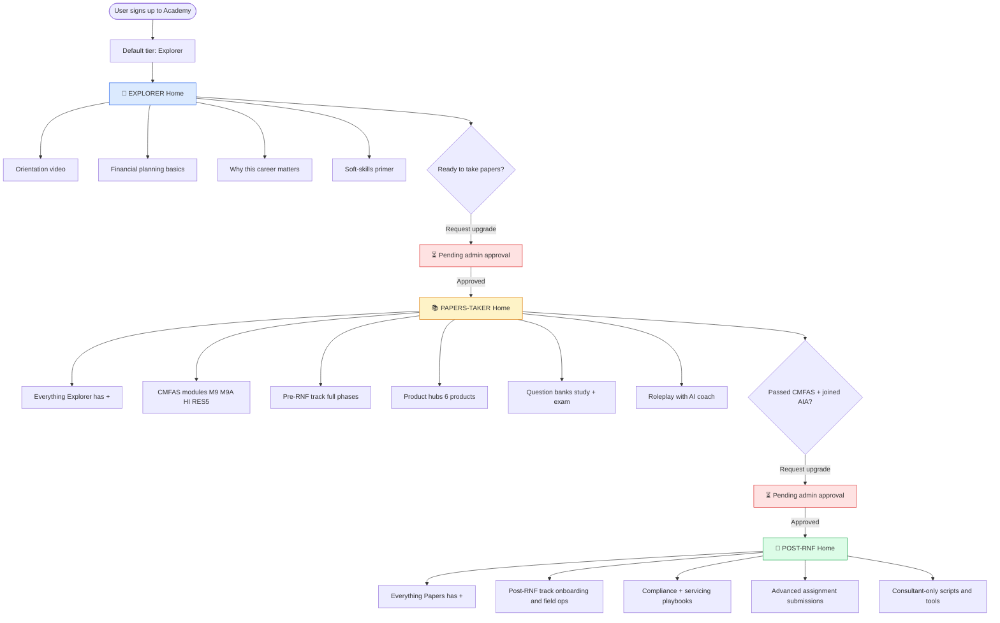
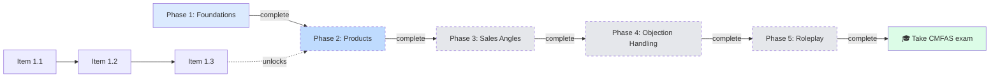
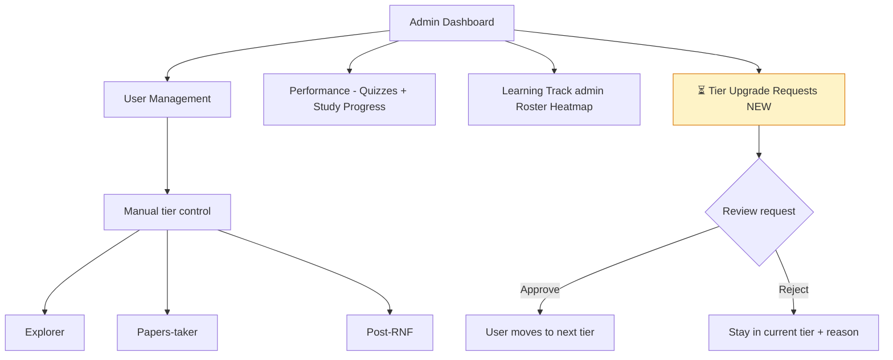

# Academy Persona Flow (vision)

## High-level flow: signup → tier progression



---

## Within-tier: linear unlock (example — Pre-RNF for Papers tier)


Dashed boxes = locked until prereqs complete.

---

## Admin-side flow



---

## Today vs Vision — which parts of this flow exist?

| Flow node | Status |
|---|---|
| Signup → default tier assignment | ❌ No auto-assign |
| Explorer home / orientation | ❌ No persona routing |
| Papers-taker home (Pre-RNF + CMFAS + products + Q-banks) | 🟡 Pieces exist, no tier gate |
| Post-RNF home | 🟡 Track exists, no tier gate |
| "Request upgrade" button | ❌ Missing |
| Admin tier approval queue | ❌ Missing |
| Manual tier control | 🟡 DB ready, UI missing |
| Within-tier linear unlock | ❌ Missing |
| Linear unlock progression UI | ❌ Missing |

**What to build first (minimum viable persona system):**
1. Auto-assign `tier_level = explorer` on signup
2. Route `/` to tier-specific home (Explorer/Papers/Post-RNF)
3. Wire `tier_permissions` table to hide features by tier
4. "Request upgrade" button → new `tier_upgrade_requests` table
5. Admin approval queue in AdminDashboard

---

# Academy Vision vs Current State — Gap Analysis

## Context
Leo's vision: retire Skool, make aia-product-compass-hub the single "Academy" home with 3 personas (Explorers / Papers-takers / Post-RNF), linear journeys, gating ("complete X → unlock Y"), and eventually "request access" to unlock modules. This doc inventories what's already built vs what's still greenfield.

---

## 1. Learning Track (Pre-RNF / Post-RNF)

**✅ Built**
- Phased architecture: `learning_track_phases` → `learning_track_items` → `learning_track_content_blocks` (DB tables)
- Track types in code: `"pre_rnf"` | `"post_rnf"` ([src/types/learning-track.ts](mdrt/aia-product-compass-hub/src/types/learning-track.ts))
- Per-user progress in `learning_track_progress` table + `useLearningTrackProgress` hook
- Admin surfaces: Roster, Heatmap, Submissions, Activity, Phase controls
- Assignment-style submissions (not just localStorage)
- Pages wired: `/learning-track/pre-rnf`, `/learning-track/post-rnf`

**❌ Missing**
- No prerequisite / gating logic — items render sequentially but nothing enforces "complete X to see Y"
- No "unlock" semantics on items or phases
- No route for Explorers (a third track/view beyond Pre + Post)

---

## 2. User Tiers / Personas

**✅ Built (DB-ready)**
- Tables exist: `user_access_tiers` (tier_level, user_id) + `tier_permissions` (tier_level, resource_id, access_type) per [types.ts:2501-2557](mdrt/aia-product-compass-hub/src/integrations/supabase/types.ts#L2501)

**❌ Missing (UI-dormant)**
- No "Explorer / Papers / Post-RNF" tier concept in code — only user/admin/master_admin roles
- Tier tables aren't wired to feature visibility or routing anywhere
- No auto-assignment of tier on signup (e.g. default = Explorer)
- No admin UI to move users between tiers

---

## 3. Onboarding / Front Door

**✅ Built**
- Optional tours via `useOnboarding` ([src/hooks/useOnboarding.tsx](mdrt/aia-product-compass-hub/src/hooks/useOnboarding.tsx))
- `WelcomeModal`, `GettingStartedChecklist` components exist
- Basic + Advanced onboarding steps (search, categories, bookmarks, AI assistant)

**❌ Missing**
- No post-signup routing flow ("you're an Explorer, start here")
- No orientation-only path — Explorers currently see the full app
- Welcome modal disabled by default (line 167 in useOnboarding)
- No automatic tier assignment post-signup

---

## 4. CMFAS

**✅ Built**
- 5 modules (Onboarding, M9, M9A, HI, RES5) with own pages under `/cmfas/*`
- Module-specific AI tutor chatbot

**❌ Gap vs vision**
- CMFAS is a **separate silo** — not a phase inside Pre-RNF track
- Vision: CMFAS should be a phase within Pre-RNF for Papers-takers
- No cross-linking between Pre-RNF items and CMFAS content

---

## 5. Request Access / Unlock

**❌ Not built at all**
- Zero references to content locks, prerequisites, request-access flows, or unlock patterns in learning-track code
- `playbook_edit_requests` table exists but for scripts, not applicable

---

## 6. Skool Migration

**❌ Not started**
- Zero references to "Skool" in the codebase
- No content migration tooling, no import scripts, no links
- This is primarily content/IA work, not code

---

## Summary Scorecard

| Vision area | State | Effort to ship |
|---|---|---|
| Phased Pre/Post-RNF tracks | ✅ Done | — |
| Progress tracking + submissions | ✅ Done | — |
| Product hubs + question banks | ✅ Done | — |
| CMFAS module flow | ✅ Done but siloed | Medium — re-slot as Pre-RNF phase |
| User tiers (3 personas) | 🟡 DB-ready, UI dormant | Medium — wire existing tables to feature gating |
| Onboarding / front-door routing | 🟡 Partial | Medium — post-signup tier assignment + orientation path |
| Unlock / prerequisite gating | ❌ Missing | Medium — add `prerequisite_item_ids` to learning_track_items + UI |
| "Request access to unlock" | ❌ Missing | Medium — new table + admin approval flow |
| Skool content port | ❌ Missing | Large — mostly content/IA work, not code |
| Single front door (replace Skool) | ❌ Missing | Large — depends on all the above |

**Bottom line:** Hub is ~60% of Leo's vision. Remaining 40% is ~half code (tiers, gating, request-access) and half content/process (Skool port, tier assignment playbook).

---

# Question Bank — Boss Update (shipped this session)

## User-side (Study Bank)
- **New mode picker**: 3 card buttons (Fresh / Review / Redo All) with icons, live counts, and empty-state messages like "All caught up!" when no fresh questions remain
- **Smart category counts**: now reflect the selected mode's pool, not the full bank — no more misleading totals
- **Inline callout** when mode + category combo has 0 questions, telling users how to adjust instead of silently disabling Start
- **Fresh exhaustion nudge** celebrates when a user has seen every question at least once
- **Session restore**: quiz state survives refresh / navigation — users resume mid-session instead of starting over
- **End-of-session summary** with "You mastered X new questions this session!" celebration
- **"Auto-saved" indicator** on the mastery card so users trust their progress is persisted
- **Retry Missed fixed**: answers now reset so users can actually re-attempt missed questions (was broken before)
- **Mastery bar bug fixed** on /question-banks — now queries by product_slug directly, so progress survives question bank re-seeding

## Admin-side
- **New unified "Performance" tab** consolidates Quizzes + Study Progress (7 top-level tabs → 6, less clutter)
- **Underline-style tabs** for clearer primary/secondary navigation hierarchy
- **Quiz Scores shows ALL users** (takers + non-takers) with filter tabs: All / Taken / Not Taken
- **New Study Progress panel** — per-user mastery, KPIs, at-risk flagging, top performers leaderboard, engagement-by-product chart, filter tabs
- **Avg Mastery fix** — now only counts active learners (previously diluted to 0% by non-studiers)
- **Expanding any user row shows all 6 products**: engaged ones first, dimmed "Not taken" / "Not started" rows below a divider — admins instantly spot gaps
- **Status flags** (Active / At Risk / Not Started) with colored dots for fast scanning

## Shipped
Pushed to main as commit `e08fdb25` on top of 27 parallel Lovable commits, conflicts resolved, build passing.

---

# Show all 6 products in admin Quiz Scores & Study Progress expanded rows (completed)

## Context
Currently, expanding a user's row in Quiz Scores or Study Progress admin panels shows ONLY products that user has engaged with. Products they haven't attempted/studied don't appear at all. This hides the admin's most actionable insight — the gaps. For a compliance/training oversight tool, knowing what a user has NOT done is as important as what they have.

**UX approach:** Always render all 6 products per user. Engaged products sorted first (by score/mastery), then a subtle divider, then dormant products shown in a muted style with clear "Not taken" / "Not started" labels.

---

## Changes

### 1. `src/hooks/useAdminQuizScores.tsx`
After building `product_breakdown` for attempted products, pad it with stub entries for every slug in `PRODUCT_SLUGS` that the user hasn't attempted. Stub entries have `attempts: 0`, score fields at 0, `last_attempt: null`, but keep the correct `product_id`, `product_title`, `mastered_count`, `study_total` (mastery data from `user_question_progress` is independent of exam attempts).

Sort breakdown: attempted products (by best_score desc) first, then not-attempted (alphabetical by title).

### 2. `src/hooks/useAdminStudyProgress.tsx`
After building `product_breakdown` for touched products, pad it with stub entries for every slug in `PRODUCT_SLUGS` the user hasn't touched. Stub entries: `mastered_count: 0`, `study_total` from `studyTotalBySlug`, `last_studied: null`, `mastery_pct: 0`.

Sort: touched products (by mastery_pct desc) first, then not-touched (alphabetical by label).

### 3. `src/components/admin/QuizScoresPanel.tsx`
In `UserQuizRow` and `UserQuizMobileCard`:
- Render "Not taken" rows with reduced opacity, grey text, no progress bar — show a dim "Not taken" label and em-dash for metrics
- Insert a small separator row/label like "Not yet attempted (N)" between attempted and not-attempted groups
- Don't count "Not taken" rows in the breakdown total for the Products column (already handled by `attempts > 0` filter)

### 4. `src/components/admin/StudyProgressPanel.tsx`
In `ProductBreakdownRow` (used inside expanded rows):
- Detect when `mastered_count === 0 && last_studied === null` → render dim "Not started" variant (no progress bar, grey label, no date)
- Insert a separator between touched and not-touched groups in the per-product breakdown section

---

## Critical Files
| File | Change |
|---|---|
| `src/hooks/useAdminQuizScores.tsx` | Pad breakdown with all 6 product slugs |
| `src/hooks/useAdminStudyProgress.tsx` | Pad breakdown with all 6 product slugs |
| `src/components/admin/QuizScoresPanel.tsx` | Dim rendering for "Not taken" rows + group separator |
| `src/components/admin/StudyProgressPanel.tsx` | Dim rendering for "Not started" rows + group separator |

## Reuse
- `PRODUCT_SLUGS`, `PRODUCT_LABELS` from `src/types/questionBank.ts`
- Existing `titleToSlug` map in `useAdminQuizScores.tsx` for Quiz → slug matching
- Existing `studyTotalBySlug` map in both hooks for study question counts per product

## Verification
1. Visit admin → Performance → Quizzes → expand any user → verify all 6 products appear, with attempted ones first and not-taken ones dimmed below
2. Same for Performance → Study Progress
3. A user who has studied all 6 but taken 0 exams → Study view shows 6 engaged rows, Quiz view shows 6 "Not taken" rows
4. Separator/label between engaged and dormant groups is visible and helpful
5. Run `npm run build` — passes

---

# Nest Quizzes + Study Progress under a single "Performance" tab (completed)

## Context
Quiz Scores and Study Progress are both user-performance views. Currently they take up two separate top-level tabs in the admin dashboard (7 total tabs, getting crowded). Group them under a single **Performance** parent tab with two sub-tabs ("Quizzes" and "Study Progress") — reduces clutter without changing any existing functionality or data.

---

## Change

**Top-level admin tabs become (6 total, down from 7):**
User Management · Video Progress · **Performance** · Question Bank · Leaderboard · Feedback

**Inside Performance tab (new nested Tabs):**
`[Quizzes] [Study Progress]` — each renders the existing panel component unchanged.

Default sub-tab: Quizzes (more familiar, was the original tab).

---

## Files to change
| File | Change |
|---|---|
| `src/pages/AdminDashboard.tsx` | Replace `quiz-scores` + `study-progress` top-level tabs with a single `performance` tab that uses nested `<Tabs>` to render the two existing panels |

## Reuse
- `QuizScoresPanel` — unchanged
- `StudyProgressPanel` — unchanged
- Existing `Tabs`, `TabsList`, `TabsTrigger`, `TabsContent` from shadcn/ui

## Verification
1. Visit `/admin` → top-level tabs show "Performance" instead of "Quiz Scores" + "Study Progress"
2. Click Performance → default lands on Quizzes sub-tab showing the full Quiz Scores panel
3. Click Study Progress sub-tab → shows the full Study Progress panel
4. Both panels retain all existing functionality (filters, expandable rows, KPIs)
5. Run `npm run build` — passes

---

# Console Errors Analysis (no action needed)

All errors in the browser console are pre-existing or third-party — none are from our changes. The study page is working correctly.

- Loom SDK errors → Loom's own internal bugs on their CDN. Not fixable by us.
- `<div> cannot appear as descendant of <p>` → Pre-existing React warning in ProductModuleCourseLayout from markdown + video embeds.
- Chrome extension errors → Loom browser extension noise.
- Auth/permissions logs → Informational only, not errors.
- The only real crash (`freshPool before initialization`) was already fixed.

---

# Question Bank Setup UI Redesign (completed)

## Context
The study bank setup screen uses plain `<select>` dropdowns for mode, category, and question count. When a mode like "Fresh" has 0 questions, the only feedback is a browser-native greyed option — no explanation, no guidance, no celebration. Users get confused and think the feature is broken. The three Lucide icons (Sparkles, RotateCcw, Layers) imported into StudyModePicker are unused, suggesting a card-based UI was originally intended but never built.

---

## What to change

### 1. Replace StudyModePicker with card-style mode buttons
**File:** `src/components/study/StudyModePicker.tsx`

Redesign from a `<select>` into 3 horizontal tappable cards (one per mode), each showing:
- Icon (Sparkles = Fresh, RotateCcw = Review, Layers = Redo All)
- Mode label
- Count badge
- **Empty state copy** inside the card when count = 0:
  - Fresh = 0 → "All caught up!" (green tint, no disable — just informational)
  - Review = 0 → "Nothing to revisit" 
  - Cards with 0 count are still selectable but show the empty message clearly
- Selected state: highlighted border + background
- Layout: `grid grid-cols-3 gap-2`

---

### 2. Inline empty-state callout below setup card
**File:** `src/pages/ProductStudyPage.tsx`

When `selectedMode` is set but `filtered.length === 0`, render an inline message explaining why Start is disabled and what to do:

```
⚠ No [mode] questions available in [category]
   → Try switching to "All Categories" or choosing "Redo All"
```

Replace the current silent disabled Start button with this contextual guidance.

---

### 3. Fix category counts to reflect selected mode
**File:** `src/pages/ProductStudyPage.tsx`

The category `<select>` currently shows counts from the full `studyBank` regardless of mode.
Fix: compute category counts from the **selected mode's pool** so the count shown is what's actually available.

E.g. if Fresh is selected and Roleplay has 0 fresh questions, category shows "Roleplay Scenarios (0)" and that option is disabled.

---

### 4. Contextual mastery nudge for 100% fresh exhausted
**File:** `src/pages/ProductStudyPage.tsx`

When `freshPool.length === 0` and the user hasn't picked a mode yet, show a small callout above the setup card:
```
🎉 No unseen questions left — you've seen everything at least once!
   Switch to Review to re-test weak spots, or Redo All.
```
This replaces the current silent experience of seeing "Fresh (0)" grayed out with no context.

---

## Critical Files
| File | Change |
|---|---|
| `src/components/study/StudyModePicker.tsx` | Full rewrite — card-based UI |
| `src/pages/ProductStudyPage.tsx` | Inline empty-state message, fix category counts |

## Reuse
- Lucide icons: Sparkles, RotateCcw, Layers (already imported in StudyModePicker)
- `cn()` from `@/lib/utils` for conditional class merging
- Existing `Badge` component for count badges

## Verification
1. Visit a product study page where Fresh = 0 → cards show "All caught up!" clearly
2. Select Fresh + a category with 0 questions → inline callout explains why Start is disabled
3. Category counts match the selected mode pool (not total bank)
4. Run build check
