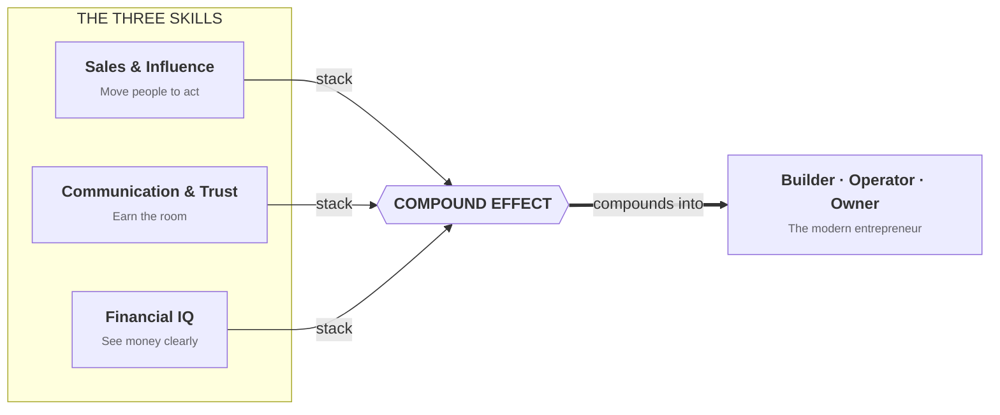

# Day 3 — High-Income Skills You Build Either Way

> **The one idea for today:** Don't chase the money. Master the skills that make money chase you. This career is the fastest incubator for three skills every entrepreneur eventually needs — and you keep all three for life, even if you leave in year two.

## What you'll walk away with

By the end of today you should be able to:

1. Name the three high-income skills this career builds, in the specific way they're built here rather than the stereotype.
2. Estimate the market value of those skills if you carried them into any other career.
3. Reframe the worst-case scenario of joining as a win rather than a loss.

---

## 1. Why I don't chase the money

Quick context: I'm CFA Level 2, CFP certified, and a NUS Engineering graduate. I'm not telling you to skip the credentials and just sell.

But after a decade in the industry, one pattern keeps showing up.

> 80% of self-made millionaires started with sales.

Not because sales is glamorous. Because sales teaches you how humans actually decide, and that's the single most portable skill in business.

> "Leadership starts with influence, and influence starts with sales."

Every founder, CEO, negotiator, politician, manager and investor I've met is a salesperson wearing a different job title. They're selling vision to investors, products to customers, missions to teams. The sooner you master it, the sooner everything else compounds.

So don't chase the money. Master the skills that make money chase you. This career is the fastest incubator for three of them.

---

## 2. Skill #1 — Sales and influence (not what you think)

Ask the average person what "sales" means and they picture someone pushing a product on a reluctant stranger.

That's not what this craft is. Real sales, done well, is applied human psychology. You learn what drives people to decide: cash-flow pressures, family context, fears. You learn to communicate value clearly so the right choice becomes obvious to the client rather than something argued into them. You build conviction through story, because why lands before what. And you learn to attract opportunities through positioning, content and reputation, instead of chasing them.

Most agencies teach product-push selling. On my team we teach consultative, heart-led selling, with the mindset that the salesperson isn't the product pusher, you are the product.

The difference compounds over five years. Advisors who learn real consultative selling are still in the career. Advisors who learned to push products are gone.

---

## 3. Skill #2 — Communication and trust-building

Something that surprises most candidates: being a great talker is not what makes a top advisor successful. Most of the best advisors I know are introverts. Some, like me, had a stammer growing up. Several went through Toastmasters as adults.

What actually matters is listening.

Clients don't want someone who talks at them. They want someone who understands them. The top advisors I've trained are all trained to ask questions that uncover what the client actually cares about, reflect back what they've heard so the client feels understood, sit in silence long enough for the real concern to surface, and build trust fast enough that the client shares financial details most people won't even tell their spouse.

It's the same skillset that makes someone an excellent negotiator, a brilliant manager, a great board member, a trusted confidant. Hard to learn from a book. You learn it by sitting across from hundreds of people over years.

Carry this into tech, law, medicine, or founding a company, and you'll be materially better at it than someone who never trained it.

---

## 4. Skill #3 — Financial IQ (the education school forgot)

This one might be the most valuable of all.

Think about what you weren't taught in school. How to structure cash flow. How to build an emergency buffer. How compounding actually works over 30 years. What insurance is for and when it's a waste of money. How to read a policy, a fund fact sheet, a retirement plan. When to pay down debt and when to invest. How to protect dependants if something happens to you. How tax-advantaged savings schemes work.

Most adults learn these lessons through painful, expensive mistakes. Some never learn them at all.

In this career you don't just learn financial planning. You get paid to learn it. And when you're surrounded by a community of financially literate advisors, your own money decisions start compounding quietly in the background.

Three years in, even if you'd left the career, you'd be the financially literate one in your family, your friend group and most corporate meetings you sit in. That alone prevents a lifetime of avoidable mistakes.

> "Earning ability beats saving and investing early on."

Even Warren Buffett at 20% returns can't move a $10K portfolio meaningfully. Build the high-income skill first. The investing math only starts to matter once you've scaled the income, and this career builds the income engine first.

---

## 5. The three skills stacked = the modern entrepreneur

The three of them compound together.

Every successful founder has some version of all three. Many had to learn them slowly and expensively. In this career they get built in parallel, paid, with feedback from day one.

I used exactly these three skills to build four other companies on top of the FA business. The digital marketing agency is now #1 on Google for "Digital Marketing Agency" in Singapore, with 50 full-time staff. The corporate cleaning business I bought over in 2023 runs at more than $15K a month profit. The outsourcing business and the consulting firm both launched in 2024.

Combined revenue across all four is seven figures. I didn't learn business in business school. I learned it by sitting across the table from more than a thousand financial-advisory clients first.

---

## 6. Why this matters for the worst case

Here's the reframe. Imagine you join, stick with it for 12 to 18 months, and then decide this isn't your forever career.

What do you walk away with? A working financial plan for yourself that would have taken years to build otherwise. Sales, listening and negotiation skills that transfer directly into any industry. A network of real clients and mentors. A year of client-facing reps that most corporate jobs will never give you. And battle-tested self-discipline.

What do you not walk away with? No debt. No failed franchise fee. No non-compete ruining your next move. No years of your life spent running a high-stress business with nothing to show for it.

Even the bad version of the story is a win. Day 4 goes deeper on this exact idea, the risk-reversal card.

---

## Worksheet — what would it be worth?

Answer honestly, one line each.

1. If you became measurably better at reading people and building trust, what would that be worth in your current or next career?
2. If you were fluent in personal finance for life, what's the dollar value of not making the big mistakes (bad insurance, bad investments, under-saving for retirement)?
3. If you learned to sell your ideas to investors, to a team, to future customers, what would that unlock?

The point isn't to justify joining. It's to honestly price what you'd walk away with. That number is your floor. Whatever happens above it is upside.

---

## Quiz

**Q1. The working definition of "sales" top advisors actually use is:**
- A) Persuading people to buy things they don't need
- B) Understanding decisions well enough to make the right choice obvious ✓
- C) Closing every lead that comes in
- D) Building strong rapport so price stops mattering

**Why:** The stereotype describes bad salespeople. Real sales — the kind top advisors practice — is applied human psychology: understanding drivers, communicating value, building conviction through story. It's the exact skill set every founder, CEO and negotiator relies on. Rapport-and-price framing (D) is superficial; real sales works on decision clarity, not charm.

**Q2. Top advisors are disproportionately drawn from people who are:**
- A) Extroverted and naturally persuasive
- B) Good listeners, often introverts, who earn trust by asking ✓
- C) Former athletes or competitive performers
- D) Already financially successful before they start

**Why:** The surprising pattern across top advisors is that listening beats talking. Clients want to be understood, not sold to — which favours people who ask good questions, hold silence, and reflect back what they've heard. That's often introverts. The myth that sales favours extroverts is one of the main reasons introverts wrongly rule themselves out.

**Q3. "Don't chase the money — master the skills that make money chase you" means:**
- A) Money doesn't matter early on
- B) Early-career returns on high-income skills dwarf returns on investing a small portfolio ✓
- C) Investing is a scam for ordinary earners
- D) Only rich people should bother learning about money

**Why:** At low portfolio sizes, even a 20% investment return produces negligible absolute dollars. What actually changes your financial trajectory is *earning ability*, which compounds through high-income skills. Build the skills first, earn aggressively, *then* the investing math starts to matter. The order is non-obvious but decisive.

---

## Related

- Previous: [[day-02|Day 2 — The Franchise Without the $200K Fee]]
- Next: [[day-04|Day 4 — The Risk-Reversal Card]]
- Week 1 overview: [[README|Week 1 — The Opportunity]]
