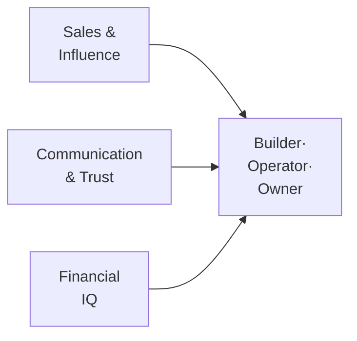

# Day 3 — High-Income Skills You Build Either Way

> **The one idea for today:** Don't chase the money. Master the skills that make money chase you. This career is the fastest incubator for three skills every entrepreneur eventually needs — and you keep all three for life, even if you leave in year two.

## What you'll walk away with

By the end of today you should be able to:

1. **Name** the three high-income skills this career builds, in the specific way they're built here (not the stereotype).
2. **Estimate** the market value of those skills if you carried them into any other career.
3. **Reframe** the *worst-case scenario* of joining as a win, not a loss.

---

## 1. Why I don't chase the money

Quick context: I'm CFA Level 2, CFP certified, NUS Engineering graduate. I'm not saying *"skip the credentials and just sell."*

But I'll tell you this from a decade in the industry:

> **80% of self-made millionaires started with sales.**

Not because sales is glamorous. Because sales *teaches you how humans actually decide* — and that's the single most portable skill in business.

> **"Leadership starts with influence, and influence starts with sales."**

Every founder, CEO, negotiator, politician, manager, and investor I've met is a salesperson wearing a different job title. They're selling vision to investors, products to customers, missions to teams. The sooner you master it, the sooner the rest compounds.

So — don't chase the money. **Master the skills that make money chase you.**

This career is the fastest incubator for three of those skills.

---

## 2. Skill #1 — Sales & Influence (not what you think)

Ask the average person what "sales" means and they'll imagine someone pushing a product on a reluctant stranger.

That's not what this craft is. Real sales, done well, is applied human psychology:

- **Understanding what drives people to decide** — cash-flow pressures, family context, fears
- **Communicating value clearly** — so the right choice is obvious to the client, not argued into them
- **Building conviction through story** — *why* lands before *what*
- **Attracting opportunities**, not chasing them — through positioning, content, reputation

Most agencies teach *product-push* selling. At my team we teach **consultative, heart-led selling** — and the mentality that the salesperson is not the product pusher; *you are the product*.

The difference compounds over 5 years. Advisors who learn real consultative selling are still in the career. Advisors who learned to push products are gone.

---

## 3. Skill #2 — Communication & trust-building

Here's a surprising thing: **being a great talker is not what makes a top advisor successful.** Most of the best advisors I know are introverts. Some, like me, had a stammer growing up. Several went through Toastmasters as adults.

What actually matters is **listening.**

Clients don't want someone who talks at them. They want someone who *understands* them. The top advisors I've trained are all trained to:

- Ask questions that uncover what the client actually cares about
- Reflect back what they've heard, so the client feels understood
- Sit in silence long enough for the real concern to surface
- Build trust fast enough that the client shares financial information most people won't even tell their spouse

This is the same skillset that makes someone an excellent negotiator, a brilliant manager, a great board member, a trusted confidant. It's hard to learn from a book. You learn it by sitting across from hundreds of people over years.

Carry this skill into tech, law, medicine, founding — and you are materially better at it than someone who never trained it.

---

## 4. Skill #3 — Financial IQ (the education school forgot)

This one might be the most valuable of all.

Think about what you *weren't* taught in school:

- How to structure cash flow
- How to build an emergency buffer
- How compounding actually works over 30 years
- What insurance is for and when it's a waste of money
- How to read a policy, a fund fact sheet, a retirement plan
- When to pay down debt and when to invest
- How to protect dependants if something happens to you
- How tax-advantaged savings schemes work

Most adults learn these lessons through painful, expensive mistakes. Some never learn them at all.

You don't just learn financial planning here. **You get paid to learn it.** And when you're surrounded by a community of financially literate advisors, your own money decisions start compounding quietly in the background.

After three years in this career — even if you left — you would be the financial-literate one in your family, your friend group, and most corporate meetings you'd ever sit in. That alone prevents a lifetime of avoidable mistakes.

> *"Earning ability beats saving and investing early on."*

Even Warren Buffett at 20% returns can't move a $10K portfolio meaningfully. Build the high-income skill first. The investing math only starts to matter once you've scaled the income. This career builds the income engine first.

---

## 5. The three skills stacked = the modern entrepreneur

The three compound:

Every successful founder has some version of all three. Many had to learn them slowly and expensively. In this career they're built in parallel, paid, with feedback, from day one.

Me personally: I used exactly these three skills to build four other companies on top of the FA business:

- **Digital marketing agency** — now #1 on Google for "Digital Marketing Agency" in Singapore, 50 full-time staff
- **Corporate cleaning business** — bought over in 2023, $15K+/month profit
- **Outsourcing business** — started 2024
- **Consulting firm** — started 2024

Combined 7-figure revenue across all four. I didn't learn business in business school. I learned it by sitting across the table from 1,000+ financial-advisory clients first.

---

## 6. The asymmetry — why this matters for the "worst case"

Here's the reframe. Imagine you join, stick with it for 12–18 months, and then decide *this isn't my forever career.*

What do you walk away with?

- A working financial plan for yourself that would have taken years to build otherwise
- Sales, listening and negotiation skills directly transferable to any industry
- A network of real clients and mentors
- A year of client-facing reps that most corporate jobs will never give you
- Battle-tested self-discipline

What do you *not* walk away with?

- Debt
- A failed franchise fee
- A non-compete ruining your next move
- Years of your life spent running a high-stress business with nothing to show

That's the asymmetry. Even the "bad" version of the story is a win. That's why Day 4 is about this exact idea — the risk-reversal card — in more depth.

---

## Worksheet — what would it be worth?

Answer honestly, one line each:

1. If you became *measurably* better at reading people and building trust, what would that be worth in your current or next career?
2. If you were fluent in personal finance for life, what's the dollar value of *not* making the big mistakes (bad insurance, bad investments, under-saving for retirement)?
3. If you learned to sell your ideas — to investors, to a team, to future customers — what would that unlock?

The point isn't to justify joining. The point is to honestly price what you'd walk away with. That number is your *floor*. Whatever happens above it is upside.

---

## Quiz

**Q1. The real definition of "sales" in this career is:**
- A) Persuading people to buy things they don't need
- B) Understanding human decision-making and communicating value so the right choice is obvious ✓
- C) Pushy cold-calling
- D) Closing at all costs

**Why:** The stereotype describes bad salespeople. Real sales — the kind top advisors practice — is applied human psychology: understanding drivers, communicating value, building conviction through story. It's also the exact skill set every founder, CEO and negotiator relies on. Framed properly, it's one of the most transferable, high-leverage skills in any career.

**Q2. Top advisors are disproportionately:**
- A) Extroverted natural salespeople
- B) Good *listeners*, often introverts, who build trust through asking rather than telling ✓
- C) Ex-athletes
- D) Financially well-off from the start

**Why:** The surprising pattern across top advisors is that listening beats talking. What clients want is to be understood, not sold to. This favours people who can ask good questions, sit in silence, and reflect back what they've heard — skills introverts often possess more naturally. The myth that sales favours extroverts is one of the main reasons introverts underrate themselves for this career.

**Q3. "Don't chase the money. Master the skills that make money chase you" means:**
- A) Money isn't important
- B) Early in your career, the return on high-income skills — sales, communication, financial IQ — dwarfs the return on saving and investing a small portfolio ✓
- C) Investing is a scam
- D) Only rich people should learn about money

**Why:** At low portfolio sizes, even a 20% investment return produces negligible absolute dollars. What actually changes your financial trajectory is *earning ability* — which compounds through high-income skills. Build the skills first, earn aggressively, *then* the investing math starts to matter. The order is non-obvious but decisive.

---

## Related

- Previous: [[day-02|Day 2 — The Franchise Without the $200K Fee]]
- Next: [[day-04|Day 4 — The Risk-Reversal Card]]
- Week 1 overview: [[README|Week 1 — The Opportunity]]
