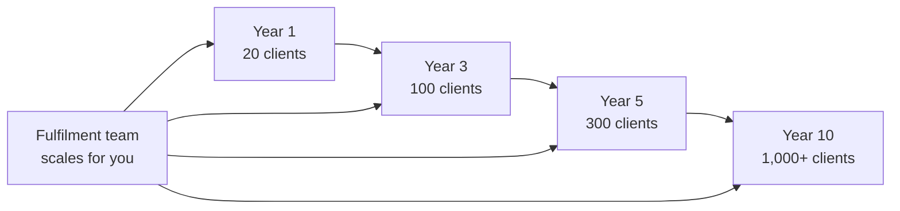

# Day 6 — Stickiness and Scalability

> **The one idea for today:** The best businesses in the world share two traits: clients who stay for decades (stickiness), and growth that doesn't require proportional effort (scalability). Financial advisory has both — built in. That's why year 5 looks nothing like year 1.

## What you'll walk away with

By the end of today you should be able to:

1. **Define** stickiness and explain why it's the single biggest driver of lifetime value.
2. **Explain** why this business scales like software, not like a service.
3. **Predict** how an advisor's year 5 looks materially different from their year 1 because of compounding.

---

## 1. Stickiness — why clients stay

Look at the most successful consumer companies you interact with: Apple, Netflix, Adobe, Starbucks. What they share isn't a single great product — it's **stickiness.**

- **Apple:** phone → iCloud subscriptions → upgrade every 2–3 years
- **Netflix & Adobe:** recurring subscription, cancel-anytime but most don't
- **Starbucks:** one coffee → daily ritual → decades of $5 purchases

To Starbucks, you're not a $5 customer. You're the sum of every coffee you'll buy over the next decade. Once they think of customers this way, the economics change:

- Spending $200 marketing to acquire a customer worth $5,000 is obvious
- Paying for a $50/year loyalty program is obvious
- Investing heavily in product improvement is obvious

**Stickiness drives lifetime value. Lifetime value drives everything else.**

---

## 2. My own painful lesson on stickiness

I learned this the hard way running my digital marketing agency.

Even at 200+ retainers with 40 staff, the stickiness problem was brutal:

- Clients sign a 6–12 month contract
- Most drop off within a year as cheaper freelancers win on price
- I'm on a treadmill, always replacing what I lost
- Typical client LTV: $20K–$30K before churn

Every month I was starting partially from zero. Compare that to the insurance client who:

- Buys a policy intended to last decades
- Stays because switching costs are high (medical underwriting, age-related premium increases)
- Comes back for new needs as life happens (marriage, baby, home, promotion)
- Refers family and friends once trust is established
- Average LTV: **~$10,000 per client over the full relationship**

Numbers look similar, but the mechanism is completely different. The marketing agency fights churn every month. The FA plants an orchard.

**I still run the agency — but the FA business is the one I keep pointing young entrepreneurs toward. Structurally easier to build and sustain.**

---

## 3. Why this business has stickiness built in

Stickiness in FA isn't a marketing technique — it's structural.

### Product nature
Insurance is the definition of a multi-decade product. A 25-year endowment isn't cancelled for a "better offer." A critical-illness policy gets more expensive to replace every year you age and every new diagnosis you pick up. Retirement plans need to last 30+ years by design.

### Life-event cross-sell
As a client goes through life — marriage, children, home purchase, promotion, parents aging, health scares, job changes — each event creates new financial needs. Every one is a natural moment to come back to their advisor. Not from sales pressure. From genuine need.

### Trust carryover
The trust required to share financial details with an advisor is hard-won. Once built, clients don't want to rebuild it with someone else. Switching cost that works in your favour.

### Claims moments
Counterintuitively, claims events (hospitalisation, critical illness, accident) are among the stickiest moments. A client whose claim I handled well in their worst week has never left for a better-priced competitor. Ever.

Together, these make the FA client base one of the stickiest of any business model. You don't engineer it. You just don't mess it up.

---

## 4. Scalability — growing without the grind

The second superpower is scalability. Common mistake: people think scalability means *handling more customers.*

It doesn't. **Scalability means handling more customers without the complexity growing proportionally.**

### Why most businesses hit a ceiling

The interior designer from Day 5:

- Max 5 projects at once
- 50 post-sale hours each
- Double sales → double project management
- To serve 50 clients at once → hire 10 people → manage + train + pay them

The more successful he is, the more complex the business becomes. Revenue up, margins compress. Eventually he's running a small company, not a business. **Service business trap.**

### Why FA scales like software

Adding my 200th client didn't add proportional complexity. Here's what actually happens:

- **Underwriters** process the application — I don't
- **Fund managers** grow the money — I don't
- **Claims team** pays out — I don't
- **Admin team** handles paperwork — I don't
- **Customer service** fields routine questions — I don't
- **Product team** designs new offerings for me to sell

I have a 200-person team. I don't hire, pay, or manage them. **AIA does.**

This is why a single advisor with 1,000+ clients can run with just 1–2 part-time admin helpers. Infrastructure is already there. It's software-as-a-service economics wearing an insurance label.

Your headcount never grows. Your client base does.

---

## 5. Compounding — why year 5 looks nothing like year 1

Stickiness + scalability compound. This is what produces the absurd-looking incomes in year 5–10 that new advisors can't believe.

Sketch — not a promise, just the structural logic:

**Year 1** — Add 20 clients. Work hard on each. All new relationships.

**Year 2** — Add 30 more (now 50 total). Year 1 clients generating renewals + starting to cross-sell. A few refer. Less work per client, higher income.

**Year 3** — Add 40 more (now 90 total). Year 1 clients deepening, year 2 cross-selling, year 3 new. Renewals + referrals layering. Income materially higher than year 1 while *hours haven't grown.*

**Year 5** — 200+ clients. Half your income is renewals, cross-sells, referrals from your own base. New-business time focused on referrals, not cold prospecting. Income: "good" → "excellent."

**Year 10** — Book runs largely on its own trajectory. Time freed for top-value work — HNW cases, senior mentoring, strategic. Income at this point looks nothing like a corporate salary.

This is why leaving in year 2 or 3 is such a common mistake for people who joined for the right reasons. **The payoff curve is backloaded.** First 12–24 months are the investment. Years 3+ are where it starts paying out at a rate that doesn't look remotely like a 9-to-5.

---

## 6. Real example — my own back-end

Here's my own back-end, year by year. Just passive — renewals, Career Benefit, APF. Not including new-business commission from current year.

By year 6, even if I did zero new business that year, I'd still be earning more than $100K of passive income.

And that's why, travel-wise, I've been able to go: LA (2017), Athens (2018), Berlin (2019), LA (2022), Hawaii (2023), Norway (2024). Twice a year, company-sponsored trips. The book doesn't stop while I'm away.

---

## 7. What this means practically

Three takeaways:

1. **The model gets easier over time, not harder.** First year is the hardest. Every year after gets materially easier — opposite of most jobs.
2. **Clients are assets, not transactions.** Each one is a decade-long relationship producing compound value. Behave accordingly.
3. **Your goal in year 1 is to reach year 3.** Year 1 is about surviving long enough for compounding to begin. That's why Day 9's six traits matter so much — they predict who reaches year 3.

---

## Worksheet — map your own compounding curve

Imagine you started this career next week. Write one sentence each:

1. What would your year 1 look like, realistically? Assume hard work and honest effort.
2. What would your year 3 look like, if year 1 and year 2 went reasonably well?
3. What would your year 10 look like, if you stayed and compounded?

The difference between year 1 and year 10 isn't about effort — effort is the same. It's about compounding. Make sure your picture reflects that.

---

## Quiz

**Q1. *Stickiness* in a business model means:**
- A) Products that are contractually difficult to cancel
- B) Customers who keep buying over long horizons, producing high lifetime value ✓
- C) Aggressive retention marketing
- D) Complex contracts with penalty clauses

**Why:** Stickiness is about customer behaviour over time, not lock-in tactics. The strongest forms come from products that solve long-horizon problems (insurance, retirement), build high switching costs (trust, underwriting history), and produce natural upsell moments (life events). In FA, all three operate together.

**Q2. *Scalability* in this career means:**
- A) You can simply work more hours each week
- B) Adding a new client adds almost no operational work on your side ✓
- C) You can hire a large sales team to serve more clients
- D) You can one day sell the practice for a multiple

**Why:** The FA model scales because the marginal cost of a 100th or 500th client is negligible — you're not adding delivery headcount or operational complexity. AIA's underwriting, claims, admin, and fund management teams do the work. That's a software-like cost curve, which is what lets individual advisors run 1,000+ client books with minimal support headcount.

**Q3. Compounding makes year 5 income look radically different from year 1 because:**
- A) Advisors get tenure-based raises
- B) The business is front-loaded and naturally gets easier
- C) Renewals, cross-sells, and referrals from prior years add to new-business income ✓
- D) AIA pays long-tenure loyalty bonuses

**Why:** Year 1 income = year 1 new business only. Year 5 income = year 5 new business *plus* cross-sells from year 4 *plus* referrals from year 3 *plus* renewals from years 1–2. Each year's work layers under every future year — that layering is compounding. The career isn't linear; it's exponential on a long-enough horizon.

---

## Related

- Previous: [[day-05|Day 5 — The Hidden Math: $40 vs $667 an Hour]]
- Next: [[day-07|Day 7 — The Three I's: Income, Independence, Impact]]
- Week 1 overview: [[README|Week 1 — The Opportunity]]
