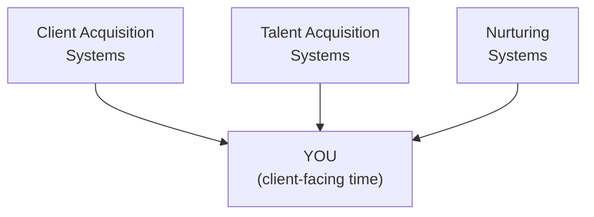

# Day 8 — Why the Agency Matters More Than Most People Realise

> **The one idea for today:** People don't fail. Systems fail them. The agency you pick decides whether the Week 1 model actually plays out — or whether you become a statistic who quits in year one. Here are the three lies most agencies tell, and the Tripod Support System I built as the alternative.

## What you'll walk away with

By the end of today you should be able to:

1. **Recognise** the three most common failure patterns in traditional agency onboarding.
2. **Understand** the Tripod Support System (TSS) and 6-Tier Power Pyramid — what real infrastructure looks like.
3. **Ask** the right diagnostic questions when meeting with *any* agency recruiter (including us).

---

## 1. The uncomfortable truth

The insurance industry in Singapore has a year-one attrition rate of around 50%. **Half of new advisors don't make it past 12 months.**

Is that because the career is too hard? For some, yes. But the majority of those who leave are capable people who were *set up to fail.* Not because they weren't smart or motivated — because the agency they joined didn't give them the basic infrastructure a new advisor needs to survive year one.

This matters because Week 1 made a structural case for the career. That case is true — *if* you're in an agency that actually delivers the franchise benefits. In a broken agency, you're not in a franchise. You're in a sink-or-swim sales floor. Very different outcomes.

> **"People don't fail. Systems fail them."**

This is the principle I built FINternship around.

---

## 2. The three lies most agencies tell new advisors

### Lie #1: "Just sell to your friends and family"

First thing most agencies tell you: *"Make a list of 100 people you know."*

Here's the truth: **warm market is a crutch, not a strategy.**

Yes, your friends and family may buy initially because they trust you. But what happens after that? You have maybe 50–100 real connections. Once you've approached them, you're done. Pipeline dries up, relationships get awkward, you're left wondering where the next client comes from.

I learned this the hard way. In my early days I exhausted my warm market within months and had to figure out how to build a real business in the cold market — with complete strangers. That's where the real opportunity is, but most agencies will never teach you how.

**99.9% of my 1,000+ clients were strangers when I first met them.** Warm market contributed almost nothing to my book.

If your agency's plan for you is *"sell to your friends and family first, then we'll figure out the rest,"* what they're really telling you is: *we don't have a real system for acquiring cold-market clients. You're on your own after month 3.*

### Lie #2: "Culture and vibes will carry you"

Walk into most agencies and they'll sell you on *family culture,* team bonding, motivational videos, "positive energy."

Culture matters. But **culture without systems is just expensive cheerleading.**

I've seen the pattern too many times. Advisor joins agency → attends weekend retreats → feels pumped → returns Monday to an empty calendar and no idea how to fill it → motivation fades → drifts → leaves within a year.

What you actually need are **predictable systems that generate results whether you feel motivated or not.** Scripts. Lead sources. Training. Role-plays. Feedback loops. Tech tools. Mentorship structures.

If the agency's main pitch is "we have great culture," keep asking until you understand what's *behind* it. If nothing is behind it, that's your answer.

### Lie #3: "Figure it out yourself"

Most agencies run a sink-or-swim model. Desk, phone, outdated training materials — figure the rest out.

You're expected to:

- Generate your own leads
- Book your own appointments
- Handle your own admin and paperwork
- Create your own marketing materials
- Manage your own follow-ups
- Build your own CRM
- Learn all products yourself from brochures

**This is insane.** You signed up to help people with their finances and build wealth for yourself. Instead you become an unpaid marketer, administrator, telemarketer and operations manager — with no time or energy for the work that actually generates income.

The agencies that do this are using you as a cheap customer-acquisition channel. You're not being built up; you're being churned through. Some percentage sticks. Most don't. They recruit replacements.

This is the *broken system* most of the industry runs on. Not because it's evil — because churn is profitable to agencies that monetise *headcount* rather than *production.*

---

## 3. Why I built something different

After living through this broken system personally — no scripts, no mentors, no systems in my first 2 years — I made a decision. I would never put another advisor through what I went through.

I spent the last decade building the infrastructure, systems, and support I wish I'd had when I started.

> **"I'm not looking for people who need to be pushed. I'm looking for people who need to be guided. There's a massive difference."**

I call what I built the **Tripod Support System (TSS)** combined with our **6-Tier Power Pyramid.**

---

## 4. The Tripod Support System (TSS)

Three pillars, one outcome: your time goes to clients, not to figuring out infrastructure.



**1. Client Acquisition Systems.** Subsidised digital ads (Facebook, Instagram, Google), in-house appointment setters who book qualified leads directly to your calendar, a centralised marketing funnel generating warm inbound leads, cold-market scripts and frameworks tested across hundreds of real calls, LinkedIn cold-outbound systems, value-first lead magnets (policy reviews, BTO calculators, tax reliefs).

**2. Talent Acquisition Systems.** Structured recruitment programs so when you're ready to build a team, the talent pipeline already exists. You inherit the same infrastructure I'm using right now.

**3. Nurturing Systems.** Digital CRM (iSmart), automated follow-ups, retention campaigns, client-birthday/anniversary reminders, review-meeting scheduling, referral-ask scripts, value-first content calendar.

Plus — the foundation under all three: **proper training + value-adding + 1-1 coaching.**

---

## 5. The Right People × Right Systems matrix

Here's the honest framing of why agency choice matters so much.

```
                        WRONG PEOPLE      RIGHT PEOPLE
                       ┌──────────────┬─────────────────┐
   RIGHT SYSTEMS       │   struggles  │    SUCCESS      │
                       │   (no grit)  │    (compounds)  │
                       ├──────────────┼─────────────────┤
   WRONG SYSTEMS       │   total fail │    burns out    │
                       └──────────────┴─────────────────┘
```

- **Wrong people, wrong systems** — total fail, fast
- **Wrong people, right systems** — no discipline, not proactive — still fail, even with good infrastructure
- **Right people, wrong systems** — capable people burn out trying to build everything themselves — the majority of year-one dropouts
- **Right people, right systems** — compound growth, year 5 looks nothing like year 1

The agencies pushing warm-market + culture-only are offering the *wrong systems* quadrant. The right-people candidates they attract burn out. The agency shrugs and recruits replacements.

What I'm building is the *right people × right systems* cell — small by design. Not mass recruitment. Quality over quantity.

---

## 6. What I actually give you (when you pass the test)

If you pass CMFAS and join the team, here's what you get access to — everything I've built over the past decade:

**Complete knowledge transfer:**
- Every script I've used to close hundreds of cases
- All presentation slides and frameworks
- Lead generation methods and proven ad funnels
- Marketing strategies and templates
- Operational SOPs

**Systems infrastructure:**
- Digital CRM (iSmart)
- Project management software
- Virtual assistant & outsourcing support
- Weekly team meetings
- CMFAS exam tutoring + chatbot
- Structured lessons, videos, lecture recordings
- 50% subsidy on your marketing activities
- Sponsored overseas trips
- Done-for-you authority creation (website, social media, marketing funnels)

**The multiplication effect:**
Eventually, you can use this entire program to build *your own team.* Everything I've used to develop you becomes infrastructure for you to develop others.

I'm building a large organisation of strong leaders who build other strong leaders — carrying forward these principles and systems across generations.

---

## 7. What to ask *any* agency (including us)

Before committing anywhere, test the agency against these five red flags:

1. **Warm-market-first strategy.** If the plan is *"approach your friends and family first,"* ask what happens after the list is done.
2. **Vague on lead sources.** If they can't explain where cold-market leads come from, there are none.
3. **Culture-heavy, systems-light.** If the pitch is mostly vibes, the systems don't exist.
4. **Churn-friendly economics.** Ask about 12-month and 36-month retention rates of new advisors. A healthy agency shares them. A broken one dodges.
5. **No written onboarding curriculum.** If there's no document showing the first 90 days week by week, there isn't one.

If an agency fails two or more — walk. **The model doesn't save you from a broken agency.**

### The one question that cuts through

If you only have time for one diagnostic question at *any* agency meeting — including ours — ask:

> **"Can you walk me through what an average Day 30 looks like for a new advisor in this agency — specifically where their leads come from, who's coaching them, and what tools they use?"**

Watch the answer. If the recruiter gets vague, talks about culture, or can't give you a day-in-the-life answer — you have your data.

A good agency has this memorised. A bad one improvises.

---

## 8. The bottom line

At the end of the day, all the systems, support, and infrastructure in the world won't matter if you're not ready to do the work. No system can succeed without the right individual at the centre.

The most important questions aren't about what I can do for you. They're about what you're willing to do for yourself:

- Are you taking action, or just consuming information?
- Are you dreaming big enough to justify the effort required?
- Can you turn fleeting motivation into firm discipline?
- Will you form the routines that create lasting success?
- Are you willing to learn to delegate and automate as you grow?

That's Day 9. The 4 C's I screen every candidate for.

**The racetrack is built. The question is: are you ready to drive?**

---

## Worksheet — the agency you're evaluating

If you've spoken to an agency already (including us), run this audit:

1. What's their concrete answer for where leads come from *after* warm market is exhausted?
2. What does their onboarding look like week by week — and can they show it in writing?
3. What tools do they provide that save you hours per week?
4. What's their 12-month retention rate for new advisors?
5. Would you recommend this agency to your smartest friend? Why or why not?

If you haven't spoken to an agency yet, save this. Use it as your diagnostic when you do.

---

## Quiz

**Q1. The most dangerous "lie" traditional agencies tell new advisors is:**
- A) "The career is easy"
- B) "Just sell to your friends and family" — it's a bridge to nowhere once the warm market runs out ✓
- C) "You'll be rich in year one"
- D) "Everyone passes the licensing exam"

**Why:** Warm-market guidance isn't false — it's just dangerously incomplete. It generates quick early sales, which masks the fact that no long-term client-acquisition system exists. Three months in, the advisor is out of names and out of options. Agencies that lead with this strategy are often hiding that they don't have a real cold-market system.

**Q2. The Tripod Support System (TSS) consists of:**
- A) Three managers per advisor
- B) Client acquisition systems + Talent acquisition systems + Nurturing systems, with training + value-adding as the foundation ✓
- C) Three types of insurance products
- D) Three training modules

**Why:** TSS is the actual infrastructure an advisor plugs into — not a motivational framework. Client acquisition solves "where does my pipeline come from?" Talent acquisition solves "how do I scale when I'm ready?" Nurturing solves "how do clients stay and refer?" All three rest on training and value. This is the scaffolding that prevents year-one burnout.

**Q3. The Right People × Right Systems matrix shows:**
- A) That systems alone drive success
- B) That either people OR systems can compensate for the other
- C) That success requires BOTH the right individual AND the right infrastructure — each fails without the other ✓
- D) That experience is more important than character

**Why:** The matrix is explicit: wrong people × right systems still fails (no motivation). Right people × wrong systems burns out (capable candidates crushed by no infrastructure). Only right people × right systems produces compound growth. Which means two things: agencies need to screen for character (Day 9), *and* build real infrastructure. Either alone is insufficient.

---

## Related

- Previous: [[../week-1/day-07|Day 7 — The Three I's: Income, Independence, Impact]]
- Next: [[day-09|Day 9 — The 4 C's — Honest Self-Assessment]]
- Week 2 overview: [[README|Week 2 — The Fit Test]]
