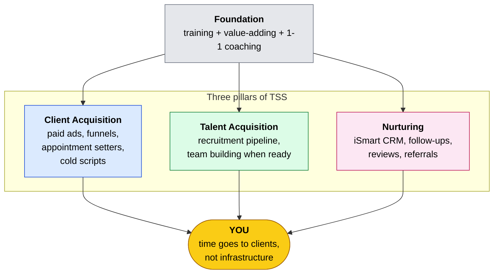
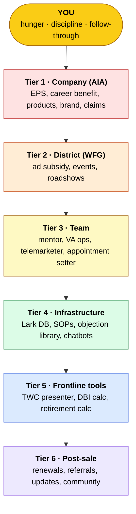
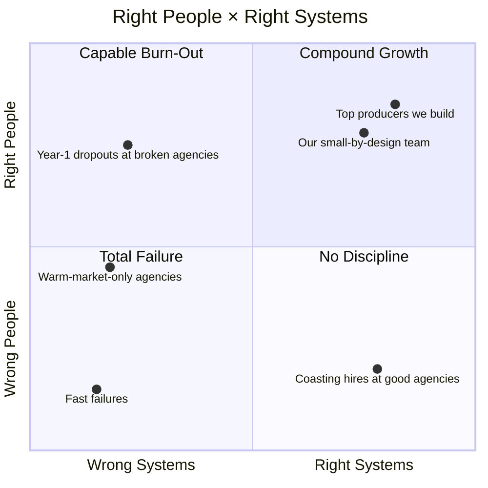

# Day 8 — Why the Agency Matters More Than Most People Realise

> **The one idea for today:** People don't fail, systems fail them. The agency you pick decides whether the Week 1 model actually plays out or whether you become a statistic who quits in year one. Here are the three lies most agencies tell, and the Tripod Support System I built as the alternative.

## What you'll walk away with

By the end of today you should be able to:

1. Spot the three most common failure patterns in traditional agency onboarding.
2. Explain the Tripod Support System (TSS) and 6-Tier Power Pyramid, so you know what real infrastructure looks like.
3. Ask the right diagnostic questions at any agency recruiter meeting, including ours.

---

## 1. The uncomfortable truth

The insurance industry in Singapore has a year-one attrition rate of around 50%. Half of new advisors don't make it past 12 months.

Is that because the career is too hard? For some, yes. But most of the people who leave are capable, and they were set up to fail. Not because they weren't smart or motivated. Because the agency they joined didn't give them the basic infrastructure a new advisor needs to survive year one.

This matters because Week 1 made a structural case for the career. That case holds up if you're in an agency that actually delivers the franchise benefits. In a broken agency, you're not in a franchise at all. You're in a sink-or-swim sales floor. The outcomes look nothing alike.

> **"People don't fail. Systems fail them."**

This is the principle I built FINternship around.

---

## 2. The three lies most agencies tell new advisors

### Lie #1: "Just sell to your friends and family"

First thing most agencies tell you is to make a list of 100 people you know.

The truth is warm market is half the pipeline, not the whole plan.

Your friends and family will buy from you initially because they trust you, and serving them well is meaningful work. That part is genuinely valuable. But warm alone isn't a career. You have maybe 50 to 100 real connections. Once you've worked through them, you're done, unless there's a cold-market engine running in parallel. Day 10 covers this in depth.

My own warm network was thin. GEP at NUS, a small adult-professional circle. I had to build most of my book through cold systems, and most of my 1,000+ clients started as strangers. That wasn't because warm is wrong. It was because I didn't have much warm to start with. Candidates with richer networks should serve those people too. It's part of the job, and it's good work.

If your agency's plan is sell to your friends and family first, then we'll figure out the rest, what they're really telling you is they don't have a cold-market system. You're on your own after month 3. A well-built agency provides the cold engine so warm stays a meaningful contribution instead of becoming a life raft.

### Lie #2: "Culture and vibes will carry you"

Walk into most agencies and they'll sell you on family culture, team bonding, motivational videos and positive energy.

Culture matters. But culture without systems is just expensive cheerleading.

I've seen the pattern too many times. Advisor joins agency, attends weekend retreats, feels pumped, returns Monday to an empty calendar and no idea how to fill it. Motivation fades. They drift. They leave within a year.

What you actually need are predictable systems that generate results whether you feel motivated or not. Scripts, lead sources, training, role-plays, feedback loops, tech tools, mentorship structures.

If the agency's main pitch is "we have great culture," keep asking until you understand what sits behind it. If nothing sits behind it, you have your answer.

### Lie #3: "Figure it out yourself"

Most agencies run a sink-or-swim model. Desk, phone, outdated training materials, and you figure the rest out.

You're expected to:

- Generate your own leads
- Book your own appointments
- Handle your own admin and paperwork
- Create your own marketing materials
- Manage your own follow-ups
- Build your own CRM
- Learn all products yourself from brochures

This is insane. You signed up to help people with their finances and build wealth for yourself. Instead you become an unpaid marketer, administrator, telemarketer and operations manager, with no time or energy for the work that actually generates income.

The agencies that do this are using you as a cheap customer-acquisition channel. You're not being built up. You're being churned through. Some percentage sticks. Most don't. They recruit replacements.

That's the broken system most of the industry runs on. It's not evil, it's just that churn is profitable to agencies that monetise headcount rather than production.

---

## 3. Why I built something different

I lived through this broken system myself. No scripts, no mentors, no systems in my first 2 years. At some point I made a call: I would never put another advisor through what I went through.

So I spent the last decade building the infrastructure, systems, and support I wish I'd had when I started.

> **"I'm not looking for people who need to be pushed. I'm looking for people who need to be guided. There's a massive difference."**

I call what I built the **Tripod Support System (TSS)**, combined with our **6-Tier Power Pyramid.**

---

## 4. The Tripod Support System (TSS)

Three pillars, one outcome: your time goes to clients, not to figuring out infrastructure.

**1. Client Acquisition Systems.** Subsidised digital ads on Facebook, Instagram and Google. In-house appointment setters who book qualified leads directly to your calendar. A centralised marketing funnel generating warm inbound leads. Cold-market scripts and frameworks tested across hundreds of real calls. LinkedIn cold-outbound systems. Value-first lead magnets like policy reviews, BTO calculators, tax reliefs.

**2. Talent Acquisition Systems.** Structured recruitment programs so when you're ready to build a team, the talent pipeline already exists. You inherit the same infrastructure I'm using right now.

**3. Nurturing Systems.** Digital CRM (iSmart), automated follow-ups, retention campaigns, client-birthday and anniversary reminders, review-meeting scheduling, referral-ask scripts, value-first content calendar.

Sitting under all three is the foundation: proper training, value-adding, and 1-1 coaching.

---

## 4a. The 6-Tier Power Pyramid — what's actually plugged in behind TSS

TSS names the three pillars. The 6-Tier Pyramid shows the stack, the layers of support sitting under every meeting you'll ever run.

| Tier | What it gives you | Failure mode it solves |
|---|---|---|
| **1. Company (AIA)** | EPS allowance, career benefit (1.5x years 2-6, perpetual APF year 7+), #1 hospitalisation + HNW + corporate, $1B+ claims approved/year, 50-60% ad subsidy | "My company doesn't back me up." |
| **2. District (WFG)** | More ad subsidy stacking on AIA, corporate talks, roadshows, overseas trips, smaller office → more marketing budget | "My district's marketing budget is on rent, not leads." |
| **3. Team** | Weekly 1-1s, VAs for ops (Ira), graphic designer, content writer, appointment setter, telemarketer, in-house web dev | "I'm a one-person circus — ops + sales + marketing." |
| **4. Infrastructure** | Lark DB with SEO-named searchable articles, 34 objections × 43 responses, SOPs, chatbots | "I have to figure out every objection from scratch." |
| **5. Frontline tools** | TWC presenter, DBI adequacy calculator, retirement calc, welcome-bonus calc, enhanced AIA presenter | "I have to pause mid-meeting to look things up." |
| **6. Post-sale** | Auto onboarding kit, monthly market updates, media-agency blog, telegram communities, expense tracker | "My client forgot I exist by year 2." |

A typical Wednesday runs the pyramid top-to-bottom. Tier 3 books the appointments overnight. Tier 5 is open when you walk in. Tier 4 catches the tricky objection. Tier 1 handles the submission. Tier 3 processes the summary. Tier 6 starts the lifecycle. Every step plumbed into the next.

If an agency can't name something concrete at each tier, that tier is missing, and you'll feel the gap within 90 days.

---

## 5. The Right People × Right Systems matrix

Here's the framing of why agency choice matters so much.

- Wrong people, wrong systems: total fail, fast.
- Wrong people, right systems: no discipline, not proactive, still fail even with good infrastructure.
- Right people, wrong systems: capable people burn out trying to build everything themselves. This is where the majority of year-one dropouts sit.
- Right people, right systems: compound growth, year 5 looks nothing like year 1.

The agencies pushing warm-market plus culture-only are offering the wrong-systems quadrant. The right-people candidates they attract burn out. The agency shrugs and recruits replacements.

What I'm building sits in the right-people, right-systems cell. Small by design, quality over quantity.

---

## 6. What I actually give you (when you pass the test)

If you pass CMFAS and join the team, here's what you get access to. Everything I've built over the past decade.

**Complete knowledge transfer:**
- Every script I've used to close hundreds of cases
- All presentation slides and frameworks
- Lead generation methods and proven ad funnels
- Marketing strategies and templates
- Operational SOPs

**Systems infrastructure:**
- Digital CRM (iSmart)
- Project management software
- Virtual assistant and outsourcing support
- Weekly team meetings
- CMFAS exam tutoring and chatbot
- Structured lessons, videos, lecture recordings
- 50% subsidy on your marketing activities
- Sponsored overseas trips
- Done-for-you authority creation (website, social media, marketing funnels)

**The multiplication effect:**
Eventually you can use this entire program to build your own team. Everything I've used to develop you becomes infrastructure for you to develop others.

I'm building a large organisation of strong leaders who build other strong leaders, carrying these principles and systems forward across generations.

---

## 7. What to ask any agency (including us)

Before committing anywhere, test the agency against these five red flags:

1. **Warm-market-first strategy.** If the plan is approach your friends and family first, ask what happens after the list is done.
2. **Vague on lead sources.** If they can't explain where cold-market leads come from, there aren't any.
3. **Culture-heavy, systems-light.** If the pitch is mostly vibes, the systems don't exist.
4. **Churn-friendly economics.** Ask about 12-month and 36-month retention rates of new advisors. A healthy agency shares them. A broken one dodges.
5. **No written onboarding curriculum.** If there's no document showing the first 90 days week by week, there isn't one.

If an agency fails two or more of these, walk. The model doesn't save you from a broken agency.

### The one question that cuts through

If you only have time for one diagnostic question at any agency meeting (ours included), ask this:

> **"Can you walk me through what an average Day 30 looks like for a new advisor in this agency — specifically where their leads come from, who's coaching them, and what tools they use?"**

Watch the answer. If the recruiter gets vague, talks about culture, or can't give you a day-in-the-life answer, you have your data.

A good agency has this memorised. A bad one improvises.

---

## 8. The bottom line

All the systems, support, and infrastructure in the world won't matter if you're not ready to do the work. No system works without the right person at the centre.

The harder questions aren't about what I can do for you. They're about what you're willing to do for yourself:

- Are you taking action, or just consuming information?
- Are you dreaming big enough to justify the effort required?
- Can you turn fleeting motivation into firm discipline?
- Will you form the routines that create lasting success?
- Are you willing to learn to delegate and automate as you grow?

That's Day 9. The 6 C's I screen every candidate for.

The racetrack is built. Are you ready to drive?

---

## Worksheet — the agency you're evaluating

If you've spoken to an agency already (us included), run this audit:

1. What's their concrete answer for where leads come from once warm market is exhausted?
2. What does their onboarding look like week by week, and can they show it in writing?
3. What tools do they provide that save you hours per week?
4. What's their 12-month retention rate for new advisors?
5. Would you recommend this agency to your smartest friend? Why or why not?

If you haven't spoken to an agency yet, save this. Use it as your diagnostic when you do.

---

## Quiz

**Q1. The most dangerous lie traditional agencies tell new advisors is:**
- A) "The career is easy"
- B) "Your warm market alone will carry you" ✓
- C) "You'll be rich in year one"
- D) "Everyone passes the licensing exam"

**Why:** Warm market itself isn't the problem — warm is a real, valuable part of a healthy pipeline (see Day 10). The lie is *warm-only* as a complete strategy. It generates quick early sales, which masks the fact that no long-term client-acquisition system exists. Three months in, the advisor is out of names and out of options. Agencies that lead with warm-only are usually hiding that they don't have a real cold-market system to complement it.

**Q2. The three legs of the Tripod Support System (TSS) are:**
- A) Three managers assigned to every advisor
- B) Client acquisition, talent acquisition, and nurturing systems ✓
- C) Three categories of insurance products
- D) Three phases of training curriculum

**Why:** TSS is the actual infrastructure an advisor plugs into, not a motivational framework. Client acquisition solves "where does my pipeline come from?" Talent acquisition solves "how do I scale when I'm ready?" Nurturing solves "how do clients stay and refer?" All three rest on training and value-adding. This is the scaffolding that prevents year-one burnout.

**Q3. The Right People × Right Systems matrix shows that:**
- A) Great systems alone drive success
- B) The right person compensates for weak systems
- C) Success needs both the right person and the right infrastructure ✓
- D) Experience matters more than character

**Why:** The matrix is explicit: wrong people × right systems still fails (no motivation). Right people × wrong systems burns out (capable candidates crushed by no infrastructure). Only right people × right systems produces compound growth. So agencies need to screen for character (Day 9) *and* build real infrastructure. Either alone is insufficient.

---

## Related

- Previous: [[../week-1/day-07|Day 7 — The Three I's: Income, Independence, Impact]]
- Next: [[day-09|Day 9 — The 6 C's — Honest Self-Assessment]]
- Week 2 overview: [[README|Week 2 — The Fit Test]]
