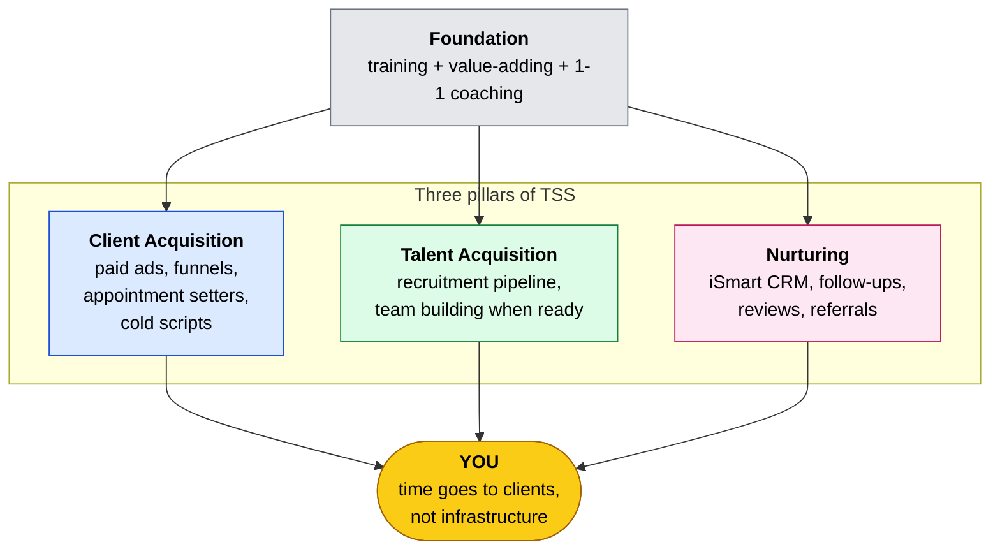
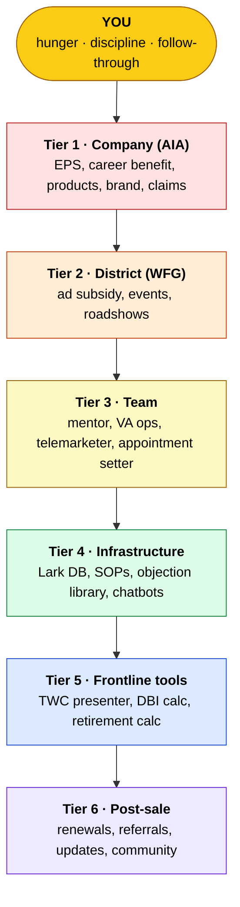

# Day 8: Why the agency you join matters

You've seen the potential of a financial advisory career, but you've probably also heard the horror stories. The industry has a reputation for being a "sink or swim" environment, and for good reason.

Most agencies fail their new advisors. They promise the world but give you little more than a desk and a phone book.

Today I'll show you exactly why we are different.

## The broken system most agencies won't tell you about

Let me be direct with you.

If you've decided financial advisory is the right path, you now face an even bigger decision: which agency to join.

Most people think all agencies are the same. They couldn't be more wrong.

I've been in this industry for nearly a decade. I've seen hundreds of talented, ambitious people join the wrong agencies and flame out in their first year. They were capable people who were set up to fail from day one.

The traditional agency model is broken, and here is why.

### Lie #1: "Just sell to your friends and family"

This is the first thing most agencies tell you: "Make a list of 100 people you know." They call it your "warm market", and they'll convince you it's the foundation of your business.

Here's the truth: your warm market is a crutch. It can't be your whole plan.

Yes, your friends and family might buy from you at first because they trust you. But what happens after that? You have maybe 50 to 100 people in your network, and once you've approached them all, you're done. Your pipeline dries up, your relationships get awkward, and you're left wondering where your next client will come from.

I learned this the hard way. In my early days I used up my warm market within months, so I had to figure out how to build a real business in the cold market, with complete strangers. That's where the real opportunity is, and most agencies will never teach you how to get there.

### Lie #2: "Culture and vibes will carry you"

Walk into most agencies and they'll sell you their "family culture" and team bonding. They'll show you motivational videos and talk about how "positive energy" will drive your success.

Don't get me wrong, culture matters. But culture without systems is just expensive cheerleading.

I've seen too many advisors get hyped up at weekend retreats, only to come back to their desk on Monday with an empty calendar and no idea how to fill it. Motivation fades, so what you need are predictable systems that get results whether you feel motivated or not.

### Lie #3: "Figure it out yourself"

Most agencies run on a "sink or swim" mentality. They give you a desk, a phone and maybe some outdated training materials, then expect you to figure out the rest.

You're expected to:

- Generate your own leads
- Book your own appointments
- Handle your own admin and paperwork
- Create your own marketing materials
- Manage your own follow-ups

You become an unpaid marketer, administrator, telemarketer and operations manager, all rolled into one.

This is insane.

You didn't sign up to become a one-person circus. You signed up to help people with their finances and build wealth for yourself. When you're drowning in low-value tasks, you have no time or energy left for the work that actually brings in income.

### Why I built something different

After living through this broken system myself, I made a decision: I would never put another advisor through what I went through.

I spent years building the infrastructure, systems and support I wish I'd had when I started. I believe in using business to build people, not using people to build business.

The result is what we call the Advisor OS, a complete operating system that handles everything traditional agencies leave you to figure out alone.

## A side-by-side comparison

I'm not here to sell you dreams. Let's look at what you're actually choosing between.

### Lead generation

At a typical agency, they hand you a list of your friends and family, maybe throw in some outdated cold-calling techniques, and send you on your way. When that runs out, you're expected to buy leads from vendors. These are often recycled, low-quality prospects that have already been sold to five other advisors.

I've watched talented people burn through thousands of dollars on garbage leads and blame themselves when nothing converted. The system was rigged against them from the start.

With us, our in-house telemarketers and appointment setters book 3 to 5 qualified meetings for you every week. They are people who have already asked about financial planning and are ready to have a conversation.

You don't chase leads. You serve them.

### Admin and operations

At a typical agency, policy summaries, paperwork, follow-ups and data entry all land on your desk. I've seen advisors spend 20+ hours a week on admin that brings in zero revenue.

With us, our backend VA team handles your operations and admin. Policy summaries are done, paperwork is handled and follow-ups are automated. You focus on what actually makes money: building relationships and closing clients.

### Marketing support

At a typical agency, a basic website costs you $3,000. For social media content, you find your own graphic designer. To run ads, you figure out Facebook and Google yourself and pray you don't waste your budget.

With us, you get our marketing team: graphic designers, web developers, social media managers and copywriters. We're backed by the #1 ranked digital marketing agency in Singapore. And we subsidise 75% of your ad spend.

### The two philosophies

The old way throws you in the deep end and sees if you can swim.

Our way gives you a boat, a map and a crew, then teaches you how to sail.

I built this system because I remember what it felt like to struggle alone. I remember having good intentions but no clear path forward, and wasting time on tasks that didn't move the needle.

You don't have to go through that. The infrastructure is built and the team is in place.

## Systems vs culture

Let me tell you something most agencies won't admit: culture is the bare minimum.

I've been to enough agency events to know the script. Photos of team dinners, motivational posters on the walls, and "we're one big family". Everyone's smiling and talking about "supporting each other".

That's great, and I'm happy for them. But motivation fades by Tuesday. Culture doesn't book your appointments, close your sales or pay your rent when you're struggling to hit your targets.

We have a great culture too. Our team cares about each other's success, and we celebrate wins together. But that's table stakes. What sets us apart is what happens behind the scenes: the systems, processes and SOPs I've spent years building.

I document everything: how to handle different types of leads, how to structure client meetings, how to follow up without being pushy, how to close with conviction, how to onboard new clients. I hate repeating myself, and I hate watching people struggle with problems I've already solved.

Our systems run 24/7. Lead nurturing sequences trigger automatically. Follow-up reminders appear based on client behaviour. Admin gets handled by our backend team without you even knowing about it. I built this because I remember spending weekends doing paperwork instead of living my life.

We have a wiki where you can find the answer to any question in seconds. No more hunting through old WhatsApp messages or asking the same question again.

And we track lead quality, conversion rates, appointment show rates and closing percentages. This isn't to micromanage you. It shows us exactly where you need support, so we can keep improving the system.

### What this means for your day

At a culture-first agency, you start your day with a motivational huddle about "believing in yourself". Then you spend two hours cold calling from a list bought online. You type data into a CRM that crashes half the time, write your own follow-up emails because there's no template, and do your own paperwork because "that's part of the learning process". You end the day exhausted, maybe with one appointment booked, and you wonder if you're cut out for this.

With our systems, you check your calendar and see three pre-qualified appointments already booked by our team. You walk into each meeting with full client notes and a proven presentation framework. While you're in meetings, our VAs handle the paperwork. Your follow-ups are automated and your CRM updates itself. You end the day having had three good conversations with people who actually want to buy.

One approach hopes you'll figure it out. The other makes sure you do.

### Why I built it this way

After running several businesses and managing teams in different industries, I've learned that you can't scale personalities, but you can scale systems.

Culture is fragile. It depends on moods, relationships, and whether the team leader had a good day. When key people leave, the culture often leaves with them.

Systems get stronger under pressure. They work no matter who's having a bad day, and they keep working as you grow.

That's why I've spent hundreds of thousands of dollars and countless hours building infrastructure instead of throwing pizza parties.

## What the system looks like

We call it the Tripod Support System (TSS).

![[first-14-days/images/tripod-support-system.webp|Tripod Support System: three pillars around the advisor]]

```mermaid
flowchart TB
    subgraph Pillars["Three pillars of TSS"]
        direction LR
        A["<b>Client Acquisition</b><br/>paid ads, funnels,<br/>appointment setters,<br/>cold scripts"]
        B["<b>Talent Acquisition</b><br/>recruitment pipeline,<br/>team building when ready"]
        C["<b>Nurturing</b><br/>iSmart CRM, follow-ups,<br/>reviews, referrals"]
    end
    F["<b>Foundation</b><br/>training + value-adding + 1-1 coaching"]
    D(["<b>YOU</b><br/>time goes to clients,<br/>not infrastructure"])
    F --> A
    F --> B
    F --> C
    A --> D
    B --> D
    C --> D
    style D fill:#facc15,stroke:#a16207,color:#000
    style F fill:#e5e7eb,stroke:#6b7280,color:#000
    style A fill:#dbeafe,stroke:#1d4ed8,color:#000
    style B fill:#dcfce7,stroke:#15803d,color:#000
    style C fill:#fce7f3,stroke:#be185d,color:#000
```

Client acquisition: subsidised ads on Facebook, Instagram and Google, in-house appointment setters who book qualified leads into your calendar, cold-market scripts tested on hundreds of real calls, LinkedIn outreach, and lead magnets like policy reviews, BTO calculators and tax relief guides.

Talent acquisition: a recruitment pipeline that already exists when you're ready to build your own team.

Nurturing: the iSmart CRM, automated follow-ups, birthday and anniversary reminders, review meetings and referral scripts.

Under all three sits the foundation: training, value-adding and 1-1 coaching.

Behind TSS is the 6-tier power pyramid, the layers of support under every meeting you run.

```mermaid
flowchart TB
    T6["<b>Tier 6 · Post-sale</b><br/>renewals, referrals, updates, community"]
    T5["<b>Tier 5 · Frontline tools</b><br/>TWC presenter, DBI calc, retirement calc"]
    T4["<b>Tier 4 · Infrastructure</b><br/>Lark DB, SOPs, objection library, chatbots"]
    T3["<b>Tier 3 · Team</b><br/>mentor, VA ops, telemarketer, appointment setter"]
    T2["<b>Tier 2 · District (WFG)</b><br/>ad subsidy, events, roadshows"]
    T1["<b>Tier 1 · Company (AIA)</b><br/>EPS, career benefit, products, brand, claims"]
    YOU(["<b>YOU</b><br/>hunger · discipline · follow-through"])
    YOU --> T1
    T1 --> T2
    T2 --> T3
    T3 --> T4
    T4 --> T5
    T5 --> T6
    style YOU fill:#facc15,stroke:#a16207,color:#000
    style T1 fill:#fee2e2,stroke:#b91c1c,color:#000
    style T2 fill:#ffedd5,stroke:#c2410c,color:#000
    style T3 fill:#fef9c3,stroke:#a16207,color:#000
    style T4 fill:#dcfce7,stroke:#15803d,color:#000
    style T5 fill:#dbeafe,stroke:#1d4ed8,color:#000
    style T6 fill:#ede9fe,stroke:#6d28d9,color:#000
```

1. Company (AIA): EPS allowance, career benefit (1.5x in years 2 to 6, APF from year 7), hospitalisation, HNW and corporate products, $1B+ in claims approved a year, and a 50-60% ad subsidy. This answers "my company doesn't back me up".
2. District (WFG): more ad subsidy on top of AIA's, corporate talks, roadshows and overseas trips. This answers "my district spends its budget on rent, not leads".
3. Team: weekly 1-1s, VAs for ops, a graphic designer, a content writer, an appointment setter, a telemarketer and an in-house web developer. This answers "I'm doing ops, sales and marketing alone".
4. Infrastructure: a searchable Lark database, 34 objections with 43 responses, SOPs and chatbots. This answers "I have to figure out every objection from scratch".
5. Frontline tools: the TWC presenter, the DBI adequacy calculator, and retirement and welcome-bonus calculators. This answers "I have to stop mid-meeting to look things up".
6. Post-sale: an onboarding kit, monthly market updates, blog content, Telegram communities and an expense tracker. This answers "my client forgot I exist by year 2".

## What to ask any agency, including us

If you're comparing agencies, ask each one these:

- What happens when I've finished my list of friends and family?
- Where do the cold-market leads come from?
- How many new advisors are still here after 12 months, and after 36?
- Can I see the first 90 days, week by week, in writing?
- What does Day 30 look like for a new advisor here: where their leads come from, who coaches them, and which tools they use?

A good agency answers these on the spot. If the answers get vague or turn into talk about culture, you have your answer.

So ask yourself this: do you want to spend the next two years struggling to build a business from scratch, or do you want to plug into a machine that's already working?

---

## Worksheet — the agency you're evaluating

If you've spoken to an agency already (us included), run this audit:

1. What's their concrete answer for where leads come from once warm market is exhausted?
2. What does their onboarding look like week by week, and can they show it in writing?
3. What tools do they provide that save you hours per week?
4. What's their 12-month retention rate for new advisors?
5. Would you recommend this agency to your smartest friend? Why or why not?

If you haven't spoken to an agency yet, save this. Use it as your diagnostic when you do.

---

## Related

- Previous: [[../week-1/day-07|Day 7 — The Three I's: Income, Independence, Impact]]
- Next: [[day-09|Day 9 — The 6 C's — Honest Self-Assessment]]
- Week 2 overview: [[README|Week 2 — The Fit Test]]
