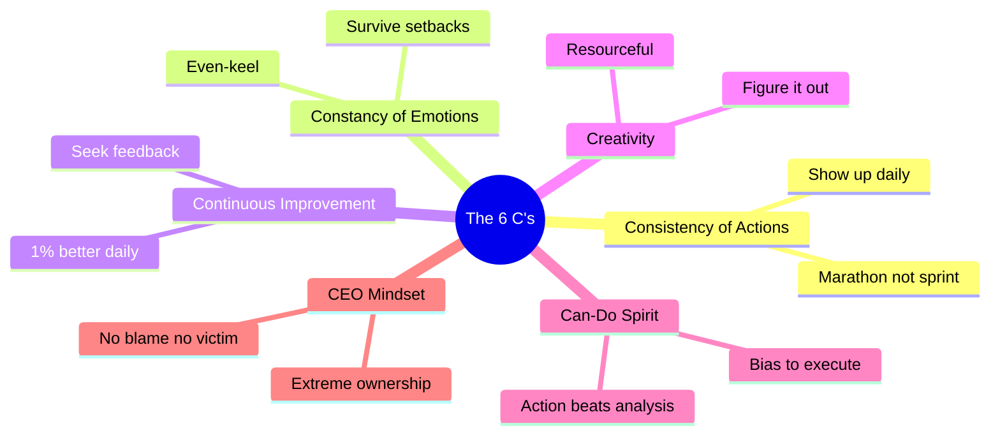

# Day 9 — The 6 C's — Honest Self-Assessment

> **The one idea for today:** I don't screen for experience, connections, or charisma — all of those can be built. I screen for **six character traits**: Consistency of Actions, Constancy of Emotions, Continuous Improvement, Creativity, Can-do Spirit, CEO Mindset. These predict year-one survival better than any CV.

## What you'll walk away with

By the end of today you should be able to:

1. **Understand** the 6 C's I actually screen every candidate for — and why each matters.
2. **Self-assess** honestly against each, using specific behavioural tests.
3. **Identify** which of the six is your strongest and which is your weakest.

---

## 1. What I screen for (and what I ignore)

After a decade in this career, training hundreds of people, I've seen a consistent pattern. The traits that predict year-one survival and year-five excellence are **not**:

- Intelligence
- Likability
- Family connections
- Charisma
- Finance degree
- Sales experience
- Extroversion
- Age

All of those correlate weakly. Some are even negatively correlated (sales experience often means bad habits to unlearn).

What *does* predict success, reliably: **the 6 C's.**

1. **Consistency of Actions** — you show up whether you feel like it or not
2. **Constancy of Emotions** — you don't let highs or lows derail you
3. **Continuous Improvement** — you seek feedback and compound 1% daily
4. **Creativity** — you're resourceful when there's nothing
5. **Can-do Spirit** — you take action, bias toward doing over analysing
6. **CEO Mindset** — you take ownership; no blame, no excuses

Let me walk through each honestly.

---

## 2. The 1st C — Consistency of Actions

**What it means:** you show up and do the work, regardless of how you feel.

> **Consistency beats intensity.** The bucket of water dumped at a rock does nothing. The drop landing every day wears a hole through stone. Small efforts, daily, for a long time.

This career is a marathon, not a sprint. Most people treat it like a sprint, burn out, and quit in month 3.

### The show-up test

*"On a bad day — low motivation, bad mood, tired — do I still do the minimum required work?"*

- **Yes, every time** — high consistency
- **Usually** — average
- **Only when stakes are immediate** — low consistency
- **No** — this is the trait that will break you in this career

### The timeline reframe

Most people set unrealistic timelines and call the goal crazy. The goal isn't crazy — **the timeline is.**

Most ambitious goals become realistic when you stretch the window from 1 year to 5–10 years. Architecture doesn't get abandoned, just delayed. You just need to keep going.

- If lost: the answer is education
- If educated: the answer is execution
- If executing: the answer is consistency

Consistency is what turns the 5-year plan into a 5-year result.

---

## 3. The 2nd C — Constancy of Emotions

**What it means:** controlled peaks and valleys. You don't let a bad week tank you or a great month inflate you.

This career will punch you in the face, repeatedly:

- Week 1: 100 calls, 95 hang-ups
- Week 2: finally 3 appointments, all 3 cancel
- Week 3: great meeting → *"let me think about it"*
- Week 4: first close! → client lapses after 2 months

What separates the ones who make it is **emotional even-keel.**

### The two extremes (both bad)

**Type A — The Quitter:**
- 2 bad weeks → *"this isn't for me"*
- 10 rejections in a row → *"I'm not good at sales"*

**Type B — The Burnout:**
- 1 great month → *"I've figured it out!"* → stops prospecting
- Next month: 0 closings → panic → *"what happened?"*

### My tennis mentality

I played competitive tennis before this career. What tennis taught me:

- **Win a match:** don't celebrate too long. There's another match tomorrow. Stay humble. Keep training.
- **Lose a match:** don't sulk. Analyse. Adjust. Next match.
- **The only thing that matters:** did you put in the work today, regardless of yesterday's result?

Bad month: *"numbers are down, let me analyse and adjust."* Great month: *"awesome, now what can I improve next month?"* Even-keeled. Process-oriented. Not reactive.

### The rejection reframe

Every person doing something meaningful goes through rejection:
- **Jack Ma** — rejected from over 30 job applications, including KFC
- **J.K. Rowling** — rejected by 12 publishers before someone said yes

The single clap in an empty auditorium takes a long time. That's not a bug — it's the indicator you're on the right path.

*"Don't let go too soon, but don't hold on too long."*

---

## 4. The 3rd C — Continuous Improvement

**What it means:** 1% better, every day.

Most people plateau after learning the basics. Get comfortable. Coast. This is where growth dies.

Continuous improvers never plateau because they:

- After every client meeting: *"what could I have done better?"*
- After every rejection: *"what did I say that turned them off?"*
- After every close: *"what worked that I can replicate?"*
- Weekly: *"what's my conversion rate and how do I improve it 5%?"*
- Monthly: *"what new skill should I learn this month?"*

### Don't ask price — ask ROI

*"What's the cost?"* is the wrong question. The right question is: *"What's the ROI?"*

I can pay someone $15/hour because I know my time is worth $300/hour. The math works because I've done the improvement work to know my own value.

### My own examples

During NS, I taught myself on Carousell. Joined Toastmasters. Started reading books seriously. I couldn't just sit in the routine and let my brain atrophy.

FINternship itself is a result of this trait. Launched logo July 16, 2024. In less than a year: 200+ community members, 20+ webinars, 200 pages of slides, 150+ pieces of content, 300+ hours of 1-1 mentorship, 50+ hours of recorded video. That's the output speed when continuous improvement is reflex.

---

## 5. The 4th C — Creativity (Resourcefulness)

**What it means:** being resourceful when there is nothing.

Most people say: *"I can't do X because I don't have Y."*

- *"I can't run ads because I don't know Facebook Ads Manager"*
- *"I can't call leads because I don't have a good script"*
- *"I can't close deals because I don't have enough product knowledge"*

Creative people say:

- *"I don't know Facebook Ads Manager — I'll watch 3 YouTube videos tonight and figure it out."*
- *"I don't have a good script — I'll use the template and iterate."*
- *"I don't have enough product knowledge — I'll study 2 hours every evening until I'm confident."*

### My own example

When I started my digital marketing agency, I knew nothing about marketing. Zero. But I knew it was a core skill worth learning. YouTube videos. Self-learning. No AI back then to lean on. I just knew I could learn as I go.

That same resourcefulness is what let me build four companies after the FA business. Not genius. Not connections. Just **"I don't know, so let me figure it out."**

### The initiative test

*"Last time I needed something at work that wasn't available — what did I do?"*

- **Spent 15+ minutes trying before asking** — high creativity
- **Asked immediately** — average
- **Waited for someone to tell me it was impossible** — low creativity
- **Gave up** — low creativity

---

## 6. The 5th C — Can-do Spirit

**What it means:** take risks and take action. Execute at the speed of thought.

Most people:
1. Have an idea
2. Think about it for days
3. Analyse all outcomes
4. Seek validation
5. Wait for the "perfect moment"
6. Never execute

Can-do people:
1. Have an idea
2. Take action within 24 hours
3. Learn and adjust as you go

### The two recruits

**Recruit A (planner):** 2 weeks researching "the perfect CRM," reads 10 articles on "cold-calling scripts," watches 15 YouTube videos. Starts calling 3 weeks in. Month 1: 50 calls, 2 appointments.

**Recruit B (executor):** Day 1 — *"let me just start calling."* Uses whatever script was given. Makes mistakes, adjusts on the fly. Month 1: 500 calls, 15 appointments.

Recruit B wins. Willing to look stupid, fail publicly, learn through action.

### The three things that stop most people

Slide from my masterclass:

- **FEAR** — False Evidence Appearing Real. Chess game with shadows.
- **DISCOMFORT** — courage needs adversity. Diamond under pressure. Sword forged in fire. Pencil sharpened by friction.
- **INCONVENIENCE & PROCRASTINATION** — like credit card debt. Feels good swiping, painful paying. Compounds at ~26% annually. Always something for something, never something for nothing.

### Wealthy vs poor mindset

- **Wealthy:** *"I get ready by starting."*
- **Poor:** *"I'll start when ready."*

The wealthy already know: you don't feel ready before the thing. You feel ready *during* the thing. Start anyway.

### Life lines I live by

- *"Life is like a camera. If things don't work out, take another shot."*
- *"You don't need more information. You need more momentum."*
- *"Courage is action despite fear."*
- *"The man who waited for the rain never planted. The man who feared failure never built a thing."*

---

## 7. The 6th C — CEO Mindset

**What it means:** Chief Efficiency Orchestrator. Take ownership, take accountability. No blame, no excuses, no victim.

When something goes wrong, who do you blame?

**Low CEO mindset:**
- *"The leads were bad"*
- *"The market is down"*
- *"Clients don't have money"*
- *"The training wasn't good enough"*

**High CEO mindset:**
- *"I didn't qualify the leads properly"*
- *"I need to adjust my pitch for this environment"*
- *"I was targeting the wrong demographic"*
- *"I didn't use the training materials enough"*

### There is no rich victim

> **"You can be successful, or you can be a victim. You cannot be both."**

Blaming feels like relief. It lets you stay stuck. Blame → excuses → complaints.

But victim mindset and success are mutually exclusive. You choose one or the other. There is no such thing as a rich victim.

**Poor mindset:** *"Why is this happening to me?"*
**Rich mindset:** *"Who do I need to become?"*

### The 3-question drill

When you catch yourself complaining, run this drill:

1. **"So?"** — what's the consequence of this actually being true?
2. **"Then?"** — what's the solution?
3. **"How?"** — how do I execute the solution?

By question 3, the complaint has become a plan. That's the switch from victim to CEO.

### The ownership principle

> **"Nothing happens to you, everything happens for you."**

Every difficult experience is a lesson. If you don't learn, it happens again. And again. The universe is teaching you the same lesson until you get it.

People complain as though an audience is present in their life. There isn't one. Only you.

### Extreme ownership, extreme honesty

The CEO mindset is three extremes held together:

- **Extreme ownership** — this is on me
- **Extreme accountability** — I said I'd do it, so I do it
- **Extreme honesty** — with myself, first, before anyone else

---

## 8. The honest self-assessment

Rate yourself 1–5 on each, with specific recent evidence:

| C | Score | Evidence |
|---|:-:|---|
| Consistency of Actions | __ | |
| Constancy of Emotions | __ | |
| Continuous Improvement | __ | |
| Creativity | __ | |
| Can-do Spirit | __ | |
| CEO Mindset | __ | |

**5 on all six:** you're exactly who I'm looking for. Year-one survival highly probable.

**4–5 on five out of six:** strong candidate. Know which is weak — that's where year-one risk lives.

**3 on most:** average. Possible but harder than it needs to be. Evaluate whether weaker traits are teachable *for you*.

**2 or lower on any trait:** be honest. Not all traits are equally teachable. *Constancy of Emotions* and *CEO Mindset* are the hardest to build from a low base.

---

## 9. Can these be developed?

Yes — all six can be built with intentional effort:

- **Consistency:** track daily activities, set non-negotiable minimums, study stoicism
- **Constancy of Emotions:** meditation, journaling, Stoic readings (Marcus Aurelius, Epictetus)
- **Continuous Improvement:** join growth communities, find a mentor who challenges you
- **Creativity:** practice figure-it-out time — 15 minutes before asking for help
- **Can-do Spirit:** small commitments with timers, launch at 70% ready
- **CEO Mindset:** catch yourself blaming, run the 3-question drill, extreme-ownership reading

The catch: **you can't fake these long-term.** If you're not naturally inclined toward at least four of the six, this career will expose it within 6 months. Better to know now.

If the honest self-assessment says no — that's valuable information. Maybe not *career is wrong.* Maybe *now isn't the right time,* and 6 months of deliberate work on these traits would make you a much better fit.

---

## 10. The question that matters

At the end of the day, all the systems and support in the world won't matter if you're not ready to do the work.

So let me ask directly: **Are you ready for the challenge?**

Ready to commit not just to learning, but to *executing*? Not just to dreaming, but to *building*? Not just to starting, but to *finishing*?

If yes — everything I've built is waiting for you. The infrastructure is ready. The systems are proven. The only variable left is you.

---

## Worksheet — your six-trait plan

1. Which C is your strongest? (evidence?)
2. Which is your weakest? (evidence?)
3. If you were to join this career tomorrow, which C would be your biggest liability? What could you do in the next 30 days to strengthen it?
4. If you had to choose *not* to join — which C's weakness would be the honest reason?

---

## Quiz

**Q1. The 6 C's that predict year-one survival better than any CV item are:**
- A) Intelligence, likability, connections, charisma, confidence, credentials
- B) Consistency, Constancy, Continuous Improvement, Creativity, Can-do Spirit, CEO Mindset ✓
- C) Sales experience, finance degree, extroversion, composure, confidence, credentials
- D) Network, family money, age, education, energy, effort

**Why:** Qualifications can be gained on the job. Character traits set the ceiling for how quickly skills layer on. The 6 C's together explain most of the difference between advisors who make it and advisors who leave in year one. Agencies that screen for CV instead of character produce predictable attrition.

**Q2. The CEO Mindset line *"you can be successful or a victim, not both"* means:**
- A) Successful people never face hardship
- B) Blame forfeits the power to change; ownership unlocks growth ✓
- C) Playing victim is a valid strategy
- D) Successful people don't care about others

**Why:** The claim isn't that successful people avoid hardship. It's that *victim* and *successful* are incompatible states. Victim mindset gives you an excuse to stay stuck; ownership gives you the power to move. You can't hold both at once. Choose ownership, even when the "fault" is partly external.

**Q3. If your honest self-assessment scores 2/5 on one trait, the right response is:**
- A) Ignore it — you'll grow into it on the job
- B) Quit considering the career entirely
- C) Treat it as a real liability, evaluate teachability and timing ✓
- D) Overcompensate by leaning on your other traits

**Why:** A 2/5 is diagnostic, not a judgment. Some traits (Can-do, Continuous Improvement) can be built in 3–6 months. Others (deep Consistency, CEO Mindset, Constancy of Emotions) take longer and require real self-work. Honest response: evaluate teachability and timing. Joining while knowingly weak — without a plan — is the year-one dropout pattern.

---

## Related

- Previous: [[day-08|Day 8 — Why the Agency Matters More Than Most People Realise]]
- Next: [[day-10|Day 10 — Warm + Cold Market: Your Full Pipeline]]
- Week 2 overview: [[README|Week 2 — The Fit Test]]
