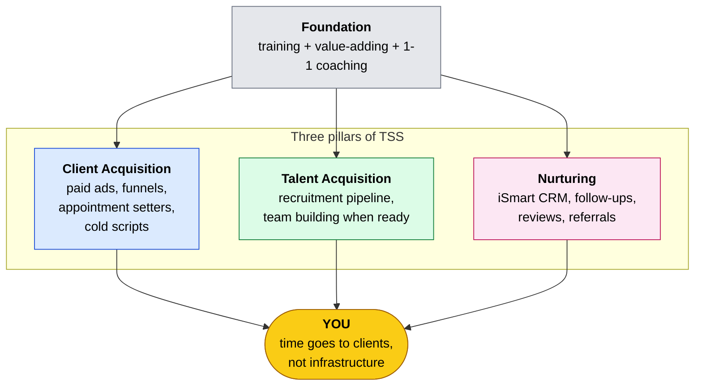
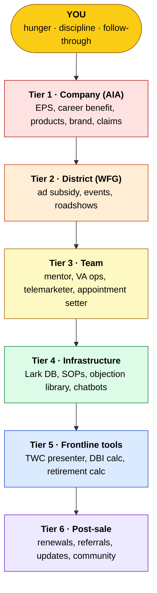

## What the system looks like

Yesterday you saw why the agency matters. Here is the system we built. We call it the Tripod Support System (TSS).

![[first-14-days/images/tripod-support-system.webp|Tripod Support System: three pillars around the advisor]]

```mermaid
flowchart TB
    subgraph Pillars["Three pillars of TSS"]
        direction LR
        A["<b>Client Acquisition</b><br/>paid ads, funnels,<br/>appointment setters,<br/>cold scripts"]
        B["<b>Talent Acquisition</b><br/>recruitment pipeline,<br/>team building when ready"]
        C["<b>Nurturing</b><br/>iSmart CRM, follow-ups,<br/>reviews, referrals"]
    end
    F["<b>Foundation</b><br/>training + value-adding + 1-1 coaching"]
    D(["<b>YOU</b><br/>time goes to clients,<br/>not infrastructure"])
    F --> A
    F --> B
    F --> C
    A --> D
    B --> D
    C --> D
    style D fill:#facc15,stroke:#a16207,color:#000
    style F fill:#e5e7eb,stroke:#6b7280,color:#000
    style A fill:#dbeafe,stroke:#1d4ed8,color:#000
    style B fill:#dcfce7,stroke:#15803d,color:#000
    style C fill:#fce7f3,stroke:#be185d,color:#000
```

Client acquisition: subsidised ads on Facebook, Instagram and Google, in-house appointment setters who book qualified leads into your calendar, cold-market scripts tested on hundreds of real calls, LinkedIn outreach, and lead magnets like policy reviews, BTO calculators and tax relief guides.

Talent acquisition: a recruitment pipeline that already exists when you're ready to build your own team.

Nurturing: the iSmart CRM, automated follow-ups, birthday and anniversary reminders, review meetings and referral scripts.

Under all three sits the foundation: training, value-adding and 1-1 coaching.

Behind TSS is the 6-tier power pyramid, the layers of support under every meeting you run.

```mermaid
flowchart TB
    T6["<b>Tier 6 · Post-sale</b><br/>renewals, referrals, updates, community"]
    T5["<b>Tier 5 · Frontline tools</b><br/>TWC presenter, DBI calc, retirement calc"]
    T4["<b>Tier 4 · Infrastructure</b><br/>Lark DB, SOPs, objection library, chatbots"]
    T3["<b>Tier 3 · Team</b><br/>mentor, VA ops, telemarketer, appointment setter"]
    T2["<b>Tier 2 · District (WFG)</b><br/>ad subsidy, events, roadshows"]
    T1["<b>Tier 1 · Company (AIA)</b><br/>EPS, career benefit, products, brand, claims"]
    YOU(["<b>YOU</b><br/>hunger · discipline · follow-through"])
    YOU --> T1
    T1 --> T2
    T2 --> T3
    T3 --> T4
    T4 --> T5
    T5 --> T6
    style YOU fill:#facc15,stroke:#a16207,color:#000
    style T1 fill:#fee2e2,stroke:#b91c1c,color:#000
    style T2 fill:#ffedd5,stroke:#c2410c,color:#000
    style T3 fill:#fef9c3,stroke:#a16207,color:#000
    style T4 fill:#dcfce7,stroke:#15803d,color:#000
    style T5 fill:#dbeafe,stroke:#1d4ed8,color:#000
    style T6 fill:#ede9fe,stroke:#6d28d9,color:#000
```

1. Company (AIA): EPS allowance, career benefit (1.5x in years 2 to 6, APF from year 7), hospitalisation, HNW and corporate products, $1B+ in claims approved a year, and a 50% ad subsidy. This answers "my company doesn't back me up".
2. District (WFG): more ad subsidy on top of AIA's, corporate talks, roadshows and overseas trips. This answers "my district spends its budget on rent, not leads".
3. Team: weekly 1-1s, VAs for ops, a graphic designer, a content writer, an appointment setter, a telemarketer and an in-house web developer. This answers "I'm doing ops, sales and marketing alone".
4. Infrastructure: a searchable Lark database, 34 objections with 43 responses, SOPs and chatbots. This answers "I have to figure out every objection from scratch".
5. Frontline tools: the TWC presenter, the DBI adequacy calculator, and retirement and welcome-bonus calculators. This answers "I have to stop mid-meeting to look things up".
6. Post-sale: an onboarding kit, monthly market updates, blog content, Telegram communities and an expense tracker. This answers "my client forgot I exist by year 2".

## The person at the centre

That's the system. Before you go further, let me be clear about something: no system, however good, can succeed without the right person at the centre.

The most important questions aren't about what we can do for you. They're about what you're willing to do for yourself:

- Are you taking action, or just consuming information?
- Are you dreaming big enough to justify the effort?
- Can you turn short bursts of motivation into firm discipline?
- Will you form the routines and habits that keep success going?
- Are you willing to learn how to delegate and automate as you grow?

After building four companies, I've learned that every system, organisation and team starts with the individual.

I'm not looking for people who need to be pushed. I'm looking for people who need to be guided. There's a big difference.

### Building an elite team

After a decade in financial advisory and entrepreneurship, managing 1,000+ clients across four companies, I made a decision. In 2025 I stepped back from finding new clients myself to focus on what I do best: building and mentoring the next generation of advisors.

I want to build something like an elite sports team, a group of high performers who step up, contribute and push each other to grow. People who dream big, stay disciplined, and know that systems carry you further than hustle alone.

My mission has two parts:

1. Find the right people, with the hunger and discipline to succeed.
2. Build the right systems to support them.

A system without the right people will fail. The best people will struggle in a broken system. You need both.

| | Wrong systems | Right systems |
|---|---|---|
| Right people | Capable people burn out building everything alone. Most year-one dropouts sit here. | Growth that adds up every year. This is my aim. |
| Wrong people | They quit before licensing. | The systems sit unused and they still fail. |

### What you get when you pass the test

If you pass the licensing exams and join the team, you get access to everything I've built over the past decade:

- Every script I've used to close hundreds of cases
- All my presentation slides and frameworks
- Lead generation methods and systems
- Marketing strategies and materials
- Operational processes and SOPs

Later, you can use this whole program to build your own team. Everything I used to develop you becomes what you use to develop others.

## The 6 C's

So what does the right person look like? After training hundreds of people, I don't screen for experience, connections or charisma. Those can all be built. I look for six traits.

### 1. Consistency of actions

![[first-14-days/images/6c-consistency.webp|Consistency of actions]]

You show up and do the work whether you feel like it or not. A bucket of water thrown at a rock does nothing, but a drop landing every day wears a hole through it.

This career is a marathon. Most people set a timeline that's too short and then decide the goal was crazy. Stretch the window from 1 year to 5 and most goals become realistic, as long as you keep going.

What keeps me going is the game itself. I played tennis at national level, so I know the drive for titles. But if your only goal in Maplestory is to hit level 200, what do you do after you get there? Many players just sell their accounts and move on. I don't work for COT or a certain net worth. I work because I like to build better systems, solve problems and help people improve. If I'd told myself I'd stop at a certain goal, I would have quit long ago.

### 2. Constancy of emotions

![[first-14-days/images/6c-constancy.webp|Constancy of emotions]]

You don't let a bad week tank you or a great month go to your head.

This career will test you. 100 calls with 95 hang-ups. Three appointments that all cancel. A great meeting that ends in "let me think about it". Some people quit after two bad weeks. Others have one great month, stop prospecting, and panic when the next month is empty.

Tennis taught me to treat both the same way. Win a match, don't celebrate too long, because there's another match tomorrow. Lose one, don't sulk. Look at what went wrong, adjust, and play the next one.

### 3. Continuous improvement

![[first-14-days/images/6c-continuous-improvement.webp|Continuous improvement]]

You get 1% better every day. After every meeting you ask what you could have done better. After every rejection, what you said that turned them off. After every close, what worked.

During NS, I taught myself to sell on Carousell, joined Toastmasters and started reading seriously. FINternship itself came out of this habit. We launched on 16 July 2024, and within a year we had 200+ community members, 20+ webinars, 150+ pieces of content and 300+ hours of 1-1 mentorship.

### 4. Creativity

![[first-14-days/images/6c-creativity.webp|Creativity]]

You're resourceful when there's nothing to work with. Most people say "I can't run ads because I don't know Facebook Ads Manager." A resourceful person watches three YouTube videos tonight and figures it out.

When I started my digital marketing agency, I knew nothing about marketing. I learned it from YouTube, by myself, before there was any AI to help. I built the other companies with the same "I don't know, so let me figure it out".

A simple test: the last time you needed something that wasn't available, did you spend 15 minutes trying before you asked for help?

### 5. Can-do spirit

You take action fast. Picture two new advisors. The first spends two weeks researching the perfect CRM and reading about cold-calling scripts, and starts calling in week 3. Month 1: 50 calls, 2 appointments. The second starts calling on day 1 with the script he was given and adjusts as he goes. Month 1: 500 calls, 15 appointments.

The second one wins because he's willing to look stupid and learn by doing.

Fear is False Evidence Appearing Real. You don't feel ready before you start. You feel ready once you've started.

### 6. CEO mindset

![[first-14-days/images/6c-ceo-mindset.webp|CEO mindset]]

You own your results. When something goes wrong, you don't say "the leads were bad" or "the market is down". You say "I didn't qualify the leads properly" or "I need to adjust my pitch".

You can be successful, or you can be a victim. You can't be both. There is no such thing as a rich victim.

When you catch yourself complaining, ask three questions. So what? What's the solution? How do I carry it out? By the third question, the complaint has turned into a plan.

## Can the 6 C's be built?

All six can be built with effort. Track your daily activity and set minimums you never skip. Give yourself 15 minutes to figure something out before you ask for help. Launch at 70% ready. But you can't fake these for long. If you're weak on more than two, this career will show it within 6 months, and it's better to know now.

## The reality check

Not everyone stays convicted, motivated and disciplined over time. The next few months are a test of your skills and of your character.

Some people get excited about the opportunity and fade when the work begins, and others start strong and lose momentum at their first real challenge. I'm looking for the ones who understand that this is a marathon.

So let me ask you directly: are you ready for the challenge? Are you ready to commit to executing, and to building, and to finishing what you start?

If your answer is yes, everything we've built is waiting for you. The only variable left is you.

---

## Related

- Previous: [[day-08|Day 8 — Why the Agency Matters More Than Most People Realise]]
- Next: [[day-10|Day 10 — Warm + Cold Market: Your Full Pipeline]]
- Week 2 overview: [[README|Week 2 — The Fit Test]]
