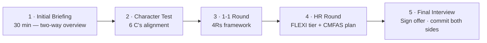

# Day 14 — Your Decision + Your Timeline With Us

> **The one idea for today:** 14 days in. You've got the model, the math, the systems, the self-assessment, the objections handled, the FLEXI scheme, the income guarantee. Today is the decision — and if it's yes, here's exactly what the next 12 months look like with us.

## What you'll walk away with

By the end of today you should be able to:

1. **Land** on one of four specific outcomes — Commit, Delay, Keep Exploring, or honest No.
2. **Know** the full timeline with us if you commit — introduction, incubation, induction.
3. **Book** the onboarding call that starts your journey, or pick the revisit date for Delay.

---

## 1. What you've seen in 14 days

Quick recap before you decide.

**Week 1 — The Opportunity:**
- Day 1 — Why you're reading this (my story, the 9-to-5 ceiling)
- Day 2 — Franchise without the $200K fee
- Day 3 — Three high-income skills that transfer for life
- Day 4 — The risk-reversal card (everything to gain, nothing to lose)
- Day 5 — Hidden math ($40/hour vs $667/hour)
- Day 6 — Stickiness + scalability = compounding
- Day 7 — The three I's: Income, Independence, Impact

**Week 2 — The Fit Test:**
- Day 8 — Why the agency matters (TSS, 6-Tier Pyramid, right people × right systems)
- Day 9 — The 6 C's (Consistency of Actions, Constancy of Emotions, Continuous Improvement, Creativity, Can-do Spirit, CEO Mindset)
- Day 10 — Warm market objection (99.9% of my book was cold)
- Day 11 — Experience/introvert objection (Gabriel, Benjamin receipts)
- Day 12 — Time/office/IFA objections
- Day 13 — FLEXI scheme ($4,200/month possible) + Income Guarantee ($2K/$4K min)

That's the complete picture. Now the decision.

---

## 2. The four valid outcomes

By end of today you should be in one of four places:

### Outcome 1 — Commit

Model yes. Agency yes. You're a fit. You're ready to take the next concrete step.

**What Commit looks like — our 5-stage interview process:**

I'm not looking for mass hires. The 100-earner mission requires actually picking the right 100. So here's the structured process you'd go through:

1. **Initial Briefing** — 30 min. I walk through the full program, answer your questions, understand your context. This is the replacement for a "sales call" — it's a two-way conversation.
2. **Character Test** — values-alignment check. Short structured conversation + self-assessment against the 6 C's (Day 9). Most of this happens naturally through the first two calls.
3. **1-1 Round** — deeper conversation on your strengths, weaknesses, current situation, and what you actually want out of the next 12 months. I use the **4Rs framework** here: Role title, role responsibilities, role mission, role results — we align on all four before moving forward.
4. **HR Round** — working-hours agreement, FLEXI tier selection (0/10/20 hrs), CMFAS exam registration plan. This is the operational round.
5. **Final Interview Round** — commitment conversation. You sign the FLEXI offer. I countersign my commitment to your $2K/$4K income guarantee. Both sides walk in with eyes open.

You'll also meet **2–3 current FINterns** during this process to hear unfiltered reality — what the work actually looks like, the hard parts, what they wish they'd known on day 1.

None of this is automated. You talk to me, to the team, to peers. It takes 2–4 weeks end-to-end.

Commit doesn't mean *"sign today."* It means *"I've decided on the direction — let's run the process that seals the decision."*

**Next step:** Book the Initial Briefing.

### Outcome 2 — Delay

Model yes. Agency yes. *Timing* no.

Real reasons might include:
- Current role too demanding to ramp a side practice right now
- Family or health situation needs full focus
- Financial buffer insufficient to handle 3-6 months ramp variability
- You identified a weak C out of the 6 C's (Day 9) to work on first
- You want to build a specific skill in current role before transitioning

**What Delay looks like:**

- Pick a specific revisit date (3, 6, or 12 months)
- Write down what has to be true by that date
- Put Day 14 re-read on your calendar for the revisit date
- In the meantime, keep learning — podcasts, books, one coffee chat a month with someone in the career

**Next step:** Calendar the revisit date with specific conditions.

### Outcome 3 — Keep Exploring

Model yes. This specific agency — not sure.

Maybe:
- Systems feel weaker than you'd hoped after Day 8's audit
- Team or culture didn't feel like your people
- Compensation structure seems off
- Something subtly doesn't fit

**What Keep Exploring looks like:**

- Apply Day 8's diagnostic questions to 2–3 other agencies
- Rank them on three criteria (lead infrastructure, training, systems)
- Speak to real advisors at each — not just recruiters
- Re-evaluate in 4–6 weeks

**Next step:** Use Day 8's checklist. Revisit with data.

### Outcome 4 — Honest No

The career isn't for you. Reading these 14 days didn't shift your answer to yes — and that's valid.

You've saved yourself 12 months of finding out the hard way. The skills you built working through this course — evaluating a business model, running hourly-rate math, recognising real vs broken agency structures — apply to any career you choose.

**Next step:** Go well. If conditions change, come back in 6 months. No hard feelings.

---

## 3. If you committed — here's your full timeline with us

This is the entire arc from today → licensed advisor. Three phases: **Introduction → Incubation → Induction.**

### Phase 1 — INTRODUCTION (Today → Week 2)

**What you do:**

1. **Book the onboarding call** — 30-minute conversation with me to understand your context, answer residual questions, decide together if we move forward.
2. **Sign up for FINternship FLEXI scheme** — pick the tier (0/10/20 hrs) that matches your commitment capacity.
3. **Register for CMFAS exams** — M5, M9, M9A, HI. We give you access to exam prep resources and the chatbot tutor.
4. **Second onboarding call** (after first is done) — we walk through the full Skool course in greater detail, connect you with existing FINterns to ask questions.

### Phase 2 — INCUBATION (Months 1–3)

**Focus:** clear the CMFAS papers + build conviction.

**What you'll do:**

- **Study CMFAS exams** — 2–3 hours/day commitment. Faster completion earns a fast-completion reward.
- **Attend weekly training calls** — mindset, sales psychology, prospecting, product knowledge
- **Book 1-1 coaching calls with me** for personalised feedback and questions
- **Earn via FLEXI scheme** — up to $4,200/month during this phase depending on tier
- **Optional:** register for the AIA One Internship Program for additional income

Most FINterns pass all papers in 2–4 months at full pace. Part-timers take 4–6 months. No rush — just consistency.

### Phase 3 — INDUCTION (Post-exams → Full advisor)

**Congratulations — you're now officially qualified to join as a financial advisor.**

**What happens:**

1. **Lodge your RNF** (Representatives Notification Framework) with MAS
2. **Choose your pay scheme** — EPS (AIA's $1K–$4K monthly allowance) or commission-only
3. **Receive $1,000 onboarding incentive**
4. **Enter structured onboarding programs:**
   - **FTS** (Foundation To Success) — sales fundamentals
   - **EPS Training Programme** — if on the Entrepreneur Power Scheme
   - **BTS Training Programme** — advanced frameworks
5. **Income Guarantee kicks in from month 4 post-licensing** — $2K (student) / $4K (full-time) minimum monthly
6. **Start closing cases** — first ones typically close within 30–60 days

After that, your journey moves into the First 60 Days curriculum — the post-licensing 60-day module I built specifically for this phase.

---

## 4. How much do you need to commit?

Honest answer from my own experience:

When I joined as a student advisor, I had no clue whether it would work out. No support like what we have now. No training programs. I joined with the mindset that I had **everything to gain and nothing to lose.**

I didn't have a crystal ball. At minimum, I'd gain income, knowledge, communication skills, work experience. And even if it didn't work out, I could still pursue any other career path.

- Did I quit my degree? No.
- Could I still do other things? Yes. Many advisors join us while still in full-time jobs or degrees.
- **Any opportunity cost?** No.
- **Any contractual obligations?** No.
- **Can I quit anytime?** Yes, fully.
- **Fixed hours?** No — you choose your working hours.

This is the downside you're walking into. You decide if you can live with that.

---

## 5. What I'm committing to you in return

If you come on board, here's my commitment:

**1. I will not ask you to pay me a single cent.** Ever.

**2. I will not force you to do something you don't want to do.**

**3. I pay you to prove the career is right for you** — up to $4,200/month during FINternship (FLEXI 20).

**4. I personally guarantee your income** from month 4 post-licensing onwards — $2K (student) or $4K (full-time) monthly, or I pay the difference.

**5. I give you full access to everything I've built over 10 years** — scripts, slides, frameworks, lead gen systems, marketing, SOPs. Complete knowledge transfer.

**6. I'll personally mentor you** through weekly training, 1-1 coaching calls, and the full FINternship community.

**7. If you pass and stay, you can eventually build your own team** using the same infrastructure — multiplication effect built in.

That's not a pitch. That's what's actually on the table.

---

## 6. The bigger mission — 100 five-figure earners by 2026

Just so you know what you'd be joining.

In 2025, I'm stepping back from personal client acquisition. My time now goes to building the next generation of advisors. I want to create something like an elite sports team — high-performance individuals who step up, contribute, and push each other to grow.

**Specific target: 100 five-figure earners by 2026.**

Not a slogan. A specific number. Every FINtern who makes it is one of those 100. You'd be joining something with a clear mission and concrete accountability — not just "a career."

> **"To be successful in a profession, to be wealthy, cannot be compared to making the lives of our fellow men better. It can bring immense satisfaction."** — Lee Kuan Yew

That's the frame. We're not just here to make money. We're here to build advisors who change the financial trajectory of hundreds of families each.

---

## 7. If you're still on the fence — the action vs inaction math

One last frame before you decide. From my Financial IQ Masterclass:

**If you take action:**
- **Worst case:** you lose 2 hours a day for a while. Walk away smarter, with skills, a financial plan, and a network.
- **Best case:** $10K/month income. Path to retire your parents. Financially savvy for life. First millionaire in your family.

**If you don't take action:**
- **What you stand to gain:** nothing new.
- **What you stand to lose:** stay where you are. Lose ~$100K/year in opportunity cost over a decade. Settle for average. Miss this chance. Stay stuck. Lifetime of regret.

Asymmetric. Just like Day 4 argued. The hidden risk is inaction.

---

## 8. Take the shot

Some lines I live by:

> *"Life is like a camera. If things don't work out, just take another shot."*

> *"You don't need more information. You need more momentum."*

> *"Courage is action despite fear."*

> *"If the downside is zero and the upside is massive, the only real risk is not trying."*

14 days of reading is enough. The rest is action.

---

## The final worksheet

Write one sentence to each, honestly:

1. **My answer is:** *(Commit / Delay / Keep Exploring / No)*
2. **The strongest evidence for this answer is:**
3. **The strongest evidence against is:**
4. **My next step is:**
5. **My next-step date is:**

Sign it. Date it. Put it somewhere you'll find it in 3 months.

Whichever outcome you landed on — you decided with your eyes open. That's what the 14 days were for.

---

## Quiz

**Q1. The four valid outcomes of Day 14 are:**
- A) Yes or no, binary
- B) Commit now, or don't
- C) Commit, Delay, Keep Exploring, or honest No — all four are legitimate, none is a failure ✓
- D) Only Commit is a real outcome

**Why:** A good evaluation produces whatever answer the evidence supports. Forcing a binary collapses legitimate distinctions — *Delay* (right model, wrong timing) and *Keep Exploring* (right model, wrong agency) are distinct from both *Commit* and *No*. Each points to a different next step. The course is designed to produce honest clarity, not any specific outcome.

**Q2. The correct next step after a *Commit* decision is:**
- A) Sign all the paperwork immediately
- B) Book a 30-minute onboarding call with Leo — a two-way conversation, not a sales pitch ✓
- C) Take the CMFAS exams that same week
- D) Put in your resignation before the call

**Why:** *Commit* doesn't mean *sign everything today.* It means *I've decided on the direction — now let's do the due diligence that seals the decision.* The onboarding call is specifically for that — understanding your context, answering residual questions, deciding together if we move forward. Rushing past it is how bad decisions happen on both sides.

**Q3. The biggest Day-14 trap is:**
- A) Being too cautious
- B) Committing out of momentum (*"I've read 14 days, so I should"*) rather than committing because the arguments genuinely add up for you ✓
- C) Taking too long to decide
- D) Writing down your answer

**Why:** Momentum is not evidence. 14 days of reading produces momentum whether or not the underlying case is right. The specific trap is conflating *"I've invested time reading"* with *"I should therefore commit."* Sunk time is irrelevant. Whichever outcome you land on — Commit, Delay, Keep Exploring, or No — should be supported by evidence in your worksheets, not by the effort you put into the reading.

---

## Graduation

You've completed Your First 14 Days.

What you have now that you didn't have 14 days ago:

- A clear read on whether FA is a structural fit for how you want to live
- Specific criteria to evaluate any agency, not just mine
- An honest self-assessment against the 6 C's
- A handled answer for every common objection
- Full visibility into the FLEXI scheme, income guarantee, and your timeline with us
- A decision — Commit, Delay, Keep Exploring, or No — you can defend to yourself

Whichever you landed on, you earned it with 14 days of honest reading. That's more due diligence than most people do for their career.

**If you're moving forward — book the onboarding call.** Details on the Skool community or directly with me.

**If you're not** — good luck. Come back in 6 months if conditions change.

Either way: thank you for taking this seriously. That's what I built this course for.

See you on the other side.

— Leo

---

## Related

- Previous: [[day-13|Day 13 — The FLEXI Scheme + 15 Rapid-Fire FAQs]]
- Next step (if Commit): [[../../first-60-days/INDEX|First 60 Days — post-licensing]]
- Following step: [[../../next-60-days/INDEX|Next 60 Days — post-RNF]]
- Week 2 overview: [[README|Week 2 — The Fit Test]]
- The beginning: [[../week-1/day-01|Day 1 — Why You're Even Reading This]]
- [[../INDEX|Your First 14 Days — Index]]
