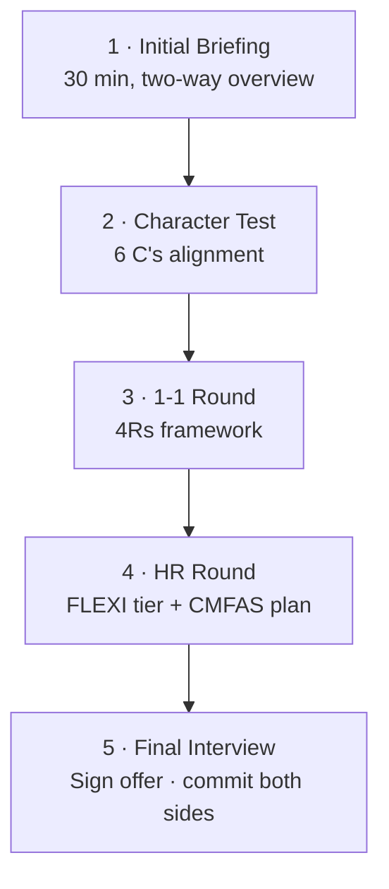

# Day 14: Your decision and your timeline with us

You've seen the business model, the math, the agency question, the 6 C's, the common worries and the Flexi scheme, so today you decide.

## Four answers

By the end of today, pick one.

### Commit

The career fits and our team fits. The next step is an initial briefing with me. From there the process has five stages, and it usually takes 2 to 4 weeks:

```mermaid
flowchart TD
    A["1 · Initial Briefing<br/>30 min, two-way overview"] --> B["2 · Character Test<br/>6 C's alignment"]
    B --> C["3 · 1-1 Round<br/>4Rs framework"]
    C --> D["4 · HR Round<br/>FLEXI tier + CMFAS plan"]
    D --> E["5 · Final Interview<br/>Sign offer · commit both sides"]
```

1. Initial briefing: 30 minutes where I walk you through the program and answer your questions.
2. Character test: a short conversation and a self-check against the 6 C's from Day 9.
3. 1-1 round: your strengths, your situation and what you want from the next 12 months. We agree on your role title, responsibilities, mission and results.
4. HR round: your working hours, your Flexi scheme and your CMFAS exam plan.
5. Final interview: you sign the Flexi offer, and I sign my side of the income guarantee.

Along the way you'll meet 2 or 3 current FINterns, so you can ask them what the work is really like.

### Delay

The career fits, but the timing doesn't. Maybe your job is too demanding right now, or you need to work on one of the 6 C's first. Pick a date 3, 6 or 12 months from now, write down what needs to be true by then, and put it in your calendar.

### Keep exploring

The career fits, but you're not sure about our team. Take the questions from Day 8 to 2 or 3 other agencies, and speak to the advisors who work there as well as the recruiters.

### No

This career isn't for you, and that's a fine answer. You've saved yourself a year of finding out the hard way. If things change, come back in 6 months.

## Your timeline with us

![[first-14-days/images/timeline-with-us.webp|Your timeline with us]]

It's going to be exciting!

### Introduction: what you do today

1. Book your onboarding call with me.
2. Register for the CMFAS exams and get access to our exam resources.
3. Book a second onboarding call, where I take you through the whole program in much more detail and connect you with some existing FINterns so you can ask them more questions.

### Incubation: the next few months

Over the next few months you'll mainly focus on clearing the CMFAS papers, attending our training calls, and reaching out to me for 1-1 coaching calls.

Commit at least 2 to 3 hours a day to studying for the CMFAS papers. Be proactive in asking the right questions and reaching out for help. If you clear the exams quickly, you get a fast-completion reward.

If you need some allowance, ask us about the Flexi scheme from Day 13, where you're paid for helping me with business development work.

It's optional, but you can also register for the AIA Internship Programme to earn extra money.

### Induction: after you pass all your exams

Congratulations! You're now qualified to join us as a financial advisor. At this point you lodge your RNF (Representatives Notification Framework). Then you go through a series of onboarding training programmes: FTS (Foundation To Success), the EPS Training Programme and the BTS Training Programme.

![[first-14-days/images/induction-post-exam.webp|After your exams]]

You choose your pay scheme and receive a $1,000 onboarding incentive.

## Your first 90 days

Here is what the first months usually look like once you start.

In months 1 and 2, we sponsor your CMFAS exams, which normally cost you $500+. You clear your papers with our study materials and support, start role-play sessions with our scripts, and shadow live client meetings to see the system in action. You earn no commission yet because you're not licensed, but you may qualify for the Flexi scheme while you study.

In month 3, you're added to our CRM and get your own dashboard. Our appointment team books 2 to 3 appointments a week into your calendar, and you run your first client meetings with coaching and a debrief after each one, while our VAs handle the paperwork. As your confidence grows, it goes up to 3 to 4 appointments a week, and you close your first cases.

From month 4, you handle 4 to 5 appointments a week, your closing rate improves, and referrals start coming from happy clients.

The math for a $10,000 month:

- Average commission per case: $2,000 (a conservative estimate)
- Cases needed a month: 5
- Appointments needed a month: 20, at a 25% closing rate
- Appointments a week: 5

Our system books the appointments, gives you scripts that make a 25%+ closing rate achievable, and handles the backend. Your job is to show up to the appointments, follow the presentation framework and close.

## How much do you need to commit?

When I joined as a student advisor, I had no clue whether this would work out. There wasn't even any support to help me pass my exams, and none of the training programs we have now. I joined with the mindset that I had everything to gain and nothing to lose.

I didn't have a crystal ball to know whether it would work. At the very least, I'd gain income, knowledge, communication skills and work experience.

And even if it didn't work out, I could still pursue many other career paths after graduation.

Did I need to quit my degree? Nope. Could I still do other things? Yes. Many advisors join us while still in full-time jobs or degrees.

There was no opportunity cost and no contractual obligation. I could quit anytime if it didn't work out, I had no fixed hours, and I chose my working hours fully.

The racetrack is built. The car is ready. All you need to do is get behind the wheel.

---

## The final worksheet

Write one sentence to each, honestly:

1. **My answer is:** *(Commit / Delay / Keep Exploring / No)*
2. **The strongest evidence for this answer is:**
3. **The strongest evidence against is:**
4. **My next step is:**
5. **My next-step date is:**

Sign it, date it, put it somewhere you'll find it in 3 months.

Whichever outcome you landed on, you decided with your eyes open. That's what the 14 days were for.

---

## Graduation

You've completed Your First 14 Days.

What you have now that you didn't 14 days ago:

- A clear read on whether FA is a real fit for how you want to live
- Specific criteria to evaluate any agency, not just mine
- An honest self-assessment against the 6 C's
- A handled answer for every common objection
- Full visibility into the FLEXI scheme, income guarantee, and your timeline with us
- A decision you can defend to yourself: Commit, Delay, Keep Exploring, or No

Whichever one you landed on, you earned it with 14 days of honest reading. That's more due diligence than most people do for their career.

If you're in, book the onboarding call. Details on the Skool community or directly with me.

If you're not, good luck. Come back in 6 months if conditions change.

Either way, thank you for taking this seriously. That's what I built this course for.

See you on the other side.

— Leo

---

## Related

- Previous: [[day-13|Day 13 — The FLEXI Scheme + 15 Rapid-Fire FAQs]]
- Next step (if Commit): [[../../first-60-days/INDEX|First 60 Days — post-licensing]]
- Following step: [[../../next-60-days/INDEX|Next 60 Days — post-RNF]]
- Week 2 overview: [[README|Week 2 — The Fit Test]]
- The beginning: [[../week-1/day-01|Day 1 — Why You're Even Reading This]]
- [[../INDEX|Your First 14 Days — Index]]
