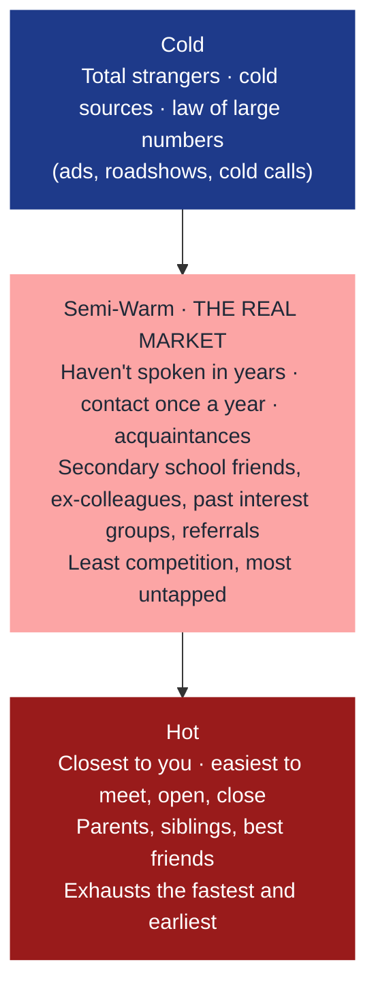

# Assignment 2 — Contact List + Personal Outreach Playbook

> **What you're producing:** Two files. (a) A Project 100 contact list with 100 real people segmented by priority. (b) A personal playbook — your own words — covering outreach messages, objection responses, and follow-up cadences.

## Why this matters

Every FC who fails in their first 2 years fails at the same point: they run out of people to talk to by Month 3. Not because they don't know anyone — because they never built the list and never wrote down the words. The list is activity. The playbook is consistency. Without both, every conversation restarts from scratch and every follow-up is awkward.

The playbook is yours. Don't use anyone else's exact words. Use their frameworks.

## Prepare from these days

- [Day 19 — Prospecting Fundamentals](../../first-60-days/week-4/day-19.md) — the 3-bucket structure for prospect activity
- [Day 37 — The Approach: 6-Step Process](../../first-60-days/week-7/day-37.md) — CLV math and what warm-market is really worth
- [Day 38 — ABCD Framework](../../first-60-days/week-7/day-38.md) — the 4 promises that open every first meeting
- [Day 39 — Project 100](../../first-60-days/week-7/day-39.md) — why 100 is the Goldilocks number and how to score A/B/C priority
- [Day 40 — Digital Presence](../../first-60-days/week-7/day-40.md) — the 4-stage prospect journey
- [Day 41 — Content & Engagement](../../first-60-days/week-7/day-41.md) — the weekly content + DM system
- [Day 42 — Digital Lead-Gen Playbook](../../first-60-days/week-7/day-42.md) — Posts → Stories → DMs funnel
- [Day 43 — Scripting Your Approach](../../first-60-days/week-8/day-43.md) — 6-part phone technique, AIDA, the "by the way" call
- [Day 44 — Handling Resistance & Objections](../../first-60-days/week-8/day-44.md) — 3-beat objection response

## Part A — Contact list

> **Start here:** **[Duplicate this Project 100 Sheet](https://docs.google.com/spreadsheets/d/1Bm0WQMPWggZ7e4o_MO-yfLxJCVvVgHd1/edit?usp=sharing&ouid=117605838416133603235&rtpof=true&sd=true)** — open the link, click **File → Make a copy**, save it into your own Drive, and fill it in. The template already has the columns, priority scoring, and temperature fields set up.

> **Then generate your first messages:** **[Open the Outreach Builder](/learning-track/pre-rnf/assignments/outreach-playbook/tool)**. Paste your sheet rows in (any order — only Name is required), and the tool drafts a starter WhatsApp / Telegram / IG message per prospect based on temperature. Edit before sending, one-tap copy, and track who you've actually contacted. Saved per device.

### Understand the market temperature first

Your list is split into three concentric rings. Most new FCs only mine the **hot** ring and run out of names by Month 3. The actual goldmine is the **semi-warm** ring.

**Why semi-warm wins:** hot market says yes out of love and exhausts in weeks; cold market is a volume game with low conversion; semi-warm has real relationship equity AND the largest untapped pool because no one reconnects with them first.

### Columns in the template

| Column | What goes here |
|---|---|
| **Name** | Full name |
| **Temperature** | Hot / Semi-Warm / Cold — honest read of your current relationship |
| **Relationship** | Family / close friend / university / ex-colleague / neighbour / vendor / community / secondary-school |
| **Priority (A/B/C)** | A = likely meet, B = worth calling, C = keep warm only |
| **Phone** | Mobile, if you have it |
| **Last contact** | When you last genuinely spoke (not a LinkedIn like) |
| **Life stage / context** | Married, kids, owns home, career switch, pre-retiree, etc. |
| **Likely need** | Protection gap / wealth building / CPF / retirement / none visible |
| **Best channel** | WhatsApp / call / in person / lunch |
| **Status** | Not contacted / messaged / meeting booked / met / closed / not pursuing |
| **Next step + date** | "Call Tuesday", "lunch 15 Jan", "re-check July", etc. |

**Rule 1: at least 30 names must be Priority A.** If you cannot find 30 A's, you haven't dug deep enough — school alumni, past colleagues, gym, church, sports clubs, wedding guest list, wife/husband's circle.

**Rule 2: at least 40 of your 100 must be Semi-Warm.** This is where your long-term pipeline lives.

## Part B — The playbook

A single document (PDF or Google Doc) structured like this. **Write it in your own voice** — use the frameworks but not the sample sentences.

### Section 1 — Opening outreach (4 customised versions)

Write one of each, tailored to yourself. Do not copy templates verbatim.

1. **The "what I'm doing now" message** to close friends — you just started. No ask, just an update.
2. **The "by the way" script** — used when you're already meeting someone for lunch/coffee.
3. **The market survey script** — the phone call to a warm-but-not-close contact asking 5 minutes for research.
4. **The reconnect message** — for someone you haven't spoken to in 2+ years.

Each should be 2 to 4 sentences, not a pitch, not salesy.

### Section 2 — Objection responses (minimum 6)

For each objection below, write your 3-beat response: **Acknowledge → Reframe → Redirect.** Written in your words, not the trainer's.

1. *"I'm not interested right now."*
2. *"I already have an FC / insurance."*
3. *"Send me the info first, I'll review."*
4. *"I can't afford anything now."*
5. *"I need to check with my wife/husband."*
6. *"Let me think about it."*

Add 2 more objections you anticipate from your specific market (e.g., if you target techies: *"I'd rather just DIY invest in ETFs"*).

### Section 3 — Follow-up cadence

For each prospect stage, write the exact messages you will send. Include timing.

- **After initial outreach, no response.** Message 1 at Day 3. Message 2 at Day 10. Message 3 at Day 30. What does each say?
- **After meeting, need time to think.** Message at Day 2. Day 7. Day 21. Day 60 if still quiet.
- **After policy issued.** Day 3 thank-you. Day 30 check-in. Day 90 review. Annual review scheduling.
- **After a NO.** Day 90 light touch. Annual re-check. What's the subject line / opener that doesn't feel stalky?

### Section 4 — Referral ask scripts (2 versions)

1. **End of a good meeting with a close.**
2. **End of a meeting where they said "not right now".**

Both should specify **exactly who** you're asking about — "two colleagues at your office who are around your age", not "anyone who might need insurance".

## What a passing playbook looks like

- 100 contacts with at least 30 priority-A, ≥40 Semi-Warm, context filled in for all A's
- Each outreach script is clearly in your own voice — not a trainer template
- Objection responses use the 3-beat structure visibly
- Follow-up cadence gives specific day markers, not "follow up later"
- Referral asks name a specific type of person, not "anyone"

## Submission

Fill in the form below. You only need to paste your Project 100 Sheet link — the playbook sections go straight into the fields on this page. No uploads required.
