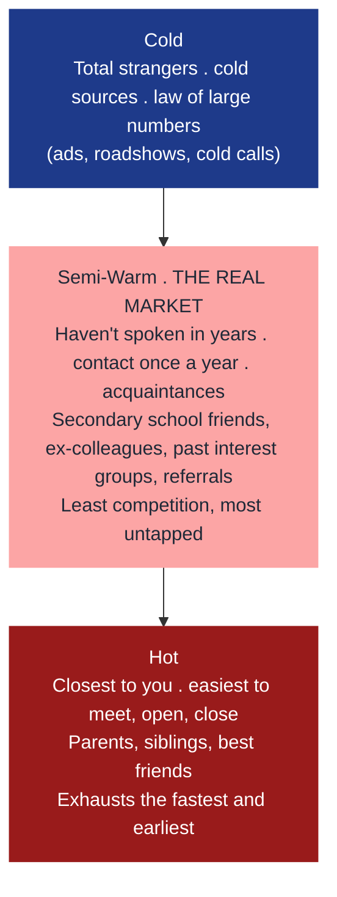

> **The gist.** Build a 200-name warm-market list, segmented by priority, and pick the one opener you'll lead with. The list is the deliverable; you're armed with ready openers below, so you don't write a playbook. Once it's built, **[Market Survey Practice](/learning-track/pre-rnf/assignments/market-survey-practice)** is where you put it to work.

**You don't need all 200 before you submit.** Drop the sheet link in once it's started and keep adding - it's fine to come back and update the count later.

## Why this matters

Every FC who fails in their first 2 years fails at the same point: they run out of people to talk to by Month 3. Not because they don't know anyone - because they never built the list. This is the single highest-leverage hour of your first 60 days: every conversation, every survey, and every appointment for the next year comes off this sheet.

Use the ready openers below and make one your own - you don't need to write anything from scratch.

## Prepare from these days

- [Day 19 - Prospecting Fundamentals](../../first-60-days/week-4/day-19.md) - the 3-bucket structure for prospect activity
- [Day 37 - The Approach: 6-Step Process](../../first-60-days/week-7/day-37.md) - CLV math and what warm-market is really worth
- [Day 38 - ABCD Framework](../../first-60-days/week-7/day-38.md) - the 4 promises that open every first meeting
- [Day 39 - Project 100](../../first-60-days/week-7/day-39.md) - the original 100-name framing, A/B/C priority scoring (we extend to 200 here)
- [Day 40 - Digital Presence](../../first-60-days/week-7/day-40.md) - the 4-stage prospect journey
- [Day 41 - Content & Engagement](../../first-60-days/week-7/day-41.md) - the weekly content + DM system
- [Day 42 - Digital Lead-Gen Playbook](../../first-60-days/week-7/day-42.md) - Posts -> Stories -> DMs funnel
- [Day 43 - Scripting Your Approach](../../first-60-days/week-8/day-43.md) - 6-part phone technique, AIDA, the "by the way" call
- [Day 44 - Handling Resistance & Objections](../../first-60-days/week-8/day-44.md) - 3-beat objection response

## Build the list

> **Start here:** **[Duplicate this Project 200 Sheet](https://docs.google.com/spreadsheets/d/1Bm0WQMPWggZ7e4o_MO-yfLxJCVvVgHd1/edit?usp=sharing&ouid=117605838416133603235&rtpof=true&sd=true)** - open the link, click **File -> Make a copy**, save it into your own Drive, and fill it in. The template already has the columns, priority scoring, and temperature fields set up.

### Your ready openers (copy and tweak - don't write from scratch)

Outreach in your first 60 days is relationship-first. You are pre-licensed, so the work is honest: reconnect, listen, help, and ask for practice - not pitch. The five ready openers below are your starting menu - copy the ones that fit your contacts and tweak them so they sound like you. **All five also live in the [Sales Scripts library, filtered to Warm Market](/scripts?audience=warm-market).** You don't need to use all five, and you don't write them from scratch - that's what these are for.

**1. The policy review / summary offer.** For friends who already have insurance and quietly aren't sure what they own. You are not selling - you're offering to lay it out for them on one page so they actually understand what they're paying for.
> *"I'm building one-page policy summaries as part of my training. Want me to do yours? Takes me about 30 min, you'll know exactly what you own and what's missing."*

**2. The casual catch-up.** For people you genuinely miss talking to. No agenda, no ask. *"Been a while - coffee this month?"* That's it. A big share of your 200 names should sit here at some point. The relationship is the work.

**3. The relationship investment.** For acquaintances and semi-warm contacts who've gone quiet. Add value first - congratulate a milestone, share something they'd find useful, react to their post like a human. Three to four touches with zero career mention before any ask.

**4. The honest "ask for help".** For close friends and family. The career change is the news; the ask is for their feedback, not their money.
> *"I just started training as a Financial Consultant. Can I borrow 15 minutes to walk you through what I'm learning? I'm not asking you to buy anything - I'm not even licensed yet. I just need real feedback on how I explain things."*

**5. The "ask for practice + future support".** For semi-warm contacts you respect. The window where this opener is most honest is right now, pre-license.
> *"I'm starting out in financial advisory. Once my license is through, my plan is to focus on people I actually know. Would you be open to a 30-min session then so I can practise on someone honest? No expectation either way."*

#### Rules of thumb when you tweak one

- **Lead with them, not you.** Reference the last thing you spoke about, their kid's age, the job change they posted. Generic openers get ignored.
- **Name the ask honestly.** "Help" / "practice" / "feedback" - not "chat" or "catch up" when you actually want practice reps. The honesty disarms.
- **One ask per message.** Don't bundle "let's catch up" with "and review your policy". Pick one angle, send one message.
- **No pitch language pre-license.** No "great policies", no "I can help you save money". You can't sell yet - saying so out loud is what unlocks the conversation.
- **Leave the door open on every "no".** Never *"ok no worries"* - always something like *"if anything ever changes, just message me anytime"*. A Year 3 inbound starts with a Year 1 open door.

### Understand the market temperature first

Your list is split into three concentric rings. Most new FCs only mine the **hot** ring and run out of names by Month 3. The actual goldmine is the **semi-warm** ring.

```mermaid
flowchart TD
    COLD["Cold<br/>Total strangers . cold sources . law of large numbers<br/>(ads, roadshows, cold calls)"]
    SEMIWARM["Semi-Warm . THE REAL MARKET<br/>Haven't spoken in years . contact once a year . acquaintances<br/>Secondary school friends, ex-colleagues, past interest groups, referrals<br/>Least competition, most untapped"]
    HOT["Hot<br/>Closest to you . easiest to meet, open, close<br/>Parents, siblings, best friends<br/>Exhausts the fastest and earliest"]
    COLD --> SEMIWARM --> HOT
    classDef cold fill:#1e3a8a,stroke:#1e3a8a,color:#fff
    classDef semi fill:#fca5a5,stroke:#fca5a5,color:#1f2937
    classDef hot fill:#991b1b,stroke:#991b1b,color:#fff
    class COLD cold
    class SEMIWARM semi
    class HOT hot
```

**Why semi-warm wins:** hot market says yes out of love and exhausts in weeks; cold market is a volume game with low conversion; semi-warm has real relationship equity AND the largest untapped pool because no one reconnects with them first.

### Columns in the template

| Column | What goes here |
|---|---|
| **Name** | Full name |
| **Temperature** | Hot / Semi-Warm / Cold - honest read of your current relationship |
| **Relationship** | Family / close friend / university / ex-colleague / neighbour / vendor / community / secondary-school |
| **Priority (A/B/C)** | A = likely meet, B = worth calling, C = keep warm only |
| **Phone** | Mobile, if you have it |
| **Last contact** | When you last genuinely spoke (not a LinkedIn like) |
| **Life stage / context** | Married, kids, owns home, career switch, pre-retiree, etc. |
| **Likely need** | Protection gap / wealth building / CPF / retirement / none visible |
| **Best channel** | WhatsApp / call / in person / lunch |
| **Status** | Not contacted / messaged / meeting booked / met / closed / not pursuing |
| **Next step + date** | "Call Tuesday", "lunch 15 Jan", "re-check July", etc. |

**Rule 1: at least 60 names must be Priority A.** If you cannot find 60 A's, you haven't dug deep enough - school alumni, past colleagues, gym, church, sports clubs, wedding guest list, wife/husband's circle.

**Rule 2: at least 80 of your 200 must be Semi-Warm.** This is where your long-term pipeline lives.

## Your ready-to-use scripts

You don't write a playbook for this. The openers you need are already above. For everything else - objection replies, follow-up timing, referral asks - use what's already built rather than writing your own:

- **Objections** (not interested, already have an FC, send info first, can't afford, check with spouse, let me think) - the 3-beat reply (Acknowledge -> Reframe -> Redirect) is taught in [Day 44 - Handling Resistance & Objections](../../first-60-days/week-8/day-44.md).
- **Follow-up timing** - the cadence (Day 3 / 10 / 30 after no reply; Day 2 / 7 / 21 / 60 after a meeting; a light touch at Day 90 and annually after a no) is in [Day 43 - Scripting Your Approach](../../first-60-days/week-8/day-43.md). One rule worth burning in: never end a no with *"ok, no worries"* or go silent - always leave the door open with a low-pressure line and a future scenario named.
- **Referral asks** - name a specific type of person (*"two colleagues around your age"*), never *"anyone who needs insurance"*. The scripts live in the [Sales Scripts library](/scripts?audience=warm-market).

> **Pre-licensed?** Lean into the *"I can't sell you anything anyway - I'm just doing market surveys to learn"* framing. It's true, it disarms guards in a way licensed FCs can never replicate, and by the time your licence drops you'll have 10-20 conversations queued. Once you're licensed the same opener reads as a pitch - so use the window while you have it. See [Day 19's pre-licensing window note](../../first-60-days/week-4/day-19.md) and [Day 39 Section 1a](../../first-60-days/week-7/day-39.md).

## Next: put the list to work

The list is only half the engine. The next assignment, **[Market Survey Practice](/learning-track/pre-rnf/assignments/market-survey-practice)**, is where you run 30 warm-market surveys off these names - the reps that make the script yours before your licence drops. Build the list here first; the surveys come off it.

## What a passing list looks like

- 200 contacts, at least 60 Priority A and 80 Semi-Warm, with context filled in for your A's.
- One opener you've made your own and will actually send.

## Submission

Paste your Project 200 Sheet link (or attach the sheet as a file at the bottom of the form), add the one opener you'll lead with, and submit. You can resubmit any time as the list grows.

> **Want feedback on your opener?** [Book a review slot with Leo](https://www.pick-a-time.app/book/withleo) - bring the line you're least sure about and we'll tighten it together.
