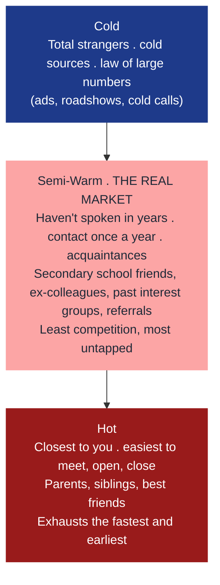

# Project 200

> **What you're producing:** Two files. (a) A Project 200 contact list with 200 real people segmented by priority. (b) A personal playbook - your own words - covering outreach messages, objection responses, and follow-up cadences.

## Why this matters

Every FC who fails in their first 2 years fails at the same point: they run out of people to talk to by Month 3. Not because they don't know anyone - because they never built the list and never wrote down the words. The list is activity. The playbook is consistency. Without both, every conversation restarts from scratch and every follow-up is awkward.

The playbook is yours. Don't use anyone else's exact words. Use their frameworks.

## Prepare from these days

- [Day 19 - Prospecting Fundamentals](../../first-60-days/week-4/day-19.md) - the 3-bucket structure for prospect activity
- [Day 37 - The Approach: 6-Step Process](../../first-60-days/week-7/day-37.md) - CLV math and what warm-market is really worth
- [Day 38 - ABCD Framework](../../first-60-days/week-7/day-38.md) - the 4 promises that open every first meeting
- [Day 39 - Project 100](../../first-60-days/week-7/day-39.md) - the original 100-name framing, A/B/C priority scoring (we extend to 200 here)
- [Day 40 - Digital Presence](../../first-60-days/week-7/day-40.md) - the 4-stage prospect journey
- [Day 41 - Content & Engagement](../../first-60-days/week-7/day-41.md) - the weekly content + DM system
- [Day 42 - Digital Lead-Gen Playbook](../../first-60-days/week-7/day-42.md) - Posts -> Stories -> DMs funnel
- [Day 43 - Scripting Your Approach](../../first-60-days/week-8/day-43.md) - 6-part phone technique, AIDA, the "by the way" call
- [Day 44 - Handling Resistance & Objections](../../first-60-days/week-8/day-44.md) - 3-beat objection response

## Part A - Contact list

> **Start here:** **[Duplicate this Project 200 Sheet](https://docs.google.com/spreadsheets/d/1Bm0WQMPWggZ7e4o_MO-yfLxJCVvVgHd1/edit?usp=sharing&ouid=117605838416133603235&rtpof=true&sd=true)** - open the link, click **File -> Make a copy**, save it into your own Drive, and fill it in. The template already has the columns, priority scoring, and temperature fields set up.

### How to craft your warm-market outreach

Outreach in your first 60 days is relationship-first. You are pre-licensed, so the work is honest: reconnect, listen, help, and ask for practice - not pitch. Use the five angles below as your starting menu. **All five live in the [Sales Scripts library, filtered to Warm Market](/scripts?audience=warm-market)** - open the closest match, rewrite it in your own voice, save your edit. Your saved versions become the four scripts you'll paste into Section 1 of the playbook.

**1. The policy review / summary offer.** For friends who already have insurance and quietly aren't sure what they own. You are not selling - you're offering to lay it out for them on one page so they actually understand what they're paying for.
> *"I'm building one-page policy summaries as part of my training. Want me to do yours? Takes me about 30 min, you'll know exactly what you own and what's missing."*

**2. The casual catch-up.** For people you genuinely miss talking to. No agenda, no ask. *"Been a while - coffee this month?"* That's it. A big share of your 200 names should sit here at some point. The relationship is the work.

**3. The relationship investment.** For acquaintances and semi-warm contacts who've gone quiet. Add value first - congratulate a milestone, share something they'd find useful, react to their post like a human. Three to four touches with zero career mention before any ask.

**4. The honest "ask for help".** For close friends and family. The career change is the news; the ask is for their feedback, not their money.
> *"I just started training as a Financial Consultant. Can I borrow 15 minutes to walk you through what I'm learning? I'm not asking you to buy anything - I'm not even licensed yet. I just need real feedback on how I explain things."*

**5. The "ask for practice + future support".** For semi-warm contacts you respect. The window where this opener is most honest is right now, pre-license.
> *"I'm starting out in financial advisory. Once my license is through, my plan is to focus on people I actually know. Would you be open to a 30-min session then so I can practise on someone honest? No expectation either way."*

#### Rules of thumb when you write your own

- **Lead with them, not you.** Reference the last thing you spoke about, their kid's age, the job change they posted. Generic openers get ignored.
- **Name the ask honestly.** "Help" / "practice" / "feedback" - not "chat" or "catch up" when you actually want practice reps. The honesty disarms.
- **One ask per message.** Don't bundle "let's catch up" with "and review your policy". Pick one angle, send one message.
- **No pitch language pre-license.** No "great policies", no "I can help you save money". You can't sell yet - saying so out loud is what unlocks the conversation.
- **Door-open on every "no".** Never *"ok no worries"* - always *"if anything ever changes, my door's open"*. A Year 3 inbound starts with a Year 1 open door.

> **Where the scripts live:** **[Sales Scripts library - Warm Market filter](/scripts?audience=warm-market)**. Open the closest match, edit until it sounds like you wrote it, save your version. If a script you need doesn't exist yet, write it from scratch in the library and tag the audience as Warm Market - it'll be there for the next FC behind you.

### Understand the market temperature first

Your list is split into three concentric rings. Most new FCs only mine the **hot** ring and run out of names by Month 3. The actual goldmine is the **semi-warm** ring.

```mermaid
flowchart TD
    COLD["Cold<br/>Total strangers . cold sources . law of large numbers<br/>(ads, roadshows, cold calls)"]
    SEMIWARM["Semi-Warm . THE REAL MARKET<br/>Haven't spoken in years . contact once a year . acquaintances<br/>Secondary school friends, ex-colleagues, past interest groups, referrals<br/>Least competition, most untapped"]
    HOT["Hot<br/>Closest to you . easiest to meet, open, close<br/>Parents, siblings, best friends<br/>Exhausts the fastest and earliest"]
    COLD --> SEMIWARM --> HOT
    classDef cold fill:#1e3a8a,stroke:#1e3a8a,color:#fff
    classDef semi fill:#fca5a5,stroke:#fca5a5,color:#1f2937
    classDef hot fill:#991b1b,stroke:#991b1b,color:#fff
    class COLD cold
    class SEMIWARM semi
    class HOT hot
```

**Why semi-warm wins:** hot market says yes out of love and exhausts in weeks; cold market is a volume game with low conversion; semi-warm has real relationship equity AND the largest untapped pool because no one reconnects with them first.

### Columns in the template

| Column | What goes here |
|---|---|
| **Name** | Full name |
| **Temperature** | Hot / Semi-Warm / Cold - honest read of your current relationship |
| **Relationship** | Family / close friend / university / ex-colleague / neighbour / vendor / community / secondary-school |
| **Priority (A/B/C)** | A = likely meet, B = worth calling, C = keep warm only |
| **Phone** | Mobile, if you have it |
| **Last contact** | When you last genuinely spoke (not a LinkedIn like) |
| **Life stage / context** | Married, kids, owns home, career switch, pre-retiree, etc. |
| **Likely need** | Protection gap / wealth building / CPF / retirement / none visible |
| **Best channel** | WhatsApp / call / in person / lunch |
| **Status** | Not contacted / messaged / meeting booked / met / closed / not pursuing |
| **Next step + date** | "Call Tuesday", "lunch 15 Jan", "re-check July", etc. |

**Rule 1: at least 60 names must be Priority A.** If you cannot find 60 A's, you haven't dug deep enough - school alumni, past colleagues, gym, church, sports clubs, wedding guest list, wife/husband's circle.

**Rule 2: at least 80 of your 200 must be Semi-Warm.** This is where your long-term pipeline lives.

## Part B - The playbook

A single document (PDF or Google Doc) structured like this. **Write it in your own voice** - use the frameworks but not the sample sentences.

### Section 1 - Opening outreach (4 customised versions)

Write one of each, tailored to yourself. Do not copy templates verbatim.

1. **The "what I'm doing now" message** to close friends - you just started. No ask, just an update.
2. **The "by the way" script** - used when you're already meeting someone for lunch/coffee.
3. **The market survey script** - the phone call to a warm-but-not-close contact asking 5 minutes for research.
4. **The reconnect message** - for someone you haven't spoken to in 2+ years.

Each should be 2 to 4 sentences, not a pitch, not salesy.

> **Pre-licensed?** While you're still pre-RNF, lean into the *"I can't sell you anything anyway - I'm just doing market surveys to learn"* framing. It's true, it disarms guards in a way licensed FCs can never replicate, and by the time your license drops you'll have 10-20 conversations queued. Once you're licensed the same opener reads as a pitch - so use the window while you have it. See [Day 19's pre-licensing window note](../week-4/day-19.md) and [Day 39 Section 1a](../week-7/day-39.md) for the full reasoning. **Part C of this assignment formalises the 30-survey floor + the practice ladder - the work itself happens during your CMFAS / RES5 study window.**

### Section 2 - Objection responses (minimum 6)

For each objection below, write your 3-beat response: **Acknowledge -> Reframe -> Redirect.** Written in your words, not the trainer's.

1. *"I'm not interested right now."*
2. *"I already have an FC / insurance."*
3. *"Send me the info first, I'll review."*
4. *"I can't afford anything now."*
5. *"I need to check with my wife/husband."*
6. *"Let me think about it."*

Add 2 more objections you anticipate from your specific market (e.g., if you target techies: *"I'd rather just DIY invest in ETFs"*).

### Section 3 - Follow-up cadence

For each prospect stage, write the exact messages you will send. Include timing.

- **After initial outreach, no response.** Message 1 at Day 3. Message 2 at Day 10. Message 3 at Day 30. What does each say?
- **After meeting, need time to think.** Message at Day 2. Day 7. Day 21. Day 60 if still quiet.
- **After policy issued.** Day 3 thank-you. Day 30 check-in. Day 90 review. Annual review scheduling.
- **After a NO.** Day 90 light touch. Annual re-check. What's the subject line / opener that doesn't feel stalky?

> **The door-leaving rule (read before writing the "After a NO" section):** never end a no with *"ok, no worries"* and never go silent. Both close the door silently - the prospect reads them as "future contact would be awkward." Instead, every no must end with the door visibly propped open and a future scenario named. Something like: *"totally fair - if anything ever changes, or you want a sounding board on something money-related, my door's open. No expectations from your side."* That single line is what turns "not now" into a Year 3 inbound message when life shifts. See [Day 37's closed-door vs open-door section](../week-7/day-37.md) for the full reasoning. Your three "After a NO" follow-up messages should each leave the door more open than the last, not chase harder.

### Section 4 - Referral ask scripts (2 versions)

1. **End of a good meeting with a close.**
2. **End of a meeting where they said "not right now".**

Both should specify **exactly who** you're asking about - "two colleagues at your office who are around your age", not "anyone who might need insurance".

## Part C - Market Survey Practice (the pre-RNF 30-survey floor)

> **The rule:** Complete **30 warm-market surveys before your RNF goes through.** That's the floor, not a ceiling. The licensing window (CMFAS / M9 / M9A / HI / RES5 study and exams) is exactly when you put these reps in. By the time your name shows up on MAS as a registered representative, the script is already yours.

### Why 30, why before RNF

- **Pre-RNF you literally cannot sell.** That makes the survey framing honest in a way it never will be again. Once licensed, "I'm just doing a survey" reads as a soft pitch. Right now it reads as the truth, because it is.
- **The first 5 feel awkward.** You over-apologise, over-explain, freeze on the binary close. That's expected.
- **Surveys 6 to 15 are when the script settles.** Tonality matures. You stop reading. The rapport intro shrinks from 90 seconds to 30.
- **Surveys 16 to 30 are when you actually become good.** The binary close lands, the appointment ask doesn't trigger reflex objections, the social-add at the end happens by reflex.
- **By Survey 30, the script is yours.** When your RNF drops, you call the next 170 names on your Project 200 list with no friction.

If you do fewer than 30, you carry the awkwardness into your real warm market - and burn the contacts that should have been your easiest closes.

### The canonical market survey script (use word-for-word until it's yours)

**Phone opening (rapport, under 60 seconds):**
> Hello, good morning, is this [name]?
>
> [Name], this is [your name]. Do you have a moment to speak?
>
> How are you this period?

**The agenda (the survey ask):**
> As you may have learnt, I am intending to embark on the career of a Financial Advisor (or: currently interning with a Financial Services Agency) and I am tasked to do a simple market survey with the people that I know. Would you be able to help me by giving me 5 minutes of your time?

**Run the 4 survey questions:**

1. Do you have any insurance policies or financial plans? *(Yes / No - if No, why?)*
2. When was the last time you did a review of your policies?
3. How do you feel about your existing consultant's service?
4. As you may be aware, I am undergoing training to become a licensed financial advisor. As part of my training I am tasked to conduct Financial Health Reviews. Will it be alright if I can meet you for a 30-min session to share with you the work that I do? *(Use the ABCD promises - I won't force you, future meetings depend on whether you find this useful.)*

Q1 to Q3 are the *survey*. They take 2 to 3 minutes. Don't react, don't sell, don't recommend - just listen and write the answers down. The *data* isn't the point; the *practice* of running a structured 5-minute conversation is the point. Q4 is the appointment ask.

**Setting the appointment (using Question 4):**
> Thanks [name]. By the way, when I am officially licensed to start my practice, one of my priorities is to extend my service to my closest friends. You are one of those whom I highly regard. Till then, may I get in touch with you for a 30-minute session to share with you the type of solutions I can offer?
>
> You have my assurance that during our meeting, I will not ask you to do anything you don't want to and any future meetings will depend entirely on whether you feel my services would be of help to you. Is that fair?

**The binary close (offer two specific options, never "when are you free?"):**
> Good. Would it be best to get together at your office, your home, or through Zoom?
>
> Would weekdays or weekends be better for you?
>
> Office hours or evenings?
>
> Could I see you on [day] at [time], or would [day 2] at [time 2] be better?

**Closing off (capture data + open the social loop):**
> Really appreciate your help. Will it be alright if I keep you posted of any AIA promotions that are relevant to you? May I have your email address and date of birth so I can connect better with you?
>
> *(Optional)* May I have your permission to add you on Instagram or Facebook so we can keep each other updated?

The full version with the 10 reflex-objection responses lives in [Day 43 - Scripting Your Approach](../week-8/day-43.md).

### How to train (the 4-stage practice ladder)

Don't dial cold into your real semi-warm market on Day 1. Climb the ladder. Each stage builds the muscle for the next.

| Stage | Reps | Who you call | Goal |
|---|---|---|---|
| **1. Solo rehearsal** | 5 to 10 read-throughs | Yourself - mirror, voice memo | Words flow without freezing. Tonality varies. Pace settles. |
| **2. Cohort roleplay** | 3 to 5 paired reps | Another pre-RNF FC | Take feedback. Swap roles. Throw reflex objections at each other. |
| **3. Hot reps (warm-up)** | 3 to 5 calls | Family, partner, best friends | Gentle live audience. They will say yes. Settle nerves before stage 4. |
| **4. Real semi-warm reps** | The remaining ~20 | Project 200 Priority A and B | This is where the actual practice happens. The yes/no is real. |

**Cluster the calls.** 5 to 7 surveys in a focused 90-minute block produces better tonality than 1 a day. Your voice warms up around call 2 and peaks around call 5. Schedule survey blocks across 2 to 3 weeks of your study window.

### What to track (the survey log)

A simple sheet with these columns. Fill it in immediately after each call - within 5 minutes, before memory fades.

| Column | What goes here |
|---|---|
| **#** | Survey number (target 30+) |
| **Date / time** | When |
| **Name + temperature** | Hot / Semi-Warm |
| **Pickup outcome** | Picked up / VM / not free |
| **Survey completed?** | Yes / No (if no, what stopped it) |
| **Q4 answer** | Yes (book appointment) / Maybe / No |
| **Appointment booked?** | Yes (date) / No |
| **What worked** | One line - the moment something clicked |
| **What didn't** | One line - tonality, pace, an objection you fumbled |

Review the log every 5 surveys. The conversion rate on Surveys 16 to 30 should be visibly higher than on Surveys 1 to 15. If it's not, the gap is usually one specific moment - the binary close, the survey-to-appointment pivot, or the rapport intro - and the log will surface which one.

### Common failure modes (what derails new FCs)

- **Trying to upgrade Question 4 into a soft pitch.** Don't. Q4 is a question, not a pitch. The appointment ask comes AFTER they answer it.
- **Skipping the social-add at the end.** That's how 30 surveys becomes 100+ social touchpoints over the next 12 months. Don't drop it because you're rushing.
- **Doing all 30 with hot market only.** Hot market exhausts. The point of practice is to walk into your semi-warm market with confidence - so most of the 30 must be semi-warm.
- **Stopping at 10 to 15 because "it's working".** Below 30, the muscle isn't built. The script feels okay because the calls are easy - they're family. Semi-warm is where the script is actually tested.
- **Treating the appointment as a sale.** You can't sell. The appointment is rehearsal of the canned CST (Insurance or Investing) - see [Day 43 - pre-licensed practice framing](../week-8/day-43.md).

### What you submit for Part C

Three new fields in the form below:
- **Market surveys completed (count out of 30)** - what you've actually done by the time you submit.
- **Survey -> appointment conversion** - of the surveys completed, how many booked a 30-min appointment. Honest number, not aspirational.
- **Best survey learning** - one line capturing the inflection moment, not a polished summary.

A passing Part C shows you've hit at least 25 of 30 (with a credible plan to clear the last 5 before RNF), and the conversion rate visibly improved between the first and second halves of the log.

## What a passing playbook looks like

- 200 contacts with at least 60 priority-A, >=80 Semi-Warm, context filled in for all A's
- Each outreach script is clearly in your own voice - not a trainer template
- Objection responses use the 3-beat structure visibly
- Follow-up cadence gives specific day markers, not "follow up later"
- Referral asks name a specific type of person, not "anyone"

## Submission

Fill in the form below. You only need to paste your Project 200 Sheet link - the playbook sections go straight into the fields on this page. No uploads required.
