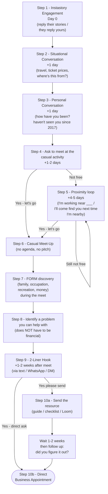

# The Warm Market Funnel — From Instastory to Business Appointment

> **The one idea:** A warm prospect goes from cold-passive social touchpoint to booked business appointment in 3-4 weeks if you run the funnel deliberately. Each step has a specific lag time, a specific move, and a specific fallback if the prospect goes quiet. Skip a step and you'll either feel pushy (jumping ahead) or invisible (drifting back).

This doc is the canonical reference. The full social-to-appointment flow lives here so we can keep one source of truth instead of duplicating script-text into every day file. Day 37 (The Approach), Day 39 (Project 100), and Day 43 (Warm Market Survey) all link back to this page.

---

## The funnel at a glance

End-to-end: **3-4 weeks** from passive story tap to booked business appointment. No business mention until step 9.

---

## The 10 steps in detail

### Step 1 - Instastory Engagement (Day 0)

The funnel starts before any conversation. **Passive presence creates active opportunities.** Two surfaces matter:

1. **Reply to their stories.** Not every story; the ones where you have a genuine reaction. A travel post -> "where was this taken? looks unreal." A food post -> "is this the [restaurant]? been meaning to go." Two stories a week from your most relevant Project 100 contacts is enough.
2. **Post stories yourself that invite reply.** "Tell me your favourite breakfast spot" beats "look at my breakfast." Open hooks invite people to reply. Replies become the conversation in Step 2.

**The principle:** the people who pick up your call in Step 4 are the ones who already feel like you've been around. Instastory is the cheap, ambient way to be around without intruding.

### Step 2 - Situational Conversation (+1 day)

**The bridge from "they replied my story" to "we're chatting."** Keep it small, keep it about the post.

> Examples:
> - "Eh how was the flight? I saw you posted from Tokyo - is this the first time or you go often?"
> - "How much were the tickets in the end? I'm planning a trip too."
> - "Wait - is this the [restaurant] near Bugis? Worth the queue?"

**The principle:** small talk earns you the right to ask bigger questions later. You're not gathering data here; you're warming the channel.

### Step 3 - Personal Conversation (+1 day)

Now you can ask about *them*, not the post. Three probing questions, asked over chat or call, that surface meet-up opportunities:

1. "Where you working at now?"
2. "Are you staying near ___?"
3. "Do you play / do ___?"  *(pick something the post hinted at - football, climbing, photography, sourdough, whatever)*

**The principle:** you're looking for **a natural meet-up reason that already exists in their life** - not a new one you have to invent. The first answer that overlaps with your geography or interest is the meet-up.

### Step 4 - Ask to meet at the casual activity (+1-2 days)

Once you've spotted the natural meet-up reason, ask. **Specific, casual, low-pressure.**

> "Eh - I'm also at the office in Tampines twice a week. Free for lunch on Wednesday or Thursday this week?"
> "I climb at BFF every Saturday morning - want to come try? I'll go easy."
> "We should grab coffee soon - free this weekend?"

Two outcomes:

| Outcome | Move to |
|---|---|
| "Ok let's go" | Step 6 (Casual Meet-Up) |
| "Not free" | Step 5 (Proximity Loop) |

### Step 5 - Proximity Loop (+4-5 days, only if "not free")

Don't take "not free" as a no. Run this fallback - it dissolves the awkward "now I have to chase them" feeling.

> "Oh, I'm also working near ___ / I always meet my clients near ___ . Next time I'm nearby and I have some time to kill, I'll come find you ok? Chit chat!"

**The principle:** you've reframed the meet from "a thing they have to schedule" to "a casual drop-in I'll initiate." The right to reschedule stays with you, not them. Loop until they say yes or until they ghost twice (then archive for 6 months).

### Step 6 - Casual Meet-Up

**No agenda. No pitch. No mention of work unless they ask.** This is the relationship investment - everything that follows compounds on the trust built here.

If they ask "so what do you do these days?" - answer briefly and pivot back to them. The ask is the indicator the relationship is alive; you don't need to convert it in the moment.

### Step 7 - FORM Discovery (during the meet)

Listen for the **F-O-R-M** of their life:

| Letter | What you're listening for |
|---|---|
| **F**amily | who they live with, kids, parents, dependents |
| **O**ccupation | what they do, how it's going, ambitions |
| **R**ecreation | what they spend free time on, what brings energy |
| **M**oney | how they think about money - not balances, attitudes |

You won't run all four like a checklist. Pick whichever the conversation surfaces naturally. The goal is to leave with **one specific problem or aspiration** you can add value to in Step 8 - which doesn't have to be financial.

### Step 8 - Identify a problem you can help with

> **Crucial:** the problem does NOT have to be financial.

Examples of valid problems for the funnel:
- They're stuck planning their wedding budget.
- Their parent just got a cancer diagnosis and they don't know what to ask the doctor.
- Their kid's hitting Primary 1 next year and they're paralysed by school choice.
- They're moving overseas and confused about how to handle their CPF.
- They want to start investing but don't know where.

If you can help with any of these (directly or via a resource your team has built), Step 9 has a real reason to exist.

### Step 9 - 2-Liner Hook (+1-2 weeks after the meet)

Send via text, WhatsApp, or DM - whichever channel they prefer. Two lines:

> **Line 1.** "Recently I have been helping my friends/clients with [common problem]. Can I help you with this also?"
>
> **Line 2.** "I have a [resource] that I/my team created, to help [common group] solve [common problems] to [measurable outcome]. You want it? I send you."

What goes in the blanks:

- **[common problem]** - what you've actually been helping clients with this week (CPF allocation review, hospital plan gap, school-fund kickoff, wedding budget planning, parent-care logistics).
- **[resource]** - a guide, checklist, calculator, comparison table, or short Loom you (or your team) put together. **Reference [[arq-database|the ARQ database]] for the closing question that turns the resource send into a conversation.**
- **[common group]** - the segment your contact obviously belongs to (young parents, fresh grads, dual-income couples, business owners, expats moving overseas).
- **[common problems]** - the headline pains that group recognises in themselves.
- **[measurable outcome]** - what they get if they actually use the resource (clarity in 15 minutes, a number they can act on, a checklist they can tick this weekend).

Two outcomes:

| Outcome | Move to |
|---|---|
| "Yes please send" | Step 10a (resource send + follow-up) |
| "Yes - direct ask" *(rare; happens when the meet went deep)* | Step 10b (direct appointment) |
| Soft no / no reply | Park for 4-6 weeks, retry with a different resource |

### Step 10a - Send the resource, then the follow-up

When you send the resource, set up the follow-up in the same message:

> "Here you go. The first section on [most useful page] is the part most [common group] find useful first - takes 5 minutes to check. I'll check back in a couple of weeks."

12-14 days later, send one short message:

> "Hey [name], been a couple of weeks since I sent you the [resource]. Did you manage to figure out [the specific problem]? Happy to help fill in any gaps if not."

The phrasing matters - **"did you figure it out"** is binary. Replies fall into three buckets:

| Reply | Move |
|---|---|
| "Yes, I sorted it" | Park as relationship contact - no appointment ask |
| "Sort of, but I have questions" | That's the appointment |
| "No, didn't get round to it" | That's also the appointment - "want to do it together?" |

The appointment ask:

> "Easiest way is a 30-minute Zoom - I can answer the specific questions and show you what most people in your situation actually do. Tuesday 7pm or Thursday lunch?"

### Step 10b - Direct Business Appointment

This branch only fires when the casual meet went deep enough that the prospect *asks you* about your work, or when the problem you identified in Step 8 is urgent (parent's diagnosis, kid hitting P1 in 3 months, etc.). Skip the resource step and go straight to the meeting ask.

---

## The full funnel timeline

| Day | Step | Lag from previous |
|-----|------|-------------------|
| 0 | Instastory engagement | - |
| +1 | Situational conversation | 1 day |
| +2 | Personal conversation | 1 day |
| +3-4 | Ask to meet at casual activity | 1-2 days |
| +7-9 | Casual meet-up (or proximity loop fires) | 4-5 days |
| +14-21 | 2-liner hook follow-up | 1-2 weeks |
| +28-35 | Resource follow-up - "did you figure it out?" | 1-2 weeks |
| +28-35 | Business appointment booked | same day |

**Roughly 4 weeks** from cold instastory to booked appointment. That's the structural lag — running the funnel faster than this feels rushed to the prospect.

---

## What this funnel is NOT

- **Not for cold leads.** This works because there's a pre-existing thread - mutual following on socials, an old friendship, a former classmate. For genuinely cold names, run [Day 43's pinpoint cold-call script](week-8/day-43.md#the-pinpoint-driven-cold-call-script-the-one-that-lifts-conversion-10x).
- **Not the only warm-market path.** The Day 43 Market Survey is phone-first; this funnel is social-first. Both end at the same 30-min appointment. Choose by the contact's preferred channel and how much pre-existing trust there is.
- **Not a script to run on every contact.** Reserve for the top 30-50 names of your Project 100 - the ones where the relationship genuinely warrants this much investment.

---

## How this maps to other days

| Day | What it covers | How this funnel relates |
|---|---|---|
| [Day 19 - Prospecting: The Lifeblood](week-4/day-19.md) | Why prospecting is non-negotiable | Sets up *why* the funnel needs to run consistently, not in bursts |
| [Day 37 - The Approach](week-7/day-37.md) | Cold / warm / follow-up / nurture, big-picture | This funnel is the warm-social-first variant |
| [Day 39 - Project 100](week-7/day-39.md) | Build the list of 100 names | Project 100 is the input list this funnel runs against |
| [Day 43 - Warm Market Survey & Cold Calls](week-8/day-43.md) | Phone-first warm script + cold-call flow | Different doorway to the same destination - phone vs social |
| [Day 44 - Objection Handling](week-8/day-44.md) | What to say when they push back | Use the AQR pattern (Acknowledge -> Question -> Reframe) inside Step 4 if they hesitate |
| [Day 45 - Storytelling](week-8/day-45.md) | The 6P story | Use a 6P story inside Step 7's FORM discovery to surface emotional weight |
| [Day 47 - ARQ](week-8/day-47.md) | Asking the Right Questions | Step 3's three probing questions and Step 9's 2-liner hook are pure ARQ moves |

---

## Practice ladder

1. **Today:** pick 5 names from your Project 100. Look at their last 3 Instastories. Reply to one each. *(Step 1, ambient)*
2. **This week:** run Steps 2 and 3 with at least 2 of them - get to a personal conversation.
3. **Next week:** run Step 4 with the one most likely to say yes. Even if it's a soft no, run Step 5.
4. **In two weeks:** do the casual meet-up with anyone who said yes. **Don't pitch.** Run FORM.
5. **In four weeks:** send the 2-liner hook to whoever surfaced a problem. Track who replies, who ghosts.
6. **In six weeks:** check back on the resource - run the "did you figure it out?" message.

By Week 6, the first 1-2 booked appointments out of this funnel show up. By Week 12, the funnel is humming. By Month 6, you stop running cold lists at all.

---

## Related resources

- [[_source-scripts/arq-database|ARQ Script Database]] *(Obsidian only)* - the question bank that powers Step 3, Step 9, and the resource follow-up
- [[_source-scripts/market-survey-script|Market Survey Script]] *(Obsidian only)* - phone-first alternative to this funnel
- [[_source-scripts/already-have-an-advisor-objection-script|"Already Have an Advisor" Objection Script]] *(Obsidian only)* - what to say if Step 4 surfaces this
