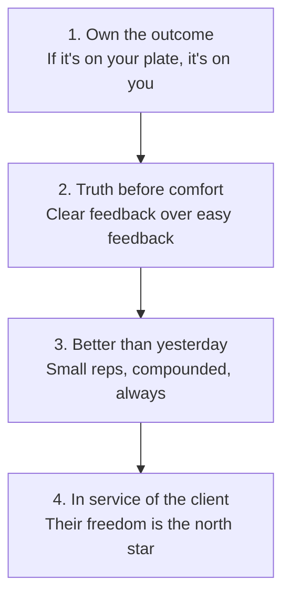
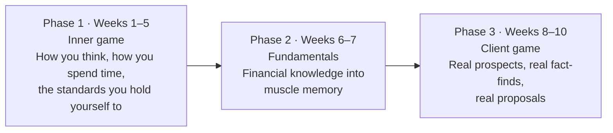

# Day 1 — Welcome: The Journey Begins

> **The one idea for today:** The next 60 days aren't about becoming a better salesperson. They're about becoming someone your future self would recognise as a professional.

---

## Welcome

You've said yes to one of the most demanding — and one of the most rewarding — careers in Singapore.

The next 60 days are designed to give you a foundation that sticks. Take them seriously. Each day is short. None of them are optional.

We're excited to have you with us.

---

## Our vision — three pillars

Everything we build stands on three pillars. They're the reason we get out of bed.

### Protect first
Before we talk about returns, we make sure the people in front of us won't be wiped out by a single bad week. Protection is the floor. Everything else is built on it.

### Build real wealth
A life worth living costs money. Our job is to help people fund the life they actually want — not the one an Instagram ad sold them.

### Stay in the room
This work is relational, not transactional. We're in the room when clients buy their first home, have their first child, and face their first hospital bill. Long-term presence beats one-off brilliance.

---

## Our philosophy

This career pays well. The car, the home, the holidays — eventually, the lifestyle follows.

But that's not the measure we use. The measure is whether the people around you — your family, your friends, your clients — become **safer, smarter, and more free** because of you.

If success to you is the Rolex, the club table, the LV bag — you'll feel out of place here. If success is the quiet knowledge that a client's family is protected because of the hour you spent on a Saturday — welcome home.

---

## Our values

Four, not six. Easy to memorise. Hard to live.

That's the whole list. We'll come back to each of them all through the 60 days.

---

## Your journey

The next 60 days break into three phases. Each phase builds the next.

You won't see a real client until Week 8. That's deliberate. We fix the operator before we hand over the machine.

The journey is yours to take, but you won't take it alone — mentors, peers, and a team that's walked the same road are already beside you. Each step is engineered. Trust the sequence.

---

## Your first task — the Reconnecting Exercise

Before you pitch anyone on anything, you reconnect. This is the warm-up for everything that comes later. Four steps. Zero selling.

1. **Set a casual catch-up** with three people from your social circle this week. Coffee, lunch, a walk — anything low-pressure.
2. **Share your transition.** Tell them you've started as a financial advisor and why. Short version. No pitch.
3. **Ask for their honest reaction.** What do they think? Do they see you doing this well?
4. **Ask if they'll help you practise.** Not buy. Practise. Market surveys, feedback, a chat in the coming weeks. Log their responses.

**The goal isn't business.** It's rebuilding warm contact with your circle and letting them see you in your new role. Everything later gets easier when this groundwork is in place.

---

## Reflection worksheet

**1. Why did you really say yes to this career?**
> Not the "tell mum and dad" answer. The honest one. 2–3 sentences.

**2. Which of our four values do you already live, and which one will stretch you?**
> Be specific. Name the value, then one example from your life this month.

**3. Who are the first three people you'll schedule a reconnect with?**
> Names. Not categories. If you can't name them, you're not starting.

---

## Quick quiz

1. **Which phase are Weeks 1–5 part of?**
 - A) Fundamentals
 - B) Client game
 - C) Inner game ✓
 - D) Graduation

2. **What's the purpose of the Reconnecting Exercise?**
 - A) Close your first case
 - B) Build warm contact and let your circle see your new role — no selling ✓
 - C) Collect policy summaries
 - D) Hit a target number of meetings

3. **Which of the four values sounds most like "clear feedback over easy feedback"?**
 - A) Own the outcome
 - B) Truth before comfort ✓
 - C) Better than yesterday
 - D) In service of the client

---

## Related

- Next: [[day-02|Day 2 — Why Financial Planning Matters]]
- Week 1 overview: [[README|Week 1 — Foundation & Identity Shift]]
