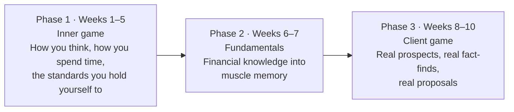
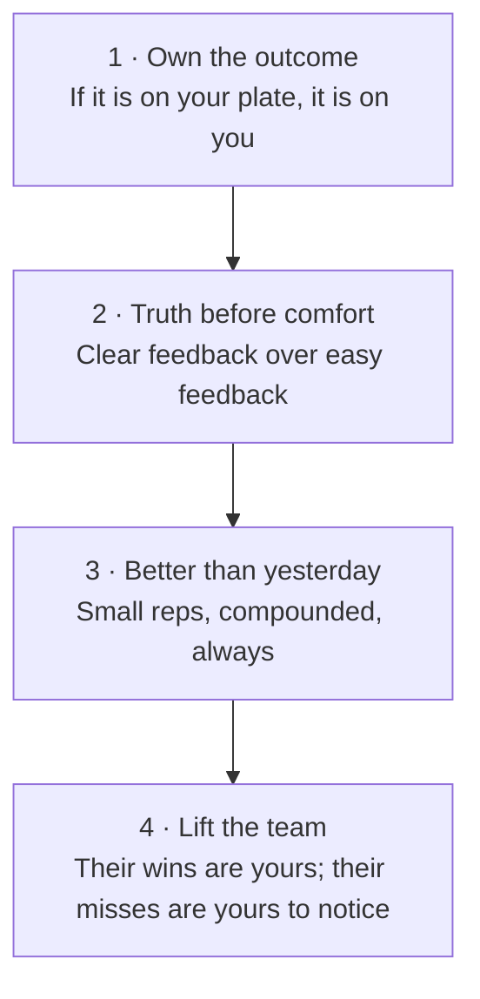

# Day 1 — Welcome: The Journey Begins

> **The one idea for today:** You've joined a career that rewards depth, honesty, and time. You've joined a team that already knows this. The next 60 days are how you earn your place in both.

---

## Welcome

You said yes to one of the most demanding — and one of the most meaningful — careers in Singapore.

Most jobs pay you for hours. This one pays you for the quality of decisions you help other people make. That's rare. Treat it that way.

We're glad you're here.

---

## What you're really signing up for

Most people see a financial advisor and think "salesperson." They're wrong. The people who stay in this career build four high-income skills — the same four that make every CEO, negotiator, and founder valuable:

| Skill | Why it compounds for life |
|---|---|
| **Human nature** | Every relationship — professional, personal, commercial |
| **Negotiation** | Deals, boundaries, salary, marriage |
| **Money** | Every financial decision you'll make for 60+ years |
| **Sales** | Any time you need someone to say yes to anything |

Over the next 60 days, you'll practise all four on real people with real stakes. Very few jobs in Singapore offer that. Most will still be typing emails to an inbox. You'll be sitting across from people whose lives will actually change because of you.

**This is the quiet advantage.** While others build experience narrowly, you build it broadly — and the broad version compounds far harder over 10 years.

---

## Your 60-day journey

The 60 days break into three phases. Each one earns the next.

You won't meet a real prospect until Week 8. That's intentional. We fix the operator before we hand over the machine.

You won't take this journey alone. Mentors, peers, and people who've walked the same road are already beside you. The sequence is engineered. Trust it.

---

## Our vision — three pillars

Everything we build stands on three pillars.

### Protect first
Before we talk about returns, we make sure the people in front of us won't be wiped out by a single bad week. Protection is the floor. Everything else gets built on it.

### Build real wealth
A life worth living costs money. Our job is to help people fund the life they actually want — not the one an Instagram ad sold them.

### Stay in the room
This work is relational, not transactional. We're in the room when clients buy their first home, have their first child, and face their first hospital bill. Long-term presence beats one-off brilliance.

---

## Our philosophy to clients

Everyone has goals — a wedding, a home, children, a real retirement, the option to stop working before they're too tired to enjoy it. Between those goals and today sit two different obstacles: **life's uncertainties** that can wipe years of saving out in a bad week, and **the quiet erosion** of money that sits idle, earning nothing, while inflation and lifestyle creep quietly undo progress.

Our job is to hand clients the map, the vehicle, and the co-pilot to get to the life they said they wanted. That takes two things in balance:

- **We protect what they've already built** — income, family, assets — so a single bad event can't reset them to zero.
- **We help them build real wealth, systematically** — so their money compounds towards the retirement, the freedom, the choices they actually want. Not left in a savings account to rot.

Done well, these two halves work together: protection gives them the nerve to let wealth compound without panicking; wealth gives them the resources to keep protection funded for life.

In practice, our philosophy shows up as:

- **Protect the floor before chasing a ceiling.** Risk management comes first. Always.
- **Build wealth on purpose, not by accident.** We plan the retirement number backwards, then solve for the monthly rate that gets them there.
- **Tell them the truth** — even when it loses us the sale. Especially then.
- **Stay in their corner** in Year 1, Year 5, Year 15. The close is the starting line, not the finish.

A client isn't buying a policy from us. They're hiring a professional for the full arc of their financial life — protection *and* freedom. The professional has to be worth hiring.

---

## Our philosophy to our team

We're not a company. We're a team. Teams are forged, not advertised.

The difference shows up in how we behave with each other when no one's measuring:

- **We hold each other to higher standards than any manager would** — because we're in it for each other, not a scorecard.
- **We share what's working the moment it works** — scripts, concepts, referrals, playbooks. Zero hoarding.
- **We don't compete with each other.** We compete with who we were last month.
- **Nobody fights alone. Nobody celebrates alone.** If you're stuck, the team helps. If you win, the team eats.

The team is the product. The team is the career. When the team is strong, every individual in it is stronger — and the math works both ways.

---

## Our values

Four, not six. Easy to memorise. Hard to live. Every day of the next 60 will bring you back to one of them.

### 1 · Own the outcome
The work on your plate is yours — the close, the follow-up, the mistake, the recovery. You don't wait to be told. You don't blame the process. If something's broken, you're the one who names it and fixes it.

### 2 · Truth before comfort
Clients get the real answer, not the comfortable one. Teammates get the feedback that helps them grow, not the feedback that spares their feelings this week. The cost of an awkward moment is almost always smaller than the cost of an unspoken truth.

### 3 · Better than yesterday
You don't need to be the best today. You need to be better than you were last month. We keep score against our own last version — not against anyone else. Small reps, compounded, over 60 days, over 5 years, over a career.

### 4 · Lift the team
Your teammate's win is your win. Your teammate's miss is yours to notice. Share what works. Share what doesn't. Offer your time and your network before you're asked. The careers that last are built on teams that compound — not on individuals who sprint alone.

**Default mindsets**, in the order of the values:

- *"If not me, then who?"*
- *"Clarity over comfort."*
- *"Am I better than yesterday?"*
- *"When the team wins, I win twice."*

---

## Your first task — the Reconnecting Exercise

Before you pitch anyone on anything, you reconnect. Four steps. Zero selling.

1. **Set a casual catch-up** with three people from your social circle this week. Coffee, lunch, a walk — low pressure.
2. **Share your transition.** Tell them you've started as a financial advisor and why. Short version. No pitch.
3. **Ask for their honest reaction.** What do they think? Do they see you doing this well?
4. **Ask if they'll help you practise** — market surveys, feedback, a proper chat in the coming weeks. Log their responses.

**The goal isn't business.** It's rebuilding warm contact with your circle and letting them see you in your new role. Everything later gets easier when this groundwork is in place.

---

## One last thing — the quiet advantage

You didn't pick the easy path. You picked the one with compound returns — on your skills, your income, your relationships, and the lives of the people you'll be in the room for.

The people who graduated from this program before you are now:

- Running practices that hit MDRT and beyond
- Handling Year-5, Year-10 clients they first closed as rookies
- Paying off HDBs, buying homes, raising families — because the career delivered
- Teaching the cohort coming up behind them

You're not starting from zero. You're starting with 60 days of structure, a team that's already done it, and the quiet advantage of having said yes when most people found an excuse.

Welcome to the career. Welcome to the team.

## Quick quiz

1. **Which phase are Weeks 1–5 part of?**
 - A) Fundamentals
 - B) Client game
 - C) Inner game ✓
 - D) Graduation

2. **What's the purpose of the Reconnecting Exercise?**
 - A) Close your first case
 - B) Build warm contact and let your circle see you in your new role — no selling ✓
 - C) Collect policy summaries
 - D) Hit a target number of meetings

3. **Which value says "your teammate's win is your win; their miss is yours to notice"?**
 - A) Own the outcome
 - B) Truth before comfort
 - C) Better than yesterday
 - D) Lift the team ✓

4. **A new teammate asks whether they should share a closing script that's been working well for them. According to team philosophy, what should they do?**
 - A) Keep it private until they've hit MDRT — then share
 - B) Share it immediately, because zero hoarding is the standard ✓
 - C) Share only with the mentor, not the whole team
 - D) Wait for the manager to decide if it's appropriate

5. **The three-pillar philosophy puts "Protect first" at the foundation. Why does protection come before wealth accumulation?**
 - A) Insurance policies pay higher commissions than investment products
 - B) Clients are more emotionally ready to discuss protection
 - C) A single bad event can wipe out years of savings without a protection floor ✓
 - D) MAS regulations require coverage before investments

6. **Your client is excited about growing their wealth and wants to skip directly to investments. According to the Day 1 philosophy, your best response is:**
 - A) Agree — client satisfaction comes first
 - B) Explain why protection must be funded first before chasing returns ✓
 - C) Split the conversation: do investments now, revisit protection later
 - D) Defer to what their existing bank advisor recommended

7. **"The close is the starting line, not the finish line." What does this mean for how you treat a client after a policy is issued?**
 - A) The FC's role ends once the policy is active
 - B) Follow-ups are optional but appreciated
 - C) Long-term presence across years and life events is the actual job ✓
 - D) The client should self-manage from this point forward

---

## Related

- Next: [[day-02|Day 2 — Why Financial Planning Matters]]
- Week 1 overview: [[README|Week 1 — Foundation & Identity Shift]]
