# Day 1 — Orientation: The 60-Day Journey Ahead

> **The one idea for today:** You're not here to sell insurance. You're here to acquire four high-income skills — human nature, negotiation, money, and sales — under a team that holds you to a standard you can't hold yourself to yet.

## What you'll walk away with

By the end of today you should be able to:

1. **See the arc** of the next 10 weeks and what each phase builds in you.
2. **Recite** our mission and vision in your own words.
3. **Name** the six values we hold each other to — and pick the one you'll be tested on first.

---

## 1. The 60-day arc — what's ahead

You're already on the journey. Here's the map of the next 10 weeks so you know where you are at all times.

```mermaid
flowchart LR
    W1[Week 1<br/>Foundation<br/>& Identity] --> W2[Week 2<br/>Industry Context<br/>& Freedom Business]
    W2 --> W3[Week 3<br/>Wealth Building<br/>Principles]
    W3 --> W4[Week 4<br/>Productivity<br/>Principles]
    W4 --> W5[Week 5<br/>Operating Rhythms<br/>& Discipline]
    W5 --> W6[Week 6<br/>Financial<br/>Fundamentals]
    W6 --> W7[Week 7<br/>The Approach<br/>& Prospecting]
    W7 --> W8[Week 8<br/>Fact Finding<br/>& Reading People]
    W8 --> W9[Week 9<br/>Uncovering Needs<br/>& Sales Concepts]
    W9 --> W10[Week 10<br/>Product Mastery<br/>& Graduation]
```

**Three phases, three jobs.**

| Phase | Weeks | Your job |
|---|---|---|
| **Inner game** | 1–5 | Rebuild how you think, how you spend your time, and the standards you hold yourself to. No client work yet — we're fixing the operator before we hand you the machine. |
| **Fundamentals** | 6–7 | Get the financial knowledge into muscle memory so you can speak about money with a straight back. Start the approach work. |
| **Client game** | 8–10 | Sit with real prospects. Run fact-finds, uncover needs, match products. By graduation you've done this live, not just on paper. |

**The honest trade-off:** The first 90 days are the hardest part of this career. You're building skill while your friends in fixed-salary jobs are already earning. What you're really buying is the compounding that kicks in during Year 2–3. Very few careers let a 25-year-old out-earn their parents by 30. This is one of them.

## 2. Why this career builds four high-income skills

Most careers ask you to trade time for money. This one asks you to trade **reps for skills that make money chase you.** These four skills compound for the rest of your life — whether you stay in this industry for 2 years or 30.

| Skill | What it looks like in practice | Why it compounds |
|---|---|---|
| **Human nature** | Reading what someone actually cares about, not what they say | Every relationship, hire, partnership |
| **Negotiation** | Getting to yes without giving the farm away | Salary, deals, boundaries, marriage |
| **Money** | Understanding how wealth is built (and destroyed) | Every financial decision for 60+ years |
| **Sales** | Moving someone from "maybe" to "yes" ethically | Any time you need buy-in for anything |

You will practise all four, on real people, with real stakes, for the next eight weeks. That's the deal.

## 3. The three dimensions you'll grow in

Think of this as the three axes you'll be scored on — by yourself, not by anyone else.

### Personal
- Build a daily operating system (habits, time-blocks, reviews) you keep for life.
- Learn to sit with discomfort — rejection, silence, being told no.
- Get feedback faster than any of your peers in any other job.

### Professional
- Accredited training (CMFAS papers sponsored).
- International designations to work towards: **MDRT → COT → TOT**.
- Mentorship from people who've already walked the path.

### Financial
- Base + commissions + performance bonuses.
- Recurring commissions (you get paid again on policies already sold).
- A retirement scheme tied to your long-term production.

---

## 4. Our mission and vision

This is what we stand for. If any of this doesn't sit right with you, now is the time to say so.

### Mission
> **To guide individuals and families toward financial freedom — with professional excellence and client-obsessed service, one conversation at a time.**

### Vision
> **To be the most trusted financial advisory team in the region** — known for our results, our integrity, and our mission to raise the standard of advice across the industry.

The mission is about the client's freedom, not ours. The vision is about the industry we want to leave behind us, not the commissions we collect. Read them again. If they sound like words on a wall, they are. What makes them real is the six values on the next page — how we actually behave when no one is watching.

## 5. The six values — our manifesto

This is the standard. We hold each other to it. These aren't posters. They're how decisions get made when no one is watching.

### 1. Extreme Ownership
We own it end-to-end — the result, the communication, the client experience. We don't wait to be told. If something's broken, it's ours to fix, whether we caused it or not.
**Default mindset:** *"If not me, then who?"*

### 2. Radical Honesty
We speak the truth with clarity and respect. Internally, we give direct feedback that sharpens each other. Externally, we guide clients toward what they need — not just what they want to hear.
**Default mindset:** *"Clarity over comfort."*

### 3. Raise Our Standards
We don't settle. We audit ourselves. We refine our pitch, our follow-ups, our financial literacy, our presence. We are students of mastery.
**Default mindset:** *"Am I better than yesterday?"*

### 4. Team Before Ego
We win as one. We share knowledge, give credit, and ask for help. The mission is bigger than individual pride.
**Default mindset:** *"How can I elevate someone else today?"*

### 5. Fast But Thoughtful
We move with urgency but never recklessly. We balance speed with intention — fast action, sharp planning.
**Default mindset:** *"Think fast, act sharp."*

### 6. Client-Obsessed
We aren't selling policies. We're earning lifelong trust. We understand each client's story and guide them with care, clarity, and conviction.
**Default mindset:** *"Would I recommend this to my own family?"*

## 6. What we look for in each other

Three questions, asked at every review, every promotion, every difficult conversation:

1. **Does this person lift the team?** (Team Before Ego)
2. **Do they own outcomes — especially when things go wrong?** (Extreme Ownership)
3. **Do they have a real desire to win — not for the status, for the standard?** (Raise Our Standards)

You won't master all six values in 60 days. Nobody does. But by Day 60 you should know which one is *your* weakest — and be visibly working on it.

---

## Reflection worksheet

Write your answers — don't just think them.

**1. Which of the six values is already strong in you, and how do you know?**
> Be specific. "I'm honest" is not an answer. "Last month I told my manager X even though it cost me Y" is.

**2. Which value are you weakest in right now? Pick one and be specific about what that looks like in your life today.**
> No scoring. No judgment. Just name the gap. This is the one you'll be tested on first.

**3. If you had to describe our mission in one sentence to your mum, how would you say it?**
> The test of whether you understand something is whether you can explain it without jargon.

---

## Quick quiz

1. **What are the four high-income skills this program builds?**
 - A) Marketing, branding, selling, closing
 - B) Human nature, negotiation, money, sales ✓
 - C) CMFAS, MDRT, COT, TOT
 - D) Prospecting, approach, SPIN, closing

2. **Which of the six values corresponds to the mindset "Clarity over comfort"?**
 - A) Extreme Ownership
 - B) Radical Honesty ✓
 - C) Raise Our Standards
 - D) Client-Obsessed

3. **In the 10-week arc, which weeks are the "inner game" phase?**
 - A) Weeks 1–5 ✓
 - B) Weeks 1–10
 - C) Weeks 6–7
 - D) Weeks 8–10

---

## Related

- Next: [[day-02|Day 2 — Why Financial Planning Matters]]
- Week 1 overview: [[README|Week 1 — Foundation & Identity Shift]]
