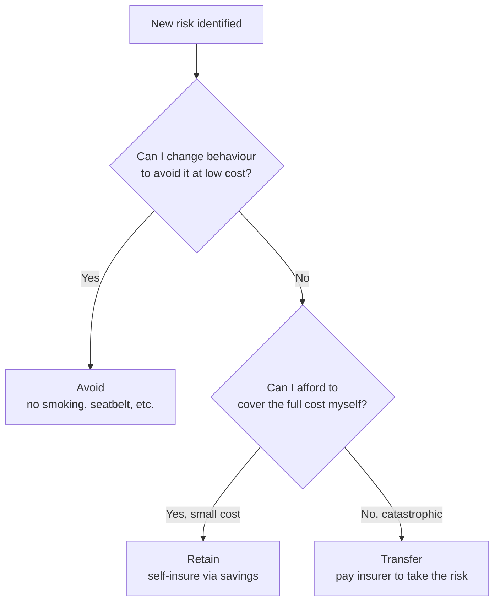
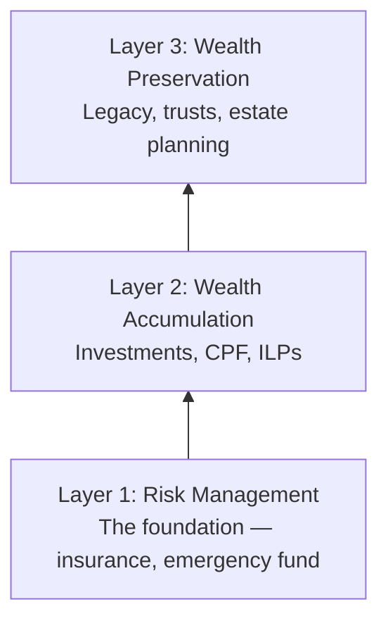

# Day 2 — Why Financial Planning Matters

> **The one idea for today:** Most people don't fail financially because they earn too little. They fail because they have no plan — and one unplanned event wipes out years of quiet saving.

## What you'll walk away with

By the end of today you should be able to:

1. **Explain** the three financial buckets every income earner needs — and what percentage of income goes into each.
2. **Distinguish** between permanent and temporary income risks, and why permanent risks are the planning priority.
3. **Describe** the three ways a person can manage risk, and when each one is the right choice.

---

## 1. The one-third rule — how every income earner should split their money

When a client tells you they "already save some money," ask where it goes. Most people have one bucket — a bank account. That's not a plan. It's a default.

A real plan divides take-home income into three equal parts:

| Third | Purpose | What it looks like |
|---|---|---|
| **Short-term** | Today's life | Daily necessities, bills, utilities, entertainment, transport, holidays |
| **Mid-term** | Life in the next 1–5 years | House, renovation, wedding, car, children's education, life milestones |
| **Long-term** | Life in 10+ years | Retirement savings, investments, and risk management (insurance) |

Most people get this backwards. Their short-term bucket balloons — lifestyle inflation is silent — and their long-term bucket stays empty. By 40, they realise the gap. By 55, the gap is too wide to close.

### The reframe — long-term first, not last

Here is the mental shift your client needs:

**Most people ask:** *"What's left for long-term savings after I pay for everything else?"*

**Our job is to flip that:** *"Once the long-term third is secured, what's left to spend on mid-term and short-term?"*

That single reorder changes everything. It forces discipline into the only bucket that actually compounds. The other two take care of themselves once this one is locked in.

**Why long-term includes risk management:** insurance and retirement are both playing the same game — protecting the 40-year version of you. If risk management fails (a CI diagnosis wipes out the fund), the long-term bucket collapses. If retirement fails (no savings at 65), the same ending arrives, just slower. That's why protection and accumulation live in the same third, with protection funded first.

## 2. Permanent vs temporary risks

Most people only plan for the easy risks. Here's the actual map:

**Temporary risks** — income loss is short-term and recoverable.
- Fired
- Resigned
- Retrenched

Planning response: **Emergency fund** of 3–6 months of income. That's the whole solution.

**Permanent risks** — income loss is severe, long-term, or irreversible.
- Death
- Permanent disability
- Critical illness
- Serious accident / hospitalisation
- Old age (your own retirement)

Planning response: **Insurance + retirement plan.** An emergency fund can't carry a family for years, and it certainly can't replace you if you're no longer here.

**The client realisation:** "If you aren't prepared to go without income for a few months, how will your family go without your income for a few years?"

## 3. The three ways to manage any risk

Every risk can be handled one of three ways. Most people default to the wrong one for the wrong risk.

### 1. Avoid risk
You change your behaviour to not face the risk at all.
- Don't smoke → reduces lung cancer risk.
- Cross at the overhead bridge → reduces road accident risk.
- Don't go into debt → reduces bankruptcy risk.

Good for **small, avoidable** risks.

### 2. Retain risk
You accept the risk and set money aside to handle it yourself.
- Temporary loss of income → 3–6 months emergency fund.
- Minor car repair → build it into your monthly budget.
- Phone replacement → sinking fund.

Good for **small-to-medium risks you can self-insure** without going broke.

### 3. Transfer risk
You pay someone else (an insurer) to take the risk off your balance sheet.
- Death → life insurance.
- Critical illness → critical illness insurance.
- Hospitalisation → health insurance.
- Accident → accident insurance.

Good for **catastrophic risks** that would destroy your financial life if they occurred.

**The rule:** transfer what you can't afford to retain.

## 4. How much coverage is enough?

This is where most clients need your guidance. A rough rule of thumb for a Singapore context:

| Risk | Rule of thumb | Why |
|---|---|---|
| Death / TPD | **10× annual income** | If you're gone, your income replaces for ~10 years while your family adjusts |
| Major Critical Illness | **5× annual income** | Recovery downtime is typically 3–5 years |
| Early Critical Illness | **2× annual income** | Shorter recovery, earlier diagnosis |
| Hospitalisation | **Maximum private/government limit** | You don't want to be choosing treatment based on bill size |

Wealth accumulation uses a different calculation: work backwards from your target retirement age and income, account for 2% p.a. inflation, then solve for the monthly savings rate.

## 5. The frame to use with every prospect

You'll use this three-layer model in every client conversation for the rest of your career:

A client who tries to jump to Layer 2 without Layer 1 is building a house on sand. Your job is to explain why — without shaming them and without selling.

## Quick quiz

1. **Under the one-third rule, which third should be locked in first?**
 - A) Short-term (daily necessities, bills, lifestyle)
 - B) Mid-term (house, wedding, kids' education)
 - C) Long-term — risk management and retirement ✓
 - D) Whichever is easiest that month

 **Why:** The entire Day 2 reframe is to flip the default order — lock in the long-term third first, then let mid and short-term fill what remains. Short-term (A) and mid-term (B) are where lifestyle inflation eats the plan; prioritising them leaves the compounding bucket empty. "Whichever is easiest" (D) is precisely the default behaviour that leaves clients with one bucket and no plan by age 40.

2. **What's the standard rule of thumb for death/TPD coverage?**
 - A) 3× annual income
 - B) 5× annual income
 - C) 10× annual income ✓
 - D) 1× net worth

 **Why:** The Day 2 coverage table specifies 10x annual income for death/TPD — enough to replace income for roughly a decade while the family adjusts. 5x (B) is the rule of thumb for major critical illness, not death. 3x (A) is too low to sustain a family past the immediate shock. Net worth (D) is not the right metric because a young earner with low net worth but high income potential would be drastically underinsured.

3. **Which risk should be retained (not transferred)?**
 - A) Critical illness
 - B) Permanent disability
 - C) Temporary job loss ✓
 - D) Hospitalisation

 **Why:** Temporary job loss is the textbook case for retention — the planning response is a 3–6 month emergency fund, which is exactly the self-insure tool. The other three (critical illness, permanent disability, hospitalisation) are permanent or catastrophic risks that would exhaust any emergency fund and destroy long-term financial plans — Day 2's rule is clear: transfer what you cannot afford to retain.

4. **A 32-year-old client earns $6,000/month. He has $20,000 in savings and no insurance. He says "I'm healthy, so I don't need insurance yet." What's the most accurate reframe?**
 - A) "You're right — start investing first, then protect later."
 - B) "Your emergency fund covers temporary income loss, but it can't replace your income if you're critically ill for years." ✓
 - C) "Insurance is compulsory under MAS rules for working adults."
 - D) "At your age, premiums are cheapest, so it's financially optimal to buy now."

 **Why:** B targets the exact blind spot Day 2 identifies — clients confuse their emergency fund (designed for temporary income loss) with a substitute for permanent-risk coverage. $20,000 cannot fund years of critical illness recovery or replace a family's income after death. A validates the wrong sequencing. C is factually false — health insurance is not legally compulsory for working adults. D may be true but it's a commission-motivated angle, not the honest client-centred reframe.

5. **Under the one-third rule, where do insurance premiums belong?**
 - A) Short-term third, because they are a monthly expense
 - B) Mid-term third, because they protect near-term goals
 - C) Long-term third, because they protect the 40-year version of the client ✓
 - D) It depends on the type of policy

 **Why:** Day 2 explicitly states that risk management and retirement live in the long-term third because "protection and accumulation are playing the same game" — protecting the decades-long version of the client. Treating premiums as a short-term expense (A) is the framing that causes clients to cancel policies during tight months. Mid-term (B) misreads the time horizon. "Depends on policy type" (D) is a dodge — the one-third rule categorises all risk management as long-term without exception.

6. **A client asks how much critical illness coverage she needs. Her annual income is $60,000. According to the rule of thumb, what range should you recommend?**
 - A) $60,000–$120,000
 - B) $120,000–$300,000 ✓
 - C) $300,000–$600,000
 - D) $600,000 or more

 **Why:** The Day 2 table gives two CI benchmarks: early CI at 2x annual income and major CI at 5x. For $60,000 income that gives a range of $120,000 (2x) to $300,000 (5x), which is exactly option B. A ($60k-$120k) undershoots the early CI floor. C and D overshoot the major CI ceiling without clinical justification.

7. **A client has no emergency fund, no insurance, and wants to start an investment portfolio. Using the three-layer model, what is the correct sequencing advice?**
 - A) Start investing immediately — time in the market beats timing the market
 - B) Build the emergency fund and risk management layer first, then add investment layer ✓
 - C) Split contributions equally across all three layers from Day 1
 - D) Focus on wealth preservation first since it has the longest time horizon

 **Why:** The three-layer model is explicitly sequential — Layer 1 (risk management) must be funded before Layer 2 (wealth accumulation), because a single uninsured event can force liquidation of investments at the worst moment. A is a finance cliche that ignores the risk floor. C sounds balanced but leaves the client exposed precisely as their investment balance grows. D inverts the pyramid entirely — wealth preservation (Layer 3) is built last, not first.

---

## Related

- Previous: [[day-01|Day 1 — Orientation]]
- Next: [[day-03|Day 3 — Four Assurances of This Career]]
