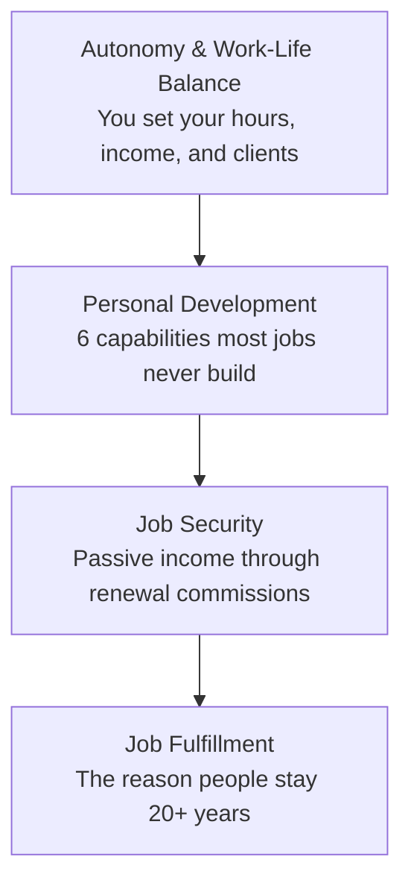
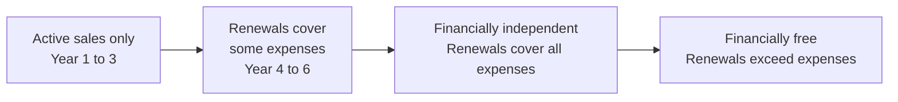

# Day 3 — Four Assurances of This Career

> **The one idea for today:** Most jobs promise one thing — a paycheck. This career promises four: autonomy, development, security, and fulfillment. But only the ones who persist past Year 1 actually collect on them.

## What you'll walk away with

By the end of today you should be able to:

1. **Name** the four assurances this career offers and give one concrete example of each.
2. **Articulate** why passive income is what actually creates job security — and what passive income means in this career.
3. **Identify** the common trap that causes new FCs to quit in Year 1 before the assurances compound.

---

## 1. Autonomy & Work-Life Balance

"No one on their deathbed ever said *I wish I had spent more time at the office*."

You are self-employed. That means:
- You set your working hours.
- You decide your own income ceiling (and floor).
- You choose which clients you work with.

The trade-off: **autonomy comes bundled with responsibility**. No one will drag you out of bed at 8am. No one will "assign" you leads. If you don't decide what to work on today, nothing gets done — and no one pays you.

**What this looks like in practice**

Year 1: Mostly structured (training, shadowing, coaching). You're building the skills.
Year 2–3: You start deciding your own schedule. Some weeks are brutal; others are genuinely relaxed.
Year 4+: If the clients you've served are taken care of, you control your calendar. You can block out a month for travel without losing income.

Contrast this with law, medicine, and audit — careers that structurally demand 50+ hour weeks *for decades.*

## 2. Personal Development

"Your competition isn't other people. Your competition is your procrastination. Your ego. The unhealthy food you're eating. The knowledge you're neglecting. The hours on social media. Compete against that."

This career forces you to develop six specific capabilities. Most 9-5 jobs develop none of them at any meaningful depth:

1. **Personal finance knowledge** — you have to actually understand money.
2. **Ability to influence others** — move someone from "maybe" to "yes."
3. **Communication skills** — listening first, speaking second.
4. **Moral compass** — what you do when no one is watching.
5. **Entrepreneurial spirit** — treating yourself as a business.
6. **Discipline & grit** — showing up on the days you don't want to.

These are not "soft skills." They compound across every area of life: marriage, parenting, negotiation, leadership.

## 3. Job Security (Through Passive Income)

Here's the uncomfortable truth: **there is no security in a job**, even a high-paying one. You're one reorg, one bad quarter, one AI tool away from redundancy.

Real security comes from **multiple income streams** — and this career is one of the few that builds a genuine second stream as part of the work itself.

### What "passive income" means for an FC

When you sell a policy:
- You earn a first-year commission.
- You also earn **renewal commissions** — smaller amounts paid to you every year the client continues the policy. For 6, 10, sometimes 20+ years.

Over time, your renewal book gets large enough that it can cover:
- Your monthly expenses (you become *financially independent*)
- And then exceed them (you become *financially free*)

**You are financially free when your passive income exceeds your expenses.**

Most FCs underestimate how quickly this compounds. A modest book after 5–7 years of consistent production can throw off enough renewal income to remove the pressure of needing to sell.

## 4. Job Fulfillment (The One That Keeps You)

Money is a reason to start. It's rarely the reason people stay.

The fulfillment comes from three places:
1. **Educating clients** on things their school, parents, and employers never taught them.
2. **Connecting** with people at their most honest — when they talk about their fears, families, and futures.
3. **Helping** at moments that actually matter — a claim, a retirement decision, a critical illness diagnosis.

**The dark side:** because this industry is lucrative, it's easy to get pulled into money-driven behaviour. Medical malpractice happens for the same reason — the fee becomes the goal, not the client's welfare.

The antidote is a **service-focused attitude** and a strong internal moral compass. Longevity in this career depends on it. The FCs who last 20+ years are rarely the flashiest. They are the ones clients refer to their own children.

---

## 5. The Year-1 Trap

Most new FCs who quit do so because they compared:

> Their Year 1 income (commission-based, inconsistent) vs. their peers' Year 1 fixed salaries.

That comparison is the trap. The honest comparison is Year 5 vs Year 5. By then:
- Your peers are maybe 10–20% up on their starting salary.
- A consistent FC is often 2–4× their starting year, with significant passive income on top.

**The lesson:** evaluate this career on a 5-year horizon, not a 1-year horizon. If you're making a 1-year decision, you're probably going to make the wrong one.

## Quick quiz

1. **What is the definition of being financially free?**
 - A) Earning $10K/month
 - B) Passive income exceeds expenses ✓
 - C) No debt
 - D) Retired

 **Why:** Day 3 defines financial freedom precisely as passive income exceeding expenses — the threshold where you no longer need to sell to survive. A gross income figure (A) says nothing about what the expenses are, so a $10k earner with $12k in expenses is not free. Debt-free (C) is a net-worth metric, not an income-flow metric. Retirement (D) is a life stage, not a financial definition — an FC can be financially free at 35, or retired but not free.

2. **What's the most common reason new FCs quit in Year 1?**
 - A) Lack of leads
 - B) Difficulty of training
 - C) Comparing their income vs peers on fixed salaries ✓
 - D) Product complexity

 **Why:** Day 3 names the Year-1 trap explicitly: new FCs compare their early commission income against their peers' fixed salaries and make a short-term verdict. The honest comparison is Year 5 vs Year 5, when an FC who persisted is often 2-4x ahead with passive income on top. Lead availability (A) and product complexity (D) are challenges, but they are not the named cause. Training difficulty (B) is not mentioned as a quit trigger.

3. **What creates real job security in this career?**
 - A) A large agency
 - B) MDRT qualification
 - C) Multiple income streams including renewal commissions ✓
 - D) A base salary component

 **Why:** Day 3 argues that real security comes from multiple income streams, specifically the renewal commission book that keeps paying years after the original sale. A large agency (A) and MDRT status (B) are external markers that can be lost or that don't pay your bills when activity dips. A base salary component (D) is exactly the "security in a job" that Day 3 calls an illusion — one reorg ends it.

4. **A friend tells you your job is risky because there's no guaranteed salary. What is the most accurate counter-argument based on Day 3?**
 - A) "AIA provides a base allowance for the first 2 years."
 - B) "Fixed salaries are also at risk — one reorg and they're gone. Renewal commissions compound over time regardless of where I work." ✓
 - C) "Top FCs earn far more than salaried employees, so the risk is worth it."
 - D) "You're right, but the career fulfillment makes up for the instability."

 **Why:** B directly applies Day 3's argument that salaried jobs carry their own hidden risk (reorg, redundancy, AI replacement) while renewal commissions are an owned, compounding asset independent of your employer. A may be factually true but it concedes the frame that a base is what makes the job safe. C is a comparison argument, not a structural one. D concedes the instability point rather than refuting it.

5. **Which of the six development capabilities listed in Day 3 is described as "what you do when no one is watching"?**
 - A) Entrepreneurial spirit
 - B) Discipline and grit
 - C) Moral compass ✓
 - D) Ability to influence others

 **Why:** Day 3 lists moral compass with the exact phrase "what you do when no one is watching." Discipline and grit (B) is about showing up on hard days — it's behavioural, not ethical. Entrepreneurial spirit (A) is about treating yourself as a business. Influence (D) is about moving people from hesitation to decision.

6. **An FC has been in the role for 8 months. His renewal commissions now cover half his monthly expenses. According to Day 3's definitions, which stage has he reached?**
 - A) Financially free
 - B) Financially independent
 - C) Neither — he needs full coverage before either term applies ✓
 - D) Both terms apply once passive income exceeds 50% of expenses

 **Why:** Day 3 defines financially independent as passive income covering monthly expenses and financially free as passive income exceeding expenses — both require full coverage, not partial. At 50% coverage the FC still needs active sales income to survive, so neither threshold is met. D invents a 50% rule that does not exist in the framework.

7. **Why do FCs who stay 20+ years tend to be "the most loyal" advisors rather than "the flashiest"?**
 - A) Flashy FCs move to fund management after 10 years
 - B) Longevity depends on a service-focused attitude and strong moral compass, not deal volume ✓
 - C) Regulators penalise high-commission-generating advisors after Year 10
 - D) Flashy marketing works in Year 1 but clients self-select away over time

 **Why:** Day 3 directly states that longevity depends on a service-focused attitude and strong moral compass — the money-driven trap (the "dark side") is what ends careers early. The best long-term FCs are the ones clients refer to their children, which is a trust outcome, not a marketing outcome. A and C are not in the content. D contains a grain of truth but misses the deeper structural reason: it is the moral compass, not client self-selection, that drives staying power.

---

## Related

- Previous: [[day-02|Day 2 — Why Financial Planning Matters]]
- Next: [[day-04|Day 4 — Growth vs Fixed Mindset]]
