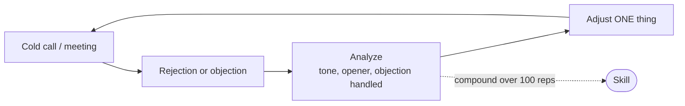

# Day 4 — Growth vs Fixed Mindset

> **The one idea for today:** Failure, rejection, and being bad at things are not obstacles on your path. They *are* the path. The only question is whether you experiment with them or hide from them.

## What you'll walk away with

By the end of today you should be able to:

1. **Distinguish** a fixed-mindset response from a growth-mindset response using your own recent examples.
2. **Apply** the "not yet" reframe to something you're currently failing at.
3. **Commit** to one specific discomfort you'll lean into this week.

---

## 1. The two mindsets, in practice

Stanford psychologist Carol Dweck's research separates people into two response patterns under challenge:

| Situation | Fixed mindset says | Growth mindset says |
|---|---|---|
| Cold call gets rejected | "I'm not cut out for sales" | "What did I miss? Let me adjust." |
| Prospect says no to the plan | "He wasn't the right client" | "Which SPIN question did I skip?" |
| Can't understand a product feature | "I'm not a finance person" | "Not yet. What do I need to read?" |
| Peer closes more than you | "She has better connections" | "What's she doing differently?" |
| You fail a CMFAS mock | "Maybe this isn't for me" | "Which 3 topics cost me the marks?" |

**The tell:** fixed-mindset responses usually contain the word "I'm" (an identity claim). Growth-mindset responses usually contain a specific, concrete next action.

## 2. Reject the "now" — embrace the "not yet"

The most powerful two words in your vocabulary for the next 60 days are **"not yet."**

- "I can't close." → "I can't close **yet.**"
- "I don't understand ILPs." → "I don't understand ILPs **yet.**"
- "I'm not good on camera." → "I'm not good on camera **yet.**"

The tyranny of the "now" is that it turns a temporary skill gap into a permanent identity. "Not yet" protects your identity from your current state of competence.

This sounds small. It isn't. It's the difference between people who quit in month 6 and people who grow in month 6.

## 3. Sales is a marathon, not a sprint

Every new FC has a week where they feel like they've cracked the code — and a week where they feel like quitting. Both are lies.

The truth: in a marathon, your Week 3 mood is not data about Week 52.

**Three consequences of this truth:**

1. **Don't make big decisions on bad weeks.** "Should I quit?" is a question for review at the 6-month mark, not a Tuesday morning after two rejected calls.
2. **Don't make big promises on good weeks.** "I'm going to hit $X this month" rarely survives the reality of Week 2.
3. **Track reps, not mood.** Dials made, appointments booked, meetings run. These are honest. Feelings lie.

## 4. The obstacle is the way

Ryan Holiday's translation of the Stoic idea: *"The obstacle in the path becomes the path."*

Every obstacle you face in the next 8 weeks — rejections, slow days, complex products, awkward family-and-friend conversations, late-night study — is simultaneously:

- The thing slowing you down, **and**
- The thing building the skill.

You can't get the skill without the obstacle. So the obstacle isn't something to get past. It's what you're *actually here for*.

### Worked example — the cold call

- **Obstacle:** rejection on the phone.
- **Fixed mindset:** "I hate cold calls. Cold calls are outdated."
- **Growth mindset:** "Rejection is the rep. The rep is the skill. Each call is 90 seconds I can analyse — tone, opener, handling of the first objection."

The cold-call rep **is** the skill acquisition. If it were easy, it wouldn't pay.

## 5. Step out of the comfort zone — this week

"If you want something you never had before, you have to do something you've never done before."

This is not motivational. It's mechanical. If you repeat what you already do, you get the results you already have. Growth requires **deliberate discomfort.**

**Rule:** Every week, do at least **one thing that scares you professionally.** Not catastrophically — just uncomfortably.

Examples for Week 1 — all zero-sales:
- Call a friend-of-a-friend you've never spoken to, just to catch up.
- Post one genuine finance observation on LinkedIn (not a polished one).
- Ask your mentor a question you think is "too basic."
- Do **one Reconnecting catch-up** (see Day 1's first task) — a casual coffee where you share that you've started this career. Pure widening of connections, no pitch, no survey, no SPIN. You'll learn SPIN in Week 8 when you're ready for it.

You'll fail at some of these. That's the point.

---

## Reflection worksheet

**1. Rewrite three recent "I can't" statements using "not yet."**
> Write the original and the rewrite side by side. Which feels more honest?

**2. What's one thing you've been too comfortable doing for too long?**
> It can be a habit, a social pattern, a topic you avoid. Name it specifically.

**3. What's one uncomfortable thing you'll do this week, by when?**
> Not "I'll be more outgoing." A specific action, a specific day, a specific person.

---

## Quick quiz

1. **The "not yet" reframe protects your:**
 - A) Ego
 - B) Identity from your current state of competence ✓
 - C) Commission
 - D) Reputation with clients

2. **Which of these is a growth-mindset response to rejection?**
 - A) "That prospect wasn't serious"
 - B) "I'm not meant for this"
 - C) "Which objection did I fumble?" ✓
 - D) "Cold calling doesn't work anymore"

3. **What should you track instead of mood?**
 - A) Commission earned this week
 - B) Number of positive reactions on social media
 - C) Reps — dials, appointments, meetings run ✓
 - D) Your NPS score from clients

---

## Related

- Previous: [[day-03|Day 3 — Four Assurances of This Career]]
- Next: [[day-05|Day 5 — Purpose-Driven Life]]
