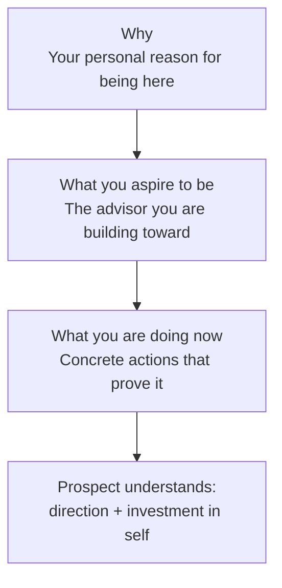

# Day 5 — Purpose-Driven Life: Your Real Why

> **The one idea for today:** Your clients don't buy your products. They buy what you've decided you're here to do. If that decision isn't made, you'll sell average work and they'll feel it.

## What you'll walk away with

By the end of today you should be able to:

1. **Articulate** the difference between a "why" that holds up under pressure and one that collapses.
2. **Draft** a 60-second elevator pitch that positions you as trustworthy *before* you've built any track record.
3. **Identify** who in your life you can reconnect with — and what value you can offer them that doesn't require you to "be good yet."

---

## 1. Purpose is the load-bearing wall

In Week 5 of training, you'll hit a rejection streak. In Week 12, a prospect will no-show twice. In Month 4, you'll question whether this is worth it.

In those moments, three things can keep you in the chair:
- Discipline (short-term — runs out).
- Financial pressure (negative — runs out when you have a bad month).
- **Purpose (long-term — compounds).**

A purpose-driven FC keeps showing up because the work answers a question bigger than "did I hit my number this week?"

```mermaid
flowchart TD
    A["Discipline<br/>Short-term - runs out"] --> D["Showing up"]
    B["Financial pressure<br/>Negative - collapses in bad months"] --> D
    C["Purpose<br/>Long-term - compounds"] --> D
    style C fill:#1a3a2a
    style A fill:#3a2a1a
    style B fill:#3a2a1a
```

**The reframe:** You are not selling insurance. You are building a life around meaningful work that value-adds to the people around you — especially those who matter to you most.

If that sentence feels like marketing, you haven't yet decided it's true.

## 2. Your elevator pitch is pre-framing, not pitching

Here's a trap new FCs fall into: they think they need **credibility** before they can speak to anyone. They don't have it (they just started). So they go quiet.

The fix is called **pre-framing.** Pre-framing lets your prospect anticipate the value you'll bring *before* you've proven it. It buys you runway.

**The three parts of a good elevator pitch:**

1. **Why** (your purpose — 1 sentence)
2. **What (End)** — the kind of advisor you aspire to be (4 points max)
3. **What (Now)** — the concrete actions you're taking to get there (4 points max)

### Worked example

> **Why:** "I joined this career because I watched my parents lose years of savings to one uninsured event, and I promised myself I'd help families see that coming before it does."
>
> **What I aspire to be:** A long-tenured advisor — 20+ years with the same clients, known for honest product fit, strong in estate and retirement planning.
>
> **What I'm doing now:** CMFAS papers this quarter · shadowing senior FC on real cases · studying CPF & ILPs · posting one weekly finance explainer on LinkedIn.

A prospect who hears this understands:
- You're not faking experience.
- You have a direction.
- You're investing in yourself before asking them to invest in you.

**Everyone loves rooting for an underdog. Everyone loves discovering the next big thing before it blows up.** Pre-framing is how you give them that role.

## 3. The underdog advantage

If you're new, your instinct is to hide it. That's the wrong move.

The right move: **own it, and convert it into a reason to work with you.**

| The hidden claim | The better claim |
|---|---|
| "I've been doing this for a while" | "I'm early in my career and I'm going to work harder than someone who's cruising" |
| "I have many clients" | "You'd be one of my first — which means you'll get my full attention for the next decade" |
| "I know everything about this product" | "Here's what I know, here's what I'm checking with my mentor" |

Prospects who work with hungry, honest new FCs often become the most loyal clients. They watched you earn it.

## 4. Reconnecting — who to speak to first

Your warm market is the first arena. Not the last.

Make a list of 10 people you'd feel *slightly uncomfortable* reaching out to right now. Not your closest 3 friends (that's too easy). Not complete strangers (that's Week 5).

The middle tier:
- Old classmates you haven't spoken to in 2+ years
- Former colleagues who left the company
- People you met at one event and exchanged numbers
- Cousins you see once a year
- Friends-of-friends you've met but don't know well

These people are **socially valid** (you're not a stranger) but **not yet emotionally complicated** (they don't have opinions about whether you'd be "good at sales"). They are the highest-leverage Week 1 audience.

**Your message to them is not a pitch.** It's a reconnection. "Hey, I've been thinking about [person] recently. Would love to catch up — coffee next week?" If the conversation turns into financial work naturally, good. If it doesn't, you've reactivated a relationship.

**Rule:** Don't ask for a meeting *about insurance*. Ask for a meeting. Let your pre-framing and their questions do the work.

## 5. The moral compass

Because this industry pays well, it attracts two types: people who want to help, and people who want to make money. The same is true of medicine — and medicine has the malpractice records to prove it.

Every month you'll face small moments where the commissioned product and the best-fit product aren't the same. The answer is always the client.

**The test:** could you explain this recommendation to your client's children, 10 years from now, without flinching?

If yes, sell it. If no, don't.

This is the most important thing on this page.

## Quick quiz

1. **What is pre-framing?**
 - A) Telling the prospect what they'll learn before the meeting
 - B) Letting the prospect anticipate your value before you've proven it ✓
 - C) Framing the sale before the objection comes
 - D) Setting up a proposal document

 **Why:** Pre-framing is specifically about buying credibility runway before you have a track record — you let the prospect form a positive expectation of your future value, not evidence of past results. A describes an agenda-setting tactic (previewing a meeting), not a trust-building technique. C conflates pre-framing with objection handling. D is an admin task with no connection to the concept.

2. **Who should NOT be on your Week 1 reconnection list?**
 - A) Old classmates you haven't spoken to in 2 years
 - B) Former colleagues
 - C) Your closest 3 friends ✓
 - D) Cousins you see once a year

 **Why:** Day 5 says closest friends are "too easy" for Week 1 — they already accept you and give you no practice at the slightly uncomfortable reconnection. The goal is the middle tier: socially valid but not yet emotionally complicated. Old classmates (A), former colleagues (B), and annual-contact cousins (D) are all explicitly named as ideal middle-tier contacts.

3. **The moral compass test for any recommendation:**
 - A) Is the commission competitive?
 - B) Does it hit the monthly target?
 - C) Could you explain it to the client's children 10 years from now without flinching? ✓
 - D) Is it the newest product?

 **Why:** Day 5 gives this exact test verbatim and calls it "the most important thing on this page." It forces a long-horizon, client-first perspective on every sale. A and B are commission- and target-driven criteria — precisely the money-motivated behaviour Day 5 warns against. D (newest product) has no bearing on fit; it reflects product push rather than client need.

4. **You're reconnecting with a cousin you see once a year. She asks why you switched careers. Using the pre-framing structure, what should your response include?**
 - A) Your commission potential and career progression path
 - B) A brief pitch about the products you now sell
 - C) Your personal why, what kind of advisor you aspire to be, and what you're doing now to earn it ✓
 - D) Social proof from your senior colleagues' track records

 **Why:** The pre-framing structure has three parts in Day 5: your why (one sentence), what you aspire to be (four points max), and what you are doing now to earn that. C maps directly to all three. A focuses on self-interest, not the client's perspective. B is a pitch, which Day 5 explicitly says your reconnection message is not. D uses someone else's credibility instead of your own direction, which defeats the purpose of pre-framing.

5. **Why does the Day 5 framework recommend the "middle tier" of warm contacts rather than your closest friends for Week 1 outreach?**
 - A) Closest friends are more likely to give negative feedback
 - B) Middle-tier contacts are socially valid but not yet emotionally complicated — they have no preconceptions about you in sales ✓
 - C) Closer relationships should be reserved for later when you have more experience
 - D) Middle-tier contacts have higher purchasing power on average

 **Why:** Day 5 explains that middle-tier contacts give you the best of both worlds: enough familiarity that you are not a cold stranger (socially valid), but no strong existing opinions about whether you would be "good at sales" (not emotionally complicated). A is not mentioned as a reason — the concern about closest friends is ease, not negativity. C and D are not in the content; purchasing power is irrelevant at the reconnection stage.

6. **An FC is new and worried they lack credibility. According to Day 5, the correct move is:**
 - A) Wait until CMFAS is passed before speaking to any prospects
 - B) Lean on the agency's brand name until personal credibility is built
 - C) Own the newness and convert it into a reason to work with you — you'll give more attention than a cruising senior ✓
 - D) Avoid mentioning how long you've been in the role

 **Why:** Day 5's underdog advantage section says hiding your newness is the wrong move — owning it and converting it (you'll be one of my first clients, you'll get my full attention) is how a new FC competes. Waiting (A) leaves money and relationship-building on the table. Leaning on brand (B) sidesteps the personal credibility question rather than answering it. D is actively dishonest, and dishonesty is the opposite of the moral compass the same day teaches.

7. **Which of the following would make a "why" statement most likely to hold up under pressure in Month 4?**
 - A) "I want to build financial freedom for myself through commissions."
 - B) "My manager believes I have the right personality for this."
 - C) "I watched a close family member suffer a financial setback that insurance could have prevented." ✓
 - D) "I want to prove that I can succeed in a hard career."

 **Why:** Day 5 says purpose must be load-bearing — it needs to answer a question bigger than "did I hit my number this week?" A personal loss that now drives protective work for others (C) is deeply anchored and will survive rejection streaks. A (self-interest in commissions) fades when commissions are thin. B (external validation from a manager) is borrowed motivation with no roots. D (proving something) is ego-driven and collapses the moment the external audience stops watching.

---

## Related

- Previous: [[day-04|Day 4 — Growth vs Fixed Mindset]]
- Next: [[day-06|Day 6 — Forming Habits That Compound]]
