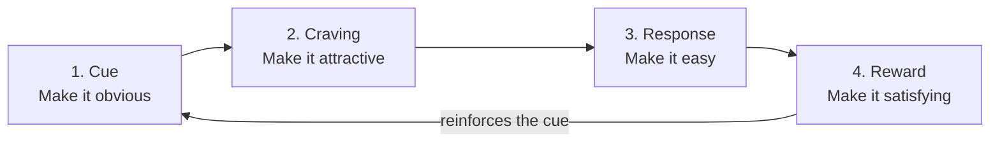

# Day 6 — Forming Habits That Compound

> **The one idea for today:** You don't rise to the level of your goals. You fall to the level of your systems. Set up the system once — then stop relying on motivation.

## What you'll walk away with

By the end of today you should be able to:

1. **Explain** why 1% daily improvement matters more than any single heroic effort.
2. **Apply** the 4-law habit loop to install one new habit and break one old one.
3. **Design** your first "identity-based" habit — one that changes who you are, not just what you do.

---

## 1. Why 1% a day beats heroics

Thirty minutes of daily calling is worth more than one weekend seminar. Daily reading of one chapter is worth more than a binge-watched course. This isn't motivational. It's arithmetic.

- 1% better every day, for 1 year = 37× better.
- 1% worse every day, for 1 year = basically zero.

The compounding is invisible in the first 30 days. That's the dangerous part — the new FCs who quit in Month 1 quit just before the curve starts bending.

**What compounding looks like in practice:**

- Week 1: your first cold-call script is clunky.
- Week 4: you've tweaked the opener 10 times — it flows.
- Week 8: you've refined objection responses — your close rate ticks up.
- Week 20: a marginal tweak in tone of voice lifts your appointment rate 3%.

Nothing dramatic on any given day. Transformative over 20 weeks.

**Where to apply 1% thinking:**
- Your opener and close
- Your SPIN questions
- Your LinkedIn post cadence
- Your dressing/presentation
- Your tone of voice on calls
- Your caption copy on social
- Your CRM note-taking after every meeting
- Your ability to ask for referrals

None of these require inspiration. They require **systems.**

## 2. Systems beat goals

"The purpose of setting a goal is to win the game. The purpose of building a system is to continue playing the game."

A goal is the destination. A system is the vehicle. Most people obsess about the destination and never build the vehicle.

| Goal | System |
|---|---|
| "Hit MDRT this year" | "Block 9–11am every weekday for calls" |
| "Get healthier" | "Walk to work 3 days a week" |
| "Read more" | "20 pages before scrolling each morning" |
| "Be more consistent on social" | "One finance post every Sunday evening" |

Goals are binary (you hit it or you don't). Systems are durable (they keep producing whether you're motivated or not).

**The failure pattern:** setting a goal without a system. Then in Week 3, when motivation drops, there's no scaffolding to fall back on.

## 3. The habit loop — the 4 laws

James Clear's framework gives you a mechanical way to install any habit or kill any bad one.

### To create a good habit

| Law | Principle | Example: daily prospecting calls |
|---|---|---|
| **1. Cue** | Make it obvious | Phone + call list on desk by 8:55am |
| **2. Craving** | Make it attractive | Pair with your favourite coffee |
| **3. Response** | Make it easy | Script already open, first 3 numbers pre-filled |
| **4. Reward** | Make it satisfying | Check a box on a visible tracker after every call |

### To break a bad habit

Invert the same 4 laws.

| Law | Principle | Example: stop doomscrolling |
|---|---|---|
| **1. Cue** | Make it invisible | Phone in drawer, not on desk |
| **2. Craving** | Make it unattractive | Unfollow the accounts that hijack you |
| **3. Response** | Make it difficult | App timer lockout after 15 min |
| **4. Reward** | Make it unsatisfying | Keep a tally of time lost vs reading done |

**The insight:** willpower is not a strategy. Environment design is.

## 4. Identity-based habits

The highest form of habit formation is identity change, not behaviour change.

| Behaviour-based | Identity-based |
|---|---|
| "I'm trying to call 10 prospects a day" | "I'm the kind of FC who prospects daily" |
| "I'm trying to get healthy" | "I'm a healthy person" |
| "I want to read more" | "I'm a reader" |

The difference: when you skip a day on a behaviour goal, you just failed. When you skip a day on an identity goal, you voted against who you are — and your brain notices.

**How to install an identity-based habit:**

1. Decide the type of person you want to be (e.g., "I am a disciplined FC").
2. Prove it with small wins (e.g., 5 calls today counts as a vote).
3. Every completed small action is a vote for your new identity. Collect enough votes and the identity becomes true.

## 5. Success habits for a new FC — the minimum set

Activities × Skills × Knowledge = FYC (first-year commission).

If any factor is zero, the product is zero. You need non-zero effort in all three every week.

| Category | Success habit | Minimum weekly rep |
|---|---|---|
| **Activities** | Planning & prospecting | 5× weekly planning session; 50+ outreach touches |
| **Skills** | Selling (SPIN, closing) | 1× role-play with mentor; 3+ real meetings |
| **Knowledge** | Self-study | 3 hours: products, CPF, markets, objections |

The 10-70-20 rule (industry data):
- 10% are high performers — the system runs itself.
- 70% are average-to-decent — **coaching and habits make the difference.**
- 20% leave within 1–2 years. Usually because they never installed the system.

Which group you end up in is largely decided in the first 60 days.

---

## Reflection worksheet

**1. Pick ONE new habit to install this week. Write all 4 laws for it.**
> Cue, Craving, Response, Reward. Be specific about each. Generic habits fail.

**2. Pick ONE bad habit to break. Write the inverted 4 laws.**
> What will you remove from your environment? Don't rely on willpower.

**3. Rewrite your #1 career goal as an identity statement.**
> Instead of "I want to earn $X." Try "I am the kind of FC who ___."

---

## Quick quiz

1. **What's the relationship between goals and systems?**
 - A) Goals are for beginners, systems are for advanced
 - B) Goals set the destination, systems are the vehicle ✓
 - C) Systems replace goals entirely
 - D) Goals beat systems in the long run

2. **The 4 laws for creating a good habit, in order:**
 - A) Cue, Response, Craving, Reward
 - B) Cue, Craving, Response, Reward ✓
 - C) Craving, Cue, Reward, Response
 - D) Reward, Cue, Craving, Response

3. **What does the 10-70-20 rule say about who makes it in this career?**
 - A) 10% make MDRT, 70% make COT, 20% make TOT
 - B) 10% are top performers, 70% need coaching, 20% leave within 1–2 years ✓
 - C) Top 10% earn 70% of income; 20% earn nothing
 - D) 10% have natural talent; 70% need years to develop; 20% can be taught in weeks

---

## Related

- Previous: [[day-05|Day 5 — Purpose-Driven Life]]
- Next: [[day-07|Day 7 — The Insurance Industry & AIA Singapore]]
- Week 1 summary: [[README|Week 1 — Foundation & Identity Shift]]
