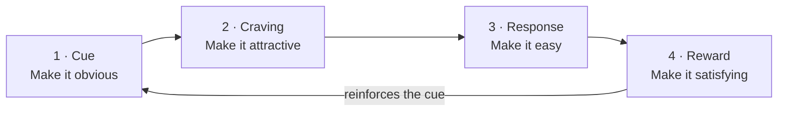

# Day 6 — Forming Habits That Compound

> **The one idea for today:** You don't rise to the level of your goals. You fall to the level of your systems. Set up the system once — then stop relying on motivation.

## What you'll walk away with

By the end of today you should be able to:

1. **Explain** why 1% daily improvement matters more than any single heroic effort.
2. **Apply** the 4-law habit loop to install one new habit and break one old one.
3. **Design** your first "identity-based" habit — one that changes who you are, not just what you do.

---

## 1. Why 1% a day beats heroics

Thirty minutes of daily calling is worth more than one weekend seminar. Daily reading of one chapter is worth more than a binge-watched course. This isn't motivational. It's arithmetic.

- 1% better every day, for 1 year = 37× better.
- 1% worse every day, for 1 year = basically zero.

The compounding is invisible in the first 30 days. That's the dangerous part — the new FCs who quit in Month 1 quit just before the curve starts bending.

**What compounding looks like in practice:**

- Week 1: your first cold-call script is clunky.
- Week 4: you've tweaked the opener 10 times — it flows.
- Week 8: you've refined objection responses — your close rate ticks up.
- Week 20: a marginal tweak in tone of voice lifts your appointment rate 3%.

Nothing dramatic on any given day. Transformative over 20 weeks.

**Where to apply 1% thinking:**
- Your opener and close
- Your SPIN questions
- Your LinkedIn post cadence
- Your dressing/presentation
- Your tone of voice on calls
- Your caption copy on social
- Your CRM note-taking after every meeting
- Your ability to ask for referrals

None of these require inspiration. They require **systems.**

## 2. Systems beat goals

"The purpose of setting a goal is to win the game. The purpose of building a system is to continue playing the game."

A goal is the destination. A system is the vehicle. Most people obsess about the destination and never build the vehicle.

| Goal | System |
|---|---|
| "Hit MDRT this year" | "Block 9–11am every weekday for calls" |
| "Get healthier" | "Walk to work 3 days a week" |
| "Read more" | "20 pages before scrolling each morning" |
| "Be more consistent on social" | "One finance post every Sunday evening" |

Goals are binary (you hit it or you don't). Systems are durable (they keep producing whether you're motivated or not).

**The failure pattern:** setting a goal without a system. Then in Week 3, when motivation drops, there's no scaffolding to fall back on.

## 3. The habit loop — the 4 laws

James Clear's framework gives you a mechanical way to install any habit or kill any bad one.

### To create a good habit

| Law | Principle | Example: daily prospecting calls |
|---|---|---|
| **1. Cue** | Make it obvious | Phone + call list on desk by 8:55am |
| **2. Craving** | Make it attractive | Pair with your favourite coffee |
| **3. Response** | Make it easy | Script already open, first 3 numbers pre-filled |
| **4. Reward** | Make it satisfying | Check a box on a visible tracker after every call |

### To break a bad habit

Invert the same 4 laws.

| Law | Principle | Example: stop doomscrolling |
|---|---|---|
| **1. Cue** | Make it invisible | Phone in drawer, not on desk |
| **2. Craving** | Make it unattractive | Unfollow the accounts that hijack you |
| **3. Response** | Make it difficult | App timer lockout after 15 min |
| **4. Reward** | Make it unsatisfying | Keep a tally of time lost vs reading done |

**The insight:** willpower is not a strategy. Environment design is.

## 4. Identity-based habits

The highest form of habit formation is identity change, not behaviour change.

| Behaviour-based | Identity-based |
|---|---|
| "I'm trying to call 10 prospects a day" | "I'm the kind of FC who prospects daily" |
| "I'm trying to get healthy" | "I'm a healthy person" |
| "I want to read more" | "I'm a reader" |

The difference: when you skip a day on a behaviour goal, you just failed. When you skip a day on an identity goal, you voted against who you are — and your brain notices.

**How to install an identity-based habit:**

1. Decide the type of person you want to be (e.g., "I am a disciplined FC").
2. Prove it with small wins (e.g., 5 calls today counts as a vote).
3. Every completed small action is a vote for your new identity. Collect enough votes and the identity becomes true.

## 5. Success habits for a new FC — the minimum set

Activities × Skills × Knowledge = FYC (first-year commission).

If any factor is zero, the product is zero. You need non-zero effort in all three every week.

| Category | Success habit | Minimum weekly rep |
|---|---|---|
| **Activities** | Planning & prospecting | 5× weekly planning session; 50+ outreach touches |
| **Skills** | Selling (SPIN, closing) | 1× role-play with mentor; 3+ real meetings |
| **Knowledge** | Self-study | 3 hours: products, CPF, markets, objections |

The 10-70-20 rule (industry data):
- 10% are high performers — the system runs itself.
- 70% are average-to-decent — **coaching and habits make the difference.**
- 20% leave within 1–2 years. Usually because they never installed the system.

Which group you end up in is largely decided in the first 60 days.

## 6. Week 1 recap — live session

Recording from the Week 1 recap call. Trimmed to the core content — Leo walks through each day of Week 1 with the team (~63 min).

<video src="https://github.com/leotansingapore/aia-product-compass-hub/releases/download/fastrack-training-1/fastrack-training-1-preview.mp4" controls preload="metadata" style="width: 100%; max-width: 960px; border-radius: 12px; display: block; margin: 1rem auto;"></video>

<strong>Lecture notes — open to follow along with the video</strong>

Click any timestamp to jump the player to that moment.

### [`00:06`](#t=6) — Why we recap before moving on
Leo opens by setting the frame: this next 60 days is structured deliberately, week by week. The recap call exists so you don't drift through Week 1 — you walk into Week 2 having actually internalised the inner game first. Skip the recap and you carry blind spots forward.

### [`01:02`](#t=62) — [Day 1](/learning-track/first-60-days/day/1) · The four high-income skills
What this career actually compounds — human nature, negotiation, money, sales — is exactly what most jobs in Singapore *don't* teach. Leo's frame: in the age of AI, knowledge is cheaper, but these four skills get rarer and more valuable. Treat the next 60 days as skill acquisition, not a job hunt.

### [`04:41`](#t=281) — [Day 1](/learning-track/first-60-days/day/1) · Team values, in plain words
Leo walks the four values: **Own the outcome** (no blaming the market or the leads), **Truth before comfort** (receive feedback without taking it personally), **Better than yesterday** (1% daily growth mindset, not heroics), **Lift the team** (encourage each other, no internal competition). The values are tested every time something goes wrong — they're load-bearing, not decoration.

### [`06:32`](#t=392) — [Day 1](/learning-track/first-60-days/day/1) · The Reconnecting Exercise
Pick three warm contacts this week, share you've started in financial advisory, and just have coffee. Not a pitch — a reconnection. The point is to rebuild warm contact and let your circle see you in your new role. Everything later gets easier when this groundwork is in.

### [`08:02`](#t=482) — [Day 2](/learning-track/first-60-days/day/2) · Why financial planning matters
Leo reframes the meeting: most clients walk in thinking short-term — bills, holidays, the bubble tea today. Real planning is **delayed gratification at scale.** The advisor's job is to flip that switch — long-term first, short-term with what's left, not the other way round.

### [`13:00`](#t=780) — [Day 2](/learning-track/first-60-days/day/2) · The three risk strategies (avoid · retain · transfer)
You can't avoid most permanent risks (death, disability, CI, accidents). You can't retain them either — almost no one has $1–2M lying around. The only honest answer is **transfer:** pay an insurer 5% of income to protect the other 95%. That's the framing every prospect needs to hear before they hear product names.

### [`15:40`](#t=940) — [Day 2](/learning-track/first-60-days/day/2) · How much coverage is enough
Rule-of-thumb refresher: 10× annual income for death/TPD, 5× for major CI, 2–3× for early CI, max private/government for hospitalisation. Numbers exist so you can sanity-check a proposal in 10 seconds — not so you can recite them at the prospect.

### [`18:02`](#t=1082) — [Day 2](/learning-track/first-60-days/day/2) · When to buy — the cost of waiting
The "I'll buy later" trap. Premiums get 50–100% more expensive after the mid-30s, *and* insurability becomes a coin flip after one diagnosis. Leo's reframe for clients: insurance is the only product where buying when you don't need it is the only time you can buy it.

### [`21:02`](#t=1262) — [Day 2](/learning-track/first-60-days/day/2) · The three-layer pyramid
Layer 1 = Risk Management (foundation), Layer 2 = Wealth Accumulation, Layer 3 = Wealth Preservation. Built bottom-up, not skipped. A client who jumps straight to investments without protection is building a house on sand.

### [`21:33`](#t=1293) — [Day 3](/learning-track/first-60-days/day/3) · The four assurances of this career
Autonomy (with the responsibility that comes with it), Development (skills + maturity, not just income), Security (renewal income compounds), Fulfillment (the work matters). Leo emphasises the catch on autonomy — flexibility without discipline turns into drift.

### [`33:32`](#t=2012) — [Day 4](/learning-track/first-60-days/day/4) · Growth vs fixed mindset
Fixed mindset on rejection: "I'm not cut out for this." Growth mindset: "What can I learn from that 'no'?" The second one is the only mindset that survives Year 1. Leo's daily test: when a meeting goes badly, what was the *one* thing you can adjust for the next rep?

### [`42:55`](#t=2575) — [Day 5](/learning-track/first-60-days/day/5) · Purpose-driven life
Why are you here, beyond the income? Leo's bar: **moral compass first.** If your friends and family wouldn't recommend you to their family, you've drifted. Reconnect with people, share what you're doing, and let your conviction (not a script) do the pre-framing.

### [`51:32`](#t=3092) — Day 6 (today) · 1%, systems, and habit loops
Where today's lesson started. 1% better daily for a year = 37× better. 1% worse = basically zero. Pair that arithmetic with the 4-law habit loop and identity-based habits, and you build the operator before the operator has to perform.

### [`60:46`](#t=3646) — Wrap-up · How Week 1 fits together
Leo closes by tying the week into one shape: vision and mission → why financial planning matters → the four assurances → mindset → purpose → habits. Each day was a layer. Week 2 builds on this — industry context and the freedom-business frame.

## Quick quiz

1. **What's the relationship between goals and systems?**
 - A) Goals are for beginners, systems are for advanced
 - B) Goals set the destination, systems are the vehicle ✓
 - C) Systems replace goals entirely
 - D) Goals beat systems in the long run

 **Why:** Day 6 uses this exact framing: the goal is the destination, the system is the vehicle. Most people obsess about the destination and never build the vehicle, which is why motivation fades in Week 3. A introduces a skill-level distinction that the content does not make. C overstates the argument — Day 6 says systems are the mechanism to reach goals, not a substitute for having them. D reverses the lesson entirely.

2. **The 4 laws for creating a good habit, in order:**
 - A) Cue, Response, Craving, Reward
 - B) Cue, Craving, Response, Reward ✓
 - C) Craving, Cue, Reward, Response
 - D) Reward, Cue, Craving, Response

 **Why:** James Clear's framework as presented in Day 6 runs in strict sequence: the cue triggers a craving, which motivates a response, which produces a reward that reinforces the cue. A skips the craving step, jumping straight to action. C and D both start in the wrong place — a habit loop must begin with a cue (the observable trigger), not a craving or reward.

3. **What does the 10-70-20 rule say about who makes it in this career?**
 - A) 10% make MDRT, 70% make COT, 20% make TOT
 - B) 10% are top performers, 70% need coaching, 20% leave within 1–2 years ✓
 - C) Top 10% earn 70% of income; 20% earn nothing
 - D) 10% have natural talent; 70% need years to develop; 20% can be taught in weeks

 **Why:** Day 6 states the 10-70-20 split as industry data: top 10% self-sustain, the middle 70% are where coaching and habits make the difference, and 20% leave within 1-2 years — usually because they never installed a system. A, C, and D apply completely different interpretations to the same numbers and none of them appear in the content.

4. **An FC sets a goal to "make 10 calls a day" but has no system in place. By Week 3, motivation fades and call count drops. What does Day 6 say was the real failure?**
 - A) The goal was too ambitious for a new FC
 - B) She needed external accountability, not self-discipline
 - C) She built a goal without a system — no scaffolding to fall back on when motivation dropped ✓
 - D) 10 calls per day is only sustainable for top 10% performers

 **Why:** Day 6 names this failure pattern explicitly: "setting a goal without a system — then in Week 3, when motivation drops, there's no scaffolding to fall back on." The fix is not a different goal or external accountability — it is building the system (blocked time, script ready, list pre-loaded) so the habit runs whether motivation is present or not. A and D second-guess the goal rather than diagnosing the missing system. B introduces external accountability as the solution, which Day 6 does not recommend.

5. **You want to break the habit of checking your phone first thing in the morning. According to the 4-law inversion, which action targets the Cue?**
 - A) Remind yourself of time wasted each time you scroll
 - B) Set a 15-minute app lockout
 - C) Leave the phone in a different room overnight ✓
 - D) Replace scrolling with a 5-minute journaling habit

 **Why:** To break a bad habit, Law 1 (Cue) says "make it invisible" — removing the phone from the room eliminates the cue entirely before the craving can form. A targets the Reward (making it unsatisfying). B targets the Response (making it difficult). D replaces the habit rather than inverting the cue, which is a habit-installation strategy, not a habit-breaking one.

6. **"I am the kind of FC who prospects every day" is an example of identity-based habit formation. Why is this more durable than "I want to make 10 calls a day"?**
 - A) Identity-based goals have clearer metrics
 - B) Skipping a day violates who you say you are, not just a number — the brain notices ✓
 - C) Identity-based habits require less time to install
 - D) Daily numerical goals create anxiety that undermines performance

 **Why:** Day 6 explains that when you skip a day on a behaviour goal you simply failed a number, but when you skip on an identity goal you voted against who you are — the brain registers the inconsistency as a self-concept threat, which is a stronger motivational force. A is wrong: identity-based habits have less precise short-term metrics, not more. C is not claimed in the content. D may be a real psychological phenomenon but it is not the reason Day 6 gives for the durability advantage.

7. **According to the FYC formula (Activities x Skills x Knowledge), an FC who is making plenty of calls but never studies products or practises SPIN will:**
 - A) Still perform adequately — activity volume compensates for skill gaps
 - B) Hit a ceiling quickly once prospects ask detailed product questions ✓
 - C) Succeed in early months but plateau only after Year 2
 - D) Be coached to balance this automatically by their mentor

 **Why:** The FYC formula is multiplicative — if Skills or Knowledge is near zero, the whole product approaches zero regardless of Activity volume. An FC who cannot answer product questions or run a SPIN conversation will lose appointments the moment conversations go past opener stage. A misreads multiplication as addition. C gives an overly generous timeline — the ceiling appears as soon as real product conversations begin. D assumes mentor intervention is automatic; Day 6 places responsibility on the FC to build all three factors.

---

## Related

- Previous: [[day-05|Day 5 — Purpose-Driven Life]]
- Next: [[day-07|Day 7 — The Insurance Industry & AIA Singapore]]
- Week 1 summary: [[README|Week 1 — Foundation & Identity Shift]]
