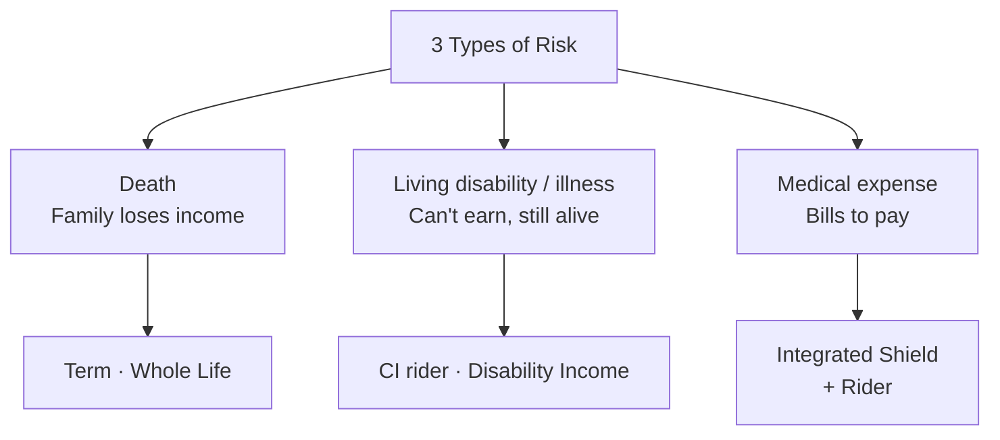
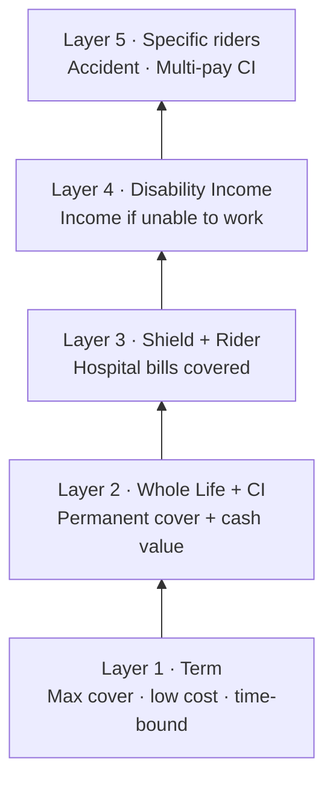

# Day 56 — AIA Solutions: Protection & Living Benefits

> **The one idea for today:** Wealth plans (Day 55) are about accumulation. Today is about the other half — the protection plans that make accumulation possible. Term, critical illness, hospital, accident, and disability coverage. Most clients have weaknesses here. Your job is to diagnose and close the gaps without scare-selling.

> **🎥 Watch the live training:** **[Module 2 — Risk Management Products Overview (David)](https://youtu.be/y12lyQRhay0)**. The full live walk-through of every protection plan in the AIA stack, organised by Cash Value vs No Cash Value, with the "products are like medicine — you are the financial doctor" framing. Also available in this day's **Video** tab.

## 0. Live training reference — the AIA protection product map

Memorise this map. It's the schematic David uses in Module 2 to navigate the entire risk-management catalogue without looking anything up.

### Plans **with** Cash Value (Death & Disability)

| Plan | Type | Notes |
|---|---|---|
| **Pro Lifetime Protector (PLP)** | Investment-Linked Policy | Living-benefits ILP variant |
| **Guarantee Protect Plus (GPP)** | Limited-pay whole life participating | **Cornerstone plan** — most-recommended |
| **Life Dividends** | 10-pay life with coupons | Niche use cases |

### Plans **with no** Cash Value

| Plan | Type | Notes |
|---|---|---|
| **Secure Flexi Term (SFT)** | Customisable term | Flexible structuring |
| **FaceTerm** | Versatile term | Covered in Module 2 |
| **Enhanced Critical Protector (ECP)** | Standalone cancer cover | Cancer-specific |
| **Ultimate Critical Cover (UCC)** | Multi-claim CI | Recurring CI events |

### Standalone CI

- **UCC** and **ASC (Absolute Critical Cover)** — the two main standalone CI options
- ASC has both cash-value and no-cash-value variants; covers relapse, benign tumours, multi-claim with waiting periods

### A&H — Accident & Health (no cash value)

Solidaire, Platinum Accident Care, Stork Protector (children), Hospital Income, HCC Cash Protector.

> **The "fries and Coke" rule:** A&H is the side order to the GPP/PLP "burger." Low cost (~$50/month max), always packaged in. Don't propose without it.

### Disability Income

- **Premier Disability Cover (PDC)** — not common, but a few advisors believe in it strongly. Worth knowing for the right client profile.

### "Products are like medicine" — the core mindset

> No product is inherently bad. **You are the financial doctor.** You prescribe the right product based on the client's financial situation, life goals, and budget. Mastery is matching the right product to the right client profile — built up over hundreds of cases.

## 0a. Coverage benchmarks (the version Module 2 uses)

For a worked example of an $8,500/month income earner ($102K/year):

| Coverage | Guideline | Example ($102K/year income) |
|---|---|---|
| **Premature Death / TPD** | 10× gross annual income + major liabilities | $1M + $400K mortgage = **$1.4M** |
| **Critical Illness** | 3–5× annual income + **$100K buffer** | **$300K–$500K** |
| **Accident** | 5× annual income | **$500K** |
| **Hospitalisation** | Based on ward preference | Private vs subsidised |

**Why the death-coverage benchmark exists:** ensure the family's financial situation remains *unchanged* — house not sold, no downgrade, spouse receives ~10 years of income replacement.

**TPD** is typically tacked onto death coverage at **75% of the sum assured**.

The $100K buffer on CI specifically funds **cancer drug treatments not covered by the hospital plan** (one vial can cost ~$10K per dose). The 3–5× income covers the recovery period when the client can't work — so the total benchmark is "$100K + 3-5× income" or equivalently "$200–400K or 5× income," which is the same coverage in two different framings.

## 0b. Product deep-dive — GPP (Guarantee Protect Plus)

The cornerstone whole-life par plan. Pays into the par fund, returns 7/8 of bonuses to policyholders. Limited-pay (15/20/25 years), covered for life. **Has cash value.**

### The multiplier mechanism (the part most new FCs misexplain)

Base sum × multiplier = total coverage **until the drop-off age (65 or 75)**. After drop-off, sum reverts to the base, but client is covered for life (premium fully paid by then).

| Multiplier | Base sum (for $500K total) | Drop-off options |
|---|---|---|
| **5×** | $100K × 5 | 65 or 75 |
| **3×** | ~$166K × 3 | 65 or 75 |
| **2×** | $250K × 2 | 65 or 75 |

Why 65? Typical retirement age — income protection need reduces. Why 75? For clients who want extended cover; by 75, dependents should be independent.

### The closing technique that converts (3× → 2× upgrade)

Worked example, 30M non-smoker, $500K cover:

| Multiplier | Annual premium | Cash value at age 70 |
|---|---|---|
| **3×** | ~$7,300 | ~$149K |
| **2×** | ~$8,900 | **~$424K** |

Always present 3× first. Then run the 2× comparison out loud:

> *"For just $1,600 more per year — $32K extra over 20 years — your cash value at 70 jumps from $149K to $424K. That's $275K more cash value for $32K more premium. And the sum drop at 65 is much less severe. Would that make sense for you?"*

The framing of *"$1,600 more for $275K more"* converts dramatically more than presenting the two options side by side cold.

### Premium tenure rule

| Client age | Recommended pay term | Why |
|---|---|---|
| **20s–30s** | 20 years | Better return than 25-year; finished by 50s |
| **40s** | 15 years | Finished by late 50s; 25-year pay doesn't make sense at 43 |

**Shorter tenure = better rate of return** for the same total premium.

### The yield reality (be honest with clients)

GPP at age 65, with par fund earning 4.25%, yields **~2.15%** to the policyholder. That's savings/fixed-deposit territory — *not* endowment-level (3.5–3.8%) or ILP-level (7–8%).

> **GPP is a protection product with savings — not a savings product.** Mis-position it as a savings product and you'll lose the case to a comparison-shopper.

### Three ways to use GPP at maturity

1. **Surrender at 65** — cash out the surrender value (e.g., $122K on $77K paid = profit)
2. **Income drawdown (tail-end annuity)** — don't surrender; draw down over 10 years (ages 65–75). GPP becomes annuity-like.
3. **Keep for legacy** — wealthy client doesn't need cash. Keep it growing. At 80, sum could be ~$353K passing to nominees.

### Life Stages benefit

At qualifying milestones (marriage, child, mortgage), client can increase sum assured by **+$100K without medical underwriting**. Use this as a "future-proofing" pitch.

### CI riders on GPP

- **CPL (Critical Payment of Lump Sum)** — 42 major CIs, **non-participating, no cash value** (state this clearly)
- **Early Critical Protector (ECP)** — early-stage conditions (carcinoma in situ, stage 0–1 cancers)
- **Waiver rider** — waives premiums on CI / early CI diagnosis
- **Payer benefit** (child policies) — waives premium if policy owner / parent gets CI

## 0c. Product deep-dive — SFT (Secure Flex Term)

Pure term insurance — no cash value, nothing back if nothing happens. **Covers death, TPD, terminal illness** (including terminal cancer, first-in-market at launch). Premium guaranteed and locked in. Convertible without medical underwriting. Vitality-discounted (up to 15%).

### Renewable vs Level Term

| Type | How it works | Notes |
|---|---|---|
| **Level** | Fixed premium for entire chosen end-age (e.g. age 30 → 65) | Predictable — covers a 35-year period at one rate |
| **Renewable** | Fixed premium for chosen tenure (5/10/20/30 yrs), renewable after | Premium increases at each renewal — eventually prohibitively expensive |

### SFT pricing example (30M non-smoker, $1M death)

| Coverage period | Annual premium |
|---|---|
| Level term to 65 | **$882** |
| Level term to 75 | $1,403 |
| 30-year renewable | $749 |

> **The sales line:** *"For less than an Anytime Fitness gym membership, AIA guarantees your family $1 million if anything happens to you before retirement."*

### Adding CI to SFT

- **Major CI ($250K) to age 65:** total premium ~$1,500/year ($1M death + $250K CI)
- **CI rider is accelerated** — CI payout reduces death benefit (claim $250K CI → death drops to $750K)
- **Early CI ($100K)** can be added on 5/10/20/30-year tenures BUT *not* on level term to 65/75 (limitation — know this when proposing)

### Handling "what if I outlive the term?"

> *"You're right — at 65 if nothing happens, you get nothing back. That's term insurance. The reason it costs $882 instead of $7,000 is precisely because it's pure protection. The trade is real. We can extend to 75 for $1,403 if outliving the term concerns you. Your call."*

Don't argue with the math. Show the cost difference and let them decide.

## 0d. Product deep-dive — UCC (Ultimate Critical Cover)

Multi-claim standalone CI plan. **No death benefit** (only 5% of sum on death). Covers **150 conditions**. The reset benefit is the killer feature.

### The unlimited reset benefit (this is the hook)

For a $100K UCC policy:

1. Coronary artery bypass surgery → claim **$100K**
2. 1-year waiting period → early-stage cancer → claim **$100K**
3. 1-year waiting period → pulmonary hypertension → claim **$100K**
4. ...up to 5 different conditions → max payout **5 × $100K = $500K**

This is the "I had a heart attack, now I'm scared of cancer too" answer. Single-claim CI plans don't address it. UCC does.

### Enhancer rider (most clients add this)

Two benefits stack on top of the base:

- **Catastrophic CI Benefit (200% payout)** — for the 5 most common CIs (cancer, stroke, heart attack, organ transplant, paralysis) IF they meet the catastrophic definition (e.g. Stage 4 cancer with distance metastasis). $200K base → $400K payout.
- **Ultimate Relapse Benefit** — additional 100% after relapse on the 5 most common conditions, capped at **50% per claim**, 2-year waiting period. (ASC pays 100% per relapse claim — that's the key ASC differentiator.)

### UCC pricing (30M non-smoker, $100K)

| Coverage period | Annual premium |
|---|---|
| To age 65 | $874 |
| To age 75 | $1,436 |

### How UCC fits into a package

UCC is *not* a standalone protection. It's a complement:

- **GPP $200–300K (with CI rider) + UCC $100K** = comprehensive multi-claim CI at affordable premiums
- **SFT (high sum, low cost) + UCC** = max death + multi-claim CI, lowest total premium

## 0e. Product deep-dive — PLP (Pro Lifetime Protector)

Investment-linked policy (ILP). **You** choose the funds. You bear investment responsibility. Hybrid of insurance + investment.

### Death benefit structure

| Option | How it works | Trade-off |
|---|---|---|
| **Max** (most common) | Pays the **higher of** sum assured OR cash value | As investment grows, *net insurance* coverage shrinks → mortality cost decreases |
| **Plus** | Pays sum assured **PLUS** policy value | Higher payout, but mortality cost stays high throughout |

### PLP illustration (30M non-smoker, $300K Max, ~$600/month)

- At 8% fund return, investment value at 65: **~$817K**
- Total premiums paid: ~$252K → **3.25× return**
- Tipping point (~age 53–54): investment value exceeds sum assured → plan effectively becomes a pure investment

### Critical advisor note

Don't hold coverage to age 100 — **mortality costs escalate dramatically at older ages**. Strategically reduce or remove coverage at age 55–65 once accumulated cash value is sufficient. The longer you keep coverage past the tipping point, the lower your effective return.

## 0f. The packaging strategy — how a real recommendation looks

For a 30M, $8.5K/month income, $1M death need, $500K CI need:

| Product | Coverage | Purpose | ~Annual premium |
|---|---|---|---|
| **GPP** (2× or 3× multiplier) | $300–500K death + CI rider | Foundation — whole life with cash value | $7,000–$9,000 |
| **SFT** (level term to 65) | $500–700K death + $250K CI | Top up death cover affordably | $1,500–$2,000 |
| **UCC** (to 65 or 75) | $100–200K multi-claim CI | Multi-claim CI protection | $900–$1,500 |
| **A&H** (Solidaire / PAC) | Accident cover | Outpatient, TCM, dismemberment | ~$50/month |
| **HealthShield Gold Max A + riders** | Private hospitalisation | Medical expenses | Medisave-payable |

The package layers together: GPP as the cornerstone, SFT for cheap death-coverage top-up, UCC for multi-claim CI, A&H for outpatient, HealthShield for hospitalisation. **Never propose without all five categories represented** — the gap on the missing category becomes the comparison shop.

## 0g. Cancer + medical inflation — the sales statistics worth memorising

| Statistic | Use it for |
|---|---|
| Cancer = **73% of all CI claims** in Singapore | Justifying CI coverage |
| **1 in 4–5** Singaporeans get cancer by age 75 | Personalising the risk |
| Late-stage cancer treatment: **$100K+** (oral medications drive cost) | Justifying the $100K CI buffer |
| Medical inflation: **~10% YoY** | Justifying coverage upgrades over time |
| Govt MediShield Life premium for 51–60 cohort: rose from $630 → $903 (+43.3%) | Showing even govt insurance increases — private will too |
| 5-year cancer survival: Stage 1 ~85% / Stage 2 ~77% / Stage 3 ~50% / **Stage 4 ~18.6%** | Both arguments — early detection saves lives, late-stage = income loss |

## 0g1. MediShield Life — what every Singaporean already has

Before you sell any private hospitalisation upgrade, the client needs to understand what their baseline already is. MediShield Life is the **government base plan** — every Singapore Citizen and PR is automatically covered.

### The basic coverage

| Item | Limit |
|---|---|
| Ward fee | $830/day |
| ICU | $5,000/day |
| Surgical procedures | Table 1–7 (max ~$3,900 for the most complex) |
| Cancer drug treatment | Subject to Cancer Drug List (CDL) limits |
| **Deductible** | $2,000 (for B2 ward and above, age 80 and below) |
| **Co-insurance** | 3–10% after the deductible |

### How deductible + co-insurance actually work

Worked example, $20K hospital bill on plain MediShield Life:

1. Minus **$2,000 deductible** (you pay)
2. Remaining $18,000 → **co-insurance ~10% (~$1,800 you pay)**
3. MediShield Life covers the rest (~$16,200)
4. **Out-of-pocket: ~$3,800**

That $3,800 hits even a healthy 35-year-old with a $20K bill. The point of an Integrated Shield Plan (and the Vital Health rider) is to absorb most of that out-of-pocket exposure.

## 0g2. HealthShield Gold Max — AIA's Integrated Shield Plan

### Three plan tiers

| Plan | Hospital type | Position |
|---|---|---|
| **Max A** | Private hospital | Highest coverage, as-charged basis |
| **Max B** | Government hospital (A ward) | Mid-tier |
| **B Lite** | Government hospital (B ward & below) | Budget option |

### Vital Health riders (the as-charged co-pay caps)

| Rider | What it covers | Co-payment | Cap |
|---|---|---|---|
| **Vital Health A** | Deductible + co-insurance | 5% | **$3,000** |
| **Vital Health A Value** | Co-insurance only (not deductible) | 10% | $6,000 |
| **Vital Health B** | Deductible + co-insurance (govt) | 5% | Government bills |

### The Deductible Waiver Pass — easy to misexplain

- **First claim:** Only 5% co-payment (no deductible if Vital Health A is attached)
- **Second claim within 3 policy years:** 5% co-payment **+ $2K deductible** (the waiver runs out)
- **If next claim is 4+ years later:** Deductible **resets** — back to 5% only

Tell the client up front. Surprised clients at claim time become disengaged clients at renewal.

### Cancer Drug Coverage — the CDL multipliers (this is the killer feature)

MOH maintains a **Cancer Drug List (CDL)** with approved drugs and a monthly claim limit per drug. MediShield Life pays only **1× the CDL limit**. AIA layers on top:

| Layer | CDL multiplier | Monthly cap |
|---|---|---|
| MediShield Life (base) | **1×** | e.g. $2K (varies by drug) |
| HealthShield Max A (base) | + **5×** | $10K |
| Cancer Care Booster rider | + **16×** | $32K |
| **Full package total** | **21×** | **~$42K/month** |

For **non-CDL drugs** (newer drugs not yet on the approved list): up to **$200K/year** with 10% co-insurance under the Booster rider.

For **cancer drug services** (scans, tests): Base 5× + Booster 10× = **15× total**.

### Other HealthShield benefits worth naming

- **Pre & post-hospitalisation:** 13 months coverage
- **Panel of quality healthcare partners** — searchable by specialty
- **Pre-authorisation (Letter of Guarantee):** inform AIA before surgery → get approval beforehand → no out-of-pocket scramble at admission
- **Vitality discount** on Vital Health rider premiums
- Covers: pregnancy complications, congenital abnormalities (child), organ donation/transplant, psychiatric treatment (limited), radiotherapy

### How to position HealthShield against MediShield Life

Don't attack MediShield. Just show the gap:

> *"MediShield Life is great as a baseline. The issue is one specific scenario — late-stage cancer drug treatment. MediShield pays 1× the CDL limit, maybe $2K/month. A typical late-stage cancer drug regime can run $20K–$40K/month. That's a gap of $18K–$38K every month, for years. The point of HealthShield Max A + the Cancer Care Booster is specifically to close that gap."*

That's a use-specific argument, not a "your government plan is bad" argument. Wins more conversions, breaks no relationships.

## 0h. The budget psychology — the line that doubles every case

> *"Whatever budget your client gives you, they can comfortably afford **double** without feeling uncomfortable."*

Asian / Singaporean clients are conservative when first asked. A client who says $500/month can usually afford $1,000. **It's not about squeezing commission** — it's about showing them more value so they naturally stretch.

The mechanism: use multiplier comparisons (3× vs 2× → "$1,600 more for $275K more cash value") to make the upgrade feel obvious. They stretch when the value is undeniable.

## What you'll walk away with

By the end of today you should be able to:

1. **Differentiate** the main protection plan types and their primary use cases.
2. **Identify** which protection product solves which client need.
3. **Recommend** a minimum protection portfolio for a typical client.

---

## 1. The 3 types of "bad thing happens" protection

Every client faces three categories of risk that require insurance:

1. **Death** — they stop existing. Family needs income replacement.
2. **Living disability / illness** — they exist but can't earn. They need income replacement + medical coverage.
3. **Medical expense** — bills for treatment. They need bill-coverage.

Each category maps to specific AIA product types.



## 2. Term Insurance — the affordability workhorse

**What it is:** pure protection, no cash value, fixed term (e.g., 20 or 30 years).

**Premium profile:** low — a young client can insure $1M for roughly $50–80/month.

### Key uses

- **Mortgage protection** — covers the outstanding mortgage if the borrower dies.
- **Income replacement (temporary)** — covers family needs during the earning years.
- **Supplementary CI coverage** at low cost.
- **Short-term high-coverage needs** — e.g., new parents needing $1M+ coverage but on tight budgets.

### The trade-offs

**Pros:** cheap, high leverage, simple.

**Cons:**
- No cash value — you pay premiums and if nothing happens, you don't get money back.
- Coverage ends at term-end — if you want to continue, you reapply (at an older age, potentially higher cost or not insurable).
- **"Lose it if you don't use it"** — some clients resist this emotionally.

### When to recommend

Always consider term when:
- Client has a time-bound need (mortgage, kids until independence).
- Client wants maximum coverage at minimum premium.
- Client is young with limited budget.
- Client's other wealth plans already provide cash value.

## 3. Whole Life with Critical Illness — the protection core

**What it is:** lifelong life insurance + optional CI coverage riders.

**Premium profile:** 5–10× the cost of term for similar coverage, but coverage is permanent and builds cash value.

### Key CI rider types

| Rider | Covers |
|---|---|
| **Major CI rider** | Major critical illnesses (heart attack, stroke, cancer at advanced stages, etc.) |
| **Early CI rider** | Earlier stages of the same illnesses, before they become major |
| **Multi-pay CI rider** | Multiple payouts if CI recurs (e.g., second cancer diagnosis) |
| **Multiplier rider** | Coverage multiplied during working years when the risk exposure is highest |

### The standard rules of thumb

- **Major CI cover:** 5× annual income.
- **Early CI cover:** 2× annual income.
- **Death cover:** 10× annual income.

### When to recommend

Always for:
- Clients without existing CI coverage.
- Clients with family history of cancer, heart disease, or stroke.
- Clients with dependents (partner, kids, parents).
- Clients with financial exposure (mortgage, business loans, kids' education).

## 4. Accident & Health — the medical layer

**Purpose:** covers treatment bills and hospital stays, separate from CI (CI pays a lump sum; A&H pays bills).

### Main plan types

| Plan type | What it covers |
|---|---|
| **Hospital Plan (Integrated Shield Plan)** | Hospitalisation expenses; upgrades CPF MediShield Life to private / restructured hospital tiers |
| **Rider on hospital plan** | Covers the deductible + co-insurance, so client pays near zero out of pocket |
| **Daily hospital income** | Cash payout per day in hospital (for income replacement while recovering) |
| **Accident-only plans** | Outpatient treatment for accidents; often includes children-specific plans |
| **Cancer-specific plans** | Multi-stage cancer cover |
| **Overseas hospital cover** | Treatment coverage outside Singapore |

### The priority for most clients

1. **Integrated Shield Plan + rider** — this is the baseline. Every client should have this.
2. **Accident plan** (optional) — for clients with active lifestyles, kids, or motorcycles.
3. **Specialised plans** (cancer, overseas) — only for specific client needs.

### The big client trap

Many clients assume **company hospital benefits** are enough. They're not:

- Company plans end when employment ends.
- Coverage levels are often inadequate for private treatment.
- Once left, reapplying for personal coverage at an older age → higher premiums, possible exclusions.

**Rule:** recommend personal hospital coverage that's portable and independent of employment. Always.

## 5. Disability Income — the forgotten protection

**Purpose:** replace income if the insured can't work due to disability or extended illness.

**How it works:**
- Monthly payout (not lump sum) for a defined period or until retirement age.
- Based on "occupational disability" — inability to perform suitable work given training/experience.

### Why it's often overlooked

- Less famous than CI or life insurance.
- Most clients assume CI covers this — it doesn't fully.
- CI pays a lump sum on diagnosis; Disability Income pays **continued monthly income** for extended inability to work.

### When to recommend

- **Always consider for sole breadwinners.** Especially self-employed, contractors, freelancers.
- For clients whose income stops when they stop working (no sick leave, no employer coverage).
- For clients in physically demanding or accident-prone work.

### Typical gap

Most clients have zero disability income coverage. It's a stealth-priority product most FCs forget to recommend.

## 6. The minimum protection portfolio

For a typical 30–45 year old client with dependents, the **minimum protection portfolio** looks like:

| Need | Product | Typical amount/type |
|---|---|---|
| Income replacement at death | Term or Whole Life | 10× annual income |
| Critical Illness | CI rider or standalone | 5× annual income (Major) + 2× (Early) |
| Hospital costs | Integrated Shield + Rider | Private or restructured tier |
| Income if disabled | Disability Income | 60–70% of income |
| Daily hospital income | Hospital income rider | $200–$500/day |

**Typical all-in premium:** $400–$1,000/month depending on age, health, coverage amounts.

**Most clients have 1–3 of these 5 — usually 1 Whole Life from their parents' time + some CI + company hospital.** Your job is to close the gaps without overloading them.

## 7. Living benefits — the newer trend

Traditional protection paid out mainly at death. Modern plans emphasise **living benefits**:

- **CI riders** that pay while you're alive and needing treatment.
- **Disability income** that supports during long-term illness.
- **Multi-pay CI** for multiple claims during life.
- **Cancer-specific plans** with multiple payout stages.
- **Wellness incentives** — rewards for healthy behaviours that reduce premium.

**The client framing:**

> "Insurance used to be mainly about death — paying your family after you're gone. Modern plans are heavily about **living benefits** — paying you while you're alive and dealing with illness or disability. This is where the real value often sits for someone in their 30s and 40s."

## 8. The "layered protection" philosophy

No single product covers everything. A well-structured client has **layered** protection:

```
Layer 1: Term (high coverage, time-bound)     — massive coverage at low cost during high-need years
Layer 2: Whole Life (permanent baseline)        — lifelong protection + cash value + CI rider
Layer 3: Integrated Shield + Rider              — hospital bills covered
Layer 4: Disability Income                      — income continues if you can't work
Layer 5: Specific riders (accident, multi-pay CI) — for specific exposures
```



**Total coverage can reach 20–30× annual income, with CI + hospital + disability all covered.** Client cost: typically $500–$1,500/month for a family breadwinner.

This is the "fully loaded" baseline. Year 1 might cover 2–3 layers. Over time, layers get added as income grows and life stages change.


## Quick quiz

1. **The standard Death / TPD coverage rule of thumb is:**
   - A) 5× annual income
   - B) 10× annual income ✓
   - C) 20× annual income
   - D) $1M

 **Why:** 10x annual income is the benchmark for Death/TPD because it gives dependants enough capital to replace the breadwinner's income stream for roughly a decade while they adjust their finances. 5x (A) is the target for Major CI coverage, not death cover. 20x (C) would over-insure most clients and is prohibitively expensive. A flat $1M (D) ignores income entirely — $1M is too little for a high earner and potentially excessive for someone earning $40K/year.

2. **Why is Disability Income often overlooked?**
   - A) It's expensive
   - B) Clients assume CI covers this — but CI is a lump sum, not continuing income ✓
   - C) It's hard to qualify for
   - D) It's not available in Singapore

 **Why:** CI pays a one-off lump sum when a critical illness is diagnosed, which may be spent quickly on treatment or debt clearance; it does not replace the steady monthly income a disabled person needs for years. Most clients conflate the two products and assume they are covered. Disability Income is not particularly expensive compared to CI riders (A). It is available in Singapore (D). Qualification (C) is no harder than other protection products.

3. **The biggest risk of relying on company hospital coverage is:**
   - A) Low coverage limits
   - B) Coverage ends with employment, and reapplying at older age may mean higher premiums or exclusions ✓
   - C) Poor claims service
   - D) Restricted hospital choice

 **Why:** Company hospital plans are tied to the employment contract — they lapse the moment the client resigns, is retrenched, or retires. Reapplying for personal coverage years later means the client is older, potentially has pre-existing conditions recorded, and faces higher premiums or specific exclusions. Low limits (A) and hospital choice (D) are real inconveniences but are secondary to the portability problem. Claims service (C) varies by insurer, not by group versus individual plan type.

4. **A client is diagnosed with cancer and survives. Two years later, a second cancer is diagnosed. Which CI rider type pays out on the second claim?**
   - A) Major CI rider — covers all major illnesses
   - B) Early CI rider — catches illnesses at earlier stages
   - C) Multiplier rider — doubles coverage during working years
   - D) Multi-pay CI rider — designed for multiple payouts including recurrence ✓

 **Why:** A standard Major CI rider (A) typically pays out once per policy, which means the first cancer claim exhausts the benefit and the second claim receives nothing. The Multi-pay CI rider is specifically structured to allow multiple payouts — including recurrence of the same illness after a qualifying survival period. Early CI (B) pays at pre-major stages, not on recurrence. The Multiplier rider (C) increases the payout amount during working years but does not enable a second separate claim.

5. **A freelance graphic designer with no employer sick leave asks what insurance is most often overlooked for people like her. What do you recommend addressing?**
   - A) Term insurance — cheapest coverage for her age
   - B) Disability Income — replaces monthly income if she cannot work, which has no employer fallback ✓
   - C) Hospital rider — reduces out-of-pocket claims cost
   - D) Universal Life — high leverage for legacy planning

 **Why:** Disability Income is the stealth-priority product most FCs forget, and it is critical for the self-employed because there is no employer sick pay or group disability scheme to fall back on. A freelancer who cannot work for 6 months due to illness or injury faces total income loss — exactly what Disability Income is designed to cover. Term (A) addresses death cover, not income during disability. Hospital rider (C) reduces out-of-pocket medical bills but does not replace lost income. Universal Life (D) is a legacy tool for HNW clients, not a priority for a freelancer's income protection.

6. **Using the "layered protection" model, which layer should typically be established first for a 32-year-old breadwinner with two young children?**
   - A) Layer 5 — accident and multi-pay CI riders
   - B) Layer 4 — Disability Income plan
   - C) Layer 1 — Term insurance for maximum coverage during the highest-need years ✓
   - D) Layer 3 — Integrated Shield Plan upgrade

 **Why:** Layer 1 (Term) is the foundation precisely because it delivers the largest death/TPD coverage at the lowest cost — the right starting point for a young breadwinner whose family needs maximum income-replacement protection and who likely has limited premium budget. Specialised riders (A) at Layer 5 add refinement to an already-built base, not the base itself. Disability Income (B) and the hospital upgrade (D) are important but are built on top of the fundamental life-cover floor, not before it.

7. **A client says: "I already have CI coverage from my whole life plan — do I really need an Early CI rider too?" What is the accurate response?**
   - A) No — if Major CI is covered, Early CI is redundant
   - B) Yes — Early CI pays at diagnosis of pre-major stages, when treatment costs are highest and a Major CI rider would not yet pay out ✓
   - C) It depends on the insurer — some whole life plans include early stage coverage by default
   - D) Early CI is mainly for clients over 50

 **Why:** Major CI riders only trigger at advanced or late-stage illness diagnosis — by that point the client has often already incurred substantial treatment costs at the earlier stages with no payout. Early CI fills exactly that gap, paying out when an illness is first detected at a pre-major stage so the client has cash while treatment is most intensive. A is incorrect because the two riders cover different stages of the same illnesses, not the same events. C misrepresents standard whole life policy design; basic CI riders almost never include early-stage coverage without an explicit rider. D is wrong — Early CI is most valuable for clients in their 30s and 40s when the probability of early-stage detection is high and the financial impact is severe.

---

## Related

- Previous: [[day-55|Day 55 — AIA Solutions: Wealth Products]]
- Next: [[day-57|Day 57 — Investment-Linked Plans]]
