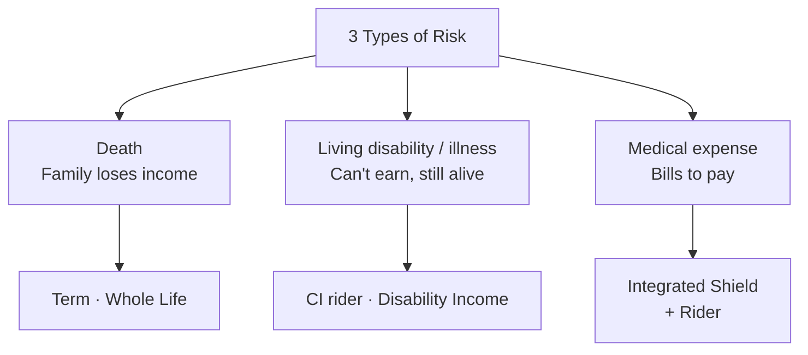
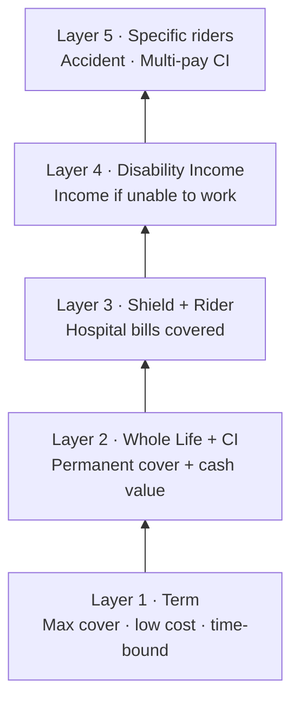

# Day 56 — AIA Solutions: Protection & Living Benefits

> **The one idea for today:** Wealth plans (Day 55) are about accumulation. Today is about the other half — the protection plans that make accumulation possible. Term, critical illness, hospital, accident, and disability coverage. Most clients have weaknesses here. Your job is to diagnose and close the gaps without scare-selling.

## What you'll walk away with

By the end of today you should be able to:

1. **Differentiate** the main protection plan types and their primary use cases.
2. **Identify** which protection product solves which client need.
3. **Recommend** a minimum protection portfolio for a typical client.

---

## 1. The 3 types of "bad thing happens" protection

Every client faces three categories of risk that require insurance:

1. **Death** — they stop existing. Family needs income replacement.
2. **Living disability / illness** — they exist but can't earn. They need income replacement + medical coverage.
3. **Medical expense** — bills for treatment. They need bill-coverage.

Each category maps to specific AIA product types.



## 2. Term Insurance — the affordability workhorse

**What it is:** pure protection, no cash value, fixed term (e.g., 20 or 30 years).

**Premium profile:** low — a young client can insure $1M for roughly $50–80/month.

### Key uses

- **Mortgage protection** — covers the outstanding mortgage if the borrower dies.
- **Income replacement (temporary)** — covers family needs during the earning years.
- **Supplementary CI coverage** at low cost.
- **Short-term high-coverage needs** — e.g., new parents needing $1M+ coverage but on tight budgets.

### The trade-offs

**Pros:** cheap, high leverage, simple.

**Cons:**
- No cash value — you pay premiums and if nothing happens, you don't get money back.
- Coverage ends at term-end — if you want to continue, you reapply (at an older age, potentially higher cost or not insurable).
- **"Lose it if you don't use it"** — some clients resist this emotionally.

### When to recommend

Always consider term when:
- Client has a time-bound need (mortgage, kids until independence).
- Client wants maximum coverage at minimum premium.
- Client is young with limited budget.
- Client's other wealth plans already provide cash value.

## 3. Whole Life with Critical Illness — the protection core

**What it is:** lifelong life insurance + optional CI coverage riders.

**Premium profile:** 5–10× the cost of term for similar coverage, but coverage is permanent and builds cash value.

### Key CI rider types

| Rider | Covers |
|---|---|
| **Major CI rider** | Major critical illnesses (heart attack, stroke, cancer at advanced stages, etc.) |
| **Early CI rider** | Earlier stages of the same illnesses, before they become major |
| **Multi-pay CI rider** | Multiple payouts if CI recurs (e.g., second cancer diagnosis) |
| **Multiplier rider** | Coverage multiplied during working years when the risk exposure is highest |

### The standard rules of thumb

- **Major CI cover:** 5× annual income.
- **Early CI cover:** 2× annual income.
- **Death cover:** 10× annual income.

### When to recommend

Always for:
- Clients without existing CI coverage.
- Clients with family history of cancer, heart disease, or stroke.
- Clients with dependents (partner, kids, parents).
- Clients with financial exposure (mortgage, business loans, kids' education).

## 4. Accident & Health — the medical layer

**Purpose:** covers treatment bills and hospital stays, separate from CI (CI pays a lump sum; A&H pays bills).

### Main plan types

| Plan type | What it covers |
|---|---|
| **Hospital Plan (Integrated Shield Plan)** | Hospitalisation expenses; upgrades CPF MediShield Life to private / restructured hospital tiers |
| **Rider on hospital plan** | Covers the deductible + co-insurance, so client pays near zero out of pocket |
| **Daily hospital income** | Cash payout per day in hospital (for income replacement while recovering) |
| **Accident-only plans** | Outpatient treatment for accidents; often includes children-specific plans |
| **Cancer-specific plans** | Multi-stage cancer cover |
| **Overseas hospital cover** | Treatment coverage outside Singapore |

### The priority for most clients

1. **Integrated Shield Plan + rider** — this is the baseline. Every client should have this.
2. **Accident plan** (optional) — for clients with active lifestyles, kids, or motorcycles.
3. **Specialised plans** (cancer, overseas) — only for specific client needs.

### The big client trap

Many clients assume **company hospital benefits** are enough. They're not:

- Company plans end when employment ends.
- Coverage levels are often inadequate for private treatment.
- Once left, reapplying for personal coverage at an older age → higher premiums, possible exclusions.

**Rule:** recommend personal hospital coverage that's portable and independent of employment. Always.

## 5. Disability Income — the forgotten protection

**Purpose:** replace income if the insured can't work due to disability or extended illness.

**How it works:**
- Monthly payout (not lump sum) for a defined period or until retirement age.
- Based on "occupational disability" — inability to perform suitable work given training/experience.

### Why it's often overlooked

- Less famous than CI or life insurance.
- Most clients assume CI covers this — it doesn't fully.
- CI pays a lump sum on diagnosis; Disability Income pays **continued monthly income** for extended inability to work.

### When to recommend

- **Always consider for sole breadwinners.** Especially self-employed, contractors, freelancers.
- For clients whose income stops when they stop working (no sick leave, no employer coverage).
- For clients in physically demanding or accident-prone work.

### Typical gap

Most clients have zero disability income coverage. It's a stealth-priority product most FCs forget to recommend.

## 6. The minimum protection portfolio

For a typical 30–45 year old client with dependents, the **minimum protection portfolio** looks like:

| Need | Product | Typical amount/type |
|---|---|---|
| Income replacement at death | Term or Whole Life | 10× annual income |
| Critical Illness | CI rider or standalone | 5× annual income (Major) + 2× (Early) |
| Hospital costs | Integrated Shield + Rider | Private or restructured tier |
| Income if disabled | Disability Income | 60–70% of income |
| Daily hospital income | Hospital income rider | $200–$500/day |

**Typical all-in premium:** $400–$1,000/month depending on age, health, coverage amounts.

**Most clients have 1–3 of these 5 — usually 1 Whole Life from their parents' time + some CI + company hospital.** Your job is to close the gaps without overloading them.

## 7. Living benefits — the newer trend

Traditional protection paid out mainly at death. Modern plans emphasise **living benefits**:

- **CI riders** that pay while you're alive and needing treatment.
- **Disability income** that supports during long-term illness.
- **Multi-pay CI** for multiple claims during life.
- **Cancer-specific plans** with multiple payout stages.
- **Wellness incentives** — rewards for healthy behaviours that reduce premium.

**The client framing:**

> "Insurance used to be mainly about death — paying your family after you're gone. Modern plans are heavily about **living benefits** — paying you while you're alive and dealing with illness or disability. This is where the real value often sits for someone in their 30s and 40s."

## 8. The "layered protection" philosophy

No single product covers everything. A well-structured client has **layered** protection:

```
Layer 1: Term (high coverage, time-bound)     — massive coverage at low cost during high-need years
Layer 2: Whole Life (permanent baseline)        — lifelong protection + cash value + CI rider
Layer 3: Integrated Shield + Rider              — hospital bills covered
Layer 4: Disability Income                      — income continues if you can't work
Layer 5: Specific riders (accident, multi-pay CI) — for specific exposures
```



**Total coverage can reach 20–30× annual income, with CI + hospital + disability all covered.** Client cost: typically $500–$1,500/month for a family breadwinner.

This is the "fully loaded" baseline. Year 1 might cover 2–3 layers. Over time, layers get added as income grows and life stages change.


## Quick quiz

1. **The standard Death / TPD coverage rule of thumb is:**
   - A) 5× annual income
   - B) 10× annual income ✓
   - C) 20× annual income
   - D) $1M

 **Why:** 10x annual income is the benchmark for Death/TPD because it gives dependants enough capital to replace the breadwinner's income stream for roughly a decade while they adjust their finances. 5x (A) is the target for Major CI coverage, not death cover. 20x (C) would over-insure most clients and is prohibitively expensive. A flat $1M (D) ignores income entirely — $1M is too little for a high earner and potentially excessive for someone earning $40K/year.

2. **Why is Disability Income often overlooked?**
   - A) It's expensive
   - B) Clients assume CI covers this — but CI is a lump sum, not continuing income ✓
   - C) It's hard to qualify for
   - D) It's not available in Singapore

 **Why:** CI pays a one-off lump sum when a critical illness is diagnosed, which may be spent quickly on treatment or debt clearance; it does not replace the steady monthly income a disabled person needs for years. Most clients conflate the two products and assume they are covered. Disability Income is not particularly expensive compared to CI riders (A). It is available in Singapore (D). Qualification (C) is no harder than other protection products.

3. **The biggest risk of relying on company hospital coverage is:**
   - A) Low coverage limits
   - B) Coverage ends with employment, and reapplying at older age may mean higher premiums or exclusions ✓
   - C) Poor claims service
   - D) Restricted hospital choice

 **Why:** Company hospital plans are tied to the employment contract — they lapse the moment the client resigns, is retrenched, or retires. Reapplying for personal coverage years later means the client is older, potentially has pre-existing conditions recorded, and faces higher premiums or specific exclusions. Low limits (A) and hospital choice (D) are real inconveniences but are secondary to the portability problem. Claims service (C) varies by insurer, not by group versus individual plan type.

4. **A client is diagnosed with cancer and survives. Two years later, a second cancer is diagnosed. Which CI rider type pays out on the second claim?**
   - A) Major CI rider — covers all major illnesses
   - B) Early CI rider — catches illnesses at earlier stages
   - C) Multiplier rider — doubles coverage during working years
   - D) Multi-pay CI rider — designed for multiple payouts including recurrence ✓

 **Why:** A standard Major CI rider (A) typically pays out once per policy, which means the first cancer claim exhausts the benefit and the second claim receives nothing. The Multi-pay CI rider is specifically structured to allow multiple payouts — including recurrence of the same illness after a qualifying survival period. Early CI (B) pays at pre-major stages, not on recurrence. The Multiplier rider (C) increases the payout amount during working years but does not enable a second separate claim.

5. **A freelance graphic designer with no employer sick leave asks what insurance is most often overlooked for people like her. What do you recommend addressing?**
   - A) Term insurance — cheapest coverage for her age
   - B) Disability Income — replaces monthly income if she cannot work, which has no employer fallback ✓
   - C) Hospital rider — reduces out-of-pocket claims cost
   - D) Universal Life — high leverage for legacy planning

 **Why:** Disability Income is the stealth-priority product most FCs forget, and it is critical for the self-employed because there is no employer sick pay or group disability scheme to fall back on. A freelancer who cannot work for 6 months due to illness or injury faces total income loss — exactly what Disability Income is designed to cover. Term (A) addresses death cover, not income during disability. Hospital rider (C) reduces out-of-pocket medical bills but does not replace lost income. Universal Life (D) is a legacy tool for HNW clients, not a priority for a freelancer's income protection.

6. **Using the "layered protection" model, which layer should typically be established first for a 32-year-old breadwinner with two young children?**
   - A) Layer 5 — accident and multi-pay CI riders
   - B) Layer 4 — Disability Income plan
   - C) Layer 1 — Term insurance for maximum coverage during the highest-need years ✓
   - D) Layer 3 — Integrated Shield Plan upgrade

 **Why:** Layer 1 (Term) is the foundation precisely because it delivers the largest death/TPD coverage at the lowest cost — the right starting point for a young breadwinner whose family needs maximum income-replacement protection and who likely has limited premium budget. Specialised riders (A) at Layer 5 add refinement to an already-built base, not the base itself. Disability Income (B) and the hospital upgrade (D) are important but are built on top of the fundamental life-cover floor, not before it.

7. **A client says: "I already have CI coverage from my whole life plan — do I really need an Early CI rider too?" What is the accurate response?**
   - A) No — if Major CI is covered, Early CI is redundant
   - B) Yes — Early CI pays at diagnosis of pre-major stages, when treatment costs are highest and a Major CI rider would not yet pay out ✓
   - C) It depends on the insurer — some whole life plans include early stage coverage by default
   - D) Early CI is mainly for clients over 50

 **Why:** Major CI riders only trigger at advanced or late-stage illness diagnosis — by that point the client has often already incurred substantial treatment costs at the earlier stages with no payout. Early CI fills exactly that gap, paying out when an illness is first detected at a pre-major stage so the client has cash while treatment is most intensive. A is incorrect because the two riders cover different stages of the same illnesses, not the same events. C misrepresents standard whole life policy design; basic CI riders almost never include early-stage coverage without an explicit rider. D is wrong — Early CI is most valuable for clients in their 30s and 40s when the probability of early-stage detection is high and the financial impact is severe.

---

## Related

- Previous: [[day-55|Day 55 — AIA Solutions: Wealth Products]]
- Next: [[day-57|Day 57 — Investment-Linked Plans]]
