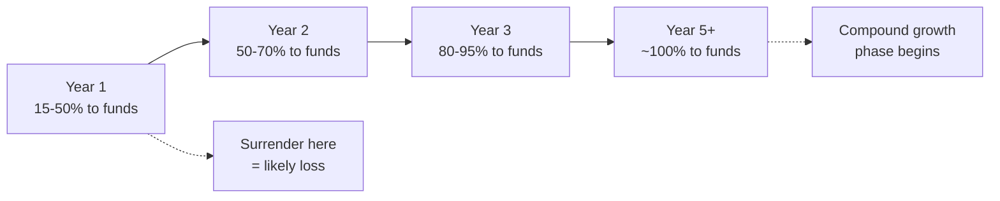

# Day 57 — Investment-Linked Plans: Core Mechanics

> **The one idea for today:** ILPs have a complicated reputation — loved by FCs, misunderstood by clients, criticised online. The truth: ILPs work brilliantly for the right client and disastrously for the wrong one. Know the difference. Never sell an ILP to a client who doesn't fit.

> **🎥 Watch the live training:** **[Module 3 — Wealth Accumulation Products Overview (David)](https://youtu.be/8rZJ3uZSwqw)**. Module 3 covers retirement-needs calculation using a TVM calculator, CPF LIFE structure (BRS / FRS / ERS), and the wealth-accumulation product stack (Pro Achiever, PWV, PRE). Also available in this day's **Video** tab.

## 0. Live training reference — the retirement-needs spine

Before recommending any wealth product, you need to surface the *gap* — the monthly retirement income the client wants minus what CPF LIFE will give them. The remainder is what your product needs to fill.

### Use the TVM (Time Value of Money) calculator

Download a TVM calculator app (free on iPad/phone). Five parameters:

- **PV** — present value (current expenses)
- **FV** — future value (what those expenses become)
- **I** — interest / inflation rate
- **N** — number of years
- **Compounding** — annual

### Worked example (David's exact walkthrough)

Client: 35, retire at 50, current expenses $2,500/month, plan to age 85.

1. **Inflate the expenses (15 years at 3%):** PV $2,500 → FV **$3,894/month** at retirement.
2. **Lump sum needed:** $3,894 × 12 × 35 retirement years = **~$1.6M**.
3. **Two drawdown methods:**
   - **Capital Preservation (4% rule):** withdraw 4%/yr forever. $1.6M × 4% = ~$65K/yr. Capital stays intact *if* investment return ≥ withdrawal rate.
   - **Capital Depletion:** withdraw faster (6–8%). Capital eventually runs out — outliving-your-money risk.

> **The teaching line:** *"If your investment return is more than your withdrawal rate, your capital stays preserved. If your withdrawal rate is more than your return, the capital line goes down. Your money has to work harder than you do."*

### Three milestones on the retirement timeline

| Age | Milestone |
|---|---|
| **55** | CPF withdrawal age — extract OA above FRS, restructure |
| **65** | Official retirement — CPF LIFE payouts begin, zero active income |
| **85–90** | Life-expectancy planning target (avg 83, plan to 90) |

### CPF LIFE retirement sums (2025)

| Scheme | Lump sum at 55 | Monthly payout at 65 (for life) |
|---|---|---|
| **Basic (BRS)** | $106K | ~$930 |
| **Full (FRS)** | $213K | ~$1,730 |
| **Enhanced (ERS)** | $426K | ~$3,300 |

### The planning gap (this is the closing math)

```
Desired retirement income          $7,000/mth
Minus CPF LIFE (FRS)              −$1,730/mth
                                   ─────────
GAP your wealth product fills    = $5,270/mth
```

That gap is the entire reason Pro Achiever, PWV, PRE, and other wealth-accumulation plans exist. Once the client sees their personal gap number, the product recommendation becomes the only logical thing to discuss.

## 0b. Product deep-dive — PWV (Platinum Wealth Venture)

The newest-generation ILP. Breaks the traditional ILP convention of long lock-ins by paying dividends from quarter 1.

| Feature | PWV | Traditional ILP |
|---|---|---|
| Premium payment | **5 years only** | 10–25 years |
| Holding period | 7–8 years | 15–25 years |
| First returns | **After ~3 months** (dividends) | After many years |
| Lock-in feel | Very short commitment | Long-term commitment |

### The dividend pitch — step by step

Worked example, $20K/year into Global Adventurous Income Fund:

1. Fund unit price ~$1.08
2. $20,000 ÷ $1.08 = **18,518 units**
3. Dividend rate ~1.9 cents per unit per quarter
4. 18,518 × $0.019 = **$351 per quarter** in dividend income
5. Client picks: **Pay Now** (cash out dividends) OR **Reinvest** (buy more units)

### Why this is powerful right now

Fixed deposit rates are falling. Conservative investors and elderly clients are looking for income alternatives. A ~7% dividend yield with quarterly payouts is a compelling answer.

### PWV bonus structure

| Feature | Details |
|---|---|
| **Bonus Units** | >$42K/year premium → extra 3–5% bonus units |
| **Supplementary Charge** | 3.6% on policy value for first 7 years |
| **Investment Bonus** | Year 8–11: 2.5% of annual premium per year |
| **Performance Bonus** | Year 8+: 0.4% of policy value per year, paid perpetually |

### Three dividend strategies

| Strategy | How it works | Best for |
|---|---|---|
| **Dividend Now** | Spend dividends from day 1 | Clients needing immediate income |
| **Dividend Later** | Reinvest dividends, start spending at target age (e.g. 65) | Accumulation then drawdown |
| **Dividend Future** | Invest in growth fund (Adventurous), fund-switch to Income at retirement | Maximum growth then passive income |

### PWV retirement-income worked example

40-year-old invests $30K/year × 5 years into Global Adventurous Income Fund:

- Dividends reinvested at ~8% (6–7% dividend + ~2% capital growth)
- At age 65: accumulated value **~$585K**
- Switch to receive dividends at 7%: $585K × 7% ÷ 12 = **~$3,400/month passive income**
- Add CPF LIFE FRS payout of $1,730/month
- **Total retirement income: ~$5,100/month**

PWV minimum: **$18,000/year**. Strongest opener-product because of the 5-year-only commitment and visible-within-3-months returns.

## 0c. Product deep-dive — PRE (Platinum Retirement Elite)

A **dedicated retirement income plan** using the Elite funds. Designed for *drawdown*, not accumulation. PRE is what you sell when the client is closer to retirement and wants structured monthly income.

### Key features

| Feature | Options |
|---|---|
| Premium type | Single premium OR 5-year pay |
| Retirement age | Choose from 50 / 55 / 60 / 65 / 70 |
| Payout period | 10 / 15 / 20 / 25 / 30 years OR until age 100 |
| Step-up option | Income increases annually (e.g. 5%/year) to offset inflation |
| Income target | Set by premium amount OR by desired monthly income |

### How PRE works — the math

40-year-old, $30K/year × 5 years ($150K total), Elite Adventurous fund at 8%:

- At 65: investment grows to **~$549K**
- 8% return on $549K = ~$43,970/year = ~$3,660/month (interest only)
- But PRE pays **$4,773/month** → draws down BOTH returns AND capital
- By age 80 (15-year payout): fund **depletes to zero**

This is the key difference from PWV: **PRE is a structured drawdown plan. The capital is consumed over the payout period.**

### PRE variations

| Configuration | Monthly payout | Notes |
|---|---|---|
| 15-year payout, flat income | $4,773 | Capital depletes at 80 |
| 20-year payout, flat income | ~$4,000 | Capital depletes at 85 |
| 15-year payout, 5% step-up | ~$3,500 (starting) | Increases yearly, hedges inflation |

### Single premium is more efficient

| Premium type | Total premiums | Approx monthly payout |
|---|---|---|
| 5-year pay ($30K/year) | $150K | ~$4,773 |
| **Single premium** | **$120K** | ~$4,000+ |

Single premium has lower charges → recommend when client has lump sum (endowment maturity, inheritance, property sale).

### PRE pitch calculation (the closing math)

Total payout = monthly income × 12 × payout years. Divide by premiums paid = **return multiple**.

> *"$4,883 × 12 × 15 = $878K total payout ÷ $120K premium = **7.3× return**. That's the leverage you get from a structured retirement product vs leaving the money in fixed deposit."*

### PRE vs APA for retirement (the choice rule)

- **APA (Pro Achiever):** also accumulates via funds, but at 65 you do a manual fund switch to Dynamic Income Fund and withdraw ~5% perpetually. **Capital preserved.**
- **PRE:** purpose-built for retirement drawdown with automatic structured payouts. **Capital consumed.**
- **For younger clients (20s–30s):** APA is better — longer accumulation horizon, capital preservation.
- **For older clients or lump-sum investors:** PRE is more suitable — structured, lower charges for this specific use case.

### Alternative use — children's education fund

Child age 0–1: $6K/year × 5 years = **$30K**. At 21 (university): grows to **~$85K** at 8%. If child gets scholarship and money stays invested → at 65 compounds to a massive retirement fund (~$8K/month income).

## 0d. The paycheck and playcheck framing (the close)

A clean two-line model for retirement income that any client can grasp:

| Layer | Source | Purpose |
|---|---|---|
| **Paycheck (Foundation)** | CPF LIFE (FRS: $1,730/month) | Basic survival — bills, necessities |
| **Playcheck (Lifestyle)** | PRE / PWV / APA / other plans | Fun — travel, hobbies, dining, gifts to grandkids |

> *"CPF LIFE pays your bills. The investment plan pays for the life you actually want to live."*

Desired income − CPF LIFE = Gap → fill with investment plans. **This is the closing math** for every retirement-angle case.

## 0e. The AIA-vs-DIY positioning (the ProAchiever differentiator)

When the prospect says *"I'd rather DIY into S&P 500 / Endowus / Phillip / a robo-advisor,"* you need four specific responses ready. These are the same four from Day 52 (Section 7), restated here in product context:

| Risk in DIY | What AIA's structure does about it |
|---|---|
| **Currency risk** — your retirement is in SGD; USD-denominated ETFs swing with FX (especially as USD weakens long-term) | Plan denominated in SGD with currency hedging baked in |
| **Dividend tax** — US dividends taxed ~30% at source. On $14,951/mth × 12 × 20 yrs = ~$3.6M dividends, you'd lose $1M+ to tax | Hedging structure → **no dividend taxes** at the policy level |
| **Estate tax** — US assets held by non-US persons → up to 30% US estate tax on death. On $2.8M, that's $840K vanishing | **No estate taxes** on the AIA structure. Full capital passes through |
| **Inheritance mismanagement** — heirs get cash, don't know what to do, often spent down or badly reinvested | **Secondary insured** — heirs inherit the *policy*, not cash. AIA continues managing under their name |

### One more anchor — "S&P 500 isn't always the safest"

> *"Most people assume S&P is the safe default. But there's a 10-year stretch (2003–2013) where the S&P 500 returned roughly zero while emerging markets and international did well. Concentration in any one market is a 10-year-loss risk. Global balanced is what survives the bad decades."*

For the actual portfolio composition: **S&P 500 is only ~18% of the AIA Elite Adventurous Index Fund**. The rest is global diversification. Use this when a knowledgeable C-type client tries to compare AIA against their existing S&P holdings.

## 0f. The supplementary-charge sub-pitch

Most other major insurers (GE, Manulife, SingLife, Prudential, HSBC, etc.) charge a **supplementary fee of 0.6% to 1% per year** on policy value, perpetually. **AIA does not have this charge after 65.**

The math on a $2M retirement portfolio: **0.7% × $2M = $14,000 per year** removed from the policy, every year, forever. Over a 30-year retirement, that's **$420K leaving the portfolio just to fees**.

> *"GE, Manulife, SingLife, Prudential, HSBC — they all have a supplementary charge of 0.6% to 1%. On a $2M portfolio, that's $14K a year being removed. AIA doesn't have that after 65 — so the $2M can stay invested, generating $10K a month in dividend income, without the fee drag eating into it."*

This is one of the strongest single sales angles in the entire wealth-accumulation conversation. **Memorise the number — 0.6 to 1% — and the $14K-on-$2M math.**

## 0g. Distribution costs + the linearisation script

When a client asks *"how much do you actually earn from this?"* — don't dodge. Run the linearisation math out loud:

> *"Let me show you. On a $200/month plan over 40 years, you put in roughly $6,194 of premium across the lifetime. After bonuses, that effectively becomes around $3,000 in lifetime distribution costs to me. Divide that by 40 years × 12 months = **about $1 per month** I earn from your policy. You meanwhile are getting roughly $600/month of value back. So this isn't me selling you a high-margin product — this is structurally a relationship plan."*

Same calculation can be reframed as a **fraction**: *"For every dollar of value you get, I earn maybe one cent. AIA is essentially losing money selling this to convert it into a long-term relationship."*

When the client sees the asymmetry, the perceived sales pressure collapses. They feel they're getting a deal, not being sold to.

> **State the actual numbers honestly. Don't inflate or deflate.** The math IS the close — manipulate it and you lose trust the moment they verify.

## 0h. Bonus structure refresher (the welcome calculator)

For ProAchiever (APA) and similar wealth plans, the bonus structure typically looks like:

| When | Bonus | On $12K/yr premium |
|---|---|---|
| Year 1 | 10% of annual premium | $1,200 |
| Year 2 | 10% of annual premium | $1,200 |
| Year 3 | 15% of annual premium | $1,800 |
| **Years 1–3 welcome bonus total** | | **~$6,360** (some illustrations show $6,000) |
| Year 10 onwards (every year) | 5% of annual premium | +$600/year |
| Year 20 onwards (every year) | 8% of annual premium | +$960/year |

> **The lifetime-bonus question to ask the client:** *"What seems bigger to you — the $6,360 welcome bonus in the first three years, or the $600 + $960 every year for life?"*
>
> Most guess the first. The right answer is the second — held to age 60, lifetime bonuses ~$45K. Held to age 100 (since the policy passes through secondary insured to descendants), the figure compounds even further.

**Always pull current illustration values from iResource before quoting bonuses.** The percentages and breakpoints are subject to change. The teaching framework above is durable; the exact numbers belong to the live system.

## 0i. The "I'll invest myself" objection (acknowledge → reframe → upsell)

From Module 3, reinforced from Module 1:

- Out of 10 clients who say *"I'll do my own investing,"* maybe **0.5–1** actually follow through after 10 years
- Most get promoted, get busy, attend a $5K course but never execute
- The pattern is that knowledge ≠ action

The script:

> *"Great that you're interested in investing — that puts you ahead of most. What if we get you started with a systematic plan that runs on auto-pilot, and you can always do your own investing on top of that? The systematic plan ensures something is happening even when life gets busy."*

Don't argue. Don't compete with the DIY plan. **Position AIA as the autopilot layer underneath whatever they want to do manually.** Most clients will agree, fund both, and over time the autopilot quietly becomes the bigger pot.

## What you'll walk away with

By the end of today you should be able to:

1. **Explain** how an ILP actually works mechanically — premiums, allocation, fees, unit accumulation.
2. **Identify** the 3 client profiles where ILPs are genuinely appropriate — and the 3 where they're not.
3. **Illustrate** ILP projections honestly, including guaranteed and non-guaranteed scenarios.

---

## 1. How an ILP actually works

An Investment-Linked Plan is structurally simple:

1. Client pays a **premium** (monthly or annually).
2. After fees, the remainder buys **units** in selected investment funds.
3. Funds are professionally managed — equity, bond, balanced, sector-specific, etc.
4. Units accumulate over time.
5. Fund value fluctuates with market performance.
6. The policy includes an **insurance component** (varying — more for protection-focused, less for wealth-focused).
7. On surrender or maturity, the client receives the **cash value** (number of units × current unit price).
8. On death, beneficiaries receive either the **sum assured** or the **cash value**, whichever is greater.

### The key insight

ILPs are **investments wrapped in an insurance policy**. The wrapper gives:
- Insurance coverage (the leverage at death).
- Tax-advantaged structure.
- Forced savings discipline.

The wrapper also costs:
- Insurance charges (ongoing).
- Administrative fees.
- Fund management fees.

Whether the wrapper is worth the cost depends on the client.

## 2. The two ILP flavours

### Wealth-focused ILPs
- 95%+ of premium goes to fund investment.
- Minimal insurance cost.
- Structured for **long-term capital growth.**
- Best for clients who want the wrapper + discipline + growth potential.

### Protection-focused ILPs
- 60–80% of premium goes to fund investment.
- Significant insurance cost (more coverage).
- Provides meaningful protection + smaller growth.
- Best for clients who want coverage with some long-term accumulation.

**The question to ask:** is the client primarily looking for **investment growth** (wealth-focused) or **protection with growth** (protection-focused)?

## 3. Premium allocation — where the money actually goes

A typical ILP premium breakdown (illustrative):

| Year | Premium | Allocation to units | Insurance cost | Admin fees |
|---|---:|---:|---:|---:|
| 1 | $500/month | 15–50% | 40%+ | 10–20% |
| 2 | $500/month | 50–70% | 20% | 10% |
| 3 | $500/month | 80–95% | 5–10% | 3–5% |
| 5+ | $500/month | ~100% | Minimal | Minimal |

**The key point:** ILP fees are **front-loaded.** The first 1–3 years have heavy deductions. After that, allocation approaches 100%.

### What this means

- **Short-term ILPs lose money.** Selling within 3 years → heavy loss due to front-loaded fees.
- **Long-term ILPs compound.** After Year 3, most of the premium goes directly into funds.
- **Early surrender is punishing.** The structure assumes 15–30 years of holding.



### The disclosure discipline

Always show clients the **Benefit Illustration** that shows both:
- **Guaranteed** surrender values (low — only guaranteed minimum).
- **Non-guaranteed** projected values (higher, based on illustrated rates like 4% and 8%).

Never present only the optimistic scenario. Clients who later feel misled cause complaints, claw-backs, and reputation damage.

## 4. The 3 client profiles who benefit from ILPs

### Profile 1: The disciplined long-term investor
- 15+ year horizon.
- Understands market volatility.
- Wants a structured vehicle with forced discipline.
- Comfortable with fund-linked returns.

### Profile 2: The protection-plus-growth client
- Wants meaningful protection (CI, life).
- Wants growth potential alongside.
- Accepts that insurance cost reduces pure return.
- Values the all-in-one structure.

### Profile 3: The tax-advantaged saver (for certain ILP structures)
- Uses the wrapper's tax treatment to their benefit.
- Has maxed out other tax-advantaged vehicles (CPF top-ups, SRS).
- Higher-income clients where tax matters.

## 5. The 3 client profiles where ILPs are wrong

### Wrong 1: Short time horizon
- Planning to use the money in 5–10 years.
- Can't tolerate losing access or surrender losses.
- Should use: endowment, fixed income, or direct savings.

### Wrong 2: Cost-sensitive pure investor
- Understands investing.
- Has the discipline to DCA into ETFs on their own.
- Wants low-cost passive exposure.
- Should use: direct ETFs/unit trusts without the wrapper.

### Wrong 3: Risk-averse client
- Needs capital preservation.
- Can't stomach a 30% drop even temporarily.
- Wants guaranteed returns.
- Should use: endowment, bond funds, CPF top-ups.

**Rule:** if the client fits any of these three profiles, **do not sell them an ILP.** You'll get the commission now and the complaint later. Both are bad for the career.

## 6. The ILP conversation script

When recommending an ILP, use this disclosure framework:

> "Here's how this plan works mechanically:
>
> - You pay $[X]/month. The first 2–3 years have higher charges — about 30–40% of premium goes to insurance costs and fees. This reduces over time. By Year 4, nearly all your premium goes into the funds.
>
> - The funds are [brief description of selected funds]. Historical return is [X–Y%] but returns are **not guaranteed** — they can go up or down based on markets.
>
> - Looking at the illustration: at a projected 4% return, your value in 20 years is $[A]. At 8%, it's $[B]. The guaranteed floor is $[C]. Markets could do worse than 4%, so $[C] is the worst case we should plan for.
>
> - If you surrender before Year 10, you'll likely get back **less than you paid**. This plan only makes sense if you're committed to 15+ years.
>
> - In exchange for all that, you get [insurance benefit] of $[Z] — so the wrapper also gives you protection.
>
> Does this all make sense? Do you want to think about it, or are there questions?"

This is honest, complete, and protects the relationship.

## 7. Fund selection basics

Within an ILP, you (and the client) choose which funds the premium buys.

### The 4 main fund categories

| Category | Expected return | Expected volatility |
|---|---|---|
| Equity (growth) | Higher | Higher |
| Balanced | Moderate | Moderate |
| Bond (income) | Lower | Lower |
| Cash / money market | Lowest | Minimal |

### The allocation rule of thumb

By client risk tolerance:

- **Aggressive** (young, long horizon, high risk tolerance): 90% equity, 10% bond.
- **Balanced** (middle horizon, moderate risk): 60% equity, 40% bond.
- **Conservative** (short horizon, preservation focus): 30% equity, 70% bond.

**Rule:** match the allocation to the client's **real** risk tolerance, not the one they think they have. Use a risk questionnaire. Document the decision.

### Rebalancing

Over time, allocations drift as markets move. Best practice:
- **Annual review** with the client.
- **Rebalance** if allocations have drifted >10% from target.
- **Adjust** as life stages change (young-single to married-with-kids changes risk profile).

## 8. Handling the "ILPs are bad" objection

Many clients have seen Reddit / online threads criticising ILPs. Be ready.

### The objection
> "I've read online that ILPs are bad. Why should I buy one?"

### Your response
> "That's a fair concern — there's a lot of noise online. Here's the honest truth:
>
> ILPs are **bad for short-term investors** and **bad for cost-sensitive investors who'd prefer direct ETFs.** Those criticisms are valid for those groups.
>
> ILPs can be **good for disciplined long-term investors who value the forced-savings structure + insurance wrapper.** That's the group you'd fit into — if you're committed to 15+ years.
>
> The question isn't 'is an ILP good or bad?' It's 'is an ILP right for you?' Let me show you the honest illustration — both the projections and the scenarios where it wouldn't work — so you can decide."

This transparency builds trust. A client who chooses an ILP after this conversation owns the decision.


## Quick quiz

1. **When does most of an ILP premium actually go into investment funds?**
   - A) Year 1
   - B) After Year 3 — the first 1–3 years have front-loaded fees ✓
   - C) Year 10
   - D) Always 100%

 **Why:** ILP fee structures are front-loaded — in Years 1-2, insurance charges and admin fees can consume 40-85% of the premium, with only 15-50% allocated to units. By Year 3-5 the allocation approaches 100%. Year 1 (A) is actually the worst allocation period, not the best. Year 10 (C) understates how quickly allocation improves — it normalises well before then. Always 100% (D) is never true; there are always some ongoing insurance charges and admin fees throughout the policy life.

2. **Which client should NOT buy an ILP?**
   - A) 30-year-old with 25-year horizon
   - B) 50-year-old with 5-year horizon who needs the money ✓
   - C) Disciplined long-term investor
   - D) Client who wants forced savings

 **Why:** A 5-year horizon is a textbook disqualifier for ILPs — front-loaded fees in Years 1-3 mean early surrender would almost certainly return less than premiums paid, and market exposure on a short horizon amplifies that risk. The 30-year-old with a 25-year horizon (A) fits the ideal ILP profile. Disciplined long-term investors (C) and clients who want forced savings (D) are both explicitly named as suitable ILP profiles in the day's content.

3. **The two projected rates typically shown in an ILP illustration:**
   - A) 2% and 6%
   - B) 3% and 7%
   - C) 4% and 8% ✓
   - D) Guaranteed only

 **Why:** 4% and 8% are the industry-standard non-guaranteed illustrated rates used in Singapore ILP benefit illustrations — the low scenario for conservative planning and the high scenario for optimistic projection. These are not actual guarantees; they are illustration assumptions mandated by MAS for comparability. The other rate pairs (A and B) are not standard and would not match a real benefit illustration a client would receive. Showing guaranteed values only (D) would omit the non-guaranteed projections that MAS requires to be displayed alongside.

4. **A client surrenders their ILP after 18 months because of a job loss. What outcome should you have warned them about at point of sale?**
   - A) The policy reverts to a term plan automatically
   - B) Early surrender within the front-loaded years means likely receiving back less than total premiums paid ✓
   - C) The insurer charges a flat $500 surrender fee only
   - D) The fund value is frozen for 30 days pending final pricing

 **Why:** The front-loaded fee structure means that in the first 1-3 years only 15-70% of premium reaches the investment units; surrendering at 18 months means the accumulated fund value is almost certainly below total premiums paid. This is the key disclosure that must happen at point of sale so the client understands liquidity is restricted. Policies do not automatically revert to term on surrender (A). The surrender impact is structural, not a flat fee (C). A 30-day fund freeze (D) is not standard AIA policy.

5. **A client with a 20-year ILP has watched markets drop 25% this year. She wants to switch all funds to cash. What is the correct guidance?**
   - A) Approve immediately — capital preservation is always the priority
   - B) Discuss the rebalancing policy: switching entirely to cash during a downturn locks in losses and removes long-term recovery potential; review her risk tolerance first ✓
   - C) Decline — fund switches are not permitted under AIA policy
   - D) Advise surrendering the policy and restarting when markets recover

 **Why:** Switching entirely to cash during a 25% market drop crystallises the loss and removes the portfolio from the recovery that historically follows downturns — the opposite of sound long-term investment behaviour. The correct approach is to review her actual risk tolerance, not the one she thought she had when markets were up, and rebalance thoughtfully. Approving immediately (A) prioritises the client's emotional reaction over their 20-year financial interest. Fund switches are generally permitted in ILPs (C). Surrendering and restarting (D) would incur front-loaded fees all over again and is almost never the right advice.

6. **Why is an ILP described as "investments wrapped in an insurance policy" rather than simply an investment account?**
   - A) ILPs are taxed differently from direct investments under Singapore law
   - B) The insurance wrapper provides forced savings, a death benefit, and tax-advantaged structure — but also adds insurance charges and admin fees ✓
   - C) ILPs are managed by AIA's fund managers rather than external fund houses
   - D) The insurance wrapper guarantees the principal invested

 **Why:** The insurance policy structure is what distinguishes an ILP from a direct unit trust — it adds a death benefit, forced-savings discipline, and a tax-advantaged wrapper, but those benefits come at a cost: insurance charges and admin fees that reduce net investment return. Tax treatment of ILPs versus direct investments in Singapore is not a material distinguishing factor for most retail clients (A). ILP funds are typically managed by third-party fund houses, not AIA itself (C). The wrapper explicitly does not guarantee principal — non-guaranteed returns are a core disclosure requirement (D).

7. **A 45-year-old client who is a sophisticated investor, already DCA-ing into ETFs monthly, asks whether an ILP adds value. What is your honest answer?**
   - A) Yes — ILPs always outperform direct ETFs because of professional fund management
   - B) Not likely — a cost-sensitive investor with existing discipline benefits less from the wrapper since the fees outweigh the forced-savings advantage ✓
   - C) Yes — the insurance wrapper eliminates market risk
   - D) It depends entirely on the chosen fund, not the client's existing behaviour

 **Why:** The ILP wrapper's main value propositions are forced savings discipline and the death benefit — both of which this client already has via his own DCA habit and separate life cover. Adding the wrapper means paying insurance charges and admin fees on top of fund management fees, which nets below what direct ETF investing would return. ILPs do not consistently outperform direct ETFs (A) — the wrapper costs reduce net return. The insurance wrapper carries full market risk (C); it does not eliminate it. Fund selection matters, but it is secondary to whether the client fits the product profile (D) — the wrong client with a great fund is still the wrong recommendation.

---

## Related

- Previous: [[day-56|Day 56 — AIA Solutions: Protection & Living Benefits]]
- Next: [[day-58|Day 58 — Policy Summary]]
