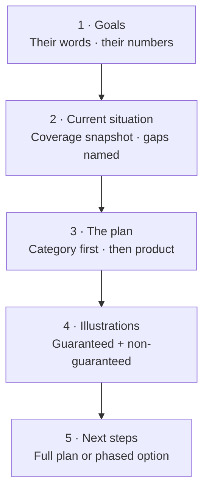
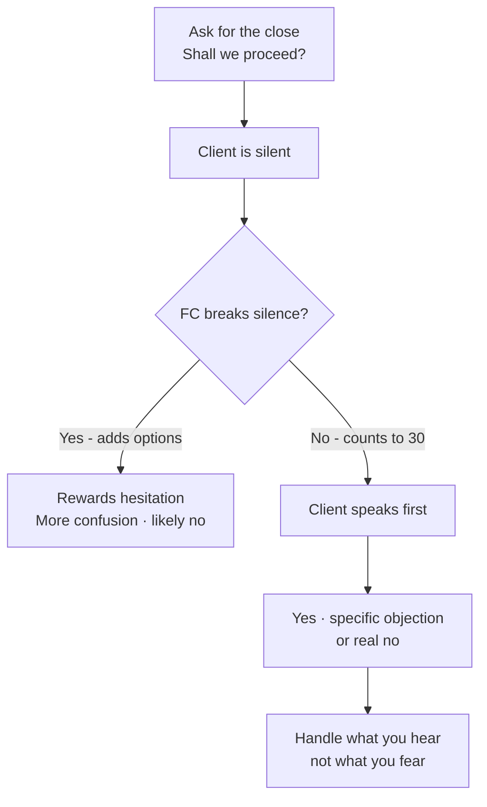

# Day 59 — Proposal Writing + Closing Techniques

> **The one idea for today:** A proposal is not a product brochure. It's a **translation** — converting everything the client told you into a one-page story with numbers that say "this is the plan that fits your life." When the proposal lands well, the close is often automatic.

## What you'll walk away with

By the end of today you should be able to:

1. **Structure** a proposal using the 5-part template that mirrors the client's own story back to them.
2. **Apply** 5 closing techniques — Columbo, Option, Assumption, Silent, Summary — with the right technique for the right moment.
3. **Close** confidently without sounding pushy.

---

## 1. The proposal is a translation

After all the fact-finding, SPIN, CSTs, and concept selling — the client has told you:
- What they're worried about.
- What they want for their family.
- What they can afford.
- What they've tried or failed at before.

The proposal **translates all of that into a plan.** If you've done the work, writing the proposal is the easy part.

**The wrong proposal:** a generic product deck with illustrations, features, and a premium.
**The right proposal:** their own words, their own numbers, mapped to a specific solution.

## 2. The 5-part proposal template

### 1. Your goals (1 page)
Restate, in their language, what they told you they want.

> **Your Goals:**
> - Retire at 62 with $6,000/month passive income.
> - Protect your family — Jane and the two kids (5 and 2) — against loss of income or major illness.
> - Build a $250K education fund for the kids by the time they turn 18.
> - Maintain the current HDB mortgage without financial stress.

**Why this works:** the client sees themselves on page 1. They know you listened.

### 2. Your current situation (1 page)
A clean snapshot of where they stand today.

> **Current Position (as of today):**
> - Monthly income: $X.
> - Monthly savings capacity: $Y.
> - Existing coverage: [list with amounts].
> - Gaps identified: CI ($Z gap), Disability Income (no coverage), Hospital (company plan only, ends with employment).

No sugar-coating. Gaps are named clearly.

### 3. The plan (1–2 pages)
The specific recommendation. Category-first, then product.

> **Recommended Plan:**
>
> **1. Critical Illness coverage — $Z sum assured**
> - Plan: [specific plan]
> - Premium: $A/month
> - Why: closes the CI gap we discussed; multiplier rider doubles coverage during your high-risk earning years.
>
> **2. Hospital upgrade — max-tier + rider**
> - Plan: [Integrated Shield Plan + rider]
> - Premium: $B/month
> - Why: replaces your company plan with portable coverage; near-zero out-of-pocket on claims.
>
> **3. Education endowment plan**
> - Plan: [specific plan]
> - Premium: $C/month
> - Why: projects to ~$250K at your kids' university age, with death benefit attached.

### 4. Illustrations + the math
Show the illustrations. Both guaranteed and non-guaranteed scenarios. Be transparent about assumptions.

Include:
- Guaranteed values.
- Non-guaranteed (illustrated at 4% and 8% where applicable).
- Key ages / milestones (when does coverage kick in, when does maturity pay out).
- Any waiting periods or exclusions.

### 5. Next steps
Clear, specific.

> **To proceed:**
> - Complete KYC + application (30 min today).
> - Medical underwriting (may require a simple health check).
> - Policy delivery within 2–3 weeks.
> - First annual review scheduled 12 months from today.
>
> **If you prefer to start with just the CI coverage this month and add the others in Q2, that works too. Let me know what fits best.**

**Rule:** always offer at least 2 starting options — full plan or phased. Gives the client agency. Reduces the "no" response.

## 3. The proposal hygiene rules

### Tone
- **Their language**, not industry jargon. "Protection gap" not "underinsurance exposure."
- **Concrete numbers**, not ranges where possible.
- **Short paragraphs.** Lots of white space. Read on phone-friendly.

### Length
- **4–6 pages maximum** for a typical plan. More than 10 and clients skim, forget, object.
- Illustrations can be appendix. Keep the main document focused.

### Personalisation
- Client's name used 3–5 times.
- Reference specific things they said ("you mentioned your dad's diabetes diagnosis last year").
- Use their kids' names if provided.

### Files
- PDF format.
- Named clearly: "Tan John — Financial Plan — Apr 2026.pdf".
- Include version number if revising.

## 4. 5 closing techniques — and when to use each

### Technique 1: Columbo Close
**When:** end of meeting, client is about to leave, you need to reopen.

> "Just one more thing before I go — if the plan I come back with addresses [goal 1], [goal 2], and [goal 3], within the budget you mentioned, can you see any reason why we wouldn't move forward?"

Covered on Day 49. Use as the standard end-of-CFR transition.

### Technique 2: Option Close
**When:** the client is 80% there but hesitating on a yes/no.

> "Would you prefer the $300/month option or the $400/month option?"
> "Do we start with the CI coverage alone, or include the hospital upgrade too?"

**Why it works:** everyone loves choices. Giving two options removes the "no" option from the mental menu. Both options represent a "yes" — just different amounts.

### Technique 3: Assumption Close
**When:** the client is clearly positive but hasn't verbally committed.

Don't ask "do you want to proceed?" Instead:

> "I'll need your NRIC to complete the application — can I take a photo of it now?"
> "Your preferred monthly debit date — 1st or 15th?"

**Why it works:** you're assuming forward motion. The client either corrects you ("wait, I haven't decided") or goes along with it ("15th"). Going along = decision made.

**Use carefully.** If misjudged, it feels manipulative. Only use when body language + verbal signals are clearly positive.

### Technique 4: Silent Close
**When:** you've presented everything. You've asked for the close. The client is thinking.

**DO NOT TALK.**

Most new FCs break silence by volunteering more information, discounts, or fallback options. That's a huge mistake — it rewards the silence with more choices, confusing the client.

**The discipline:** after asking "shall we proceed?" — count to 30 in your head. Do not speak first.

**"He who breaks silence first is the most eager to make a deal."** Let the client speak first. Their first word tells you what you actually think.

### Technique 5: Summary Close
**When:** multi-benefit plan, client needs to see everything tied together.

> "Let me summarise: you want to protect against CI with $X coverage, build an education fund of $Y by 2040, and upgrade your hospital plan. The total investment is $Z/month — less than what most families spend on eating out. Shall we proceed?"

**Why it works:** packaging three decisions as one "yes" reduces decision fatigue.

### Technique 6: "Let me think about it" close
**When:** the client is stalling but hasn't objected — the default delay response.

Don't concede the delay. Reframe it with risk-reversal + scarcity:

> "Of course. Two things worth knowing before you do: your premium is locked in at today's age — every year you wait it goes up, permanently. And there's a **14-day free-look period** after policy issue, so you can cancel for a full refund if you change your mind.
>
> Would it make sense to lock in today's rate and use those 14 days to decide if it still feels right? Worst case, you cancel — best case, you've saved a year of premium increase."

**Why it works:** you're not pushing the sale. You're offering a reversible commitment. Most "think about it" objections evaporate when the downside of starting is zero and the upside of waiting is zero.

## 5. When resistance is actually emotional

**The principle:** "When it comes to a closing, if you have been competent in your work, resistance is largely emotional, not logical."

By the time you're at the close, the client already knows the plan makes sense. The hesitation is emotional:

- "Am I making the right choice?"
- "Is this advisor trustworthy?"
- "What will my spouse say?"
- "Am I being too hasty?"

**What this means:**
- Don't respond with more logic. The logic is already there.
- **Respond with reassurance.** "This is a decision you can adjust if your situation changes. No one is locking you in for life."
- **Slow down** if needed. "Take another week to talk to [spouse]. Would Friday next week work for a 15-min check-in?"
- **Give them an out.** "You don't have to decide today. But let's get the KYC started so we're ready if you say yes next week." (Small commitment + reduced pressure.)

## 6. The handling of common late-stage objections

| Objection | Response |
|---|---|
| "Let me think about it" | "Of course. What specifically would you like to think about? Happy to clarify now." (Surfaces the real objection.) |
| "I need to talk to my spouse" | "Absolutely. Want me to prepare a 1-page summary you can discuss together? I can schedule a 3-way call if helpful." |
| "It's too expensive" | "Understood. Let's work backwards from a budget you're comfortable with — what monthly amount would feel sustainable?" |
| "I'll wait till next year" | "What would be different in a year? If the answer is 'nothing,' we might as well start now while you're thinking about it." |
| "Just send me the documents, I'll review" | "Of course. I'll send them tomorrow. But let me ask — what specifically would make you want to proceed after reviewing?" |

**Rule:** every late-stage objection has an emotional layer + a logical layer. Address both. Never dismiss either.

## 7. The "not this time" graceful exit

Sometimes a client is a real no. Handle it well — the relationship matters more than the month-3 commission.

> "Totally understood. No pressure at all. Let me put you on a gentle 6-month touch cadence — I'll check in with a useful article or market update once a quarter. If anything changes in your life, you know where to find me. Appreciate the time today."

**Never:**
- Argue further.
- Act hurt or frustrated.
- Dismiss them or stop being warm.

**Always:**
- Thank them genuinely.
- Offer a continued light touch.
- Leave the door open.

**The math:** some 3 out of every 10 "no" clients today become "yes" clients in 6–18 months. Treating a "no" gracefully today is investing in that future yes.

## 8. The post-close discipline

After the client says yes:

1. **Handle the paperwork immediately.** Don't delay. Momentum is fragile.
2. **Schedule the next review** before leaving.
3. **Send a thank-you message** within 24 hours — personal, not templated.
4. **Follow up within 7 days** on application progress.
5. **Onboard to your service cadence** — annual review, birthday call, claim help.
6. **Ask for the referral — once, cleanly.** At the end of the paperwork meeting or in the thank-you message, not during the close itself.

**The referral script:**

> "One last thing. The way I build this practice is entirely through clients like you introducing me to one or two people they care about. Who are the 2–3 people in your life you'd want to have the same conversation we just had? I'll reach out warmly — no pressure, no pitch — and if they're interested, great. If not, also fine."

**Why this script works:** it's specific (2–3 people), low-pressure (no pitch), and names the reciprocity ("people you care about"). Generic "Do you know anyone else?" closes produce generic no's.

A new client who feels cared-for in the first 90 days becomes a 20-year client. One who feels abandoned becomes a lapsed policy and a lost opportunity.

## Quick quiz

1. **The most important part of a proposal is:**
   - A) Detailed product specs
   - B) Restating the client's goals in their own language ✓
   - C) Compliance disclaimers
   - D) Advisor biography

 **Why:** Page 1 of the proposal restates the client's own goals in their own words — this is the signal that you listened, not that you prepared a generic product deck. When a client sees themselves on the opening page, the rest of the document lands in a completely different way. Product specs (A) belong in the appendix illustrations, not the opening. Compliance disclaimers (C) are mandatory but are not what drives trust or the close. The advisor biography (D) adds nothing to a client who is already meeting with you.

2. **The Silent Close works because:**
   - A) It makes clients uncomfortable
   - B) The first to speak is usually the most eager — let the client speak first ✓
   - C) It saves the advisor from talking
   - D) It's culturally polite

 **Why:** "He who breaks silence first is the most eager to make a deal" — if the FC speaks first, they are signalling they need the yes more than the client needs the plan, which invites objections, discounts, and delay. Letting the client speak first reveals their actual position: a yes, a specific concern, or a real objection you can address. Making the client uncomfortable (A) is a side effect the technique sometimes has, but it is not the mechanism. Saving the FC from talking (C) and cultural politeness (D) are irrelevant to why the technique works.

3. **When a client says "let me think about it" — the best response is:**
   - A) "OK, I'll call you next week"
   - B) "Take your time, here's more info"
   - C) "Of course. What specifically would you like to think about?" ✓
   - D) "Why? Is something unclear?"

 **Why:** "Let me think about it" is almost always a mask over a specific, addressable concern — price, spousal approval, timing, or uncertainty about one feature. Asking what specifically surfaces the real objection so you can handle it now rather than losing momentum. Conceding the delay (A) and adding more information (B) both let the real objection remain buried, which typically means the client never comes back. Option D is technically fine but sounds defensive; option C is warmer and opens the same door.

4. **A client has reviewed the full proposal, nodded along, but has not verbally committed. You say: "Your preferred monthly debit date — 1st or 15th?" Which closing technique are you using?**
   - A) Columbo Close — reopening the conversation before they leave
   - B) Summary Close — packaging multiple decisions into one yes
   - C) Assumption Close — assuming forward motion when all signals are positive ✓
   - D) Silent Close — waiting for the client to speak first

 **Why:** The Assumption Close skips the yes/no question entirely by treating the decision as already made and asking a downstream detail — if the client answers "15th," they have implicitly committed. All signals here are positive (proposal reviewed, nodding along) so the technique is appropriate. Columbo (A) is used at the end of a meeting to pre-commit the client to a future yes, before a proposal exists. The Summary Close (B) packages multiple benefits into one verbal yes. The Silent Close (D) is about withholding speech after asking for the close, which is different from assuming forward motion.

5. **You present a plan and ask "Shall we proceed?" The client is silent for 10 seconds. A new FC's instinct is to fill the silence with more options. Why is this a mistake?**
   - A) It is rude to speak while the client is processing
   - B) Adding choices during silence rewards hesitation, increases decision fatigue, and signals you are eager to concede ✓
   - C) It violates MAS guidelines on unsolicited advice
   - D) Clients interpret additional options as a sign the original plan was flawed

 **Why:** Breaking the silence with more options creates three compounding problems: it teaches the client that hesitation produces concessions, it adds new decisions on top of the one they are already processing, and it broadcasts that the FC is more eager to close than the client is to decide — all of which make a yes less likely. A is true as an observation but misses the strategic reason. C is not a MAS rule. D may happen sometimes but is a symptom, not the mechanism — the core problem is decision fatigue and the eagerness signal.

6. **Your proposal runs to 14 pages with full illustrations included in the main document. What hygiene rule does this violate?**
   - A) Proposals must be submitted in Word format, not PDF
   - B) Proposals over 4-6 pages cause clients to skim, forget key points, and generate more objections — illustrations should be an appendix ✓
   - C) 14 pages is acceptable; the issue is the font size must be at least 12pt
   - D) Client names must appear on every page of a proposal above this length

 **Why:** The proposal hygiene rules cap the main document at 4-6 pages so the client reads it fully and the key messages land clearly. Illustrations should be moved to an appendix — they are reference documents, not the persuasive narrative. A longer document causes clients to skim, lose the thread, and surface objections about details they would not have focused on in a tighter document. PDF format (A) is actually required, not prohibited. Font and page-count rules (C) and per-page name placement (D) are not real constraints stated in the training material.

7. **A client signs and you have the paperwork ready. She says: "Actually, can I bring this home and sign tonight?" What is the risk, and what is the correct response?**
   - A) No risk — clients always follow through when they have committed verbally
   - B) Post-meeting momentum is fragile; handle paperwork immediately where possible, or ask what would make her comfortable completing it now ✓
   - C) Agree and schedule a courier — never pressure a client after the close
   - D) Remind her about the 14-day free-look period and reschedule for next week

 **Why:** Momentum is fragile the moment a client leaves the room — a conversation with a spouse, a Google search, or a night of second-guessing can all reverse a verbal yes. The post-close discipline rule is to handle paperwork immediately. The right response is not pressure but a gentle inquiry: "What would make you comfortable completing it now?" which surfaces any remaining concern without being pushy. Verbal commitments do not always convert (A) — that belief costs FCs closed cases. Scheduling a courier (C) defers unnecessarily and adds a day of cooling-off for no benefit. Rescheduling entirely (D) with a free-look reminder is counterproductive when the client is ready today.

---

## Related

- Previous: [[day-58|Day 58 — Policy Summary]]
- Next: [[day-60|Day 60 — Claims Handling + Graduation]]
