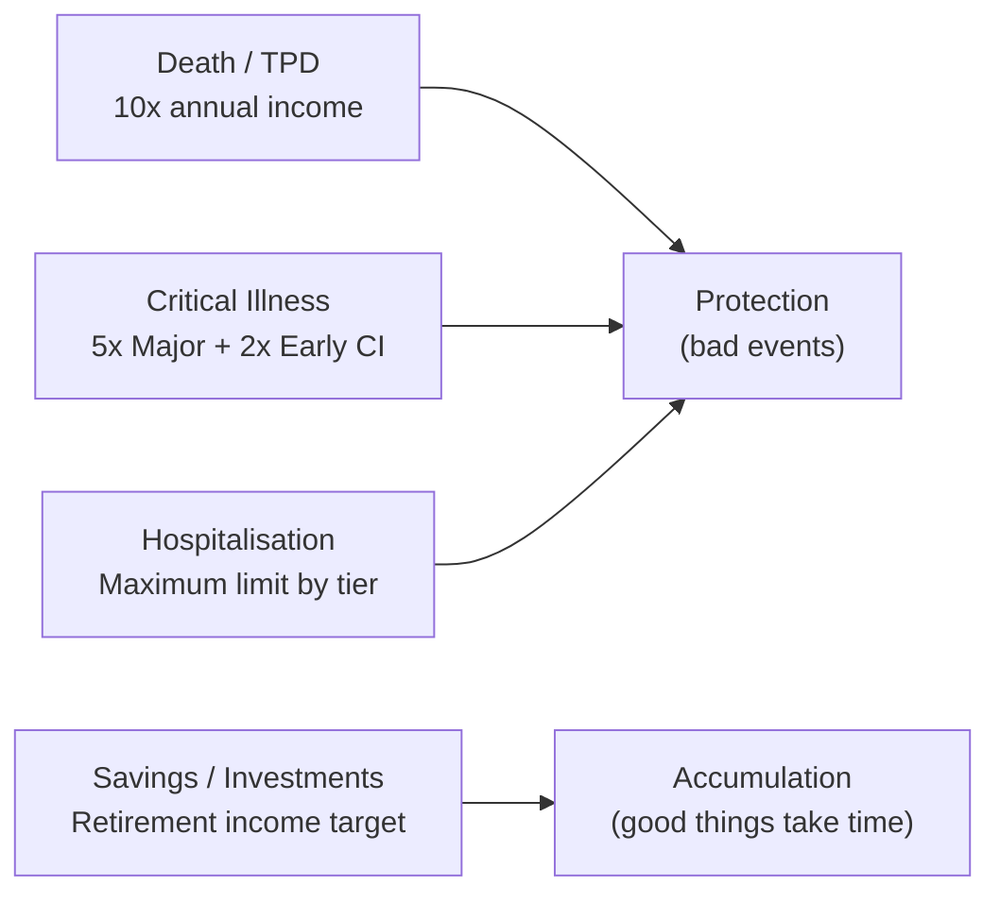
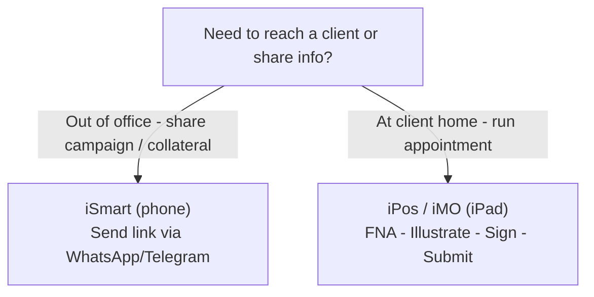

# Day 7 — The Insurance Industry & AIA Singapore

> **The one idea for today:** Insurance is not a product category. It's four different jobs — replacing income at death, paying for recovery after illness, covering medical bills, and funding retirement. Every conversation you have will map to one of these four.

## What you'll walk away with

By the end of today you should be able to:

1. **Name** the four segments of personal insurance and describe the problem each one solves.
2. **Explain** AIA Singapore's positioning in the market in one minute.
3. **Locate** the two digital tools you'll live in every day — **iPos (iMO)** and **iSmart** — and know when each is used.

---

## 1. The four segments of personal insurance

When a client says "I need insurance," your first job is clarification. Which kind? There are four, and the needs behind each are different.

| Segment | Problem it solves | Typical coverage |
|---|---|---|
| **Death / TPD** | Your dependents lose your income | **10× annual income** (replaces ~10 years of earnings) |
| **Critical Illness** | 3–5 year recovery period without income; home modifications | **5× annual income (Major CI)** + **2× (Early CI)** |
| **Hospitalisation & Accident** | Medical bills; choice of treatment quality | **Maximum limit** (private or restructured hospital tier) |
| **Savings / Investments** | Retirement — no income, still alive and healthy | Depends on target retirement income × longevity |

**The pattern:** the first three are **protection** (bad things happening). The fourth is **accumulation** (good things taking time).

A financially prepared person has all four. Most clients walk in with **one or two at best** — usually hospitalisation (because their employer offers it) and some savings. Your job is to map out what's missing without turning the meeting into a pitch.

## 2. AIA Singapore — the 60-second positioning

A competent FC can explain their company in one minute, from memory. Here's yours.

> AIA Singapore has been serving the Singapore community since **1931** — over 90 years. It's one of the largest life insurers in Asia, with a focus on being there for families across protection, wealth accumulation, and retirement.
>
> The mission is summarised in three words: **healthier, longer, better lives.** That phrase shows up in product design (wellness features in Vitality), in claims philosophy (fast and empathetic), and in how we engage clients beyond a transaction.

Why this matters: when a prospect's first question is "why AIA?" — you don't want to fumble or sound like an ad. One minute, honest, memorable.

## 3. Your digital toolkit

AIA's systems are genuinely ahead of most of the industry. Learn where each tool fits; don't memorise screens — memorise workflows.

### AIA iSmart (mobile app)
- **What it is:** mobile app with real-time client information and campaign updates.
- **Use when:** you're out of the office, need to share a campaign update, or want to push product collateral directly through WhatsApp/Telegram to a prospect.
- **Workflow:** client mentions interest → you send them the campaign link from iSmart within 30 seconds.

### AIA iPos (iPad point-of-sale)
- **What it is:** one-stop iPad platform for product details, application forms, and POS forms.
- **Use when:** you're at the client's home/office, running the actual sales appointment and submitting the application on the spot.
- **Workflow:** complete financial review → illustrate plan → client signs → straight-through submission.

**Rule:** never walk into a client meeting without iPos ready. Never leave home without iSmart on your phone. Everything else — memos, campaign updates, product collateral — pushes to you through these two.

## 4. Where AIA sits in the Singapore market

You'll get asked this. A simple mental model:

- **Tied agency model** — you represent one insurer (AIA), can go deep on its products, and benefit from scale and brand.
- **Independent financial advisor (IFA) model** — represents multiple insurers, can compare quotes, but often thinner on any single product.

**The honest trade-off:** a tied agent is stronger on depth, a broker is stronger on breadth. A well-trained tied agent with a strong moral compass serves clients extremely well, because product depth leads to better-fitted recommendations — not just cheaper ones.

If a client strongly wants a product AIA doesn't have, the right answer is to say so, not to sell around it.

## 5. The four segments — how to use this frame in every meeting

Every meeting maps to one or more of the four segments. Make a habit of silently labelling what you hear:

| Client says | Segment |
|---|---|
| "I just had my second kid" | Death/TPD ↑ (more dependents) |
| "My mum was just diagnosed with cancer" | Critical Illness ↑ (salience) |
| "My company hospital plan ended when I left" | Hospitalisation ↑ (gap) |
| "I'm worried about retirement" | Savings/Investments ↑ |
| "I got a big promotion" | Death/TPD ↑, Savings ↑ (higher income to protect) |

This silent labelling sharpens your listening. Do it on every call for a month and it becomes automatic.

## Quick quiz

1. **Which segment typically uses a 10× annual income rule of thumb?**
 - A) Critical Illness (Major)
 - B) Hospitalisation
 - C) Death / TPD ✓
 - D) Savings / Investments

 **Why:** The 10× annual income rule replaces approximately 10 years of earnings for dependents after a death or TPD event. Critical Illness uses 5× (Major CI) plus 2× (Early CI) to cover the recovery period. Hospitalisation targets maximum limits by hospital tier, not a salary multiple. Savings and Investments are sized against the retirement income target, not a fixed income multiple.

2. **Which tool would you use to submit an application on the spot at a client's home?**
 - A) iSmart (mobile app for sharing campaigns)
 - B) iPos / iMO (the iPad point-of-sale) ✓
 - C) WhatsApp
 - D) AIA+ mobile app (client-facing)

 **Why:** iPos (inside iMO) is the one-stop iPad platform for product illustrations, application forms, and straight-through submission — purpose-built for the sales appointment. iSmart is the mobile app for sharing campaign links and collateral before or between meetings, not for submitting. WhatsApp and AIA+ are client-facing channels, not submission tools.

3. **In one phrase, AIA's mission is to help people live:**
 - A) Safer, richer, longer lives
 - B) Healthier, longer, better lives ✓
 - C) Wealthier, safer, fuller lives
 - D) Longer, stronger, smarter lives

 **Why:** "Healthier, longer, better lives" is AIA's stated mission and shows up in product design (Vitality wellness features), claims philosophy, and client engagement. The other options are plausible-sounding combinations but are not AIA's actual phrasing — and in a client meeting, getting it wrong undermines credibility.

4. **A client says, "My mum was just diagnosed with cancer." Which segment should this raise in your mind first?**
 - A) Death / TPD — she may need to update her beneficiaries
 - B) Critical Illness — the salience event signals a gap to review ✓
 - C) Savings / Investments — medical costs will deplete her retirement fund
 - D) Hospitalisation — this is purely a medical-bill problem

 **Why:** A family CI event is a classic salience trigger — the client suddenly imagines the same happening to them, making this the moment to review their own CI gap. Death/TPD (A) would be relevant if the client themselves were ill, not a parent. Savings depletion (C) is a secondary concern, not the primary signal. Hospitalisation (D) addresses medical bills but misses the 3-5 year income-replacement problem that CI is designed to solve.

5. **A prospect asks, "Why AIA instead of a broker?" The most honest and accurate response is:**
 - A) AIA products are always cheaper than what a broker can source
 - B) A tied agent goes deeper on one insurer's products, which leads to better-fitted recommendations ✓
 - C) Brokers are not regulated and cannot be trusted
 - D) AIA has the highest claims payout ratio in Singapore

 **Why:** The honest trade-off from today's content is depth vs breadth — a tied agent's product depth produces better-fitted recommendations, not necessarily cheaper ones. Claiming AIA is always cheaper (A) is demonstrably false and damages trust. Brokers are MAS-regulated (C) — saying otherwise is factually wrong. Claiming the highest claims ratio (D) is an unverified stat and the kind of claim that will embarrass you if challenged.

6. **Which scenario best illustrates the "silent labelling" habit from today's lesson?**
 - A) Memorising the coverage amounts for every AIA product before each meeting
 - B) Listening to a client mention a promotion and mentally flagging Death/TPD and Savings needs ✓
 - C) Opening iPos the moment you arrive at a client's home
 - D) Sending a campaign link via iSmart before the meeting starts

 **Why:** Silent labelling means mapping what a client says to one of the four segments in real time without interrupting the conversation. A promotion raises income, which raises both the death/TPD protection gap and the savings capacity — exactly the mapping the table shows. Memorising coverage amounts (A) is product knowledge, not listening skill. Opening iPos (C) and sending iSmart links (D) are workflow steps, not segment-labelling habits.

7. **You are about to meet a new client. You have iSmart on your phone but forgot to charge the iPad with iPos. What is the impact?**
 - A) None — iSmart can do everything iPos can
 - B) You can share campaign updates but cannot complete a straight-through application on the spot ✓
 - C) You cannot show any product information without iPos
 - D) The meeting must be rescheduled; you cannot proceed without both tools

 **Why:** iSmart handles campaign sharing and collateral delivery; iPos handles the actual point-of-sale workflow — illustration, signing, and straight-through submission. Without iPos you can still run the meeting and share information, but you lose the ability to close and submit on the spot. A is wrong because the two tools serve different workflow stages. D overstates the problem — the meeting can proceed, but the submission will need to be rescheduled.

---

## Related

- Previous: [[../week-1/day-06|Day 6 — Forming Habits]]
- Next: [[day-08|Day 8 — Career Sharing: The Path Ahead]]
