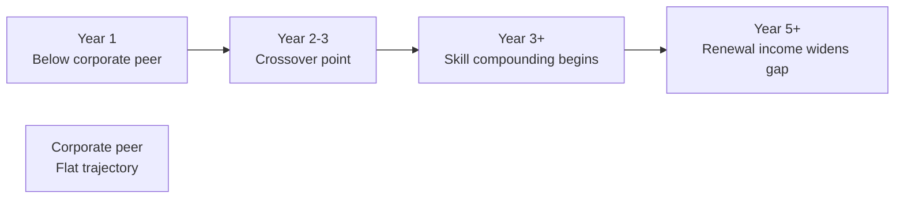

# Day 8 — Career Sharing: The Path Ahead

> **The one idea for today:** What makes this career different from a 9-5 is not the income ceiling. It's the **earning pattern** — a curve that starts slow, bends hard in Year 3, and keeps compounding for 20+ years while most salaried careers plateau.

## What you'll walk away with

By the end of today you should be able to:

1. **Describe** the earning-pattern difference between a salaried career and an FC career.
2. **Evaluate** your own career against the 5 factors of an ideal career (work-life balance, impact, independence, income, job security).
3. **Define** what "infrastructure" means — and why the right systems matter more than raw effort.

---

## 1. The 5 factors of an ideal career

Before choosing a career, most people only think about one — income. The richer frame has five:

| Factor | What it means | Most corporate jobs | This career |
|---|---|---|---|
| **Work-life balance** | Control over when, where, how you work | Low–medium | Low in Y1–2, high in Y3+ |
| **Impact** | The work meaningfully changes someone's life | Varies | Direct, visible, durable |
| **Independence** | You decide scope, strategy, schedule | Very low | High from Day 1 |
| **Income** | Current and projected earning | Fixed salary + bonus | Uncapped, commission + renewals |
| **Job security** | Your ability to keep earning through disruption | False sense — tied to employer | Based on your own client base + skill |

Few careers score well on all 5. This one has the architecture to, **if you build it right.**

## 2. The earning pattern — why Year 3 matters

Here is the single most important chart a new FC must internalise.

  
— FC vs corporate peer · income over time —

  

    
$

    
time →

    
corporate peer (flat)

    
y1

    
y2

    
↑ compoundingy3

    
y4

    
y5

    
y6

    
y7

    
y8

  

**What this chart shows:**

- Year 1: You earn less than your corporate peer. This is the trap — most people quit here.
- Year 2: You catch up. Many careers cross over around here.
- Year 3+: The curve bends. You pull ahead, and the gap widens every year because of two compounding forces:
 1. **Skill compounding** — better prospecting + sales = more income per hour worked.
 2. **Passive income** — renewal commissions from prior clients show up regardless of what you do this month.

**The honest framing:** if you evaluate this career on Year 1 income, you will quit. If you evaluate it on Year 5+, you will stay.

### Active vs passive over the first 10 years

The AIA income model makes the shape of this curve very concrete. For an FC who consistently produces, the share of income arriving *passively* (renewals + Career Benefit + APF + PA-renewals) climbs aggressively year over year:

| Year | Total income | Passive % |
|---:|---:|---:|
| 1 | ~$85K | ~2% |
| 3 | ~$95K | ~50% |
| 5 | ~$116K | ~59% |
| 10 | ~$140K | **~66%** |

By Year 3 half your income is already passive. By Year 10 roughly **two-thirds** arrives whether or not you write a new case that month. That's the real reason consistent FCs eventually stop chasing FYC — the renewal layers carry the household.

> Run the live numbers for your own assumed production at the **Income Layers — Detailed** view in the Engage Point Play tool.

## 3. Why income guarantees exist — and what they really are

A common question from recruits: "what if I'm not earning enough in Year 1?"

Many agencies offer an **income guarantee** or allowance for qualifying new advisors. This is not "free money." It's a **bridge** — the agency is betting that you'll stick long enough to build a client base that self-sustains.

Treat it accordingly:
- It's not a salary. It runs out.
- It buys you runway to focus on skill-building, not survival.
- It's a gift of **time** — the scarcest resource for a new FC.

If you squander Year 1 on unproductive activity, no income guarantee will save you in Year 2.

## 4. Infrastructure — the quiet multiplier

"The right people and the wrong systems fail. The wrong people and the right systems fail faster. The right people AND the right systems compound."

Most new FCs obsess about **effort** (hours worked, calls made). The ones who break out focus on **infrastructure**:

| Infrastructure element | What it looks like |
|---|---|
| **CRM discipline** | Every meeting has a note within 24 hours. No exceptions. |
| **Content/posting system** | One piece of public content per week, produced by a repeatable template |
| **Referral workflow** | Every closed client has a referral ask within 60 days |
| **Study rhythm** | Fixed weekly time for product + SPIN + CPF study |
| **Mentor access** | Weekly 1-1, with an agenda, not just vibes |
| **Review cadence** | Sunday 30-min review of the week's reps + next week's plan |

You can work 60 hours a week with poor infrastructure and stay broke. You can work 35 hours a week with good infrastructure and outperform them.

  
— infrastructure, the quiet multiplier —

  

    

i.

CRM discipline

Note every meeting within 24h

    

ii.

Content system

One post per week, repeatable

    

iii.

Referral workflow

Ask within 60 days of close

    

iv.

Study rhythm

Fixed weekly product + SPIN time

    

v.

Mentor access

Weekly 1-1 with agenda

    

vi.

Review cadence

Sunday 30-min week review

  

## 5. Impact is the part no one talks about

The stories that bring FCs back 20 years later are not about income. They are about:

- The single mum whose CI claim paid for her child to stay in school.
- The retiree who didn't have to sell his home because his savings plan matured.
- The young family whose hospital plan covered an ICU stay that would have otherwise bankrupted them.

Impact is slow to arrive and uneven in distribution. You may work for 18 months before a claim moment happens to one of your clients. When it does, you'll remember why you started.

**Be the advisor your clients talk about at funerals.** That sounds dark. It's actually the highest bar in this profession.

## Quick quiz

1. **When does the earning curve in this career typically cross a corporate peer's?**
 - A) Month 6
 - B) End of Year 1
 - C) Year 2–3 ✓
 - D) Year 5

 **Why:** The earning-pattern chart shows Year 1 income below the corporate peer, a crossover around Year 2-3, and a widening gap from Year 3 onward as skill and renewal commissions compound. Month 6 (A) is still deep in the slow ramp. End of Year 1 (B) is too early — most FCs are still building their client base. Year 5 (D) would mean five years of under-earning before any advantage, which contradicts the chart.

2. **Day 8 closes with the line: "Be the advisor your clients talk about at funerals." What's the actual lesson behind it?**
 - A) Funeral preplanning is a high-impact product line to lead with
 - B) Impact is the part of the career no one talks about — slow to arrive, but it's why FCs are still in the chair 20 years in ✓
 - C) Estate planning is the highest-margin segment, so prioritise affluent clients
 - D) Maintain a record of which clients pass away each year for accurate client-base metrics

 **Why:** The "Impact" section reads the line literally — an FC's work surfaces at a family's gravest moments (CI claims that keep a child in school, savings plans that prevent a forced home sale, hospital plans that absorb an ICU bill). Those moments are what bring FCs back to the office decade after decade. The earnings chart explains why you stay *financially*; impact explains why you stay *emotionally*. A and C misread the line as product or segment advice — neither belongs to this section. D reduces an emotional anchor of the career to a bookkeeping task.

3. **Which of these is NOT infrastructure?**
 - A) Sunday 30-min review of the week
 - B) CRM note within 24 hours of every meeting
 - C) Working more hours than last week ✓
 - D) Weekly 1-1 with mentor, with agenda

 **Why:** Infrastructure is a system that multiplies effort — CRM discipline, review cadences, mentor access are all named examples in today's table. Working more hours is raw effort, not a system. As the lesson states, you can work 60 hours a week with poor infrastructure and stay broke. More hours without better systems just amplifies existing inefficiency.

4. **A new FC in Month 8 is discouraged because her income is lower than her former salary. Based on today's earning-pattern lesson, what is the most accurate reframe?**
 - A) She should consider switching to a salaried role while the market is tough
 - B) Month 8 is still in the slow part of the curve; evaluating on Year 1 income leads most FCs to quit prematurely ✓
 - C) Her income should already be higher than a corporate peer by Month 8
 - D) If she works twice as many hours, she will immediately cross her former salary

 **Why:** The lesson explicitly states: "if you evaluate this career on Year 1 income, you will quit." Month 8 is still Year 1 — the trap the chart warns against. Switching to salaried (A) is exactly the response that cuts the compounding curve short. Crossing peers by Month 8 (C) is wrong per the chart. Doubling hours (D) conflates effort with infrastructure; raw hours don't produce an immediate income jump.

5. **Which of the five career factors does this career score lowest on during Year 1–2, but highest on by Year 3+?**
 - A) Impact
 - B) Independence
 - C) Work-life balance ✓
 - D) Job security

 **Why:** The five-factor table explicitly scores work-life balance as "Low in Y1-2, high in Y3+" — the only factor with that trajectory. Impact is direct and visible from the first claim moment, not delayed. Independence is high from Day 1 per the table. Job security is described as being based on your own client base and skill, which builds over time but is not the factor with the starkest Y1-vs-Y3 contrast.

6. **Two FCs both work 45 hours a week. FC A has a CRM, a weekly mentor review, and a referral workflow. FC B relies on memory and works by instinct. After three years, who is more likely to outperform — and why?**
 - A) FC B, because instinct develops faster than systems
 - B) FC A, because infrastructure compounds skill and income over time ✓
 - C) They will be equal — effort is the only variable that matters
 - D) FC B, because rigid systems slow down client relationships

 **Why:** The lesson is unambiguous: "you can work 35 hours a week with good infrastructure and outperform" someone working 60 hours without it. Systems compound because every referral asked, every CRM note written, and every mentor session compounds the next one. Instinct (A) is not the variable — systems are. Effort parity (C) ignores the multiplier effect. Systems don't slow relationships (D); they make follow-up more consistent, which clients experience as attentiveness.

7. **The reason passive income (renewal commissions) is described as a "compounding force" is:**
 - A) Renewal rates increase every year the client ages
 - B) Each well-serviced policy adds to a client base that pays regardless of this month's new sales ✓
 - C) The commission percentage doubles after Year 3
 - D) Clients automatically refer friends, multiplying the client base with no extra effort

 **Why:** Renewal commissions are passive because the work was done once (the sale and service) and keeps generating income every year the client maintains the policy. Each new policy adds to the client base, so the passive layer grows with every year of production. Renewal rates do not increase with age (A). Commission percentages do not double at Year 3 (C). Referrals are a separate benefit — they do not happen automatically without a referral workflow (D).

---

## Related

- Previous: [[day-07|Day 7 — The Insurance Industry & AIA Singapore]]
- Next: [[day-09|Day 9 — The Poor, The Middle Class, and The Rich]]
