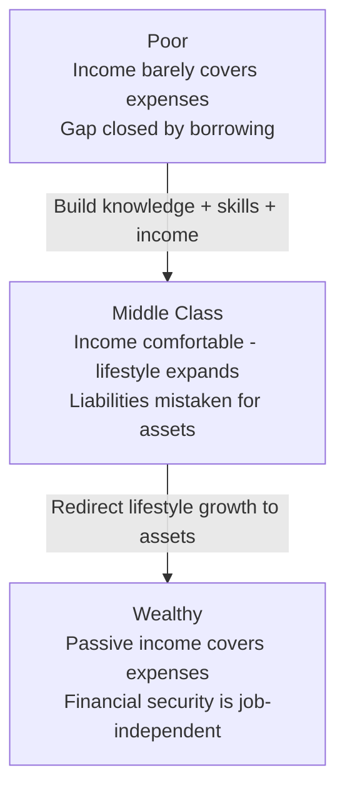
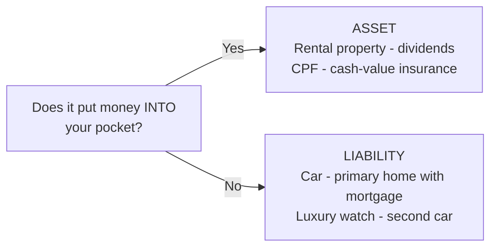

# Day 9 — The Poor, The Middle Class, and The Rich

> **The one idea for today:** The three classes are not defined by income. They're defined by **what happens between pay cheques.** That's the frame that lets you actually help a client — no matter how much they earn.

## What you'll walk away with

By the end of today you should be able to:

1. **Classify** a household as poor, middle class, or wealthy based on cash-flow behaviour, not salary.
2. **Explain** why "looking rich" often means being poor, and why the middle class can stay stuck for decades.
3. **Frame** your purpose as helping a middle-class client begin the slow move to wealth.

---

## 1. The real definitions — by cash flow, not salary

Forget income brackets. The three classes are behavioural.

### The Poor
- **Income:** barely covers expenses.
- **Savings:** near zero.
- **Between pay cheques:** the gap is closed by borrowing, favours, or going without.
- **Primary need right now:** build **knowledge, skills, and experience** — these are the only things that raise income.

### The Middle Class
- **Income:** covers expenses comfortably. Sometimes very comfortably.
- **Savings:** some. Often sitting in a bank account earning less than inflation.
- **Between pay cheques:** lifestyle expands to match income. Cars, condos, phones, holidays.
- **Trap:** "Rich people acquire assets. The poor and middle class acquire liabilities they think are assets." — Robert Kiyosaki.
- **Primary need right now:** learn the **asset vs liability distinction** and start redirecting lifestyle growth into asset acquisition.

### The Wealthy
- **Income:** may be high, but that's not the point.
- **Savings / investments:** produce passive income.
- **Between pay cheques:** doesn't matter — passive income covers expenses.
- **Defining feature:** **financial security is independent of their job.** They can quit tomorrow and not starve.
- **Next move:** preserve wealth, pass it on, sometimes re-invest.

### The cash flow tells the story

The clearest way to see the three classes is to draw what happens to a single dollar that lands in their hands. The classic illustration:

The same idea, rebuilt in our own visual language:

  
— three cash-flow patterns —

  

    

      
Poor

      

        
Income Statement

        

          
Income

          
Salary

          
Expenses

          
Taxes Rent Food Transport Clothes

        

      

      

        
Balance Sheet

        

          

            
Assets

            
—

          

          

            
Liabilities

            
—

          

        

      

      
Salary in → all of it back out

    

    

      
Middle Class

      

        
Income Statement

        

          
Income

          
Salary

          
Expenses

          
Taxes Mortgage payment Car payment Credit card School loan

        

      

      

        
Balance Sheet

        

          

            
Assets

            
—

          

          

            
Liabilities

            
Mortgage Car loan Credit card School loan

          

        

      

      
Salary in → out → servicing liabilities

    

    

      
Rich

      

        
Income Statement

        

          
Income

          
Rental income Dividends Interest Royalties

          
Expenses

          
Taxes Mortgage payment

        

      

      

        
Balance Sheet

        

          

            
Assets

            
Real estate Stocks Bonds Notes Intellectual property

          

          

            
Liabilities

            
Mortgage Consumer loans Credit cards

          

        

      

      
Assets → income → expenses → margin → more assets

    

  

  
The poor and middle class trade time for income. The rich own things that produce income while they sleep. Same currency, opposite direction.

**The key insight:** some people earning $15K/month are poor (by behaviour). Some earning $6K/month are on a clear path to wealth (by behaviour). Your job isn't to judge income — it's to read the pattern.

## 2. Why the middle class is the hardest to help

The poor know they have a problem. The wealthy don't have the problem anymore. The middle class **has the illusion of not having a problem** — and that's why they're stuck.

The illusion sounds like:
- "I have a stable job."
- "I save some money every month."
- "I have the hospitalisation plan my company gave me."
- "I'll figure out retirement later."

Every one of these statements is a **future-killer** dressed up as reassurance.

The middle-class client needs you to ask three questions gently:
1. **If your income stopped next month, how long could your lifestyle continue?**
2. **What percentage of what you own actually puts money back into your pocket?**
3. **If nothing changes for the next 20 years, where do you end up?**

The answers are usually sobering. That's the moment you earn the right to help.

## 3. Assets vs liabilities — the 60-second rule

**An asset puts money INTO your pocket.**
**A liability takes money OUT of your pocket.**

That's the whole rule.

| Commonly called an "asset" | Actually a... |
|---|---|
| A car | Liability (petrol, insurance, depreciation) |
| A second car | Bigger liability |
| Your primary home (with mortgage) | Mostly liability until it's paid off |
| A rental property with tenants | **Asset** (rent > costs) |
| Investment portfolio throwing dividends | **Asset** |
| Cash-value insurance with living cash value | **Asset** |
| A luxury watch | Liability (mostly — some collectibles appreciate) |
| CPF funds compounding | **Asset** |

**Net worth = What you own − What you owe.**

Run the calculation on yourself tonight. Most people are surprised.

## 4. The "looking rich" problem

Singapore is a high-signalling society. A $120K income with a Tesla, a condo, an expensive watch, and annual European holidays *looks* wealthy. On the inside, the same person often:

- Has 2 months of emergency savings (or less).
- Has minimal CI / disability coverage.
- Couldn't afford a 20% income drop for 6 months.
- Has more liabilities than assets on a real balance sheet.

This is not a moral failing. It's a pattern installed by marketing, social pressure, and absent education.

**The frame to use with clients (gently):**
> "Looking rich and being rich are two different projects. The first one costs you. The second one pays you."

Most clients have never heard it put that way.

## 5. Your mission

Most FCs describe their job as "selling insurance." That's the wrong description.

A better one: **helping middle-class and poor people begin the quiet, systematic move toward wealth.**

That's a sentence worth writing on your bathroom mirror for the next 8 weeks.

It sounds big. It starts small:
- Helping someone cover a risk they hadn't considered.
- Setting up a $200/month investment plan that compounds for 30 years.
- Explaining CPF in a way their HR never did.
- Being honest about what they don't need.

None of these moments feel heroic on the day. Stack enough of them across a career, and you've helped hundreds of families cross a line their parents never crossed.

## Quick quiz

1. **An asset is defined as:**
 - A) Something you own outright
 - B) Something worth more than $10,000
 - C) Something that puts money into your pocket ✓
 - D) A property or stock

 **Why:** Today's 60-second rule is explicit: an asset puts money into your pocket; a liability takes money out. Ownership alone (A) is irrelevant — a car you own outright still costs you petrol, insurance, and depreciation. Dollar value (B) has nothing to do with direction of cash flow. Property and stocks (D) can be either, depending on whether they generate income — a primary home with a mortgage is mostly a liability until paid off.

2. **What's the primary trap for the middle class?**
 - A) Too low an income
 - B) Acquiring liabilities they believe are assets ✓
 - C) Paying too much tax
 - D) Living in expensive cities

 **Why:** The Kiyosaki quote at the core of today's lesson states this directly: "the poor and middle class acquire liabilities they think are assets." The trap is not income level (A) — the middle class often earns comfortably — it is the misclassification of cars, condos, and watches as wealth-building. Tax (C) and city costs (D) are real pressures but not the structural behavioural trap this framework identifies.

3. **The defining feature of being wealthy, by this framework:**
 - A) Earning above $500K/year
 - B) Owning property
 - C) Having financial security that's independent of your job ✓
 - D) Being in the top 1% of net worth

 **Why:** The framework defines wealth by cash-flow behaviour, not salary or net worth. The wealthy person's passive income covers expenses — meaning they could quit tomorrow without financial consequence. High income (A) doesn't equal wealth if it all gets spent. Property (B) is only an asset if it produces more income than it costs. Top 1% net worth (D) is an outcome, not the behavioural definition this lesson uses.

4. **A client earns $18,000/month, drives a Tesla, lives in a condo, and has $10,000 in savings. By the cash-flow framework, how would you classify them?**
 - A) Wealthy — their income is very high
 - B) Middle class — comfortable income but liabilities likely exceed assets ✓
 - C) Poor — $10,000 savings is below the poverty line
 - D) Wealthy — they own a property (the condo)

 **Why:** The "looking rich" section describes this exact profile: Tesla, condo, high income, minimal savings. High lifestyle signalling with minimal assets and 2 months or less of savings is the middle-class pattern, not the wealthy pattern. The wealthy are defined by passive income covering expenses, not by income level (A). $10,000 savings is not a poverty indicator (C). A condo with a mortgage is mostly a liability, not a wealth signal (D).

5. **You ask a middle-class client: "If your income stopped next month, how long could your lifestyle continue?" They say "about 6 weeks." What does this reveal?**
 - A) They are on a clear path to wealth with a solid emergency fund
 - B) They have less than 2 months of emergency savings and are financially fragile despite their salary ✓
 - C) 6 weeks is the recommended emergency buffer for most Singaporeans
 - D) This is a normal result — most Singaporeans keep 4–6 weeks of savings

 **Why:** Six weeks is under two months of coverage, which today's content flags as characteristic of the "looking rich" profile — someone who appears comfortable but cannot absorb even a short income disruption. It is not a sign of wealth (A). The recommended buffer from tomorrow's pyramid is 3-6 months, not 6 weeks (C). Normalising 6 weeks (D) would shut down the diagnostic moment the question was designed to open.

6. **Which of the following is correctly classified as an ASSET under today's definition?**
 - A) A personal car used for daily commute
 - B) A primary home with an outstanding mortgage
 - C) A rental property where rent exceeds all costs ✓
 - D) A luxury watch purchased as a "store of value"

 **Why:** The asset table in today's lesson makes this explicit: a rental property where rent exceeds costs puts money into your pocket — the definition of an asset. A commuter car (A) costs petrol, insurance, and depreciation — pure liability. A primary home with a mortgage (B) is listed in today's table as "mostly liability until it's paid off." A luxury watch (D) is listed as a liability, with a narrow exception for collectibles that appreciate.

7. **The quote "looking rich and being rich are two different projects" is most useful in a client conversation when:**
 - A) You want to upsell a client from term to whole-life coverage
 - B) A high-income client has minimal assets and resists acknowledging a financial gap ✓
 - C) A client asks why AIA's premiums are higher than competitors
 - D) You need to explain the difference between CI and hospitalisation coverage

 **Why:** The quote is designed to create a gentle cognitive shift for high-income clients who equate their lifestyle with financial security. When someone earns well but has a weak balance sheet and resists the gap conversation, this frame distinguishes two projects they might be conflating. It has nothing to do with product comparisons (A, C) or coverage categories (D), which require different explanations entirely.

---

## Related

- Previous: [[day-08|Day 8 — Career Sharing: The Path Ahead]]
- Next: [[day-10|Day 10 — Your Greatest Purchase = Freedom]]
