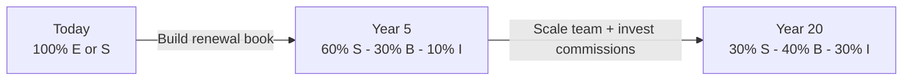

# Day 11 — The Cashflow Quadrant: Beyond 9–5

> **The one idea for today:** There are only four places income can come from. Most people spend their whole lives in the two lowest-leverage quadrants — and never know there's a choice.

## What you'll walk away with

By the end of today you should be able to:

1. **Map** any income stream (yours or a client's) to one of four quadrants: E, S, B, I.
2. **Explain** why this career is architecturally a "B" (Business) opportunity, not an "S" (Self-employed) one.
3. **Identify** which quadrant your current and future income should come from, in what proportion.

---

## 1. The four quadrants

Robert Kiyosaki's framework, stripped to its bones:

  

    
Active Income
trade time for money

    
Passive Income
money works for you

  

  

    

      
E — Employee

      
Works for someone else. Income = hours × rate. Tax: highest.

    

    

      
B — Business owner

      
Owns a system that others operate. Tax: best structures.

    

    

      
S — Self-employed

      
Works for themselves. Income = hours × rate (usually higher). Tax: high.

    

    

      
I — Investor

      
Money generates money. Dividends, rent, capital gains. Tax: favoured.

    

  

**E (Employee):** 90% of the world's workforce. Predictable. Low autonomy. Capped income. Taxed the hardest.

**S (Self-employed):** Freelancers, doctors in own practice, solo consultants. Higher income per hour, but **you are still the product.** If you stop, income stops.

**B (Business):** You own a system that runs without you. Franchise owner, software company founder, and — critically — **a financial advisor with a large renewal book.**

**I (Investor):** Pure capital at work. Dividends, interest, rent, appreciation.

**The compounding truth:** most wealth is built in the right-hand column. Most paycheques come from the left.

  

    

    

      
Active income
trade time

      
Passive income
money works

    

    

      Owns system
      Works for others
    

    

      

        
S — Self-employed

        
Owns a job. You are the product.

      

      

        
B — Business owner

        
System runs without you.

      

      

        
E — Employee

        
Trades hours for a paycheque.

      

      

        
I — Investor

        
Capital does the work.

      

    

  

## 2. Where this career lives

Many new FCs think of themselves as **S** — self-employed, trading hours for commission. That's a Year-1 reality, not a destination.

The architecture of this career is actually:

- **Year 1–2:** You're in **S**. You're the only productive unit. Every dollar earned is a dollar you personally generated.
- **Year 3+:** Your renewal book starts throwing off income that arrives **regardless of today's effort.** You've crossed partway into **B**.
- **Year 5+:** If you've hired associates, built a content/lead-gen engine, or built a referral partnership network — you're running a small **B** with real passive leverage.
- **Year 7+:** Your investments (seeded by higher income) start producing **I** income.

The same person, same career, moving through the quadrants. This is rare. Most careers lock you into E forever.

## 3. Recurring vs non-recurring revenue

Here's the mechanism that makes the quadrant shift possible.

### Non-recurring revenue
You do the work. You get paid once.
- One-off consulting project.
- A house sale (for an agent).
- A legal case settlement.
- A first-year-commission-only insurance product.

### Recurring revenue
You do the work once. You keep getting paid.
- A subscription software license.
- A tenant paying rent.
- A dividend-paying stock.
- **A renewal commission** on a policy the client keeps.

**Why this matters for FCs:** every policy you service properly produces income **every year the client keeps it.** A 30-year-old client on a well-fit plan can be paying you renewal commissions into your 60s.

Stack that across 200 clients over 10 years, and you have a machine.

**Subscription economics show up everywhere.** Before you quit on Year 1, list the subscription businesses you already use — Netflix, Spotify, gym memberships, mobile plans, software, streaming. Their owners love them for the same reason your future self will love a well-serviced client book: **predictable, recurring income.**

## 4. The other passive lever — building a team

The renewal book is one passive layer. There's a second one most new FCs don't think about until later — and underestimating it is one of the more common reasons FCs cap their income at the S-quadrant ceiling.

**Override commissions.** When you recruit and mentor a new FC under your line and they sell a policy, AIA pays you an override — a percentage of their commission. The mechanics are simple, the math compounds fast:

- One associate writing $10K FYC/month at a ~30% override ≈ $3K/month flowing to you, on top of your own production.
- Three productive associates ≈ $9K/month before you do anything personally.
- A team of ten producing consistently is a layer of income that scales without scaling your own hours.

That is the textbook **B-quadrant move**: you're no longer trading hours for income, you're earning on a system of people you've recruited, trained, and mentored. The income arrives whether or not you sell anything personally that month.

**The two passive layers compound together:**

| Lever | Source of income | Scales when you... |
|---|---|---|
| **Renewal book** | Your past work paying you forward (your sold policies, every year the client keeps them) | Sell consistently and service well |
| **Team overrides** | Other people's current work paying you (a percentage of every policy your downline writes) | Recruit, train, and mentor producers |

Most senior FCs who reach Year 7+ in good standing have both. The ones who reach $1M+ income have built the team layer deliberately — usually starting in Year 3 or 4 once their own production is stable.

### When to start — and when not to

There's a real trap here: recruiting too early, before you've personally hit a productive rhythm. If you can't yet sell consistently, you can't credibly mentor someone else to do it — and a downline you can't mentor produces nothing for either of you. The honest sequence:

  
— when to recruit, in honest stages —

  

    

      
Year 1–2

      
Build your own muscle

      
Do the thing before you teach it. No recruiting yet.

    

    

      
Year 3+

      
Recruit selectively

      
Personal rhythm solid. Quality over quantity.

    

    

      
Year 5+

      
A small team carries the slow months

      
3–6 productive associates. Override income shows up.

    

    

      
Year 10+

      
Full agency

      
Time mostly on mentoring. Overrides are a major part of income.

    

  

  
You don't commit to becoming an agency leader on Day 1. You just acknowledge the option exists.

You are not committing to becoming an agency leader on Day 1. You are just acknowledging that **the option exists, that it's a deliberate B-quadrant move, and that the ceiling on what you can earn lifts dramatically when you build people, not just policies.**

## 5. Why most people never leave the left-hand side

Three reasons. None of them are about intelligence or effort.

1. **School trains you for E.** The entire education system is optimised to produce employees. You learn how to follow instructions, pass standardised tests, and defer to authority.
2. **The S-to-B jump is scary.** It requires giving up full control, hiring, building systems you can't personally oversee in real time. Most self-employed people stay S forever because S is safer than B.
3. **I requires capital.** Most people don't save enough to meaningfully invest, because their lifestyle eats their income.

**The FC career quietly solves all three:**
- Training is structured, not academic — you learn by doing.
- The S-to-B jump happens gradually through the renewal book, not a risky leap.
- Higher income creates capital to invest, which builds the I layer over time.

That's why this career is a genuine quadrant-crossing vehicle — if you last long enough to see it happen.

## 6. The honest starting point

Don't pretend you're further along than you are. Most people in Week 2 of this program:

- **Source of income today:** 100% E or S (job or freelancing).
- **Source of income in 5 years, if you stay:** ~60% S, ~30% B (renewal book), ~10% I.
- **Source of income in 20 years, if you stay and build:** ~30% S, ~40% B, ~30% I.

The goal isn't to hate your E income. It's to **stop it from being 100% of your income.**

Every policy you sell well is a vote for your future B. Every dollar invested from that commission is a vote for your future I.

You don't need to quit anything. You just need to start shifting the mix.

## Quick quiz

1. **In the cashflow quadrant, where is a self-employed doctor with their own practice?**
 - A) E
 - B) S ✓
 - C) B
 - D) I

 **Why:** S is defined as self-employed — you work for yourself, your income equals hours times rate, and income stops when you stop. A doctor in their own practice is the textbook S example: higher rate per hour than an employee, but still the sole productive unit. E requires working for someone else. B requires owning a system that others operate without you. I requires capital generating returns independently of your effort.

2. **Which of these are mechanisms that turn an FC from S into B over time? (Select all that apply.)**
 - A) Recruiting and mentoring a team of advisors whose production you earn override commissions on ✓
 - B) Making more cold calls each week
 - C) A renewal book that produces recurring income regardless of daily effort ✓
 - D) Selling the business

 **Why:** Both A and C are real S→B mechanisms — Day 11 names them as the two passive layers that compound together. The renewal book (C) is your past work paying you forward: every serviced policy generates income each year the client keeps it. Team overrides (A) are other people's current work paying you: when an FC you recruited and mentored sells a policy, you earn a percentage — income that arrives whether or not you sold anything personally. Most senior FCs who break the S-quadrant ceiling have built both layers deliberately. Cold calls (B) generate new active income but stay firmly in S — every dollar is one you personally produced. Selling the business (D) exits the career rather than transitioning quadrants.

3. **Non-recurring revenue means:**
 - A) Monthly income
 - B) You do the work once and get paid once ✓
 - C) Income that can be cancelled anytime
 - D) Gig-economy pay

 **Why:** Today's definition is precise: non-recurring revenue means you do the work and get paid once — the payment does not repeat without new work. Monthly income (A) can be either recurring or non-recurring depending on the structure. Cancellability (C) describes a different risk attribute. Gig-economy pay (D) is typically non-recurring but the definition is about the payment structure, not the delivery model.

4. **A freelance graphic designer charges $5,000 per project. She works for herself and sets her own hours. Which quadrant does she occupy?**
 - A) E — she works under client contracts
 - B) S — she is self-employed and income stops when she stops ✓
 - C) B — she owns her own business
 - D) I — design skills are an intangible asset

 **Why:** Self-employment with personal delivery is the S definition. Her income equals her output — when she stops working, the income stops. Working under client contracts (A) does not make someone an employee; the key is who she works for and whether a system replaces her. Owning a business (C) requires a system running without her personal labour. Design skills are not capital generating passive returns (D).

5. **An FC in Year 6 has 300 active clients, two junior associates she mentors, and a referral engine that generates 4 new leads per month without her active involvement. Which quadrant shift best describes her situation?**
 - A) Still in S — she is personally licensed and still serves clients
 - B) Transitioning from S into B — a system runs without requiring her daily effort ✓
 - C) Fully in I — passive income now exceeds active income
 - D) In E — she is effectively employed by her clients

 **Why:** Today's progression table places Year 5+ FCs in a partial B position when they have associates, a content/lead-gen engine, or a referral network — all present here. She has not fully crossed into B (still personal delivery) and is certainly not in I (C), which requires capital returns exceeding active income. Retaining her licence does not keep her in S (A) if a system now generates leads without her. She is not employed by clients (D).

6. **Why does school training make the E-to-B quadrant shift harder for most people?**
 - A) School teaches investment strategies that favour the I quadrant instead
 - B) School optimises students to follow instructions and defer to authority, reinforcing the E mindset ✓
 - C) School discourages savings, leaving people without capital to invest
 - D) School teaches sales skills that only work in the S quadrant

 **Why:** Today's section on why most people never leave the left-hand side states this directly: "the entire education system is optimised to produce employees. You learn how to follow instructions, pass standardised tests, and defer to authority." School does not teach investment strategy at the level of quadrant I (A), nor does it explicitly discourage savings (C). School does not teach sales skills in any quadrant (D).

7. **A new FC is debating whether to leave because Year 1 commissions are low. The cashflow quadrant lesson suggests the most important question to ask is:**
 - A) "Am I closing enough policies this month?"
 - B) "Is my renewal book growing in a way that will shift me from S toward B over time?" ✓
 - C) "Should I move to an IFA model to access more products?"
 - D) "Is my hourly rate competitive with my corporate peer's salary?"

 **Why:** The quadrant lesson reframes the career decision from monthly commission (S thinking) to whether the recurring-revenue engine is being built (B trajectory). A renewal book growing now will pay into the future regardless of this month's production. Closing count (A) and hourly rate (D) both measure S-quadrant performance. Moving to an IFA model (C) is a product-access question that doesn't change the quadrant logic.

8. **A Year-2 FC is excited about override income and wants to start recruiting a downline immediately. Based on Day 11's sequencing rule, what's the strongest counsel?**
 - A) Recruit early — every month delayed is override income lost
 - B) Don't ever recruit; the renewal book is enough
 - C) Build personal production first; you can't credibly mentor someone in a craft you haven't yet stabilised yourself ✓
 - D) Wait until Year 5 minimum before considering recruitment

 **Why:** Day 11's sequencing is explicit: build your own production muscle in Years 1–2 before recruiting, because you have to do the thing before you can teach it. A skips the credibility step — a downline you can't mentor produces nothing for either of you. B treats team override as optional, but Day 11 names it as the second passive layer that lifts the income ceiling. D is too rigid; the section recommends starting selective recruitment in Year 3+, not Year 5+.

---

## Related

- Previous: [[day-10|Day 10 — Your Greatest Purchase = Freedom]]
- Next: [[day-12|Day 12 — The Financial Freedom Pyramid]]
