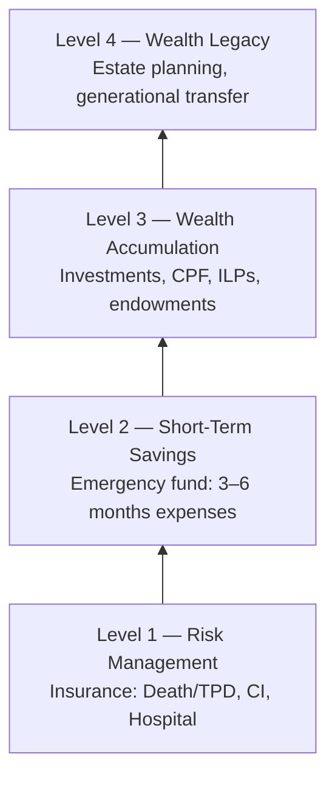

# Day 12 — The Financial Freedom Pyramid

> **The one idea for today:** Every financial plan is built bottom-up. When a client tries to skip a level, your job is to bring them back to the foundation — gently, but firmly. Shortcuts cost lives.

## What you'll walk away with

By the end of today you should be able to:

1. **Draw** the four-level pyramid from memory and explain what fits on each level.
2. **Diagnose** which level a client is *actually* on, versus the level their lifestyle suggests.
3. **Use** the pyramid as the mental map for every recommendation you make.

---

## 1. The pyramid — from memory

You already saw this on Day 10. Today you lock it in.

**The non-negotiable rule:** you cannot permanently build a level above without the level below. Any plan that does so is a tower on sand.

## 2. Level 1 — Risk Management (the foundation)

**Purpose:** ensure that one uncontrollable event doesn't destroy everything above it.

**Components:**
- **Death / TPD cover** (~10× annual income).
- **Critical Illness cover** (~5× for Major CI, ~2× for Early CI).
- **Hospitalisation + Rider** (the bill-payer for medical events).
- **Personal accident cover** (for specific risks — especially if you travel/ride).
- **Disability income cover** (for longer-term work inability).

**Symptom of a weak Level 1:**
- "My company has hospitalisation for me."
- "My life insurance is $50,000 through work."
- "I don't want to think about dying."

**Rule:** no meaningful accumulation planning happens until Level 1 is solid.

## 3. Level 2 — Short-Term Savings

**Purpose:** cover the **temporary risks** (Day 2). Loss of job, medical copays, broken appliance, sudden travel.

**Target:** **3–6 months of expenses** in an easily accessible account. Not invested, not locked up — liquid.

**Why this isn't Level 1:** emergency savings protect you from inconvenience. Insurance protects you from catastrophe. Different problems; different tools.

**Symptom of a weak Level 2:**
- A $2,000 surprise expense becomes a credit card debt.
- The person has investments but can't access them without penalty.
- Every unexpected bill triggers a small financial crisis.

## 4. Level 3 — Wealth Accumulation

**Purpose:** grow your money faster than inflation, over long enough to matter.

**Components:**
- **CPF** — your mandatory forced-saving mechanism, with decent returns.
- **Endowment plans** — fixed savings plans with life cover attached.
- **Investment-Linked Plans (ILPs)** — insurance wrapper around investment funds.
- **Direct investments** — stocks, bonds, ETFs, unit trusts.
- **Property** — if it makes financial sense (often it doesn't for primary homes).

**The key insight:** accumulation is not about picking the hottest asset. It's about:
1. **Consistency** (regular contributions).
2. **Diversification** (don't bet on one sector).
3. **Time horizon** (start young, leave alone).

Ten years of consistent investing beats one well-timed bet 99% of the time.

**Symptom of a weak Level 3:**
- Most savings sitting in a bank account losing to inflation.
- One-time lump-sum investments with no regular contribution.
- Chasing last year's best-performing fund.

## 5. Level 4 — Wealth Legacy

**Purpose:** what you leave behind, and to whom.

**Components:**
- **Will** — updated, witnessed, locatable.
- **CPF nominations** — most people's biggest asset passes by nomination, not will.
- **Trust structures** — for clients with complex families, business interests, or tax concerns.
- **Life insurance as an estate-equalisation tool** — critical for clients with illiquid assets like businesses or properties.
- **Gifting / philanthropic planning.**

You will rarely have Legacy conversations with new clients. But you'll serve them long enough that these conversations will arrive.

## 6. How to use this in every meeting

Treat the pyramid as a **diagnostic tool.** In every fact-finding meeting, silently check:

| Level | Question |
|---|---|
| 1 | Are the four risks (death, CI, hospital, disability) adequately covered? |
| 2 | Can this household survive 3–6 months of lost income? |
| 3 | Is there a regular, diversified accumulation plan? |
| 4 | Are will, CPF nominations, and dependents' plans in place? |

**When you find a gap:** start at the lowest missing level. Don't try to fill all gaps at once. Most clients can't absorb more than one or two decisions per meeting.

## 7. The common mistake — selling above the client's real level

The pressure of monthly targets can push new FCs into selling a Level 3 (ILP) product to a client with a clear Level 1 gap.

**Why this is wrong:**
- A CI diagnosis forces the client to surrender the ILP at a loss.
- The commission is clawed back, or at least the client relationship breaks.
- The client tells ten friends not to work with you.

**The discipline:** even when quota is tight, build bottom-up. A smaller Level 1 policy sold correctly is worth more over a career than a larger Level 3 policy sold at the wrong level.

## Quick quiz

1. **Which level of the pyramid is the foundation?**
 - A) Short-term savings
 - B) Risk management ✓
 - C) Wealth accumulation
 - D) Wealth legacy

 **Why:** Level 1 is Risk Management — the non-negotiable foundation. The pyramid's core rule is that no level above can be permanently built without the one below. Short-term savings is Level 2, wealth accumulation is Level 3, and wealth legacy is Level 4. One uninsured CI diagnosis can force a client to surrender their Level 3 portfolio, which is exactly what Level 1 exists to prevent.

2. **A 25-year-old client with $500/month to allocate. Their company offers hospitalisation. What's your first priority?**
 - A) Start a regular savings plan immediately
 - B) Check Level 1 gaps (Death/TPD, CI, private hospital plan) ✓
 - C) Begin wealth preservation
 - D) Open an ILP

 **Why:** An employer hospital plan is a common Level 1 symptom — it creates the illusion of a solid foundation while leaving Death/TPD, CI, and private-tier hospitalisation uncovered. Today's lesson lists "my company has hospitalisation for me" as a weak-Level-1 symptom. A savings plan (A) and an ILP (D) are Level 2 and 3 respectively, and should not be recommended before Level 1 is checked. Wealth preservation (C) is Level 4 — many levels too early.

3. **What distinguishes Level 2 from Level 1?**
 - A) Level 2 is insurance; Level 1 is savings
 - B) Level 1 handles catastrophic risks; Level 2 handles temporary risks ✓
 - C) Level 2 is CPF; Level 1 is private plans
 - D) Level 1 is for young people; Level 2 is for older people

 **Why:** Today's content states clearly that insurance protects you from catastrophe (Level 1) while emergency savings protect you from inconvenience (Level 2) — different problems requiring different tools. A reverses the tools incorrectly. CPF is part of Level 3 accumulation, not Level 2. The pyramid is not age-segmented (D) — every adult needs all four levels regardless of age.

4. **A client is enthusiastic about starting an ILP (Level 3). During fact-finding you learn he has no CI coverage and only a basic employer hospital plan. What is the correct next step?**
 - A) Start the ILP — the client's enthusiasm means higher retention
 - B) Sell a smaller ILP and add CI as a rider to keep it simple
 - C) Redirect the conversation to Level 1 gaps before recommending any accumulation product ✓
 - D) Defer CI coverage until the ILP matures and provides cash value

 **Why:** This is the exact scenario today's "common mistake" section describes. A CI diagnosis could force the client to surrender the ILP at a loss, breaking the relationship and triggering negative word-of-mouth. Enthusiasm does not override a structural gap (A). Bundling CI as a rider does not address the discipline of building bottom-up — and a rider on an ILP is not the same as standalone Level 1 coverage (B). Deferring CI to wait for ILP cash value (D) is exactly the sequence the pyramid forbids.

5. **Which of the following is a symptom of a weak Level 2, NOT a weak Level 1?**
 - A) "My death coverage is only $50,000 through my employer."
 - B) "I don't have any CI plan."
 - C) "A $2,000 surprise expense last month became credit card debt." ✓
 - D) "My hospital plan ends when I leave my company."

 **Why:** Level 2 is the emergency fund — 3-6 months of liquid expenses. A $2,000 surprise triggering credit card debt signals a near-zero emergency buffer, which is the Level 2 symptom listed in today's content. Inadequate death coverage (A), no CI plan (B), and employer-dependent hospital cover (D) are all Level 1 gaps — catastrophic risk exposure, not temporary-expense exposure.

6. **Why is selling an ILP to a client with a clear Level 1 gap described as a risk to your career, not just the client?**
 - A) ILPs are not suitable for clients without existing CI cover under MAS regulations
 - B) A CI diagnosis could force the client to surrender the ILP at a loss, breaking the relationship and triggering negative word-of-mouth ✓
 - C) The ILP commission will be clawed back immediately if the client has no hospitalisation plan
 - D) AIA does not allow ILP sales until Level 1 is complete

 **Why:** Today's "common mistake" section traces the exact causal chain: CI diagnosis forces ILP surrender at a loss, the client relationship breaks, and "the client tells ten friends not to work with you." That reputational damage compounds over a career. There is no MAS rule prohibiting ILPs for uninsured clients (A). Commission clawback (C) is a possibility in some cases but is not the stated reason here. There is no AIA policy requiring Level 1 completion before ILP sales (D).

7. **A client has a will, updated CPF nominations, and is planning a trust structure for her business. Which pyramid level is she working on?**
 - A) Level 2 — short-term savings
 - B) Level 3 — wealth accumulation
 - C) Level 4 — wealth legacy ✓
 - D) Level 1 — risk management

 **Why:** Level 4 components listed in today's content are exactly these: a will, CPF nominations, and trust structures for clients with complex families or business interests. Short-term savings (A) is a liquid emergency fund. Wealth accumulation (B) covers CPF contributions, endowments, ILPs, and investments. Risk management (D) covers Death/TPD, CI, hospitalisation, and disability cover.

---

## Related

- Previous: [[day-11|Day 11 — The Cashflow Quadrant]]
- Next: [[../week-3/day-13|Day 13 — Job A vs Job B]]
- Week 2 summary: [[README|Week 2 — Industry Context & The Freedom Business]]
