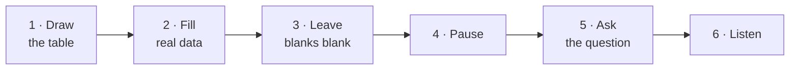

# Day 13 — Job A vs Job B

> **The one idea for today:** Two jobs can pay the same monthly salary and produce wildly different outcomes — because salary only pays when you show up well. The real comparison is what happens when you *can't* show up.

## What you'll walk away with

By the end of today you should be able to:

1. **Explain** the Job A vs Job B comparison to a client in under 2 minutes.
2. **Identify** which of your own income streams look like Job A vs Job B.
3. **Use** this frame to surface coverage gaps in any fact-finding conversation.

---

## 1. The story — Job A vs Job B

Imagine two offers arrive on the same day. Same industry, same seniority.

| | **Well** | **Sick / Injured** | **Dead** | **Hospitalised** | **Kids' college** | **Retirement** |
|---|---:|---:|---:|---:|---:|---:|
| **Job A** | $100,000 | $0 | $0 | $0 | $0 | $0 |
| **Job B** | $85,000 | $66,000 | $500,000 | Full coverage | $50,000 | $50,000/year |

Job A pays more *when you show up well.*
Job B pays less when well — but pays *in every scenario that matters.*

Which one do you take?

  

    
JOB A

    

      
Well$100,000

      
Sick / Injured$0

      
Dead$0

      
Hospitalised$0

      
Retirement$0

    

  

  

    
JOB B

    

      
Well$85,000

      
Sick / Injured$66,000

      
Dead$500,000

      
HospitalisedFull coverage

      
Retirement$50,000/yr

    

  

## 2. Why this matters — what you're really selling

Most people — including most of your future clients — evaluate a job offer using only the first column. Annual salary. Maybe bonus.

They ignore the other five columns entirely. Those columns are **benefit structures** — and they are the difference between a job that funds a good life and a job that leaves a family exposed.

**The uncomfortable truth for the client:** they are currently living on a Job A income. A standard salary pays when they show up. The moment they can't show up — sick, injured, critically ill, dead, retired — the payments stop.

**This is what you're selling when you sell a financial plan.** You are helping the client convert their Job A income into a Job B life. They agree to set aside roughly 10–20% of their income *today* — into protection and long-term savings. In exchange, their future selves get paid across every scenario Job A ignores:

- The retirement where they can finally stop showing up
- The critical-illness diagnosis they survive without selling the house
- The hospitalisation bill that doesn't eat their emergency fund
- The life payout that keeps their children on their feet if they're gone
- The education fund that survives Singapore's tuition inflation

The "cost" of Job B isn't a premium. It's the Job A version of them who wants to spend that 10–20% on lifestyle right now. Your job is to help them see the trade-off clearly — and choose it willingly.

Clients don't buy insurance. They buy the version of their life where they still have options in the worst scenarios.

## 3. The standard rebuttal — "but my company gives me benefits"

Most clients push back with some version of: "My company already gives me insurance."

Here's the frame that defuses it respectfully:

> "That's great — your company gives you *job benefits.* What they give you is tied to you keeping that job. If you leave, get laid off, or retire, the coverage disappears. I'd like to help you build benefits that are tied to *you,* not to your employer. So when the job ends (voluntarily or not), the protection stays."

This is true, non-pushy, and surfaces the real gap. Most client hospital plans and life insurance tied to employment are *portable only in the sense that you can pay to convert* — often at high premiums because you're older and possibly have new conditions.

## 4. The life-stage test

Use this checklist in any fact-finding meeting. Map the client's actual coverage against each life scenario.

| Scenario | What Job B requires | Common client reality |
|---|---|---|
| **Well, working** | Nothing extra — salary works | Usually fine |
| **Sick / temporarily injured** | Disability income / savings to cover 3–6 months | Often underfunded |
| **Critically ill** | CI payout 5× annual income for major CI | Usually 0 or grossly underfunded |
| **Dead** | Life insurance 10× annual income | Employer policies: 1–3× at best |
| **Hospitalised** | Max-tier hospital plan + rider | Employer plan ends with employment |
| **Kids' education** | Dedicated savings / endowment plan started early | Usually unplanned — CPF cannot be used to pay school or university fees, so it falls entirely on savings, loans, or scholarships the family may or may not win |
| **Retirement** | Income stream ~70% of working income | Most Singaporeans under-save |

A Job A client with gaps in 4+ rows is one bad week away from a catastrophe they can't fix retroactively.

## 5. How to use this in a meeting

The Job A / Job B table is a great visual tool. You can draw it on a piece of paper in 30 seconds.

1. Draw the two-row table.
2. Fill in columns using what the client told you in fact-finding.
3. Leave the blank columns **blank** — don't fill them in with estimates.
4. Pause. Let the client look at their own situation on paper.
5. Ask one question: **"Which column worries you most?"**

Then listen. That answer is your needs analysis — in 90 seconds, from the client's own mouth.

**Why this works:**
- They're not arguing against a pitch. They're staring at their own gaps.
- They choose the starting point, which means they've already pre-committed to doing something about it.
- You don't have to talk about products yet. This is diagnosis, not prescription.

## 6. The honest limit of this story

Job A vs Job B is a powerful story but it's a **simplification**. Real clients have:
- Partial employer benefits (some CI, capped payout).
- Spouses with their own coverage (reduces need).
- Kids at different ages (changes urgency).
- Existing policies from 10 years ago (may or may not still fit).

Never recommend based on the story alone. Use it to open a conversation, then do the proper fact-finding (Weeks 8–9) before making any recommendation.

## Quick quiz

1. **What's the core insight of the Job A vs Job B comparison?**
 - A) Job B pays more
 - B) Job B has benefits that kick in across life scenarios Job A can't cover ✓
 - C) Self-employment beats employment
 - D) AIA's career beats a corporate career

 **Why:** Job B pays *less* when things are fine but delivers income across every scenario that matters — illness, death, hospitalisation, education, retirement — which is the whole point of the comparison. A is wrong because Job A pays more in the "Well" column. C and D import conclusions the story never makes; the frame is about benefit structures, not career paths.

2. **The best response to "my company already gives me insurance":**
 - A) "Your company plan isn't enough"
 - B) "Corporate plans are always inadequate"
 - C) "Employer benefits are tied to the job. Let's build coverage tied to you — so it stays when the job ends." ✓
 - D) "Let me quote you a private plan for comparison"

 **Why:** C surfaces the real gap — portability — without attacking the employer plan, which keeps the client open rather than defensive. A and B make blanket criticisms that feel pushy and are not always true. D jumps straight to a product comparison before any needs have been uncovered, skipping the trust-building step entirely.

3. **In a meeting, after filling in the Job A/B table with client data, you should:**
 - A) Start presenting products
 - B) Ask "which column worries you most?" and listen ✓
 - C) Fill in the blanks with estimates
 - D) Close the meeting and send a proposal

 **Why:** Asking the client which column worries them most turns their own gaps into their own needs analysis — in their words, not yours. A and D skip diagnosis entirely and pitch before understanding, which breaks trust. C is explicitly discouraged; leaving blank columns blank is what prompts the client to confront reality themselves.

4. **A client says "I earn $120K and have great company benefits." What's the most important follow-up question?**
 - A) "How much does your company plan cost?"
 - B) "What happens to those benefits if you leave or get retrenched?" ✓
 - C) "How long have you been at the company?"
 - D) "Do you have any dependants?"

 **Why:** The core vulnerability of employer-linked benefits is that they disappear when the employment ends — B surfaces exactly that gap without being combative. A focuses on cost rather than coverage gap, which misses the point. C is irrelevant to the portability issue. D is useful for life-insurance sizing but doesn't address the key flaw in relying on employer benefits.

5. **According to the life-stage test, a client with gaps in 4+ columns is:**
 - A) Unlikely to be interested in financial planning
 - B) Already well-covered by CPF
 - C) One bad week away from a catastrophe they can't fix retroactively ✓
 - D) A good candidate for investment products only

 **Why:** The day's content states this directly — four or more uncovered columns means a single bad event (CI, hospitalisation, death, forced retirement) could wipe out the family without any safety net to fall back on. A gets this backwards; widespread gaps are precisely what motivates clients to act. B is wrong — CPF does not cover critical illness income, education fees, or adequate retirement for most Singaporeans. D ignores the most urgent gaps (protection) in favour of investment.

6. **A new FC finds the Job A/B story works beautifully — clients consistently identify their own gaps. They start using it as a closing tool, recommending products in the same meeting based on the columns the client flagged. According to Day 13, what's the issue?**
 - A) Nothing — if the story works, ride the momentum and close
 - B) The story is a diagnostic for *opening* a conversation, not a basis for product recommendations — proper fact-finding still has to happen before suggesting anything ✓
 - C) Switch to the Total Wealth concept before closing — Job A/B can't carry a close
 - D) Use the Job A/B story only on first-meeting prospects, never on existing clients

 **Why:** Day 13's Section 6 is explicit: Job A/B is a *simplification*. Real clients have partial employer benefits, a spouse's coverage, kids at different ages, and existing policies that may or may not still fit. The story is for surfacing the gap conversation; the actual fact-finding (Weeks 8–9) must happen before any product is recommended. Closing on the story alone risks placing products that don't actually fit. A treats a powerful diagnostic as a closing tool. C swaps frameworks without addressing the missing fact-finding step. D invents a meeting-stage rule the lesson never makes.

7. **A client is 45, has a $2M mortgage, two kids in secondary school, and no critical illness cover. Using the Job A/B frame, which column is most urgent to address first?**
 - A) Retirement income
 - B) Kids' education fund
 - C) Critical illness coverage — it's underfunded and the financial impact would be immediate ✓
 - D) Life insurance top-up

 **Why:** A CI diagnosis at 45 with a $2M mortgage and no cover would be financially catastrophic immediately — the family could be forced to liquidate assets or take on debt to cover treatment and lost income. Retirement (A) is a future concern that compounding can still address. Education (B) has a longer timeline and some flexibility. Life insurance (D) matters but covers death, not the more likely scenario of surviving a serious illness with no income.

---

## Related

- Previous: [[../week-2/day-12|Day 12 — The Financial Freedom Pyramid]]
- Next: [[day-14|Day 14 — The Total Wealth Concept]]
