# Day 14 — The Total Wealth Concept

> **The one idea for today:** Clients don't buy products. They buy a future where they don't need to work to keep the lights on. *Total Wealth* is the name of that future — and it's the single concept your entire career will be built around delivering.

## What you'll walk away with

By the end of today you should be able to:

1. **Define** Total Wealth in one sentence and explain why it's a *target*, not a product.
2. **Calculate** a client's Freedom Number from two inputs (monthly expenses + expected yield).
3. **Introduce** the Total Wealth concept in a meeting in under 5 minutes — without pitching a product.

---

## 1. What clients actually buy

The single biggest mistake new FCs make is talking about plans, premiums, and projected returns when the client is shopping for something else entirely.

A client who hands over money for an insurance policy is not buying *the policy*. They are buying:

- **The certainty** that one event won't ruin their family.
- **The autonomy** of being able to stop working someday without becoming a burden.
- **The dignity** of choosing how their later years look.

This is the language of *outcomes* — and outcomes are what Total Wealth is built around.

## 2. The Total Wealth definition

**Total Wealth = the point where passive income exceeds your expenses.**

That is the entire concept. Six words. Memorise them.

Three implications worth unpacking with every client:

- **It's about flow, not size.** A $5M net worth that throws off no income leaves you needing to work. A $1.2M portfolio paying $5K/month doesn't.
- **It's personal.** Two clients with identical incomes can have very different Total Wealth targets — because they have very different lifestyles.
- **It's binary at the threshold.** The day passive income equals expenses is the day you become *financially independent*. Anything above that is *financially free.*

```mermaid
flowchart LR
    A["Active income<br/>You work for money"] --> B["Passive income builds<br/>Renewals - dividends - rent"]
    B --> C{"Passive income<br/>vs expenses?"}
    C -->|"<"| D["Working by necessity"]
    C -->|"="| E["Financially independent"]
    C -->|">"| F["Financially free<br/>Working by choice"]
    style E fill:#1a3a2a
    style F fill:#1a3a2a
```

## 3. The Freedom Number — the math anyone can do

Total Wealth has a number attached to it. It's called the **Freedom Number** — the size of the asset base required to throw off enough passive income to cover expenses indefinitely.

The formula is honest and short:

> **Freedom Number = (Monthly expenses × 12) ÷ Expected yield**

Worked example for a client whose lifestyle costs **$5,000/month**:

| Expected annual yield | Freedom Number required |
|---|---:|
| 3% (conservative — bonds, endowment coupons) | **$2,000,000** |
| 4% (balanced — diversified portfolio) | **$1,500,000** |
| 5% (growth — equity-tilted ILPs / dividend stocks) | **$1,200,000** |

That table changes every conversation it appears in. A client looking at "$2M needed by 60" stops thinking in monthly premium terms and starts thinking in lifetime structure terms — exactly where you want them.

## 4. The three layers that produce Total Wealth

Total Wealth is the *destination*. The road to it is built in three parallel layers — each addressing a different threat to the goal.

  
— the three layers of Total Wealth —

  

    

      
i. Protection

      
Defends what you've built

      
CI, hospital, life, disability. One uncovered event undoes a decade of accumulation.

    

    

      
ii. Accumulation

      
Builds the asset base

      
CPF, endowments, ILPs, ETFs. Time + consistency + diversification.

    

    

      
iii. Distribution

      
Converts the base into income

      
Annuities, dividend portfolios, rental income, retirement plans. Sequencing matters.

    

  

  
Skip Protection and the other two layers can be wiped out overnight. Skip Distribution and the asset base just sits there.

Every product you will ever sell maps to one of these three layers. Every conversation you will ever have is about strengthening one of them.

## 5. The 5-minute introduction

Use this in a first meeting once you've established rapport. The goal is to install the *concept*, not close a sale.

### Step 1 — The orienting question (30 sec)
> "When you think about your finances, what's the actual outcome you're working toward — not the next milestone, but the long one?"

*Most clients say something like "comfortable retirement," "freedom to choose," or "not running out." Whatever they say is your anchor for the next four minutes.*

### Step 2 — Name the target (1 min)
> "There's a single number behind that goal. It's called your Freedom Number — the asset base you need to produce enough passive income to cover your monthly expenses, indefinitely. The day you cross that line is the day work becomes optional."

### Step 3 — Calculate it together (2 min)
On a piece of paper, ask:
- "Roughly how much do you spend in a month right now?"
- "Let's say in retirement you want a similar lifestyle — call it the same number, adjusted for inflation."
- Multiply by 12.
- Divide by an honest expected yield (use 4% — conservative enough to be defensible, generous enough to feel reachable).

Show them the number. Pause.

### Step 4 — Show the three layers (1 min)
> "Getting to that number isn't one product. It's three things working together — protection so one event doesn't wipe out the asset base, accumulation so the base actually grows, and a distribution structure so the base produces real income when you need it. Most people only think about one layer. We work on all three."

### Step 5 — Open the door (30 sec)
> "I'm not going to recommend anything today. The right plan depends on where you are now versus where this number is. Mind if I walk through a few questions to actually understand your situation? Then I can put a real plan together for you."

That last sentence is the entire sale. You have just earned a fact-finding meeting.

## 6. Why this works

1. **Outcomes-first, products-last.** The client never feels pitched — they feel oriented.
2. **The math is theirs.** They calculated their own Freedom Number. They cannot un-see it.
3. **The three layers pre-justify everything you'll later recommend.** Protection isn't an upsell — it's one of the three things they already agreed they need.
4. **It scales by income.** The same conversation works for a $4,000/month earner and a $40,000/month earner — only the numbers change.

## 7. Common objections and reframes

| Objection | Reframe |
|---|---|
| *"That number is too big — I'll never get there."* | "Most people start that way. The plan is to start the engine, not to leap to the finish. A 25-year-old saving $500/month at a moderate return reaches around $1M by 65 — without any inheritance, salary jumps, or luck." |
| *"I'd rather just buy property."* | "Property can absolutely be one of the layers. The question is whether the *income stream* it produces — net of mortgage, maintenance, and vacancy — covers the gap between today's lifestyle and your Freedom Number. Sometimes yes. Often the cash flow tells a different story than the headline equity." |
| *"My CPF will cover most of it."* | "CPF LIFE pays roughly $1,500–$2,500/month for most Singaporeans. If your Freedom Number works out to $5,000/month in expenses, CPF closes about half the gap — the other half still has to come from somewhere." |
| *"Let me think about it."* | "Of course — this isn't a one-meeting decision. The next step is just a proper fact-find so I can show you the actual gap, not a guess. Take 45 minutes with me, then think on it with real numbers in front of you." |

## 8. Compliance and the limits of the concept

Total Wealth is a teaching frame, not a product illustration. When you do recommend products to fund it:

- Use **actual product illustrations** from iResource, not back-of-envelope yields.
- **Never describe non-guaranteed returns as guaranteed.**
- Show **both guaranteed and non-guaranteed** scenarios.
- Note that **past performance does not guarantee future results**.
- Be honest about **inflation** — a Freedom Number calculated in today's dollars needs adjusting for the years between now and the target date.

The concept opens the door. The actual recommendation walks through it. Both have to be honest.

## Quick quiz

1. **What is the Total Wealth definition in one sentence?**
 - A) A net worth above $1 million
 - B) Passive income exceeds expenses ✓
 - C) Owning a home and CPF account fully topped up
 - D) Earning more than your peers

 **Why:** Total Wealth is defined precisely as the point where passive income exceeds expenses — it's about cash flow, not net worth size. A $5M net worth that throws off no income still requires the owner to work; a smaller portfolio paying enough monthly to cover expenses doesn't. A and D conflate Total Wealth with net worth or peer comparison. C names two specific assets that may or may not produce passive income.

2. **A client's monthly expenses are $4,000 and you assume a 4% expected yield. What is the Freedom Number?**
 - A) $480,000
 - B) $960,000
 - C) $1,200,000 ✓
 - D) $2,400,000

 **Why:** Annual expenses are $48,000 ($4,000 × 12). Divided by 4% yield = $1,200,000. The formula is *(monthly expenses × 12) ÷ expected yield*. A divides annual expenses by 10% — too aggressive. B is exactly half the right answer. D is double — likely confusing 4% yield with 2%.

3. **The three layers that produce Total Wealth are:**
 - A) Term, whole life, and ILP
 - B) Protection, Accumulation, and Distribution ✓
 - C) Insurance, savings, and stocks
 - D) Short-term, mid-term, and long-term

 **Why:** Day 14 names the three layers explicitly — Protection (defends what you've built), Accumulation (builds the asset base), and Distribution (converts the base into income). A names three product types, not layers. C lists asset categories rather than functional roles. D is the bucket framing from Day 2's one-third rule, which addresses *spending* horizons, not the architecture of producing Total Wealth.

4. **A client says "$1.2 million is too big a number — I'll never get there." What's the strongest reframe?**
 - A) Lower the Freedom Number by halving their expense estimate
 - B) Suggest they buy property instead since it's cheaper to start
 - C) Show them what a small monthly amount, started now, compounds to over their working horizon ✓
 - D) Drop the Freedom Number conversation and pitch a smaller plan

 **Why:** The standard reframe in Day 14 is to convert a "too big" headline into a manageable monthly start — a 25-year-old saving $500/month at a moderate return reaches around $1M by 65, without any luck. A produces a misleadingly low target. B redirects to a different asset class without addressing the fear. D abandons the concept that earned the conversation in the first place.

5. **In the 5-minute introduction, what's the right move at Step 5 (the door-opener)?**
 - A) Recommend a specific endowment that fits the Freedom Number
 - B) Ask permission to do a proper fact-find — no product yet ✓
 - C) Send a follow-up proposal that evening
 - D) Calculate two different yield scenarios live to compare

 **Why:** Step 5's exact line is: *"I'm not going to recommend anything today… mind if I walk through a few questions to actually understand your situation?"* The pitch is a fact-find, not a product. A is the classic new-FC trap — the concept opens a door, the recommendation has to wait for fact-finding. C delays the conversation and substitutes paperwork for relationship. D is over-engineering — comparing yields before the FC knows the client's circumstances is premature.

6. **Why is the Freedom Number written down in front of the client rather than spoken aloud?**
 - A) Compliance requires written disclosure of all numbers
 - B) Writing slows the moment down and makes the number land — the client cannot un-see it ✓
 - C) The advisor needs a record for the file
 - D) Calculators are not allowed in client meetings

 **Why:** The lesson teaches that the physical act of writing the calculation makes the number concrete and emotional, in the same way that any well-paced reveal lands harder than a thrown-out figure. A invents a compliance rule that doesn't exist. C is true (notes are useful) but isn't the *reason* for writing the number live. D is false — calculators are fine; the point is pacing, not tooling.

7. **Total Wealth is described as a "teaching frame, not a product illustration." What is the practical implication?**
 - A) Don't show the concept to clients who already own products
 - B) Use the concept to open the conversation, but every actual recommendation still requires real product illustrations and full compliance disclosure ✓
 - C) Avoid mentioning specific yields when introducing the concept
 - D) Save the concept for clients with at least $100K in assets

 **Why:** Day 14 is explicit — the concept opens the door, the actual product recommendation must use proper iResource illustrations with both guaranteed and non-guaranteed scenarios, no "guaranteed" framing for non-guaranteed returns, and acknowledgement that past performance doesn't guarantee future results. A invents a use restriction the lesson never makes. C contradicts the concept itself, which uses an honest expected yield (e.g. 4%) as the calculation input. D imposes a wealth threshold that doesn't exist — the concept scales by income.

---

## Related

- Previous: [[day-13|Day 13 — Job A vs Job B]]
- Next: [[day-15|Day 15 — Wealth Building Principles]]
