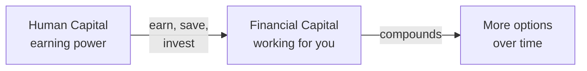

# Day 14 — The Total Wealth Concept

> **The one idea for today:** A client's wealth has two forms — **Financial Capital** (the money they already have) and **Human Capital** (their future ability to earn). Your job as an FC is to help them convert one into the other, on loop, while protecting the engine that makes it possible.

> **🎥 Watch the live training:** **[Module 1 — New FC Training (David)](https://youtu.be/EtAo1of4h8U)**. The first half of Module 1 is the live walk-through of the CST structure (Why / What / How Much) with the rules-of-thumb table for coverage levels — this lesson is the slower, written version of what David delivers. The video is also available in the **Video** tab of this day. Companion videos: **[Warm Market Flow](https://www.loom.com/share/defd2115fa4a46bb98c9a75113b12343)** and **[Canned Sales Track](https://youtu.be/TAsMoWdXLyg)**.
>
> **📄 The hand-drawn delivery script:** the Total Wealth concept on this page is the *teaching* version. The 2-page hand-drawn artefact you actually deliver in front of a prospect is the **[OST Script — Full Reference](/learning-track/first-60-days/reference/ost-script-full)**. Read both — Day 14 gives you the *why*, the OST gives you the *exact words and pace*.

## What you'll walk away with

By the end of today you should be able to:

1. **Define** Total Wealth as Financial Capital + Human Capital, and explain why most people only see one half.
2. **Name** the four pillars of the Total Wealth Financial Planning System (TWFPS) and the coverage benchmark each one targets.
3. **Open** the conversation by drawing the Total Wealth equation on paper in under 5 minutes — without pitching a product.
4. **Run** the budget conversation (20% investments + 10–15% insurance) and the modular close (one pillar per meeting, with bridges).

---

## 1. The two capitals

Total Wealth has two forms. A client's full wealth is the sum of both:

The graph on the left tells the entire story: when you're young, **Human Capital** (your future ability to earn) is huge — but Financial Capital is small. Across a working life, the deliberate move is to **convert** one into the other — earn more, spend less, save the difference, invest it, and repeat. Total Wealth is the sum of both at any given moment.

For a 30-year-old earning $100K/year with 30 working years left, Human Capital is worth roughly **$3M of future income** — usually more than every Financial Capital line item combined. Most clients only think about the visible half (the money already in their accounts). Your job is to surface the invisible one — and make sure the conversion engine that connects them is protected.

> **The live phrasing that lands every time:** *"You are your own golden goose. Your bank account is small. The reason you can eat, live, and have a good life is your ability to keep producing income. That's your greatest asset — not what's in the bank."*

## 2. The conversion engine

Building wealth is one repeated motion: convert Human Capital into Financial Capital, and protect both halves while you do it.

Four steps, on loop, for 30+ years:

1. **Earn more** — career growth, second income, deliberate skill compounding.
2. **Spend less** — the gap between income and lifestyle *is* the conversion rate.
3. **Save** — the converted capital, parked safely.
4. **Invest** — let the capital work for itself.

The clients who finish well do this rhythm for decades without breaking it. The clients who don't finish well usually broke the rhythm at one of two points: spending caught up with income, or one uncovered event wiped out years of conversion.

## 3. Protect Human Capital — it's the engine, not a side concern

Here's the part most people miss: the entire conversion engine assumes you can keep working. The day Human Capital stops — accident, critical illness, premature death — the engine stops. Whatever Financial Capital is already in the box has to carry the family for the rest of their lives.

This is why protection isn't an upsell or an add-on. It's the **foundation** that makes everything else possible. If Human Capital collapses without coverage, every other plan fails — the savings get spent, the investments get liquidated, the property gets sold.

> **Insurance is the most cost-efficient way to manage risk.** It transfers a catastrophic-but-rare loss to an insurer for a small predictable premium — far cheaper than retaining the risk and self-funding a $400K medical bill out of your asset base.

### The "health or wealth" question

Try this on a new prospect once the two boxes are on the page:

> **You:** *"Health or wealth — which is more important?"*
>
> **Them:** *"Health, of course."*
>
> **You:** *"Then we can't just talk about investing. We also have to talk about protecting the engine that produces the wealth in the first place. Investments build the bank. Insurance protects the goose that fills it."*

That bridge is what gives you permission to talk about coverage *before* products. It collapses the "I just want to invest" objection by making it the client's own logic.

## 4. The Total Wealth Financial Planning System (TWFPS)

The TWFPS organises every client plan around four pillars — three to protect Human Capital, one to grow Financial Capital.

| Pillar | What it protects against | Benchmark coverage |
|---|---|---|
| **Death / Disability** | Family loses the income engine | Dependents' income needs · **10–20× annual income** |
| **Critical Illness** *(the weakest link — often ignored)* | Major medical event + 12–24 months recovery | **$100K (cancer drug treatments not covered by hospital plan)** + **3–5× annual income** (recovery period) — equivalent to the slide's "$200–400K or 5× income" benchmark, but broken down so the client sees what each dollar funds |
| **Hospital & Accident** | Hospitalisation, injury, illness, sprains, dengue, food poisoning, permanent dismemberment | Hospital cover + Medishield upgrade + Personal Accident plan |
| **Investment & Savings** | Inflation slowly eroding Financial Capital | Global balanced strategy |

The first three pillars defend the Human-Capital → Financial-Capital conversion. The fourth (Investment & Savings) makes sure the converted capital actually grows faster than inflation. Together they make sure the engine never has to restart from zero.

## 5. The 5-minute introduction

Use this in a first meeting once rapport is established. Goal: install the *concept*, not close a sale.

### Step 1 — Draw the two boxes (30 sec)
On a piece of paper, draw two boxes side by side. Label them **Financial Capital** and **Human Capital**.

### Step 2 — Ask which one they have more of (30 sec)
> "When we're young — which one do you think we have more of: Financial Capital or Human Capital?"

Almost everyone answers **Human Capital** correctly. That's the opening — they've already conceded that the bigger asset is the one nobody insures.

### Step 3 — Surface the invisible half (1 min)
> "Human Capital is your future earning power — your career, your years of working ahead. For most people in their 30s, it's worth $2-4 million in future income. Way bigger than what's in the Financial box today. But you've probably never had it valued."

Pause. Let it land.

### Step 4 — Draw the arrow (1 min)
Draw an arrow from Human Capital → Financial Capital. Write four words on it: **earn, spend less, save, invest**.

> "Building wealth is just this loop, repeated for 30 years. Earn more, spend less than you earn, save the difference, invest it. The arrow is the engine."

### Step 5 — Ask the protection question (1 min)
Underline Human Capital. Ask:
> "If this stopped tomorrow — accident, illness, anything — how long does what's in the Financial box last your family?"

Most clients can't answer. That silence is the assignment for the next meeting.

### Step 6 — Open the door (30 sec)
> "I'm not going to recommend anything today. The right plan depends on the size of both boxes today and where you want them to be in 20 years. Mind if I run through a few questions to actually understand your situation? Then I can put a real plan together for you."

That last sentence is the entire sale. You've earned the fact-find.

## 6. The four risks, in their language

For each pillar, the language to use over the next 30 years:

**Death / Disability**
> "If you stopped earning today, how many years would your family need to keep going? The standard floor is **10–20× your annual income** — roughly 10–20 years of replacement income for the people who depend on you."

**Critical Illness** *(the weakest link)*
> "Treatment for a major illness in Singapore typically costs **$200–400K**. On top of that, most people lose 12–24 months of income recovering."
>
> "We plan toward **$100K plus 3–5× your annual income**. The $100K specifically covers things your hospital plan doesn't — like cancer drug treatments. One vial of certain cancer drugs is around $10K per dose, and many of those drug treatments aren't covered by hospitalisation plans. The 3–5× income is for the recovery period when you can't work."
>
> "There's also a clean way to remember the difference between the two CI-related plans: **the hospital plan pays the hospital. The CI plan pays *you* — when you can't work for a few years.** They do different jobs."

**Hospital & Accident**
> "Sprains, dengue, food poisoning, an accident at the gym — small stuff happens often. The hospital plan covers what happens inside hospital walls; the accident plan covers everything outside."
>
> "One thing to know about hospital plans: they don't cover **outpatient** stuff. So even if you're hospitalised and discharged, the follow-up consultations, scans, and many drug treatments fall outside. That's why CI plus accident plus hospital is the full set — each plugs a different gap."

**Investment & Savings**
> "While the protection layer holds the floor, your money still needs to grow faster than inflation. The strategy is **global balanced** — not Singapore-only, not all equities, not all bonds — so the asset base survives any single market shock or currency move."

## 7. The budget conversation and the modular close

Once the client has nodded along to the four pillars, the meeting tends to bend in one of two unhelpful directions: either they ask *"so how much will all this cost?"* (and you over-quote and lose them), or you try to close everything in one meeting (too much information, they freeze). Two micro-frames keep the meeting on the rails.

### Frame A — The budget rule of thumb

When they ask about cost, don't quote products yet. Quote percentages of income:

> "As a guideline, we usually plan for around **20% of your income going to investments**, and another **10–15% to insurance** — so call it roughly 30% of income going toward future-you. That covers the protection layer plus the wealth-building layer."

> "If I built a comprehensive package across all four pillars, what's the maximum you could realistically set aside each month?"

Two things this does:
1. Anchors the conversation in **your** income (not a fixed-dollar number that scares them).
2. Asks for the **ceiling**, not the floor. People generally answer truthfully when asked for max — they don't feel cornered into commit­ting.

It also cross-references **Day 2's 1/3 income rule** — short-term needs (1/3), mid-term commitments (1/3), savings + investment + insurance (1/3). Most clients have never explicitly allocated the third slice to long-term — surfacing it is half the close.

### Frame B — The modular close

Don't try to close all four pillars in one meeting. The information density crashes the conversation. Instead:

1. **First meeting: get the budget.** End with "what's your max?" and a calendar invite for the next session.
2. **Second meeting: close the priority pillar first.** Whichever risk *they* named as most important — usually CI — close that one first.
3. **Layer in the next pillar with a one-line bridge.** Once CI is signed, you say:
   > *"Now that CI's locked in, your base is in good shape. The other thing worth knowing — your hospital plan won't cover outpatient stuff. Want to plug that gap next?"*
4. **Repeat for hospital, accident, life/disability** as separate close moments — each with its own bridge.

The bridges follow the same pattern: *"Now that we've done X, here's what X doesn't cover. Want to plug that?"* That sentence does more work than any feature comparison.

The reason it works: each close is a small yes, not one big yes. The client never sees the full bill — they see four reasonable monthly amounts spread across two or three meetings.

### A note on framing financial vs emotional burden

When you're surfacing the *need* (especially for CI), use this exact line:

> "Imagine you can't work for a few years. Who's going to give you that money? Your parents — can they afford to support you for years? The emotional burden of getting cancer is something nobody can take away from you. But the financial burden — that one we can cover."

That sentence converts more CI plans than any product feature. It separates what the client *can* control (the financial side) from what they can't (the emotional side), and positions the plan as the part that's actually solvable.

## 8. Why this works

1. **Outcomes-first, products-last.** The client never feels pitched — they feel oriented. Every product you eventually recommend already maps to a pillar they agreed they need.
2. **Their picture, not yours.** They watched you draw it. They cannot un-see the equation or the arrow.
3. **It scales by income.** A $4,000/month earner and a $40,000/month earner get the same conversation — only the numbers in the boxes change.
4. **Protection becomes obvious.** Once Human Capital is named as the engine, "you should insure it" stops being a sales line and becomes the only logical conclusion.
5. **The modular close respects the brain.** No single meeting drowns the client in choices. Each yes is small enough to feel safe.

## 9. Compliance and the limits of the concept

Total Wealth is a teaching frame, not a product illustration. When you do recommend products to fund it:

- Use **actual product illustrations** from iResource, not back-of-envelope numbers.
- **Never describe non-guaranteed returns as guaranteed.**
- Show **both guaranteed and non-guaranteed** scenarios.
- Note that **past performance does not guarantee future results.**
- Be honest about **inflation** — the coverage benchmarks above are in today's dollars and need adjusting for the years between now and the client's target horizon.

The concept opens the door. The actual recommendation has to walk through it honestly.

---

## Quick quiz

1. **Total Wealth is the sum of which two things?**
 - A) Income and savings
 - B) Financial Capital and Human Capital ✓
 - C) Net worth and CPF
 - D) Insurance coverage and investment portfolio

 **Why:** The Total Wealth concept defines wealth as Financial Capital (the money you already have — savings, investments, CPF, property) plus Human Capital (your future ability to earn). Most clients only see Financial Capital, but for a working-age person, Human Capital is usually the bigger half. A, C, and D each name pieces of one half but miss the framing entirely — and the framing is what makes every later product recommendation feel logical.

2. **Why is protecting Human Capital the foundation, not an add-on?**
 - A) Because regulations require it
 - B) Because the Human → Financial conversion engine assumes you can keep working — if Human Capital collapses without coverage, every other plan fails ✓
 - C) Because protection products earn higher commissions
 - D) Because clients always ask for it first

 **Why:** The lesson is direct: the entire conversion engine depends on the client being able to keep earning. One uncovered critical illness, accident, or premature death stops the engine — and the family has to liquidate Financial Capital to survive. That's why protection isn't a sales add-on; it's what makes the whole architecture possible. A invents a regulation that doesn't exist. C is true commercially but isn't the lesson's reason. D is false — most clients ask for investment first.

3. **The TWFPS organises a plan around how many pillars?**
 - A) 2 — protection and investment
 - B) 3 — protection, accumulation, distribution
 - C) 4 — death/disability, critical illness, hospital & accident, and investment & savings ✓
 - D) 5 — adding estate planning

 **Why:** The Total Wealth Financial Planning System has four pillars: three that protect Human Capital (death/disability, critical illness, hospital & accident) plus one that grows Financial Capital (investment & savings). A and B compress them into too few categories. D adds a pillar that isn't part of the core TWFPS — estate planning matters but lives in a later layer.

4. **The benchmark coverage for Death / Disability is:**
 - A) 5× annual income
 - B) 10–20× annual income ✓
 - C) Just enough to cover the mortgage
 - D) $1 million flat for everyone

 **Why:** The standard TWFPS benchmark is 10–20× annual income for death/disability — roughly 10–20 years of replacement income for the people who depend on the client. A is the Critical Illness benchmark, not death/disability. C is what most under-insured clients have, which is the gap the TWFPS exists to surface. D ignores income scaling — the same flat sum is wildly under-protective for high earners and over-priced for low earners.

5. **The benchmark for Critical Illness coverage is:**
 - A) Equal to the cost of one round of treatment
 - B) $200–400K, or 5× annual income ✓
 - C) Whatever MediShield Life doesn't cover
 - D) 10× annual income

 **Why:** Treatment for a major illness in Singapore typically costs $200–400K, and most patients lose 12–24 months of income while recovering. The benchmark of 5× annual income covers BOTH the treatment AND the income gap. A only funds treatment — leaves the family with no income during recovery. C under-protects because MediShield Life is calibrated to subsidised wards, not full private treatment. D is the death/disability benchmark.

6. **In the 5-minute introduction, what's the right move at Step 6 (the door-opener)?**
 - A) Recommend a critical illness plan that hits the 5× benchmark
 - B) Ask permission to do a proper fact-find — no product yet ✓
 - C) Send a follow-up proposal that evening
 - D) Calculate the client's Human Capital number on the spot

 **Why:** Step 6's exact line is *"I'm not going to recommend anything today… mind if I walk through a few questions to actually understand your situation?"* The pitch is for a fact-find, not a product. A is the classic new-FC trap — the concept opens a door, the recommendation waits for the fact-find. C substitutes paperwork for relationship and skips the fact-find entirely. D is over-engineering — Human Capital valuation is useful as a teaching point ("$2–4M for most 30-year-olds") but precise calculation requires inputs you don't have yet.

7. **A client says: "I already have hospital insurance from my employer — I don't need anything else." What's the strongest reframe using the TWFPS?**
 - A) Tell them their employer plan is probably underfunded
 - B) Walk through the four pillars and ask which ones the employer plan actually covers — typically only Hospital & Accident, leaving Death/Disability, Critical Illness, and Investment uncovered ✓
 - C) Show them a comparison of premiums between employer and personal plans
 - D) Ask what happens to their coverage when they change jobs

 **Why:** The TWFPS gives you the diagnostic frame to make the gap visible without attacking their existing plan. Walking through the four pillars surfaces that the employer plan typically only covers one pillar (Hospital & Accident, often only ward-class subsidised), leaving three other pillars exposed. A is judgmental and doesn't teach the framework. C is a price discussion, which loses the strategic frame. D is a valid follow-up but is one specific risk inside Death/Disability — the bigger move is the four-pillar audit.

8. **Why is the CI benchmark broken into "$100K + 3–5× annual income" rather than just one figure?**
 - A) Compliance requires it
 - B) Because the $100K specifically funds cancer drug treatments that the hospital plan typically doesn't cover, while the 3–5× income covers the recovery period when the client can't work ✓
 - C) Because $100K is the maximum a single CI policy will pay out
 - D) Because the slide says so

 **Why:** The breakdown is pedagogical — it lets the client see what each dollar funds. Cancer drug treatments (e.g. ~$10K per dose) often fall outside hospital plan coverage, so $100K is the buffer for treatment costs the hospital plan won't pick up. The 3–5× income covers the 12–24 months (sometimes years) the client can't work. The slide framing of "$200–400K or 5× income" arrives at the same total coverage but doesn't explain *why*. A invents a compliance rule. C is false — CI policies can pay much more. D is technically true but misses the teaching point.

9. **In the modular close, what's the right move after a client signs the CI plan in meeting two?**
 - A) Quote the full life-disability + accident + hospital bundle on the spot
 - B) Bridge to the next pillar with a one-liner like "now that CI's locked in, your hospital plan won't cover outpatient stuff — want to plug that next?" ✓
 - C) Stop selling and wait for them to ask for more
 - D) Send a 12-page proposal that evening covering all remaining pillars

 **Why:** The modular close works by treating each pillar as its own small yes, with a one-line bridge that names *what the previous plan doesn't cover*. The bridge format — "now that we've done X, here's what X doesn't cover. Want to plug that?" — keeps the conversation alive without overwhelming the brain. A drops the modularity and goes back to information overload. C abandons the pipeline you've already built. D is the new-FC trap of substituting paperwork for relationship.

---

## Related

- Previous: [[day-13|Day 13 — Job A vs Job B]]
- Next: [[day-15|Day 15 — Wealth Building Principles]]
