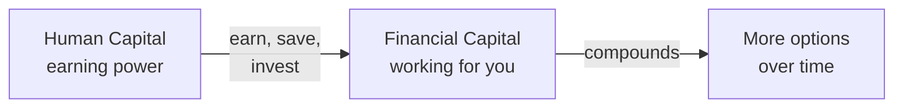

# Day 14 - The Total Wealth Concept

> **The one idea for today:** A client's wealth has two forms - **Financial Capital** (the money they already have) and **Human Capital** (their future ability to earn). Your job as an FC is to help them convert one into the other, on loop, while protecting the engine that makes it possible.

> **Watch the live training:** **[Module 1 - New FC Training (David)](https://youtu.be/EtAo1of4h8U)**. The first half of Module 1 is the live walk-through of the CST structure (Why / What / How Much) with the rules-of-thumb table for coverage levels - this lesson is the slower, written version of what David delivers. The video is also available in the **Video** tab of this day. Companion videos: **[Warm Market Flow](https://www.loom.com/share/defd2115fa4a46bb98c9a75113b12343)** and **[Canned Sales Track](https://youtu.be/TAsMoWdXLyg)**.
>
> **The delivery script:** the Total Wealth concept on this page is the *teaching* version. The 2-page slide artefact you actually deliver in front of a prospect is the **[Canned Sales Track - Full Reference](/learning-track/first-60-days/reference/ost-script-full)**. Read both - Day 14 gives you the *why*, the CST gives you the *exact words and pace*.

## What you'll walk away with

By the end of today you should be able to:

1. **Define** Total Wealth as Financial Capital + Human Capital, and explain why most people only see one half.
2. **Name** the four pillars of the Total Wealth Financial Planning System (TWFPS) and the coverage benchmark each one targets.
3. **Open** the conversation by walking the prospect through the Total Wealth slide in under 5 minutes - without pitching a product.
4. **Run** the budget conversation (10% of income for insurance protecting the other 90%) and the modular close (one pillar per meeting, with bridges), in the live sales sequence: Hospital -> Accident -> CI -> Life.

---

## 1. The two capitals

Total Wealth has two forms. A client's full wealth is the sum of both:

The graph on the left tells the entire story: when you're young, **Human Capital** (your future ability to earn) is huge - but Financial Capital is small. Across a working life, the deliberate move is to **convert** one into the other - earn more, spend less, save the difference, invest it, and repeat. Total Wealth is the sum of both at any given moment.

For a 30-year-old earning $100K/year with 30 working years left, Human Capital is worth roughly **$3M of future income** - usually more than every Financial Capital line item combined. Most clients only think about the visible half (the money already in their accounts). Your job is to surface the invisible one - and make sure the conversion engine that connects them is protected.

> **The live phrasing that lands every time:** *"You are your own golden goose. Your bank account is small. The reason you can eat, live, and have a good life is your ability to keep producing income. That's your greatest asset - not what's in the bank."*

## 2. The conversion engine

Building wealth is one repeated motion: convert Human Capital into Financial Capital, and protect both halves while you do it.

```mermaid
flowchart LR
    HC["Human Capital<br/>earning power"] -->|"earn, save,<br/>invest"| FC["Financial Capital<br/>working for you"] -->|"compounds"| HC2["More options<br/>over time"]
```

Four steps, on loop, for 30+ years:

1. **Earn more** - career growth, second income, deliberate skill compounding.
2. **Spend less** - the gap between income and lifestyle *is* the conversion rate.
3. **Save** - the converted capital, parked safely.
4. **Invest** - let the capital work for itself.

The clients who finish well do this rhythm for decades without breaking it. The clients who don't finish well usually broke the rhythm at one of two points: spending caught up with income, or one uncovered event wiped out years of conversion.

## 3. Protect Human Capital - it's the engine, not a side concern

Here's the part most people miss: the entire conversion engine assumes you can keep working. The day Human Capital stops - accident, critical illness, premature death - the engine stops. Whatever Financial Capital is already in the box has to carry the family for the rest of their lives.

This is why protection isn't an upsell or an add-on. It's the **foundation** that makes everything else possible. If Human Capital collapses without coverage, every other plan fails - the savings get spent, the investments get liquidated, the property gets sold.

Two analogies you'll lean on for the next 30 years:

- **Ship vs lifeboat.** Your wealth is the ship. Your health is the lifeboat. You don't need both on calm days - the lifeboat exists for the day the ship can't carry you.
- **Seatbelt.** Coverage is like a seatbelt - you don't wear it because you think you'll crash, you wear it because it can't be bought after. Insurance only exists *before* the event. After the event, it's not for sale, and if it is, it's at a much higher price with exclusions for whatever just happened.

### The "health or wealth" question

Try this on a new prospect once the two boxes are on the page:

> **You:** *"Health or wealth - which is more important?"*
>
> **Them:** *"Health, of course."*
>
> **You:** *"Then we can't just talk about investing. We also have to talk about protecting the engine that produces the wealth in the first place. Investments build the bank. Insurance protects the goose that fills it."*

That bridge is what gives you permission to talk about coverage *before* products. It collapses the "I just want to invest" objection by making it the client's own logic.

## 4. The Total Wealth Financial Planning System (TWFPS)

The TWFPS organises every client plan around four pillars - three to protect Human Capital, one to grow Financial Capital.

| Pillar | What it protects against | Benchmark coverage | Rough monthly cost |
|---|---|---|---|
| **Hospital** *(the foundation - every major event starts here)* | Inpatient bills. Singapore hospital bills run $10K+ for a few weeks in a private ward. CI, accident, and death events typically begin with a hospitalisation. | Up to **$2M/year** reimbursement (resets annually), covering 13 months pre and post hospitalisation | **$30-50/month cash** (Medisave covers the bulk; small cash rider reduces deductible and co-pay) |
| **Personal Accident** *(daily life)* | Outpatient injuries, sprains, dengue, food poisoning, dismemberment - things the hospital plan won't pay for. Most-claimed plan in a typical FC's book. | Plans 1-4: roughly $200K-$1M+ accidental death payout; per-accident outpatient limits (TCM, chiropractor, physio included) | **$0.60-$2.50/day** ($18-$70/month) |
| **Critical Illness** *(the weakest link - most under-bought)* | Income replacement when a major CI stops you working for 12-24+ months. A CI plan pays *you*, not the hospital. | **5x annual income** (treatment + recovery period). Some FCs add a **$100K buffer** for cancer drug treatments the hospital plan typically doesn't cover. | Quoted via iResource; usually a whole-life base + CI multiplier rider, often on 20/25-year limited pay |
| **Death / TPD** | Family loses the income engine permanently. Covers all causes of death (illness, natural, accident). | **10x annual income** (10-20x where there are young dependants or a large mortgage) | Term option or whole-life; whole-life unlocks the "premiums refunded at 65" framing |
| **Disability Income** *(optional add-on)* | Long-term inability to work that doesn't meet the TPD bar (losing one limb, partial disability) | Pays roughly **70% of monthly income** during the disability period | Quoted via iResource |
| **Investment & Savings** | Inflation eroding the converted Financial Capital | Global balanced strategy (not Singapore-only, not all equities, not all bonds) | Separate budget - see Section 7 |

The first five pillars defend the Human-Capital -> Financial-Capital conversion. Investment & Savings is what makes the converted capital actually grow faster than inflation.

**Sequence matters.** When you walk a prospect through this in a real meeting, start at **Hospital**, not Death. Hospital is the cheapest, the most claimable, and the foundation every other event passes through. Once they nod at Hospital, Accident is the easy next yes, then CI, then Life. Leading with Death/TPD frontloads the heaviest premium and the most uncomfortable conversation - both kill momentum.

## 5. The 5-minute introduction

Use this in a first meeting once rapport is established. Goal: install the *concept*, not close a sale. Walk the prospect through the Total Wealth slide as you go.

### Step 1 - Show the two boxes (30 sec)
Open the Total Wealth slide showing the two boxes side by side: **Financial Capital** and **Human Capital**.

### Step 2 - Ask which one they have more of (30 sec)
> "When we're young - which one do you think we have more of: Financial Capital or Human Capital?"

Almost everyone answers **Human Capital** correctly. That's the opening - they've already conceded that the bigger asset is the one nobody insures.

### Step 3 - Surface the invisible half (1 min)
> "Human Capital is your future earning power - your career, your years of working ahead. For most people in their 30s, it's worth $2-4 million in future income. Way bigger than what's in the Financial box today. But you've probably never had it valued."

Pause. Let it land.

### Step 4 - Point at the arrow (1 min)
Point at the arrow on the slide running from Human Capital -> Financial Capital, labelled **earn, spend less, save, invest**.

> "Building wealth is just this loop, repeated for 30 years. Earn more, spend less than you earn, save the difference, invest it. The arrow is the engine."

### Step 5 - Ask the protection question (1 min)
Point at Human Capital. Ask:
> "If this stopped tomorrow - accident, illness, anything - how long does what's in the Financial box last your family?"

Most clients can't answer. That silence is the assignment for the next meeting.

### Step 6 - Open the door (30 sec)
> "I'm not going to recommend anything today. The right plan depends on the size of both boxes today and where you want them to be in 20 years. Mind if I run through a few questions to actually understand your situation? Then I can put a real plan together for you."

That last sentence is the entire sale. You've earned the fact-find.

## 6. The four risks, in their language

The order below is the order you walk a prospect through in a real meeting: Hospital → Accident → CI → Life. Each pillar has the script line, the why, and the real claim story that lands.

### Hospital - the first line of defence

> "Out of all the coverage you can have, which one do you think is the first line of defence? It's the hospital plan. If you have an accident serious enough, you'll be hospitalised. If it's a critical illness, you'll be hospitalised. If something causes death or TPD, you'll be hospitalised first. Hospital bills in Singapore are expensive - so this is where every plan starts."
>
> "A good hospital plan reimburses up to **$2 million a year**, resets every year, and covers you 13 months *before and after* the hospitalisation event - that's called pre and post hospitalisation. And it costs roughly **$70-80 a month** total, mostly funded by Medisave with a small cash rider of $30-50/month to reduce the deductibles and co-payment."

This pillar usually closes first because the price is small relative to the coverage. Once they say yes here, you've earned permission to walk through the other three.

### Personal Accident - the most-claimed plan in your book

> "Out of all the policies I sell, the accident plan is the one I claim for the most often - genuinely about once a week across my book. You can claim for TCM, chiropractor, physiotherapy, sprains, dengue, food poisoning - the everyday stuff."

The two differences that surface here are the ones most clients haven't thought about:

**Hospital vs accident:** *"Hospital is inpatient, accident is outpatient. Hospital coverage requires you to be admitted for at least 6 hours or have day surgery. I had one client who only bought a hospital plan, then his daughter went to KK A&E to get stitches - bill wasn't covered, because A&E with no admission is outpatient. That's exactly what an accident plan covers."*

**Accident vs life:** *"Accident is far easier to claim. For a life payout, you typically need to die or lose two limbs / two eyes. For an accident plan, you can claim for an everyday injury. I had a client on a motorbike who hit a pothole, his arm scraped along the road, hospital bills, dressing, and the doctor consultations afterwards were all covered."*

The closing frame on pricing uses comparison anchoring:

> "Plan 4 covers you worldwide, 24/7, at about $1 a day. Think about what you already spend - around $500/month on food, $200/month on transport, $100/month on shopping, $3,000/year on holiday. A dollar a day to cover everything outside the hospital is cheap in comparison."

Then you ask the assume-close question: *"Which plan would you prefer - plan 1, 2, 3, or 4?"* Plan 1 is around $0.60/day ($18/month), plan 2 is $1/day ($30/month), plan 3 is $1.50/day ($50/month), plan 4 is $2.50/day ($70/month).

### Critical Illness - the income-replacement pillar

> "A hospital plan pays the **hospital**. A CI plan pays **you** - so you can keep eating, paying the mortgage, and supporting your family during the years you can't work. It's an income-replacement plan, not a medical-bill plan. They do different jobs."

The setup before quoting the number:

> "Upon getting CI, you don't want to be a *burden* on your family. The benchmark is **5x your annual income** - that's roughly 5 years of replacement income, because it's hard to expect you'll be back to work inside 5 years after a major illness. Some FCs split it as 3-5x income plus a $100K buffer specifically for cancer drug treatments that the hospital plan doesn't cover - one vial can be $10K and many aren't on the hospital plan formulary."

The emotional-financial split is what closes this one:

> "Imagine you can't work for a few years. Who's going to give you that money? Your parents - can they afford to support you for years? The **emotional** burden of getting cancer is something no one can take away from you. But the **financial** burden - that one we can cover."

### Life / TPD - the legacy pillar

> "A life plan covers death or TPD from **any cause** - illness, natural causes, accident. An accident plan only pays out for accidental death. The benchmark is **10x your annual income** - enough to pay off loans and give your family a decade of support if you're gone prematurely."

The "wasting money" objection answer:

> "How would you feel if you paid 10% of your income for years and didn't get anything back? With a **whole life** policy, that's actually built in - you get a *refund* of your premiums at age 65, and the policy is **limited pay**: you only pay for 20 or 25 years, then the coverage runs free until age 100."

### TPD vs Dismemberment - the FAQ that comes up

Worth knowing before a fact-find:

- **TPD** requires complete incapacitation - losing two limbs, eyesight, or being entirely unable to work.
- **Dismemberment / partial disability** covers single-limb losses and partial impairment.
- Losing one limb does NOT qualify for TPD - which is why an accident plan (or a disability-income plan) covers a gap that life-only clients miss entirely.

### Investment & Savings - the conversion engine

> "While the protection layer holds the floor, your money still needs to grow faster than inflation. The strategy is **global balanced** - not Singapore-only, not all equities, not all bonds - so the asset base survives any single market shock or currency move."

This is the only pillar where "more is better" is the rule. Every other pillar has a benchmark you don't blow past; this one rewards every extra dollar that makes it through the conversion.

## 7. The budget conversation and the modular close

Once the client has nodded along to the four pillars, the meeting tends to bend in one of two unhelpful directions: either they ask *"so how much will all this cost?"* (and you over-quote and lose them), or you try to close everything in one meeting (too much information, they freeze). Two micro-frames keep the meeting on the rails.

### Frame A - The 10% rule

When they ask about cost, don't quote products yet. Quote a percentage of income.

> "As a rule of thumb, we set aside around **10% of your income every month for insurance**. That 10% is what protects the other 90%."

The frame that closes the budget objection:

> "Think about it this way - you can either set aside 0% for insurance and keep all 100% of your income, or set aside 10% and have 90% protected. In good times, both look the same - you're enjoying about 90% of your income. The difference shows up in bad times. With 0% set aside, one bad event wipes out the full 100%. With 10% set aside, the protection layer covers the other 90% so the income engine doesn't collapse."

Then the closing question:

> "If I built a comprehensive package across all four pillars, what's the maximum you could realistically set aside each month?"

Two things this does:
1. Anchors the conversation in **your** income, not a fixed-dollar number.
2. Asks for the **ceiling**, not the floor - people answer truthfully when asked for max because it doesn't feel like a commitment.

This sits inside **Day 2's 1/3 income rule** - short-term needs (1/3), mid-term commitments (1/3), long-term savings + investment + insurance (1/3). The 10% for insurance lives inside the last third, alongside the ~20% they should be putting into investments. Most clients have never explicitly allocated the third slice - surfacing it is half the close.

### Frame A.5 - Setting the price anchor before quoting

Coverage isn't like investing. Nobody walks in knowing how much coverage they need, so you have to set the anchor:

> "Nobody really *knows* how much coverage they need every month. With investing, more is better. With coverage, the goal is to get the most coverage for the lowest price. So we set a benchmark first - then work out the cheapest way to hit it."

You then do a **compare-close** with iResource: quote three coverage levels (e.g. $200K vs $300K vs $400K of CI), then ask which one fits the budget. They're choosing *between coverage levels*, not deciding *whether* to take coverage.

### Frame A.6 - Urgency without pressure

If they want to "think about it", surface the two facts that make waiting expensive:

1. **Premiums are cheaper now.** Each year you wait, the premium goes up because you're a year older. Buying at 35 instead of 25 means a shorter coverage period and a higher monthly premium for the same payout.
2. **You're healthy now.** No pre-existing conditions, no exclusions, no medical loadings. Wait until something shows up on a health screen, and the same policy gets exclusions or a higher rate - or you get declined entirely.

> "You can only buy this when you don't need it. The moment you need it, it's too late."

### Frame B - The modular close

Don't try to close all four pillars in one meeting. The information density crashes the conversation. Instead:

1. **First meeting: get the budget.** End with "what's your max?" and a calendar invite for the next session.
2. **Second meeting: close the priority pillar first.** Whichever risk *they* named as most important - usually CI - close that one first.
3. **Layer in the next pillar with a one-line bridge.** Once CI is signed, you say:
   > *"Now that CI's locked in, your base is in good shape. The other thing worth knowing - your hospital plan won't cover outpatient stuff. Want to plug that gap next?"*
4. **Repeat for hospital, accident, life/disability** as separate close moments - each with its own bridge.

The bridges follow the same pattern: *"Now that we've done X, here's what X doesn't cover. Want to plug that?"* That sentence does more work than any feature comparison.

The reason it works: each close is a small yes, not one big yes. The client never sees the full bill - they see four reasonable monthly amounts spread across two or three meetings.

### A note on framing financial vs emotional burden

When you're surfacing the *need* (especially for CI), use this exact line:

> "Imagine you can't work for a few years. Who's going to give you that money? Your parents - can they afford to support you for years? The emotional burden of getting cancer is something nobody can take away from you. But the financial burden - that one we can cover."

That sentence converts more CI plans than any product feature. It separates what the client *can* control (the financial side) from what they can't (the emotional side), and positions the plan as the part that's actually solvable.

---

## Quick quiz

1. **Total Wealth is the sum of which two things?**
 - A) Income and savings
 - B) Financial Capital and Human Capital (correct)
 - C) Net worth and CPF
 - D) Insurance coverage and investment portfolio

 **Why:** The Total Wealth concept defines wealth as Financial Capital (the money you already have - savings, investments, CPF, property) plus Human Capital (your future ability to earn). Most clients only see Financial Capital, but for a working-age person, Human Capital is usually the bigger half. A, C, and D each name pieces of one half but miss the framing entirely - and the framing is what makes every later product recommendation feel logical.

2. **Why is protecting Human Capital the foundation, not an add-on?**
 - A) Because regulations require it
 - B) Because the Human -> Financial conversion engine assumes you can keep working - if Human Capital collapses without coverage, every other plan fails (correct)
 - C) Because protection products earn higher commissions
 - D) Because clients always ask for it first

 **Why:** The lesson is direct: the entire conversion engine depends on the client being able to keep earning. One uncovered critical illness, accident, or premature death stops the engine - and the family has to liquidate Financial Capital to survive. That's why protection isn't a sales add-on; it's what makes the whole architecture possible. A invents a regulation that doesn't exist. C is true commercially but isn't the lesson's reason. D is false - most clients ask for investment first.

3. **The TWFPS organises a plan around how many pillars?**
 - A) 2 - protection and investment
 - B) 3 - protection, accumulation, distribution
 - C) 4 - death/disability, critical illness, hospital & accident, and investment & savings (correct)
 - D) 5 - adding estate planning

 **Why:** The Total Wealth Financial Planning System has four pillars: three that protect Human Capital (death/disability, critical illness, hospital & accident) plus one that grows Financial Capital (investment & savings). A and B compress them into too few categories. D adds a pillar that isn't part of the core TWFPS - estate planning matters but lives in a later layer.

4. **The benchmark coverage for Death / Disability is:**
 - A) 5x annual income
 - B) 10-20x annual income (correct)
 - C) Just enough to cover the mortgage
 - D) $1 million flat for everyone

 **Why:** The standard TWFPS benchmark is 10-20x annual income for death/disability - roughly 10-20 years of replacement income for the people who depend on the client. A is the Critical Illness benchmark, not death/disability. C is what most under-insured clients have, which is the gap the TWFPS exists to surface. D ignores income scaling - the same flat sum is wildly under-protective for high earners and over-priced for low earners.

5. **The benchmark for Critical Illness coverage is:**
 - A) Equal to the cost of one round of treatment
 - B) $200-400K, or 5x annual income (correct)
 - C) Whatever MediShield Life doesn't cover
 - D) 10x annual income

 **Why:** Treatment for a major illness in Singapore typically costs $200-400K, and most patients lose 12-24 months of income while recovering. The benchmark of 5x annual income covers BOTH the treatment AND the income gap. A only funds treatment - leaves the family with no income during recovery. C under-protects because MediShield Life is calibrated to subsidised wards, not full private treatment. D is the death/disability benchmark.

6. **In the 5-minute introduction, what's the right move at Step 6 (the door-opener)?**
 - A) Recommend a critical illness plan that hits the 5x benchmark
 - B) Ask permission to do a proper fact-find - no product yet (correct)
 - C) Send a follow-up proposal that evening
 - D) Calculate the client's Human Capital number on the spot

 **Why:** Step 6's exact line is *"I'm not going to recommend anything today... mind if I walk through a few questions to actually understand your situation?"* The pitch is for a fact-find, not a product. A is the classic new-FC trap - the concept opens a door, the recommendation waits for the fact-find. C substitutes paperwork for relationship and skips the fact-find entirely. D is over-engineering - Human Capital valuation is useful as a teaching point ("$2-4M for most 30-year-olds") but precise calculation requires inputs you don't have yet.

7. **A client says: "I already have hospital insurance from my employer - I don't need anything else." What's the strongest reframe using the TWFPS?**
 - A) Tell them their employer plan is probably underfunded
 - B) Walk through the four pillars and ask which ones the employer plan actually covers - typically only Hospital & Accident, leaving Death/Disability, Critical Illness, and Investment uncovered (correct)
 - C) Show them a comparison of premiums between employer and personal plans
 - D) Ask what happens to their coverage when they change jobs

 **Why:** The TWFPS gives you the diagnostic frame to make the gap visible without attacking their existing plan. Walking through the four pillars surfaces that the employer plan typically only covers one pillar (Hospital & Accident, often only ward-class subsidised), leaving three other pillars exposed. A is judgmental and doesn't teach the framework. C is a price discussion, which loses the strategic frame. D is a valid follow-up but is one specific risk inside Death/Disability - the bigger move is the four-pillar audit.

8. **Why is the CI benchmark broken into "$100K + 3-5x annual income" rather than just one figure?**
 - A) Compliance requires it
 - B) Because the $100K specifically funds cancer drug treatments that the hospital plan typically doesn't cover, while the 3-5x income covers the recovery period when the client can't work (correct)
 - C) Because $100K is the maximum a single CI policy will pay out
 - D) Because the slide says so

 **Why:** The breakdown is pedagogical - it lets the client see what each dollar funds. Cancer drug treatments (e.g. ~$10K per dose) often fall outside hospital plan coverage, so $100K is the buffer for treatment costs the hospital plan won't pick up. The 3-5x income covers the 12-24 months (sometimes years) the client can't work. The slide framing of "$200-400K or 5x income" arrives at the same total coverage but doesn't explain *why*. A invents a compliance rule. C is false - CI policies can pay much more. D is technically true but misses the teaching point.

9. **In the modular close, what's the right move after a client signs the CI plan in meeting two?**
 - A) Quote the full life-disability + accident + hospital bundle on the spot
 - B) Bridge to the next pillar with a one-liner like "now that CI's locked in, your hospital plan won't cover outpatient stuff - want to plug that next?" (correct)
 - C) Stop selling and wait for them to ask for more
 - D) Send a 12-page proposal that evening covering all remaining pillars

 **Why:** The modular close works by treating each pillar as its own small yes, with a one-line bridge that names *what the previous plan doesn't cover*. The bridge format - "now that we've done X, here's what X doesn't cover. Want to plug that?" - keeps the conversation alive without overwhelming the brain. A drops the modularity and goes back to information overload. C abandons the pipeline you've already built. D is the new-FC trap of substituting paperwork for relationship.

---

## Related

- Previous: [[day-13|Day 13 - Job A vs Job B]]
- Next: [[day-15|Day 15 - Wealth Building Principles]]
