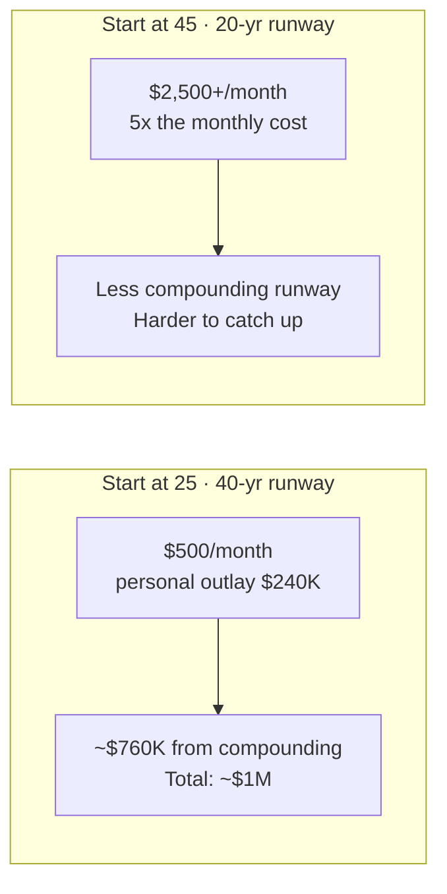

# Day 15 — Wealth Building: The Principles

> **The one idea for today:** Wealth is not built by choosing one great asset. It's built by running **multiple streams** in parallel, so that when one fails or plateaus, the others keep compounding. Every client deserves more than one source of future income.

## What you'll walk away with

By the end of today you should be able to:

1. **Name** the five main wealth-building instruments and describe the role each plays.
2. **Explain** the difference between wealth accumulation and wealth preservation — and when a client's focus should shift.
3. **Calculate** the power of starting early, using a concrete 25-year-old example.

---

## 1. Wealth is diversified income, not hoarded cash

Most clients think "wealth = the number in their bank account." That is the least efficient form of wealth they can hold.

Real wealth is a **portfolio of income sources** that includes:

1. **CPF** — mandatory, compounding, tax-advantaged. Your default stream.
2. **Property** — if it genuinely generates rental income (primary home usually doesn't).
3. **Investments** — stocks, bonds, unit trusts, ETFs. Liquid, growth-oriented.
4. **Insurance-based accumulation** — endowment plans, ILPs, retirement plans. Forced savings with guarantees.
5. **Business / self-employment income** — your own ventures, renewal books, royalties.

If **one stream is cut off**, a wealthy client's lifestyle isn't affected. If a single-stream client loses their income, everything collapses.

**Your job with clients:** build at least three streams. Most start with one (salary) and never add a second.

  

    
Wealth = Diversified income streams

  

  

  

    

CPF

Mandatory, compounding

    

Property

Rental income generating

    

Investments

Stocks, bonds, ETFs

    

Insurance accumulation

Endowment, ILP, retirement

    

Business / self-employment

Renewals, ventures

  

## 2. Wealth Accumulation vs Wealth Preservation

Two very different phases of financial life. The mindset flips somewhere between age 50–60 for most clients.

| | **Wealth Accumulation** | **Wealth Preservation** |
|---|---|---|
| **Client age** | 20s–40s mostly | 50s onwards |
| **Goal** | Grow capital | Protect capital |
| **Time horizon** | Decades | Years |
| **Risk appetite** | Higher is acceptable | Lower; need stability |
| **Cash flow priority** | Reinvest, compound | Secure, predictable |
| **Volatility tolerance** | Can ride out drops | Cannot afford big drops |
| **Typical instruments** | Equities, ILPs, property | Bonds, annuities, guaranteed income |

The **transition** is not a hard switch — it's a gradual rebalancing. A 55-year-old shouldn't be 100% in equities, but shouldn't be 100% in bonds either.

**The costly mistake:** clients who stay in accumulation mode too long. A 50% drop 2 years before retirement can push retirement back 5–10 years. Preservation exists to prevent that.

## 3. The 25-year-old example — why starting early matters

Here's the concrete arithmetic that every new FC should have memorised.

**Client:** 25-year-old, target retirement age 65, wants $4,000/month in retirement (today's dollars), for 20 years of retirement.

**Step 1 — Adjust for inflation.**
At 2% p.a. over 40 years, $4,000 today ≈ **$8,830/month at age 65.**

**Step 2 — Calculate total retirement capital needed.**
$8,830 × 12 × 20 years = **~$2.12M** (ignoring returns during withdrawal).

Most clients stop here and panic. "$2 million?! Impossible."

**Step 3 — Introduce returns.**
If the client **saves in a bank** (~0% real return after inflation):
- Needs to save **$2.12M ÷ 480 months = $4,420/month** for 40 years. Impossible.

If the client **invests at a modest 6% p.a. return** over 40 years:
- Compounding means they only need to set aside **~$500/month** to reach ~$1M in retirement capital.
- Total personal outlay over 40 years: **$500 × 480 = $240,000.**
- The other $760,000 is **compounding doing the work.**

### The lesson

**Time does the heavy lifting.** A 25-year-old needs $500/month. A 45-year-old starting from zero needs $2,500+/month — five times more — to hit the same retirement target.

**The phrase that changes client behaviour:**
> "The best time to plant a tree was 20 years ago. The second best time is now."

## 4. Applying this with real clients

When a 35-year-old client says "I'll start investing later, I need to pay off my car first" — the cost of "later" is measurable, not abstract.

Every additional year they delay starting:
- Costs them years of compounding on every future dollar.
- Means future monthly contributions have to be higher to catch up.
- Often means they *never* catch up.

Use a retirement calculator (iResource has one) to show them the gap between "start now" and "start in 3 years." It's often 20–30% of their final retirement capital.

**The respectful framing:**
> "I'm not asking you to save more than you can. I'm showing you what each year of delay costs, so you can make an informed decision. Then whatever you decide, we'll build a plan around it."

## 5. SMART goals for retirement

Vague goals produce vague outcomes. A good retirement goal is:

- **S**pecific — "$6,000/month, in today's dollars."
- **M**easurable — "I'll know because the plan will project that income."
- **A**chievable — "Based on my income, starting today."
- **R**elevant — "It matches the lifestyle I actually want, not my neighbour's."
- **T**ime-bound — "By age 62 so I can travel before 70."

**Vague goal:** "I want to be comfortable in retirement."
**SMART goal:** "$6,000/month passive income, in today's dollars, starting at age 62, adjusted for 2% inflation."

Clients who can state their goal in SMART form are 10x more likely to follow the plan. Your job in early meetings is to help them articulate this.

## Quick quiz

1. **The most important factor in wealth building for a 25-year-old client:**
 - A) Picking the best fund
 - B) Time, through compounding ✓
 - C) Aggressive risk tolerance
 - D) Property ownership

 **Why:** The 25-year-old example in this lesson shows that time does the heavy lifting — at 6% p.a., a 25-year-old needs only $500/month, while a 45-year-old needs $2,500+/month to reach the same target, purely because of the compounding runway. A matters but is secondary; a modest 6% return over 40 years still produces $760,000 from compounding alone. C is a misconception — the math works at moderate rates, and excessive risk can destroy the compounding effect. D may be part of a wealth strategy but is not the most important single factor for a 25-year-old starting out.

2. **When should a client shift from accumulation to preservation?**
 - A) At age 55 sharp
 - B) When they hit $1M in assets
 - C) Gradually, as retirement approaches — typically 50s onwards ✓
 - D) When they receive their first CPF payout

 **Why:** The transition is described as a gradual rebalancing — not a hard switch — typically beginning in the 50s as the retirement runway shortens and volatility tolerance drops. A imposes a fixed age that ignores individual circumstances; the content explicitly says there is no hard switch. B uses an asset threshold that has no basis in the content and ignores time horizon entirely. D misidentifies a CPF event as the trigger; CPF payouts begin at around age 65, by which point the shift should already have happened.

3. **A single-stream income is risky because:**
 - A) It has higher tax
 - B) If the one stream stops, everything collapses ✓
 - C) It can't be invested
 - D) It limits commission income

 **Why:** The content states it plainly: "if a single-stream client loses their income, everything collapses." A client with three or more streams can absorb the loss of one; a client with only a salary has no fallback. A is false — income tax is not affected by whether income comes from one or multiple sources. C is incorrect; single-stream income (e.g., a salary) can absolutely be invested. D applies specifically to FCs and is not the general reason stated in the lesson.

4. **A 25-year-old client wants $4,000/month (today's dollars) in retirement at 65. After adjusting for 2% inflation over 40 years, roughly how much will they need per month at retirement?**
 - A) $4,200/month
 - B) $6,000/month
 - C) $8,830/month ✓
 - D) $12,000/month

 **Why:** $4,000 compounded at 2% inflation for 40 years equals roughly $8,830/month — this is the worked example given in the lesson. A applies almost no inflation adjustment; a 2% difference over 40 years is far more than $200/month. B underestimates the power of compounding inflation over a 40-year horizon. D overstates it — $12,000 would require a higher inflation rate than the 2% stated.

5. **A 45-year-old client says they'll start investing "in a couple of years." What's the most accurate way to quantify the cost of delay?**
 - A) Tell them compounding doesn't really kick in until after 30 years anyway
 - B) Use a retirement calculator to show that delaying 2 years typically costs 20-30% of total retirement capital ✓
 - C) Remind them that markets are unpredictable, so timing isn't critical
 - D) Reassure them that CPF will cover most of the gap

 **Why:** The content instructs FCs to use iResource's retirement calculator to show the gap between "start now" and "start in 3 years" — it's often 20–30% of final retirement capital, which is a concrete and sobering figure. A is false; compounding is exponential and every additional year adds to the base that compounds from that point. C actively discourages urgency, which is the opposite of what the lesson teaches. D overstates CPF's adequacy — most Singaporeans under-save, and the content says so explicitly.

6. **Which of the following is a SMART retirement goal?**
 - A) "I want to be financially comfortable when I stop working"
 - B) "I want enough passive income in my 60s"
 - C) "$6,000/month passive income in today's dollars, starting at age 62, adjusted for 2% inflation" ✓
 - D) "I want to retire early with a million dollars"

 **Why:** C meets every SMART criterion: specific ($6,000/month), measurable (the plan can project it), achievable (based on starting today), relevant (matches a real lifestyle number), and time-bound (age 62, inflation-adjusted). A and B are vague — "comfortable" and "enough" are not measurable. D names a lump sum but has no income figure, no timeline, and no inflation adjustment, so it cannot be planned against precisely.

7. **At a modest 6% annual return, a 25-year-old saving $500/month over 40 years accumulates roughly $1M. The key insight this illustrates is:**
 - A) Picking the right fund matters most
 - B) Over $760,000 comes from compounding — not from the client's own contributions ✓
 - C) High-risk investments are necessary for retirement
 - D) CPF contributions alone are sufficient for most Singaporeans

 **Why:** The worked example shows the client personally contributes $240,000 ($500 x 480 months) while the remaining $760,000-plus comes from compounding — meaning more than three-quarters of the final figure is the result of time, not personal sacrifice. A overstates fund selection; the example uses a modest 6% rate, not a best-in-class fund. C is wrong — 6% is a moderate, not aggressive, return assumption. D contradicts the lesson, which states most Singaporeans under-save and cannot rely on CPF alone.

---

## Related

- Previous: [[day-14|Day 14 — Bank A vs Bank B]]
- Next: [[day-16|Day 16 — Recurring vs Non-Recurring Revenue]]
