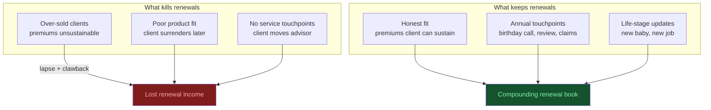

# Day 16 — Recurring vs Non-Recurring Revenue

> **The one idea for today:** Every business model on Earth is either "do it once, get paid once" or "do it once, get paid forever." Which one are you building — for yourself *and* for your clients?

## What you'll walk away with

By the end of today you should be able to:

1. **Classify** any income stream (yours, your clients', any business you see) as recurring or non-recurring.
2. **Explain** why recurring revenue is disproportionately valuable — for companies and individuals.
3. **Architect** your own future renewal book as a compounding recurring asset.

---

## 1. The two revenue types — in 90 seconds

**Non-recurring revenue:** one transaction, one payment, then it's over.

**Recurring revenue:** one decision by the customer, many payments over time.

| Non-recurring | Recurring |
|---|---|
| House sale commission | Property management fees |
| Legal case settlement | Law firm retainer |
| One-off consulting project | Monthly consulting retainer |
| Selling a car | Leasing a car fleet |
| Single book sale | Book royalty stream |
| One-time insurance commission | **Renewal commissions** |
| Freelance project | Agency retainer |

**Why this matters:** non-recurring income is inherently unstable. You have to re-sell every month. Recurring income is inherently stable. You sell once and the same customer pays again and again, if the service is kept up.

  

    

      
Non-Recurring

      

        

One transaction

One payment, then it's over.

        

Must re-sell every month

Income resets to zero on day 1.

        

Business value

1–2× revenue

      

    

    

      
Recurring

      

        

One decision

Many payments over time.

        

Sell once

Same customer pays again and again.

        

Business value

5–10× revenue

      

    

  

  
Same revenue. Different multiple. Predictability is the premium.

## 2. The subscription economy is everywhere

Think about the businesses you already pay:

- **Netflix, Spotify, Disney+** — $15/month that doesn't feel big but runs for years.
- **Gym memberships, yoga studios** — $100–200/month, often auto-renewed even when unused.
- **Mobile plan** — $40/month forever.
- **Insurance premiums** — $200–800/month per plan, for 20+ years.
- **Software (Figma, Notion, ChatGPT, Claude, Adobe)** — $10–50/month per tool.
- **Utilities, internet, streaming, property tax** — the silent monthly drumbeat.

Most people don't notice how much of their life is now organised around subscription payments. But every one of those companies is running the business model **you're building for yourself as an FC.**

## 3. Why investors value recurring revenue 5–10× more

If you own a business and sell it:

- A business with **$1M/year in non-recurring revenue** sells for roughly 1–2× revenue ($1–2M).
- A business with **$1M/year in recurring revenue** (subscriptions, retainers) sells for roughly 5–10× revenue ($5–10M).

Same revenue. 5× the value. Why? Because predictability is worth a premium. A buyer can count on recurring revenue continuing; non-recurring revenue might evaporate with the seller.

**What this means for your career:** every policy you service well builds a **compounding asset** — not just a monthly commission. Over 10+ years, the value of your renewal book can exceed the total value of the commissions you earned in that same period.

## 4. Your renewal book — the math

Let's make this concrete.

### Year-by-year model (simplified)

Assume:
- You close **30 policies/year** with an average annual premium of $3,000.
- Year-1 commission is 40% of first-year premium, renewal commission is 5% from Year 2 onwards.
- Most policies stay on the books for 15+ years.

| Year | New policies | First-year income (40%) | Renewal book income (5% × total book) | Total |
|---:|---:|---:|---:|---:|
| 1 | 30 | $36,000 | $0 | $36,000 |
| 3 | 30 | $36,000 | $9,000 (60 existing) | $45,000 |
| 5 | 30 | $36,000 | $18,000 (120 existing) | $54,000 |
| 10 | 30 | $36,000 | $40,500 (270 existing) | $76,500 |
| 15 | 30 | $36,000 | $60,000 (400+ existing) | $96,000 |

By Year 15, **more than half your income is arriving regardless of this month's effort.** You can take a month off and still get paid.

**This is the B-quadrant transition we discussed on Day 11 — but now with arithmetic.**

## 5. The flip side — what kills a renewal book

Renewal income isn't guaranteed. A policy cancelled early, lapsed, or surrendered produces:
- Zero future renewal commission.
- Clawback of first-year commission (often).
- Reputation damage if multiple policies drop.

**What kills renewals:**
1. **Over-sold clients** — premiums they can't sustain → lapsed policy.
2. **Poor fit products** — client realises later it's wrong → surrenders.
3. **No service** — client doesn't feel the relationship → moves advisor.
4. **Advisor disappears** — leaves the industry → clients orphaned.

**What keeps renewals:**
1. **Honest fit** — premiums the client can sustain even in bad years.
2. **Annual touchpoints** — birthday call, annual review, claims help.
3. **Life-stage updates** — new baby = policy review, new job = update.
4. **Staying in the industry.**

**The mindset:** sell slightly less, service a lot more. Your Year-15 income depends on it.

## 6. Teaching this to clients

The recurring/non-recurring frame helps clients understand why:

- A dividend-paying investment compounds differently from a capital gain trade.
- Rental property, at scale, can be life-changing.
- Their CPF LIFE payout (recurring for life) is more valuable than a lump-sum payout at retirement.
- A retirement plan that pays income for life (annuity) is more valuable than one that pays a lump sum at age 65.

**The client realisation:** "I've been building my career to produce a bigger salary. I should also be building a machine that produces income when I don't."

## Quick quiz

1. **Recurring revenue is valued ~5–10× higher than non-recurring because:**
 - A) It's taxed more favourably
 - B) It's more predictable ✓
 - C) It requires less work
 - D) It's from larger customers

 **Why:** Predictability is the premium — a buyer of a recurring-revenue business can count on that income continuing, whereas non-recurring revenue could evaporate the day the seller leaves. The content states this directly in the valuation comparison ($1M non-recurring = 1–2x; $1M recurring = 5–10x). A is false; revenue type does not change tax treatment in this context. C conflates the result of a mature book with the reason for the valuation multiple. D is not mentioned as a factor in the content.

2. **What kills a renewal book fastest?**
 - A) A stock market drop
 - B) Policies cancelled, lapsed, or surrendered because of poor fit or over-selling ✓
 - C) Advisor competition
 - D) Company mergers

 **Why:** The content lists four killers of renewal income — over-sold clients, poor-fit products, no service, and advisor disappearance — all of which lead to policy cancellations, lapses, or surrenders, often triggering first-year commission clawbacks as well. A is a market-risk factor but not listed as a primary killer of renewals; most insurance policies are not directly tied to equity performance. C and D are external factors not mentioned in the content as primary threats to a well-maintained book.

3. **The mindset that protects long-term renewal income:**
 - A) Sell more, service less
 - B) Sell slightly less, service a lot more ✓
 - C) Focus on the biggest premiums
 - D) Avoid annual reviews (clients re-evaluate)

 **Why:** The content states this explicitly as the protective mindset: "sell slightly less, service a lot more — your Year-15 income depends on it." Over-selling leads to lapses and clawbacks that undermine the entire renewal book. A is the exact opposite of the correct mindset. C prioritises premium size over fit, which is one of the listed causes of lapsed policies. D gets it backwards — annual reviews (birthday calls, life-stage updates) are specifically listed as what keeps renewals.

4. **An FC has been in the industry for 10 years, consistently closing 30 policies/year with $3,000 average premium. Approximately what portion of their income now arrives from renewals regardless of new sales?**
 - A) Less than 10%
 - B) About 25%
 - C) More than half ✓
 - D) Close to 100%

 **Why:** The Year-10 row in the content's model table shows first-year income of $36,000 and renewal income of $40,500 — meaning renewals already exceed new-policy income and account for more than half of the total $76,500. A and B dramatically undercount the renewal book that a decade of consistent production builds. D overstates it; at Year 10 the FC is still generating substantial new-policy income in parallel.

5. **A client asks why they should put money into a CPF LIFE plan instead of taking a retirement lump sum. The best recurring/non-recurring frame is:**
 - A) CPF LIFE has better returns than lump-sum investments
 - B) A lump sum is harder to manage in old age
 - C) CPF LIFE is recurring income for life — it's more valuable because it cannot be outlived ✓
 - D) Lump sum payouts are taxed more heavily

 **Why:** The recurring/non-recurring frame is that a payment received for life cannot be outlived — it is recurring income that pays regardless of longevity, which the content explicitly names as the reason an annuity is more valuable than a lump sum. A makes a return comparison that is not part of the frame and may not always be true. B is a practical argument but is not the recurring-vs-non-recurring framing the question asks for. D is false; CPF payouts and lump sums are generally not subject to income tax in Singapore.

6. **Which of the following advisor behaviours most directly threatens renewal income?**
 - A) Doing annual reviews and suggesting policy upgrades
 - B) Recommending a lower premium than the client originally asked for
 - C) Selling a client a premium they cannot sustain in a bad year, leading to a lapse ✓
 - D) Using renewal commissions as a reason to recommend longer-tenure policies

 **Why:** An over-sold client who lapses a policy eliminates all future renewal income from that policy and may trigger a first-year clawback — the most direct financial harm to the renewal book. A is explicitly listed as something that keeps renewals. B is actually protective behaviour — a premium the client can sustain reduces lapse risk. D is an ethical concern but is a secondary issue compared to the direct damage an unaffordable-premium lapse causes.

7. **The subscription economy analogy (Netflix, gym, mobile plans) is useful when explaining your business model because:**
 - A) It shows clients that recurring payments are always fair value
 - B) It helps clients understand that you, like those businesses, are paid renewals for continued service — making client retention your business model ✓
 - C) It positions insurance as a consumer product
 - D) It makes the commission conversation less awkward

 **Why:** The analogy works because clients already live inside a subscription economy and understand that ongoing payments sustain ongoing service — which is exactly how renewal commissions work for an FC. A overstates it; the analogy is about the model structure, not about justifying every payment as fair. C is a misuse of the analogy that trivialises the advisory relationship. D may be a side effect, but that is not the stated purpose of the analogy in the content.

---

## Related

- Previous: [[day-15|Day 15 — Wealth Building Principles]]
- Next: [[day-17|Day 17 — Assets vs Liabilities]]
