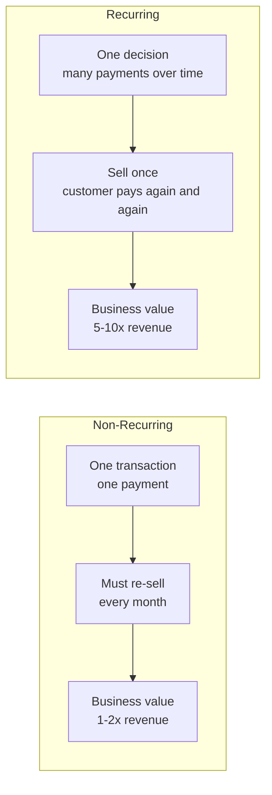
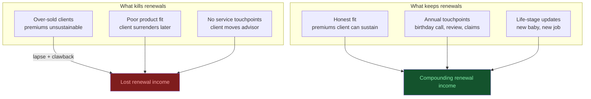

# Day 16 — Recurring vs Non-Recurring Revenue

> **The one idea for today:** Every business model on Earth is either "do it once, get paid once" or "do it once, get paid forever." Which one are you building — for yourself *and* for your clients?

## What you'll walk away with

By the end of today you should be able to:

1. **Classify** any income stream (yours, your clients', any business you see) as recurring or non-recurring.
2. **Explain** why recurring revenue is disproportionately valuable — for companies and individuals.
3. **Architect** your own future renewal income as a compounding recurring asset.

---

## 1. The two revenue types — in 90 seconds

**Non-recurring revenue:** one transaction, one payment, then it's over.

**Recurring revenue:** one decision by the customer, many payments over time.

| Non-recurring | Recurring |
|---|---|
| House sale commission | Property management fees |
| Legal case settlement | Law firm retainer |
| One-off consulting project | Monthly consulting retainer |
| Selling a car | Leasing a car fleet |
| Single book sale | Book royalty stream |
| One-time insurance commission | **Renewal commissions** |
| Freelance project | Agency retainer |

**Why this matters:** non-recurring income is inherently unstable. You have to re-sell every month. Recurring income is inherently stable. You sell once and the same customer pays again and again, if the service is kept up.

## 2. The subscription economy is everywhere

Think about the businesses you already pay:

- **Netflix, Spotify, Disney+** — $15/month that doesn't feel big but runs for years.
- **Gym memberships, yoga studios** — $100–200/month, often auto-renewed even when unused.
- **Mobile plan** — $40/month forever.
- **Insurance premiums** — $200–800/month per plan, for 20+ years.
- **Software (Figma, Notion, ChatGPT, Claude, Adobe)** — $10–50/month per tool.
- **Utilities, internet, streaming, property tax** — the silent monthly drumbeat.

Most people don't notice how much of their life is now organised around subscription payments. But every one of those companies is running the business model **you're building for yourself as an FC.**

## 3. Why investors value recurring revenue 5–10× more

If you own a business and sell it:

- A business with **$1M/year in non-recurring revenue** sells for roughly 1–2× revenue ($1–2M).
- A business with **$1M/year in recurring revenue** (subscriptions, retainers) sells for roughly 5–10× revenue ($5–10M).

Same revenue. 5× the value. Why? Because predictability is worth a premium. A buyer can count on recurring revenue continuing; non-recurring revenue might evaporate with the seller.

**What this means for your career:** every policy you service well builds a **compounding asset** — not just a monthly commission. Over 10+ years, the value of your renewal income can exceed the total value of the commissions you earned in that same period.

## 4. Your renewal income — the math

Let's make this concrete.

### Year-by-year model (simplified)

Assume:
- You close **30 policies/year** with an average annual premium of $3,000.
- Year-1 commission is 40% of first-year premium, renewal commission is 5% from Year 2 onwards.
- Most policies stay in force for 15+ years.

| Year | New policies | First-year income (40%) | Renewal income (5% × total in-force premium) | Total |
|---:|---:|---:|---:|---:|
| 1 | 30 | $36,000 | $0 | $36,000 |
| 3 | 30 | $36,000 | $9,000 (60 existing) | $45,000 |
| 5 | 30 | $36,000 | $18,000 (120 existing) | $54,000 |
| 10 | 30 | $36,000 | $40,500 (270 existing) | $76,500 |
| 15 | 30 | $36,000 | $60,000 (400+ existing) | $96,000 |

By Year 15, **more than half your income is arriving regardless of this month's effort.** You can take a month off and still get paid.

**This is the B-quadrant transition we discussed on Day 11 — but now with arithmetic.**

### The full AIA picture — active vs passive % over 10 years

The simplified table above only shows *renewals*. The actual AIA income structure layers four passive streams on top of FYC:

- **Renewals** — recurring commission on every in-force regular-premium policy.
- **Career Benefit (CB)** — boost on Y2–Y6 renewal income.
- **Agent Provident Fund (APF)** — kicks in from Year 7.
- **PA-commission renewals** — separate recurring stream from accident plans.

When all four are added, the **passive share of total income climbs aggressively**:

| Year | Active (FYC + bonuses) | Passive (Renewals + CB + APF + PA renewals) | Passive % |
|---:|---:|---:|---:|
| 1 | ~$83,500 | ~$1,500 | **~2%** |
| 3 | ~$47,500 | ~$47,000 | **~50%** |
| 5 | ~$47,500 | ~$68,500 | **~59%** |
| 10 | ~$47,500 | ~$92,500 | **~66%** |

By **Year 3** half your income already arrives passively. By **Year 10** it's roughly **two-thirds.** This is the structural reason consistent FCs eventually stop chasing FYC and start protecting their renewal layers.

> Run the live calculator at the **Income Layers — Detailed** view in the Engage Point Play tool to see the breakdown for your own assumed production.

### The lifetime value of a single client

Most new FCs think of a client as a single sale. Senior FCs think of them as a **lifetime cash flow** — and the difference is enormous.

A typical well-served household kept for 20+ years can produce:

- **Renewals on the original policy** — at 5% of a $3,000 annual premium for 20 years, that's $3,000+ from one policy alone, before counting the FYC.
- **Career Benefit and APF** on every policy sold — multiplies the base.
- **Cross-sells as life events stack** — wedding (savings + life cover), kids (education + medical), property (mortgage + life), parents (medical + estate) — each new policy starts its own renewal stream.
- **Referrals** — a satisfied client typically introduces 1–3 friends or family members across their tenure with you.

Add it all up honestly and a single household, kept long-term, is conservatively worth **20–50× the original first-year commission.**

This is why **being scared off by a small first-year case is one of the most expensive habits a new FC can develop.** The FYC is the first cheque, not the whole sale. The decision isn't "Is this client worth my time today?" — it's "Will this client compound for me over the next twenty years?"

## 5. The flip side — what kills a renewal income

Renewal income isn't guaranteed. A policy cancelled early, lapsed, or surrendered produces:
- Zero future renewal commission.
- Clawback of first-year commission (often).
- Reputation damage if multiple policies drop.

**What kills renewals:**
1. **Over-sold clients** — premiums they can't sustain → lapsed policy.
2. **Poor fit products** — client realises later it's wrong → surrenders.
3. **No service** — client doesn't feel the relationship → moves advisor.
4. **Advisor disappears** — leaves the industry → clients orphaned.

**What keeps renewals:**
1. **Honest fit** — premiums the client can sustain even in bad years.
2. **Annual touchpoints** — birthday call, annual review, claims help.
3. **Life-stage updates** — new baby = policy review, new job = update.
4. **Staying in the industry.**

**The mindset:** sell slightly less, service a lot more. Your Year-15 income depends on it.

## 6. Teaching this to clients

The recurring/non-recurring frame helps clients understand why:

- A dividend-paying investment compounds differently from a capital gain trade.
- Rental property, at scale, can be life-changing.
- Their CPF LIFE payout (recurring for life) is more valuable than a lump-sum payout at retirement.
- A retirement plan that pays income for life (annuity) is more valuable than one that pays a lump sum at age 65.

**The client realisation:** "I've been building my career to produce a bigger salary. I should also be building a machine that produces income when I don't."

## Quick quiz

1. **Day 16 reframes the FC career around recurring income. What's the most important mindset shift for a Year-1 FC?**
 - A) Maximise first-year commission on every case to fund the early grind
 - B) Treat every well-fit client as a long-term recurring income stream — over a career, renewals will dwarf the original FYC ✓
 - C) Focus only on big-premium cases; small policies aren't worth the time
 - D) Build a personal investment portfolio instead of relying on renewals

 **Why:** Day 16 makes the trajectory explicit — by Year 3 a consistent FC's income is already ~50% passive, by Year 5 around 60%, and by Year 10 roughly **two-thirds** arrives from renewals, Career Benefit, APF, and PA-renewal layers — regardless of this month's new sales. A overweights FYC and produces the over-selling pattern that destroys the renewal layer. C is the lazy/scared mindset that caps a Year-15 income at a Year-1 size — even small policies compound for decades, plus the same client typically buys more plans and refers others. D substitutes a personal investing layer for the career layer; both can exist, but the question is about the FC business model.

2. **What kills a renewal income fastest?**
 - A) A stock market drop
 - B) Policies cancelled, lapsed, or surrendered because of poor fit or over-selling ✓
 - C) Advisor competition
 - D) Company mergers

 **Why:** The content lists four killers of renewal income — over-sold clients, poor-fit products, no service, and advisor disappearance — all of which lead to policy cancellations, lapses, or surrenders, often triggering first-year commission clawbacks as well. A is a market-risk factor but not listed as a primary killer of renewals; most insurance policies are not directly tied to equity performance. C and D are external factors not mentioned in the content as primary threats to a well-maintained client base.

3. **Which mindsets protect long-term renewal income? (Select all that apply.)**
 - A) Take on every well-fit client, even those with small first-year commissions — every long-term client is a recurring income stream that compounds for decades ✓
 - B) Sell slightly less, service a lot more — your Year-15 income depends on it ✓
 - C) Skip clients with small premiums to focus only on bigger cases
 - D) Avoid annual reviews so clients don't reconsider their plans

 **Why:** Both A and B are explicit Day 16 mindsets. A: every client kept long-term throws off renewal income that often exceeds the original FYC many times over — being scared off by a low first-year cheque is the lazy mindset that caps a Year-15 income at a Year-1 size. The same client also typically buys more plans, refers others, and stays for decades. B: over-selling produces the lapses that destroy the renewal layer; service is what keeps the income compounding. C is the exact opposite of A. D would actively harm renewals — annual reviews (birthday calls, life-stage updates) are explicitly named as what keeps them.

4. **According to the AIA income model used in the income calculator, by Year 10 of consistent production, roughly what proportion of an FC's total income arrives passively (renewals + Career Benefit + APF + PA renewals) regardless of new sales that month?**
 - A) About 25%
 - B) About 40%
 - C) About 50%
 - D) About two-thirds (~66%) ✓

 **Why:** The detailed AIA income breakdown shows that by Year 10, the passive layers — renewals on regular-premium policies, Career Benefit on Y2-6 production, APF starting Y7, and PA-commission renewals — account for roughly **66%** of total income. The crossover happens around **Year 3** (already ~50% passive), accelerates to ~60% by Year 5, and stabilises in the mid-60s by Year 10. A and B significantly understate the speed at which the passive layer compounds. C is closer but is the Year-3 figure, not Year-10.

5. **Two FCs both join in Year 1. FC A focuses only on cases with the largest first-year commissions and skips smaller clients. FC B serves every well-fit client, including smaller ones, and reviews each one annually. By Year 10, who is more likely to have the higher total income — and why?**
 - A) FC A — bigger cases produce bigger compounding returns
 - B) FC B — every long-term client adds renewals, Career Benefit on those policies, future plans, and referrals; the breadth of the base dwarfs FC A's narrow one ✓
 - C) They tie — first-year commission size is the dominant factor in long-term income
 - D) FC A — fewer clients means less servicing overhead and a higher net margin

 **Why:** This is the central insight of Day 16. The recurring layer compounds with every long-term client kept on the books, and by Year 10 that layer (renewals + Career Benefit + APF + PA renewals) is roughly two-thirds of total income. FC B's broader base produces more renewal streams, more Career Benefit dollars, a larger APF base, more cross-sells over the client's life events, and far more referral surface area. FC A's larger-FYC focus might win Year 1 but loses every year after. A confuses FYC size with compounding behaviour. C contradicts the entire renewal lesson. D treats client count as overhead rather than as the asset that *produces* the renewal income.

6. **Which of the following advisor behaviours most directly threatens renewal income?**
 - A) Doing annual reviews and suggesting policy upgrades
 - B) Recommending a lower premium than the client originally asked for
 - C) Selling a client a premium they cannot sustain in a bad year, leading to a lapse ✓
 - D) Using renewal commissions as a reason to recommend longer-tenure policies

 **Why:** An over-sold client who lapses a policy eliminates all future renewal income from that policy and may trigger a first-year clawback — the most direct financial harm to the renewal income. A is explicitly listed as something that keeps renewals. B is actually protective behaviour — a premium the client can sustain reduces lapse risk. D is an ethical concern but is a secondary issue compared to the direct damage an unaffordable-premium lapse causes.

7. **The subscription economy analogy (Netflix, gym memberships, mobile plans) appears in Day 16 because:**
 - A) It helps clients understand why ongoing premiums are fair
 - B) It positions insurance as a consumer product
 - C) It helps the FC internalise that their own career *is* a subscription business — clients are the subscribers, service is the product, and retention is the entire game ✓
 - D) It makes the commission conversation less awkward

 **Why:** The analogy is a mindset tool for the FC, not a sales tool for the client. Day 16 wants the new FC to see their own career through a model they already understand: subscription businesses live and die by retention, and every long-term client is a subscriber who keeps paying as long as service stays good. That mental model reshapes the FC's behaviour — more service, fewer over-sells, more annual reviews, more deliberate referrals — to keep the "subscriber base" healthy. A treats the analogy as a sales line. B trivialises the advisory relationship. D is a side effect at best, not the stated purpose.

---

## Related

- Previous: [[day-15|Day 15 — Wealth Building Principles]]
- Next: [[day-17|Day 17 — Assets vs Liabilities]]
