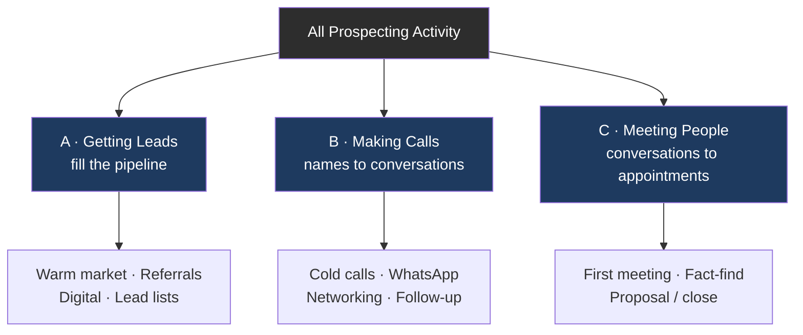

# Day 19 — Prospecting: The Lifeblood of Your Business

> **The one idea for today:** A slump in your sales is almost always a slump in your prospecting **from 30–60 days ago**. Prospecting is the leading indicator. Commissions are the lagging one. Obsess over the right number.

## What you'll walk away with

By the end of today you should be able to:

1. **Define** prospecting in a way that separates you from every FC who sees it as "asking people to buy insurance."
2. **Count** the right number (rejections, not appointments).
3. **State** the Law of Large Numbers ratios you'll be tracking for the next 60 days.

---

## 1. What prospecting actually is

Not: "telling people about insurance."
Not: "asking friends for referrals."
Not: "posting on social media."

Prospecting is **the systematic process of creating first conversations** with people who might one day have a financial planning need.

That's it. It's not selling. It's not closing. It's *creating the possibility* of a conversation where your work could one day be useful.

**The reframe:** "Approach each customer with the idea of helping them solve a problem or achieve a goal — not selling a product or service." (Brian Tracy)

## 2. Why your income is set 30–60 days in advance

Your sales cycle has stages, and each stage takes time:

1. **Prospecting touch** — you reach out.
2. **First conversation / discovery** — 1–2 weeks later on average.
3. **Fact-finding meeting** — 1–2 weeks after that.
4. **Proposal / presentation meeting** — 1–2 weeks after that.
5. **Close** — same meeting or follow-up.
6. **Submission, underwriting, approval** — 2–6 weeks.
7. **Commission paid** — month after approval.

**Total: roughly 30–90 days** from first prospecting touch to commission arriving in your account.

**Consequence:** your commission this month was built by the prospecting you did **2–3 months ago.** Today's prospecting is next quarter's income.

This is why the FCs who quit in Month 2 rarely see the compounding. They look at Month 2's commission, compare it to a corporate salary, and give up — just before the Month 1 prospecting cashes out in Month 3.

## 3. The three prospecting activities

Everything you do to find clients falls into one of three buckets. All three need to run **in parallel**, not sequentially.

### A. Getting leads
Filling your pipeline with names.

- **Warm market** — existing network (friends, family, old colleagues).
- **Referrals** — asked at end of every client meeting.
- **Digital inbound** — content-generated inquiries (Day 40–42).
- **Natural market** — people you meet organically (gym, coffee shop, events).
- **Lead lists** — purchased or agency-provided (lower quality, higher volume).

### B. Making calls (or messages)
Turning names into conversations.

- **Cold calls** — phone.
- **Warm outreach** — WhatsApp, Telegram, DM.
- **Networking events** — in-person.
- **Follow-up** — to people you met weeks or months ago.

### C. Meeting the people
Turning conversations into appointments.

- **First meeting** — coffee, lunch, or Zoom.
- **Fact-finding** — structured financial review.
- **Presentation / closing meeting.**

**The mistake most new FCs make:** they spend 90% of their time on **C** (meetings they've already got), and run out of **A** (leads). Then they panic three weeks later when the calendar is empty.

**The rule:** every day, do something in each bucket. Even on meeting-heavy days.

## 4. The Law of Large Numbers

Prospecting is fundamentally a numbers game. Not a mindset game.

### The standard ratios (roughly, for a new FC)

  

    
TOP OF FUNNEL

    
100

    
Opening Approaches (e.g., calls)

  

  
↓3% conversion

  

    
APPOINTMENTS

    
3

    
Appointments set

  

  
↓50% conversion

  

    
MEETINGS

    
1–2

    
Meetings actually happen

  

  
↓20–40% conversion

  

    
CLOSE

    
&lt;1

    
per 100 approaches

  

These ratios improve as your skills develop. A strong Year-2 FC might close 1 in 30 approaches. A Year-1 FC closing 1 in 100 is normal.

**The uncomfortable truth:** to hit $50K FYC in Year 1 (modest target), the math might require **3,000+ opening approaches** across the year. That's 60/week, 10/day.

Most new FCs make 5–10 approaches per week. Then wonder why they're not closing.

## 5. Count rejections, not appointments

This is the counterintuitive move that sets top producers apart.

**Standard new FC:**
> "I set 2 appointments this week, that felt good."

**Top producer:**
> "I got 50 no's this week, which means I'm 50 reps closer to Year-2 skill. Also I got 2 appointments."

**Why this works:**

1. You **control** the number of rejections. You don't control the number of yeses.
2. Rejections are **reps**. Each one sharpens your opener, your objection handling, your tone.
3. It removes the **emotional sting** of no. No becomes the goal, not the failure.
4. It keeps you **activity-focused** in weeks where conversions are slow.

**The target:** set a weekly rejection quota. **50 no's a week** is a good Year-1 baseline. Celebrate when you hit it.

## 6. Serve, don't sell

"To sell is to serve, and to serve is to sell."

If you treat prospecting as "I need to make a sale" → the prospect senses it, recoils, and you lose.

If you treat prospecting as "I might be able to help this person — let me find out" → the prospect senses *that*, relaxes, and opens up.

**The mental shift:** every call is a service attempt. Not every call ends in a sale. Some end in "thanks but no thanks" (fine). Some end in "actually, can you help my sister?" (referral — even better). Some end in a meeting that becomes a client for 20 years.

Your job isn't to know the outcome. Your job is to make the attempt — **with service intent.**

## 7. The daily non-negotiable

By the end of Week 4, pick ONE daily prospecting minimum that is **non-negotiable**, regardless of mood, weather, or how busy your day feels.

Common starting points:
- **10 new outreach touches per day** (mix of channels).
- **OR 3 reconnection messages + 1 content post per day.**
- **OR 1 hour of calls, 9am–10am, before anything else.**

Doesn't matter which one. What matters: **it happens even on terrible days**. The days you don't feel like it are precisely when it matters most — because that's when everyone else stops, and you stop catching up to them.

---

*Total: 30-90 days from first touch to commission. Today's prospecting = next quarter's income.*

---

*Run all three buckets every day - not sequentially.*

---

## Quick quiz

1. **A sales slump this month is usually caused by:**
 - A) Bad product fit
 - B) A slump in prospecting 30–60 days ago ✓
 - C) The market
 - D) Competitor activity

 **Why:** Prospecting is the leading indicator and commissions are the lagging one — the full sales cycle from first touch to commission payment takes roughly 30–90 days. A slump today reflects insufficient activity from 1–3 months ago, not external factors. Bad product fit (A), the market (C), and competitor activity (D) are all lagging rationalisations that distract from the only variable a new FC truly controls: daily prospecting volume.

2. **What should you count to stay consistent?**
 - A) Appointments set
 - B) Commissions earned
 - C) Rejections received ✓
 - D) Hours worked

 **Why:** You control the number of rejections, not the number of yeses — counting rejections shifts focus to an output you can actually hit daily and turns each "no" into a measurable rep that sharpens skill. Appointments set (A) and commissions earned (B) are downstream results that can swing with conversion luck and are demotivating in slow weeks. Hours worked (D) is an input that can be filled with low-value activity and tells you nothing about prospecting effort.

3. **The three prospecting activities — getting leads, making calls, meeting people — should:**
 - A) Be done sequentially
 - B) Be done one per week on rotation
 - C) Run in parallel every week ✓
 - D) Be automated wherever possible

 **Why:** The classic new-FC mistake is spending all time on meetings already booked (bucket C) while letting the lead pipeline (bucket A) dry up — leading to a calendar emergency three weeks later. Running all three buckets in parallel ensures a continuous flow from leads to conversations to meetings without boom-bust gaps. Doing them sequentially (A) or on rotation (B) guarantees the downstream steps starve while you focus upstream.

4. **You closed two clients in January. According to the 30–60 day lag, those commissions most likely came from prospecting done in:**
 - A) January
 - B) The week before closing
 - C) November or December ✓
 - D) The same month as the fact-find

 **Why:** The sales cycle runs first touch → discovery → fact-find → proposal → close → underwriting → commission, totalling roughly 30–90 days end to end. A January close traces back to first prospecting touches in November or December. Prospecting in January (A) or the week before closing (B) is far too late for a same-month commission; the fact-find (D) happens mid-cycle, not at the start.

5. **A new FC is getting 1 close per 100 approaches. To hit $50K FYC in Year 1, the daily outreach minimum should be closest to:**
 - A) 3 per day
 - B) 5 per day
 - C) 10 per day ✓
 - D) 20 per day

 **Why:** The lesson states that $50K FYC may require 3,000+ opening approaches across the year, which works out to roughly 60 per week or 10 per day on a 5-day week. Three or five touches per day (A, B) are the typical new-FC output — well short of what the numbers require. Twenty per day (D) would be above the stated baseline minimum and is not cited as the target figure.

6. **Maria frames her cold-call sessions as "how many no's can I collect today?" rather than "how many appointments will I set?" What is the primary benefit of this mindset?**
 - A) It lowers the quality bar so she makes more calls
 - B) It shifts focus to a controllable metric and reframes rejection as progress ✓
 - C) It reduces the need to track results
 - D) It removes accountability for conversion rates

 **Why:** Counting rejections is the counterintuitive move that sets top producers apart because you control the number of no's you receive, while appointments are determined by the prospect. Each rejection is a rep that sharpens opener and objection-handling skill, removing the emotional sting and keeping activity high in slow conversion weeks. It does not lower quality (A), eliminate tracking (C), or dodge accountability (D) — conversion rates are still tracked alongside rejection volume.

7. **Which of the following is NOT one of the three prospecting activity buckets described in today's lesson?**
 - A) Getting leads
 - B) Making calls or messages
 - C) Closing the deal ✓
 - D) Meeting the people

 **Why:** The three buckets are getting leads, making calls or messages, and meeting the people — closing is what happens inside a meeting, not a separate prospecting bucket. Closing belongs to the sales appointment framework covered in later lessons. All three of the other options (A, B, D) are explicitly named buckets in today's content.

---

## Related

- Previous: [[../week-3/day-18|Day 18 — The 10X Rule]]
- Next: [[day-20|Day 20 — Basic Productivity & Time Efficiency]]
