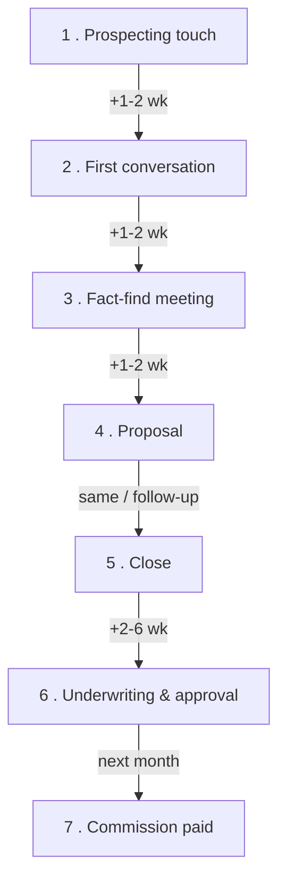
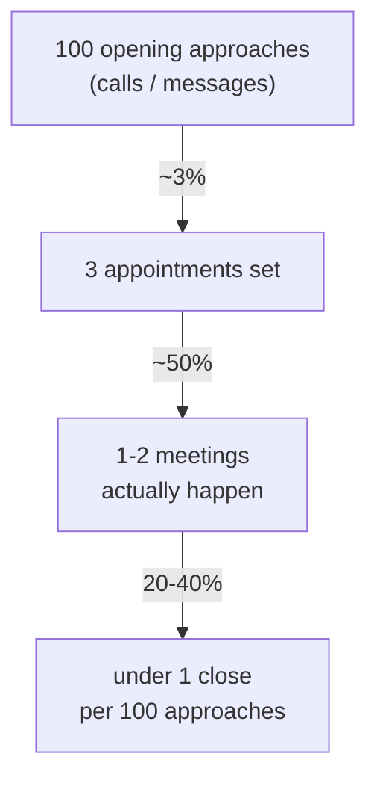

# Day 19 - Prospecting: The Lifeblood of Your Business

> **The one idea for today:** A slump in your sales is almost always a slump in your prospecting **from 30-60 days ago**. Prospecting is the leading indicator. Commissions are the lagging one. Obsess over the right number.

## What you'll walk away with

By the end of today you should be able to:

1. **Define** prospecting in a way that separates you from every FC who sees it as "asking people to buy insurance."
2. **Count** the right number (rejections, not appointments).
3. **State** the Law of Large Numbers ratios you'll be tracking for the next 60 days.

> **Where the actual scripts live:** today's day frames *why* prospecting works (numbers, not luck). The *how* lives in three companion docs - [The Warm Market Funnel](../warm-market-funnel.md) (10-step social-first flow), [Day 43 - Warm Market Survey + Cold Calls](../week-8/day-43.md), and [Day 39 - Project 100](../week-7/day-39.md) (the list this all runs against).

---

## 1. What prospecting actually is

It is **not**:

- "telling people about insurance."
- "asking friends for referrals."
- "posting on social media."

Prospecting is **the systematic process of creating first conversations** with people who might one day have a financial planning need.

That's it. It's not selling. It's not closing. It's *creating the possibility* of a conversation where your work could one day be useful.

**The reframe:** "Approach each customer with the idea of helping them solve a problem or achieve a goal - not selling a product or service." (Brian Tracy)

## 2. Why your income is set 30-60 days in advance

Your sales cycle has stages, and each stage takes time. The label on each arrow is how long the gap to the next stage usually runs:

```mermaid
flowchart TD
    A["1 . Prospecting touch"] -->|"+1-2 wk"| B["2 . First conversation"]
    B -->|"+1-2 wk"| C["3 . Fact-find meeting"]
    C -->|"+1-2 wk"| D["4 . Proposal"]
    D -->|"same / follow-up"| E["5 . Close"]
    E -->|"+2-6 wk"| F["6 . Underwriting & approval"]
    F -->|"next month"| G["7 . Commission paid"]
```

**Total: roughly 30-90 days** from first prospecting touch to commission arriving in your account.

**Consequence:** your commission this month was built by the prospecting you did **2-3 months ago.** Today's prospecting is next quarter's income.

This is why the FCs who quit in Month 2 rarely see the compounding. They look at Month 2's commission, compare it to a corporate salary, and give up - just before the Month 1 prospecting cashes out in Month 3.

### The longer truth: the prospecting cycle is years, not weeks

The 30-90 day window above is a *single* buying decision. The actual prospecting cycle - the time from first contact to a person being a paying client - is more like **1 to 10 years.**

That sounds slow until you reframe it: *most* of your career income comes from people who you talked to before they bought from anyone. Insurance, savings, retirement plans - these aren't impulse buys. They get bought when life shifts:

- Marriage
- A baby
- A parent diagnosed
- A bonus landed
- A mortgage approved

Your job is to be the person they already know on the day life shifts. That's the whole game. The seed you plant this month may bear fruit in Year 3, Year 5, even Year 10 - when the prospect needs something, or when they're asked who to refer.

But that future fruit only happens if **the prospect knew you wanted their business** and **you left the door open** instead of going quiet after a "not now."

### The unguarded pre-licensing window - your one-time advantage

Here's the part most new FCs miss until it's too late: **the period before you're RNF-licensed is your most valuable prospecting window**, not your least.

While you're not yet licensed:
- You can honestly say *"I can't sell you anything anyway - I'm just doing market surveys to learn what people actually care about with money."*
- That single line **disarms every guard** the prospect would otherwise put up. They hear "training, not sales." They give you real answers. They tell you about the spouse, the parent, the worry, the windfall.
- You're not a salesperson asking for time. You're a friend learning a craft and asking for help. Different category, different reception.

By the time your license drops:
- A properly-worked pre-license window leaves you with **10-20 people queued up** - already in conversation, already aware you'll be licensed soon, already comfortable the next chat is "the real one."
- Compare that to the FC who waits to be licensed before reaching out. Their first message after licensing reads as a pitch - even when it isn't. Guards go up. The cycle restarts at zero.

**Practical implication:** don't wait until you have your license to start your Project 100 (Day 39) or your warm outreach. Start now, with the honest framing that you're learning. The unguarded window only opens once.

## 3. The three prospecting activities

Everything you do to find clients falls into one of three buckets. All three need to run **in parallel**, not sequentially.

### A. Getting leads
Filling your pipeline with names.

- **Warm market** - existing network (friends, family, old colleagues).
- **Referrals** - asked at end of every client meeting.
- **Digital inbound** - content-generated inquiries (Day 40-42).
- **Natural market** - people you meet organically (gym, coffee shop, events).
- **Lead lists** - purchased or agency-provided (lower quality, higher volume).

### B. Making calls (or messages)
Turning names into conversations.

- **Cold calls** - phone.
- **Warm outreach** - WhatsApp, Telegram, DM.
- **Networking events** - in-person.
- **Follow-up** - to people you met weeks or months ago.

### C. Meeting the people
Turning conversations into appointments.

- **First meeting** - coffee, lunch, or Zoom.
- **Fact-finding** - structured financial review.
- **Presentation / closing meeting.**

**The mistake most new FCs make:** they spend 90% of their time on **C** (meetings they've already got), and run out of **A** (leads). Then they panic three weeks later when the calendar is empty.

**The rule:** every day, do something in each bucket. Even on meeting-heavy days.

## 4. The Law of Large Numbers

Prospecting is fundamentally a numbers game. Not a mindset game.

### The standard ratios (roughly, for a new FC)

The arrow labels are the conversion rate from one stage to the next. Watch how fast 100 collapses to under 1:

```mermaid
flowchart TD
    A["100 opening approaches<br/>(calls / messages)"] -->|"~3%"| B["3 appointments set"]
    B -->|"~50%"| C["1-2 meetings<br/>actually happen"]
    C -->|"20-40%"| D["under 1 close<br/>per 100 approaches"]
```

Read it top to bottom: 100 approaches becomes 3 appointments, becomes 1-2 real meetings, becomes well under 1 close. That is normal. The number that fixes everything downstream is the one at the top.

These ratios improve as your skills develop. A strong Year-2 FC might close 1 in 30 approaches. A Year-1 FC closing 1 in 100 is normal.

**The uncomfortable truth:** to hit $50K FYC in Year 1 (modest target), the math might require **3,000+ opening approaches** across the year. That's 60/week, 10/day.

Most new FCs make 5-10 approaches per week. Then wonder why they're not closing.

## 5. Count rejections, not appointments

This is the counterintuitive move that sets top producers apart.

**Standard new FC:**
> "I set 2 appointments this week, that felt good."

**Top producer:**
> "I got 50 no's this week, which means I'm 50 reps closer to Year-2 skill. Also I got 2 appointments."

**Why this works:**

1. You **control** the number of rejections. You don't control the number of yeses.
2. Rejections are **reps**. Each one sharpens your opener, your objection handling, your tone.
3. It removes the **emotional sting** of no. No becomes the goal, not the failure.
4. It keeps you **activity-focused** in weeks where conversions are slow.

**The target:** set a weekly rejection quota. **50 no's a week** is a good Year-1 baseline. Celebrate when you hit it.

### Translate external attribution into I-statements

Slow weeks are also the weeks the brain reaches for external explanations: *"the market is bad," "people are tighter," "my upline isn't giving leads."* Each of those is true *and* useless - none of them are levers you can pull next week.

Day 17 frames this as the **total accountability** trade: in exchange for accepting the cause is mostly your behaviour, you get back the only thing that matters - control.

Run the drill at the end of every slow week. Take the three things you blamed and rewrite each as a sentence beginning with **"I."**

| External (no lever) | Internal (lever) |
|---|---|
| "The market is tight." | "I let my pipeline thin in Week 2 - I'm running 30 dials a day this week to refill it." |
| "Prospects aren't responding." | "My opener is stale - I'm rewriting it before tomorrow's batch." |
| "My upline isn't sending leads." | "I haven't asked for referrals from my last 5 clients - I'm doing those calls today." |

The translated version isn't more comfortable. It's just the only one that points to action.

## 6. Serve, don't sell

"To sell is to serve, and to serve is to sell."

If you treat prospecting as "I need to make a sale," the prospect senses it, recoils, and you lose.

If you treat prospecting as "I might be able to help this person - let me find out," the prospect senses *that*, relaxes, and opens up.

**The mental shift:** every call is a service attempt. Not every call ends in a sale. Some end in "thanks but no thanks" (fine). Some end in "actually, can you help my sister?" (referral - even better). Some end in a meeting that becomes a client for 20 years.

Your job isn't to know the outcome. Your job is to make the attempt - **with service intent.**

## 7. The daily non-negotiable

By the end of Week 4, pick ONE daily prospecting minimum that is **non-negotiable**, regardless of mood, weather, or how busy your day feels.

Common starting points:
- **10 new outreach touches per day** (mix of channels).
- **OR 3 reconnection messages + 1 content post per day.**
- **OR 1 hour of calls, 9am-10am, before anything else.**

Doesn't matter which one. What matters: **it happens even on terrible days**. The days you don't feel like it are precisely when it matters most - because that's when everyone else stops, and you stop catching up to them.

> **The 30-day rule of pipeline gravity.**
>
> - **Miss a day** of prospecting and the absence will tend to bite you sometime in the next 90 days.
> - **Miss a week** and you'll feel it in next quarter's commission cheque.
> - **Miss a month** and you tank the pipeline entirely - three months from now you'll be desperate and have no idea how you got there.
>
> **Today's missed hour is next quarter's lost month.** That's not motivational language; it's pipeline arithmetic. Plant the seeds anyway, on the worst days too - the harvest is non-negotiable to your future self, even when today doesn't feel like it.

## 8. The four business-generating activities

Top producers in this district consistently name the same four activities as **the only ones that move the income needle**. Every other task in your day - admin, training, learning a product feature, organising your CRM - is **support work**, not business work. Necessary, but not generative.

| Activity | Why it's the engine |
|---|---|
| **1. Cold-calling / outreach** | Creates new appointments out of nothing. The leading indicator of all future income. |
| **2. Opening (1st appointment)** | Converts an appointment into a budget commitment. The point where intent becomes pipeline. |
| **3. Closing (2nd appointment)** | Converts pipeline into FYC. Without it, the first two activities are theatre. |
| **4. Following up** | Recovers the 70%+ of cases that don't close on the first attempt. Cheapest income per hour you'll ever generate. |

> **The audit question to ask yourself today:** *"What did I spend the last 7 days doing? How many hours went into the four activities above? How many hours went into everything else?"*
>
> If "everything else" is winning by hours, your next 30 days of income is already in trouble - even if your day felt productive.

### Why this matters as a new FC

There's a trap where a new FC spends weeks "learning the products" or "organising the CRM" and feels productive, but produces nothing. Knowledge isn't income. Activity is.

> *"Even if you're new now, doesn't mean you cannot do all four. Even if you don't know how to open or close yourself, just bring a senior down with you. The only time you actually get confident with presentations is by doing real ones."*

The shortcut to confidence isn't more theory. It's role-play (with peers or seniors) plus showing up to live meetings - even meetings where you're not the one closing.

## 9. Ad ROI conviction (advanced - skip if you're not running ads yet)

> **New and not yet licensed?** This section is for full-timers spending on paid lead-gen. You can skip straight to section 10 and come back once you're licensed and running ads.

If you're running ads (LinkedIn, Meta, Google), here's the conviction you need before you can scale them: **leads are not customers - they're follow-up obligations.**

A lead that doesn't close today doesn't mean ad money was wasted. It means you have a name in the pipeline you owe a follow-up. With proper follow-up discipline (Day 24), the ROI on ads in this practice has historically been **multiples - not fractions - of spend**:

> *"From experience, every $2K I've put into ads has come back as $6K+ FYC. I have never lost money on ads. You can scale this - the leads are very valuable, you just have to follow up on them."*

A practical sequencing rule:

1. **Don't scale until you can handle the volume.** A 25-Zoom weekend with no follow-up bandwidth is worse than a 5-Zoom weekend you fully service.
2. **Call leads while they're fresh.** A lead two weeks old is a different animal from a lead three days old.
3. **Don't measure ROI on a single campaign.** Measure it across 90 days. The money you spent in Month 1 produces FYC across Months 1-4.

Cross-link: see [Day 42 - Digital Lead-Gen Playbook](../week-7/day-42.md) for the operational specifics; see [Day 24 - The Time Management Matrix](day-24.md) for follow-up discipline.

## 10. Where prospecting sits in the five-pillar business

Prospecting is only *one* of the five activities a working advisory practice runs. Knowing the other four matters today because it answers the most common new-FC question - *"my warm market is small, am I cooked?"* No. You're cooked only if you confuse **lead generation** with the entire business and ignore the other four pillars.

| Pillar | What it is | Daily move |
|---|---|---|
| **1. Lead generation** | Creating new names that don't exist in your pipeline yet | Outreach blocks, content, networking, referral asks |
| **2. Lead nurturing** | Warming up the leads you already have, so they actually take a meeting | Personalised follow-ups, value drops, content engagement, Telegram/IG presence |
| **3. Sales** | The meeting work itself - questions, fact-find, presentation, close | Role-play, script drilling, mock fact-finds with peers |
| **4. Service** | Making the client glad they chose you, *after* the sale | Annual reviews, claim help, birthday touches, "you matter" gestures |
| **5. Retention & resale** | Keeping the client over years; getting referrals and repeat business | Quarterly check-ins, life-event radar, structured re-engagement |

**Three things this frame teaches a new FC immediately:**

1. **Most stuck Year-1 FCs are stuck at Pillar 2, not Pillar 1.** They confuse "I have no leads" with "I have leads that I never nurtured." Re-read your CRM before you assume you need new names.
2. **Pillars 4 and 5 produce the income you live on after Year 3.** If you only ever work Pillars 1-3, you have to re-prospect everything every year. The compounding only kicks in once the back two pillars run on their own.
3. **Cross-selling and referrals are not aggressive moves - they are the natural output of Pillars 4 and 5 done well.** Clients who feel cared for refer without being asked. You cannot shortcut that by asking harder.

For now (pre-RNF, no clients yet), your job is Pillars 1 and 2. But know the other three are coming - and build the muscle to think about all five from Day 1, not Year 3.

---

## Scripts Library

Here are the canonical mindset/tip scripts for this exact situation - prospecting as a habit, not a mood. Practise them out loud, then make them yours.

_Note: at this stage you're not licensed yet. The "appointment" you book here runs the canned Insurance CST or Investing CST as practice - see [Day 43](../week-8/day-43) for the full framing._

### Calling tips and tonality (the unromantic truth)

**Use this when** you find yourself avoiding the phone, or when 10 calls in a row feel heavier than they should.

The numbers - and they are stable across many FCs in your seat:

> 1. Make 100 calls in 1 sitting. Aim to make 10-20 connects per session.
> 2. Average appointment from a session: 1-3.
> 3. Average closing on appointments: 2-4 hours per appointment.
> 4. Pace: 1 successful appointment lasts about 30-45 minutes.

**Tonality basics that move the meter:**

- Smile while you're calling. They hear it.
- Slow down by 10-15%. New FCs always rush.
- Lead with energy and warmth - this is a real human helping a real human, not a script-bot.
- If your tone is flat, the prospect treats it as a sales call. If your tone is warm, the prospect treats it as a conversation.

**The two-phone strategy** (worth setting up now): one phone for outbound work calls, one for personal use. Stops you draining your personal battery and makes it easy to focus during a calling block.

_Source: Academy scripts library._

### FYC formula - the math that makes prospecting non-negotiable

**Use this when** the activity feels pointless. The math is the antidote.

Roughly:

- 100 dials become 10-20 connects, which become 1-3 appointments, which become roughly 1 close on average across a session.
- Closing rate on warm-survey-led appointments: typically 30-50% in Year 1.
- Each closed client = ~$1,000 FYC + the lifetime-value tail (cross-sells, referrals, reviews).

**The implication:** every dial is worth $5-10 in expected FYC even before lifetime value compounds. A dial you didn't make is money you didn't earn 60 days from now.

_Source: Academy scripts library._

### Warm market mindset - what to remember before every call

**Use this when** you're about to call a friend and the awkwardness is creeping in.

> **Mindset:** Add value or seek help - don't aim to sell. Seek help and lower your guard a little. Most people respond well to "can you help me out?" and badly to "let me sell you something."

**Reframe the meetup, for the prospect's benefit:**

- **Worst case** - they get a second opinion on their portfolio, peace of mind that what they have is good, plus a neat one-page summary of all their policies they didn't have before.
- **Best case** - they reduce their cost of insurance, free up cash flow, and walk away with a real plan.

**What NOT to do** in warm-market outreach:

> Don't lead with "we have an ILP that can help you to invest." This puts the guard up instantly - you sound like every agent they've been avoiding. Lead with curiosity and help. Let them discover the value through the conversation. Your goal in the first message is the meetup, not the sale.

_Source: Academy scripts library._

---

## Quick quiz

1. **A sales slump this month is usually caused by:**
 - A) Bad product fit
 - B) A slump in prospecting 30-60 days ago (correct)
 - C) The market
 - D) Competitor activity

 **Why:** Prospecting is the leading indicator and commissions are the lagging one - the full sales cycle from first touch to commission payment takes roughly 30-90 days. A slump today reflects insufficient activity from 1-3 months ago, not external factors. Bad product fit (A), the market (C), and competitor activity (D) are all lagging rationalisations that distract from the only variable a new FC truly controls: daily prospecting volume.

2. **What should you count to stay consistent?**
 - A) Appointments set
 - B) Commissions earned
 - C) Rejections received (correct)
 - D) Hours worked

 **Why:** You control the number of rejections, not the number of yeses - counting rejections shifts focus to an output you can actually hit daily and turns each "no" into a measurable rep that sharpens skill. Appointments set (A) and commissions earned (B) are downstream results that can swing with conversion luck and are demotivating in slow weeks. Hours worked (D) is an input that can be filled with low-value activity and tells you nothing about prospecting effort.

3. **The three prospecting activities - getting leads, making calls, meeting people - should:**
 - A) Be done sequentially
 - B) Be done one per week on rotation
 - C) Run in parallel every week (correct)
 - D) Be automated wherever possible

 **Why:** The classic new-FC mistake is spending all time on meetings already booked (bucket C) while letting the lead pipeline (bucket A) dry up - leading to a calendar emergency three weeks later. Running all three buckets in parallel ensures a continuous flow from leads to conversations to meetings without boom-bust gaps. Doing them sequentially (A) or on rotation (B) guarantees the downstream steps starve while you focus upstream.

4. **You closed two clients in January. According to the 30-60 day lag, those commissions most likely came from prospecting done in:**
 - A) January
 - B) The week before closing
 - C) November or December (correct)
 - D) The same month as the fact-find

 **Why:** The sales cycle runs first touch -> discovery -> fact-find -> proposal -> close -> underwriting -> commission, totalling roughly 30-90 days end to end. A January close traces back to first prospecting touches in November or December. Prospecting in January (A) or the week before closing (B) is far too late for a same-month commission; the fact-find (D) happens mid-cycle, not at the start.

5. **A new FC is getting 1 close per 100 approaches. To hit $50K FYC in Year 1, the daily outreach minimum should be closest to:**
 - A) 3 per day
 - B) 5 per day
 - C) 10 per day (correct)
 - D) 20 per day

 **Why:** The lesson states that $50K FYC may require 3,000+ opening approaches across the year, which works out to roughly 60 per week or 10 per day on a 6-day week. Three or five touches per day (A, B) are the typical new-FC output - well short of what the numbers require. Twenty per day (D) would be above the stated baseline minimum and is not cited as the target figure.

6. **Maria frames her cold-call sessions as "how many no's can I collect today?" rather than "how many appointments will I set?" What is the primary benefit of this mindset?**
 - A) It lowers the quality bar so she makes more calls
 - B) It shifts focus to a controllable metric and reframes rejection as progress (correct)
 - C) It reduces the need to track results
 - D) It removes accountability for conversion rates

 **Why:** Counting rejections is the counterintuitive move that sets top producers apart because you control the number of no's you receive, while appointments are determined by the prospect. Each rejection is a rep that sharpens opener and objection-handling skill, removing the emotional sting and keeping activity high in slow conversion weeks. It does not lower quality (A), eliminate tracking (C), or dodge accountability (D) - conversion rates are still tracked alongside rejection volume.

7. **Which of the following is NOT one of the three prospecting activity buckets described in today's lesson?**
 - A) Getting leads
 - B) Making calls or messages
 - C) Closing the deal (correct)
 - D) Meeting the people

 **Why:** The three buckets are getting leads, making calls or messages, and meeting the people - closing is what happens inside a meeting, not a separate prospecting bucket. Closing belongs to the sales appointment framework covered in later lessons. All three of the other options (A, B, D) are explicitly named buckets in today's content.

---

## Related

- Previous: [[../week-3/day-18|Day 18 - The 10X Rule]]
- Next: [[day-20|Day 20 - Basic Productivity & Time Efficiency]]
