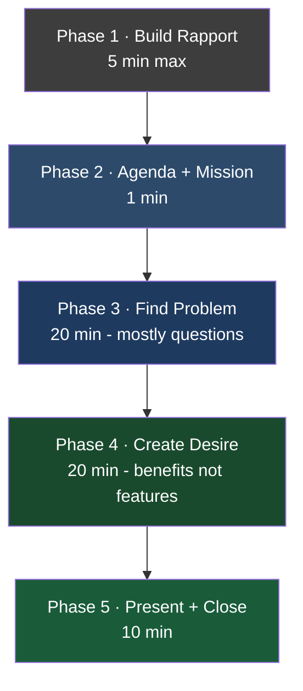

# Day 21 — Closing & Sales Appointment Framework

> **The one idea for today:** Having appointments is good. Converting them is everything. A structured sales appointment — not charisma — is what separates FCs who close 10% of meetings from those who close 40%.

## What you'll walk away with

By the end of today you should be able to:

1. **Run** a 60-minute sales appointment using the 5-phase structure.
2. **Deliver** a personal mission statement in one sentence that prospects remember.
3. **Apply** at least two closing techniques appropriately to the meeting context.

---

## 1. The front-load principle

The most common new-FC mistake:

> Spends 30 min building rapport → 20 min on budgeting/goals → talks about "some policies" → runs out of time → "let's continue next session" → never closes.

**Result:** the client ghosts. Nothing sold. Hours of effort down the drain.

**The fix: front-load the sales, back-load the servicing.**

- Front-load: get the sale done in the meeting, while the emotional context is hot.
- Back-load: the 20 hours of service (annual reviews, claims help, policy adjustments) happen over the next 20 years — *after* the first sale.

**Think "lifetime value of the relationship."** The first sale opens a 20-year relationship. The next 20 years are where your real income is.

This isn't about being pushy. It's about respecting the meeting's purpose.

## 2. The 5-phase structure (60-minute meeting)

A well-run sales appointment has exactly five phases. Timings are approximate but order is strict.

### Phase 1 — Build Rapport (5 min max)
- Comment on something personal (family photo, office, shared contact).
- Show interest — **ask, don't tell.**
- Rephrase what they say to confirm understanding.
- Humour if natural; don't force it.

**Do NOT overspend here.** 30 minutes of rapport is procrastination disguised as "building connection."

### Phase 2 — State the Agenda & Sell Yourself (1 min)
Two sentences, crisp:

> "Today we're going to do three things. First, I'd love to understand where you are financially today. Second, I'll show you what's possible. Third, if it makes sense, we'll figure out next steps."

Then — your one-sentence mission statement:

> **I help [TARGET AUDIENCE] to [OUTCOME] through [FRAMEWORK].**

Examples:
- "I help young adults achieve financial independence through my Total Wealth concept."
- "I help pre-retirees grow a stream of passive income through a Retirement Readiness review."
- "I help business owners protect their families and their exit plans through estate structuring."

**Why:** if you don't tell people your *why*, they'll assume the worst of you. Most clients walk in expecting "insurance salesperson." Your mission statement repositions you in 6 seconds.

### Phase 3 — Find the Problem, Induce Pain (20 min)

There can be no solution without a problem. This phase is **mostly questions, mostly listening.**

Standard discovery questions (the five "hot buttons"):

1. **How much do you need for retirement?** (Most clients don't know.)
2. **Do you know how much medical expenses can be?** (Most underestimate by 10×.)
3. **What happens if you can't work — hospitalised, sick, retrenched?** (Kids, mortgage, parents all affected.)
4. **Are you saving in the bank and losing to inflation?** (The Total Wealth frame from Day 14.)
5. **Do you want to invest — and do you know how?** (Most clients want to but are paralysed.)

**Your job in this phase:** ask questions, then *pause* after each answer. Don't fill silence. The silence is when the client processes and often adds the most valuable detail.

### Phase 4 — Create Desire, Visualize Benefits (20 min)

Once the problem is visible, help them *feel* the solution.

**The rule: benefits, not features.**

| Feature (bad) | Benefit (good) |
|---|---|
| "This is a participating whole-life plan with 6.75% non-guaranteed illustrated return." | "At 65, this plan could be paying you $4,500 a month — for the rest of your life — without you touching the capital." |
| "Multi-pay CI" | "If you get critically ill, we pay you. If it comes back again 5 years later, we pay you again — same policy." |
| "Hospital cash rider" | "While you're recovering in hospital, your income doesn't stop — this pays a daily cash amount straight into your account." |

**Visualize the future.** "Imagine you're 65, walking on the beach in Bali, and $4,500 lands in your account like clockwork. That's what this builds."

### Phase 5 — Present the Solution & Close (10 min)

Now and only now — recommendations + pricing.

Use one of the closing techniques (Section 3). Don't launch into a product tour. Recommend crisply, with conviction.

## 3. Common closing techniques

### Summary close
> "Let me summarise what we've talked about. You want to protect against ___, build $X/month at retirement, and cover medical costs. Here's the plan that does all three for $Y/month. Shall we proceed?"

Use when: multiple benefits are on the table and the client needs them tied together.

### Getting the customer to choose (option close)
> "Which do you prefer — $300/month or $400/month?"
> "Would you like to start Level 1 first, or cover Level 1 and Level 2 together?"

Use when: the client is close but hesitating on decisiveness. Options remove the "yes/no" friction.

### Small commitments first
> "Shall we get your KYC completed today so that we're ready to move forward?"
> "Let me just get your basic details into the application so we don't have to redo this."

Use when: the client is 80% there. Small yeses compound into the big yes.

### Urgency close (use sparingly)
> "This campaign runs until end of next month — you'd lose $X of cash value if we wait."
> "Rates typically go up with your next birthday — waiting 3 weeks costs you 2–3% in premium for life."

Use **only when the urgency is real.** Manufactured urgency destroys trust. If you don't have a real time-pressure reason, don't pretend.

## 4. Building rapport — without overspending

Five tactical moves for rapport, in priority order:

1. **Show genuine interest** — "Tell me about ___" beats "How's work?"
2. **Rephrase what they say** — "So what you're saying is ___, is that right?" Proves you listened.
3. **Be empathetic** — nod, eye contact, don't interrupt.
4. **Compliment** — specific, not generic. "I noticed you have three kids' photos — twins and a youngest?" not "nice family."
5. **Humour** — only if it comes naturally. Forced humour destroys rapport.

**The pause discipline:** after asking a question, wait 3 full seconds. Most clients need the pause to think. Most new FCs fill it with more talking — and lose the answer.

## 5. When to shut up

Three moments in every meeting where silence is your best move:

1. **After asking a discovery question.** Let them think.
2. **After presenting the recommendation.** Let them evaluate.
3. **After asking for the close.** First one to speak loses. Count to 10 in your head if needed.

New FCs talk when they're nervous. Top producers know silence is productive.

---

---

## Quick quiz

1. **The "front-load the sales, back-load the servicing" principle means:**
 - A) Sell aggressively early, ignore clients later
 - B) Get the first sale done in-meeting; service happens over 20 years after ✓
 - C) Charge upfront fees
 - D) Complete the onboarding before the first meeting

 **Why:** The first sale opens a 20-year relationship — the real income and value come from the decades of annual reviews, claims support, and policy updates that follow. Front-loading the close respects both the meeting's purpose and the client's emotional context, which is hottest in the room. Selling aggressively and abandoning the client (A) is the opposite of the philosophy; upfront fees (C) and pre-meeting onboarding (D) are simply unrelated concepts not discussed in this framework.

2. **How much time in a 60-min meeting should you spend on rapport?**
 - A) 20 minutes
 - B) 30 minutes
 - C) 5 minutes max ✓
 - D) As much as the client wants

 **Why:** The 5-phase structure allocates only 5 minutes to rapport — anything more is explicitly called "procrastination disguised as building connection." The remaining 55 minutes are where problems are discovered, desire is created, and the close happens. Twenty (A) or 30 (B) minutes on rapport consume the time needed for Phases 3, 4, and 5, which is precisely the pattern that leads to "let's continue next session" and eventual ghosting. Ceding time control to the client (D) loses the structured flow that drives closing rates.

3. **The correct framing in Phase 4 (Create Desire):**
 - A) Features
 - B) Benefits ✓
 - C) Prices
 - D) Comparisons

 **Why:** Phase 4 is about helping the client feel the solution, not understand the product — benefits describe what the plan does for the client's life (e.g., "$4,500/month at 65"), while features describe technical product attributes that mean little emotionally. Presenting features (A) keeps the client in analytical mode rather than desire mode. Introducing prices (C) in Phase 4 jumps the gun before desire is established, and leading with competitor comparisons (D) is not part of the 5-phase framework.

4. **James asks for the close, the client goes silent, and James fills the silence with more product details. What is the most likely outcome?**
 - A) The extra information reassures the client and seals the deal
 - B) James loses momentum — speaking first after the close weakens his position ✓
 - C) The silence means the client has already decided no
 - D) The additional detail triggers a referral

 **Why:** After asking for the close, the first person to speak loses — the client's silence is evaluative, not negative, and interrupting it with more information resets the decision clock and signals that James lacks conviction. The additional detail does not reassure (A); silence after a close is not a no (C); and unsolicited product dumps do not trigger referrals (D). The prescribed discipline is to count to 10 in your head and wait.

5. **A prospect says they are 80% ready to proceed. Which closing technique is best suited to this situation?**
 - A) Summary close — tie all benefits together
 - B) Urgency close — manufacturing a deadline
 - C) Small commitments first — get KYC or basic details started ✓
 - D) Option close — ask them to choose between two products

 **Why:** When someone is 80% there, they need a low-friction pathway to yes — small yeses (KYC, basic details) compound into the final commitment without pressure. The summary close (A) is designed for clients who need multiple benefits tied together, not for someone already near-decided. Manufacturing urgency (B) destroys trust if there is no real time pressure. The option close (D) introduces product-choice friction for a client who has not yet chosen to proceed at all.

6. **During Phase 3, a client reveals they have no idea how much retirement savings they need. What is the FC's correct next move?**
 - A) Move immediately to Phase 4 and present a savings plan
 - B) Pause after the answer, let the client sit with the gap, and ask a follow-up question ✓
 - C) Provide the number for them to reduce discomfort
 - D) Skip to Phase 5 and show the illustration

 **Why:** Phase 3 is mostly questions and listening — the silence after a revelation is when the client processes the gap and often adds the most valuable emotional detail, which becomes the fuel for Phase 4. Moving to Phase 4 immediately (A) or jumping to Phase 5 (D) skips the pain-induction that makes a solution feel necessary. Providing the number (C) relieves the discomfort the FC needs the client to feel before desire for a solution can be created.

7. **Why must a personal mission statement be delivered in Phase 2, before any discovery questions?**
 - A) It is a compliance requirement
 - B) It repositions the FC from "insurance salesperson" to trusted advisor before the prospect forms a negative assumption ✓
 - C) It replaces the need for rapport-building
 - D) It gives the prospect time to research the FC online

 **Why:** Most prospects walk in expecting a salesperson — the mission statement reframes the FC's role in 6 seconds, before the negative assumption hardens and colours every subsequent question. Delivering it after discovery questions means the prospect has already filed the FC mentally as a product-pusher. It is not a compliance requirement (A), it does not replace rapport (C) — rapport still happens in Phase 1 — and it is not intended to prompt online research (D).

---

## Related

- Previous: [[day-20|Day 20 — Basic Productivity & Time Efficiency]]
- Next: [[day-22|Day 22 — Productivity Principles]]
