```mermaid
flowchart LR
    subgraph ENERGISERS["⚡ ENERGISERS — generate energy while working"]
        direction TB
        PL["<b>Play</b><br/>make it a game"]
        PW["<b>Power</b><br/>build competence daily"]
        PE["<b>People</b><br/>work alongside others"]
    end
    subgraph UNBLOCKERS["🧱 UNBLOCKERS — when work still isn't happening"]
        direction TB
        PR["<b>Procrastination</b><br/>name the emotion, start tiny"]
        PA["<b>Paralysis</b><br/>write the exact next action"]
        PF["<b>Perfectionism</b><br/>ship at 80%, revise on feedback"]
    end
    subgraph SUSTAINERS["🌱 SUSTAINERS — prevent burnout over 12+ months"]
        direction TB
        CO["<b>Conserve</b><br/>A/B/C every task"]
        RE["<b>Recharge</b><br/>real rest — sleep + walks"]
        AL["<b>Align</b><br/>daily work to deeper purpose"]
    end
    ENERGISERS --> UNBLOCKERS --> SUSTAINERS
```

# Day 23 — Feel-Good Productivity

> **The one idea for today:** If you're grinding through your work hating every minute, you will burn out in Month 4. Productivity that lasts requires you to actually enjoy it. Not every minute — but enough of the minutes that the compound keeps working.

## What you'll walk away with

By the end of today you should be able to:

1. **Name** the three energisers that make work feel better, not just get done.
2. **Identify** the three unblockers that kill procrastination at its root.
3. **Install** the three sustainers that prevent burnout over 12+ months of consistent work.

---

## 1. Why this matters

The classic productivity advice says: *push harder, track more, schedule tighter.* That works for sprints. It fails at 6 months.

Ali Abdaal's *Feel-Good Productivity* framework (and the research behind it) flips the model: **positive emotion is a *driver* of productivity, not a reward for it.** People who feel energised produce more, for longer, with less willpower.

For a new FC doing 50 cold calls a week, this isn't soft — it's the difference between continuing in Month 7 and quitting in Month 4.

## 2. The three energisers — PLAY, POWER, PEOPLE

These are the states that generate energy *while you work*. Build them into your days.

### Play
**Rule:** make serious work feel like a game.

- Track calls as "reps" — like gym sets.
- Give yourself mini-challenges ("can I get 3 referral asks in before lunch?").
- Use streaks, leaderboards, or Habit trackers if gamification helps you.
- Find the creative, playful angle in even boring tasks.

**Why it works:** the brain under "play" mode is more creative, more willing to experiment, and more resilient to failure. A prospecting session framed as "let's see how many no's I can collect" outperforms a prospecting session framed as "I have to hit my number."

### Power
**Rule:** build a sense of competence, especially during skill acquisition.

- **Learn one small thing daily.** One new fact about a product. One new objection handled. One small CPF rule.
- **Track what you've learned.** A running doc called "What I learned this month" builds visible progress.
- **Teach what you learn.** Teaching locks in the learning and creates a sense of mastery.
- **Protect expertise time.** One block per day where you're deliberately getting better, not just producing.

**Why it works:** competence is the antidote to imposter syndrome, which is the #1 emotional blocker for new FCs.

### People
**Rule:** do difficult work in the company of others when possible.

- Schedule role-plays with peers.
- Do call blocks together (physical or virtual co-working).
- Report progress to a mentor weekly.
- Surround yourself with people who are also sprinting.

**Why it works:** shared effort reduces perceived difficulty. Human coordination is wired into us — leveraging it is cheap and powerful.

## 3. The three unblockers — PROCRASTINATION, PARALYSIS, PERFECTIONISM

When energy is good but work still isn't happening, one of three blockers is present.

### Procrastination
**The root cause:** usually negative emotion attached to the task (fear, boredom, anxiety).

**Unblock by:**
- Naming the emotion. "I'm avoiding this because it feels scary, not because it's hard."
- Making the first step tiny. "Open the doc" is a complete goal.
- Changing the environment. Move location. Stand up. Different chair.

### Paralysis
**The root cause:** too many options or unclear next step.

**Unblock by:**
- Write down the exact next physical action. Not "write proposal." → "Open Pages. Type 'Mr. Tan — Financial Review — 19 April.' Save."
- Decide, even poorly. A bad decision now often beats the best decision never.
- Ask a mentor for a 2-minute sanity check.

### Perfectionism
**The root cause:** fear of being judged on the output.

**Unblock by:**
- The 80% rule (Day 22).
- Ship rough, revise based on feedback.
- Separate the draft from the polish — literally two different time blocks.
- Ask: "who is actually going to see this, and at what standard do they expect?"

## 4. The three sustainers — CONSERVE, RECHARGE, ALIGN

Even with energisers and unblockers, you can't sustain 10X for 12 months without sustainers.

### Conserve
**Rule:** not every task deserves full effort.

- 20% of your tasks produce 80% of your results. Identify them, over-deliver there.
- The other 80% need **good enough**, not perfect.
- Energy is a finite resource. Spend it on high-leverage work.

**Practical:** write "A/B/C" on every task in your week. A's get peak-hour effort. B's get medium effort. C's get whatever's left — or delegated/deleted.

### Recharge
**Rule:** real rest is productive.

**Not rest:**
- Scrolling social media.
- Binge-watching 4 hours of Netflix.
- Drinking with friends then working with a hangover.

**Real rest:**
- Sleep (7+ hours).
- Walks without your phone.
- Actual weekends (at least one full day).
- A physical activity you enjoy.
- Conversations with people who aren't in sales.

Your brain is doing background processing during rest. Cutting rest to "get more done" reliably reduces output. This is measurable, not motivational.

### Align
**Rule:** your daily work should connect to a purpose that matters to you.

**Weekly question:** "Did the work I did this week serve the bigger thing I'm trying to build?"

When alignment is high:
- You don't need willpower to show up.
- Rejections sting less.
- 60 days feels like 60 days of building something, not 60 days of survival.

When alignment is low:
- Even small tasks feel heavy.
- You drift to distractions constantly.
- You start questioning if this is "worth it."

**If alignment is low for more than 2 weeks → revisit your Day 5 purpose statement.** Either re-commit to it, or update it. Don't ignore the signal.

## 5. The daily self-check

At the end of each working day, 60 seconds:

- **Today's energiser** — which of P/P/P was present? (Play, Power, People)
- **Today's blocker** — was anything blocking me? (Procrastination, Paralysis, Perfectionism)
- **Today's sustainer** — did I spend energy wisely? Rest enough? Stay aligned?

Score each out of 10. Over a week, patterns emerge. Fix the lowest-scoring category.

## 6. The lifecycle view

Your first 60 days is a sprint. After that, this career is measured in **decades.**

The FCs who make it to Year 5, Year 10, Year 20 aren't the hardest-working. They're the ones who figured out how to **feel good enough** about the work to keep doing it when motivation waned.

Feel-Good Productivity isn't about being happy at work all the time. It's about **not ruining yourself in pursuit of short-term output.** That distinction compounds.

---

---

## Quick quiz

1. **The three energisers are:**
 - A) Passion, Purpose, Plan
 - B) Play, Power, People ✓
 - C) Push, Pull, Pause
 - D) Produce, Perform, Persist

 **Why:** The framework from Ali Abdaal's Feel-Good Productivity names exactly three energisers — Play (making work feel like a game), Power (building competence), and People (doing hard work alongside others). None of the other answer options (A, C, D) appear in the framework. These three states generate energy while you work, which is what makes productivity sustainable at 6 and 12 months, not just in a sprint.

2. **According to the framework, perfectionism is a form of:**
 - A) High standards (good)
 - B) Procrastination driven by fear of judgement ✓
 - C) Lack of experience
 - D) Attention to detail

 **Why:** The lesson is explicit: perfectionism is an unblocker category because its root cause is fear of being judged on the output, not genuine quality commitment. When an FC rewrites their proposal for the seventh time, they are managing anxiety, not serving the client. High standards (A) and attention to detail (D) are distractors that conflate the feeling of perfectionism with its function. Lack of experience (C) is a separate issue — experienced FCs are equally susceptible to perfectionism.

3. **Real rest excludes:**
 - A) Sleep
 - B) Walks without a phone
 - C) Social media scrolling ✓
 - D) Physical activity you enjoy

 **Why:** The lesson draws a hard distinction between real rest and fake rest — social media scrolling is listed explicitly under "not rest" because it keeps the brain in reactive mode rather than allowing genuine recovery. Sleep (A), phone-free walks (B), and physical activity you enjoy (D) are all cited in the "real rest" list. Your brain does background processing during genuine rest, and cutting that recovery reliably reduces output.

4. **Kevin is in Month 6 and notices that even small tasks feel heavy, he drifts to distractions constantly, and he keeps questioning if the career is worth it. According to today's framework, the most likely root cause is:**
 - A) He is in the Paralysis blocker
 - B) His alignment is low — his daily work has disconnected from his deeper purpose ✓
 - C) He has exhausted the Play energiser
 - D) He needs a longer recharge period

 **Why:** The Align sustainer section describes exactly these three symptoms — heavy tasks, constant drifting, and career questioning — as the signs of low alignment between daily work and deeper purpose. The lesson prescribes revisiting the Day 5 purpose statement when this pattern persists beyond two weeks. Paralysis (A) is a single-task blocker, not a month-long pattern. Exhausted Play (C) would show as low energy, not existential questioning. Recharge (D) is a sustainer but the symptom cluster points specifically at Align.

5. **Doing prospecting calls in a co-working session with two peers rather than alone primarily activates which energiser?**
 - A) Play
 - B) Power
 - C) People ✓
 - D) Conserve

 **Why:** The People energiser is specifically about doing difficult work in the company of others — shared effort reduces perceived difficulty, and human coordination wired into us makes the same activity feel easier and more sustainable. Play (A) would involve gamifying the session (e.g., tracking no's as a competition), and Power (B) is about building competence through deliberate learning. Conserve (D) is a sustainer, not an energiser.

6. **The A/B/C task-priority system under the Conserve sustainer is designed to:**
 - A) Rank tasks by deadline
 - B) Ensure the most leveraged work receives peak-hour energy ✓
 - C) Delegate all C tasks to admin staff
 - D) Reduce total tasks each week

 **Why:** The Conserve principle says 20% of your tasks produce 80% of results — A tasks get peak-hour full effort, B tasks get medium effort, and C tasks get whatever is left over or get delegated and deleted. The purpose is to allocate finite energy to the highest-leverage work, not simply to rank by urgency (A). C tasks are not automatically delegated to staff (C) — a solo new FC may batch or drop them. The system does not reduce total tasks (D); it prioritises how energy is spent across them.

7. **An FC notices she has been avoiding writing a proposal for three days. Applying the framework, she names the feeling as anxiety about rejection. What is the prescribed first unblocker step?**
 - A) Ask a mentor to write it instead
 - B) Schedule a full afternoon block and power through
 - C) Make the first step tiny — open the document and write one sentence ✓
 - D) Apply the 80% rule and submit a rough draft immediately

 **Why:** Once the root cause (fear) is named, the procrastination unblocker prescribes making the first step tiny — "open Pages, type the client's name, save" is a complete goal. Tiny first steps lower the activation energy that the anxiety has raised, and momentum handles the rest. Asking a mentor to write it (A) avoids the task entirely rather than unblocking it. Scheduling a full afternoon block (B) is too large an activation jump and re-triggers the anxiety. Submitting an 80% draft immediately (D) skips the starting problem that has kept her stuck for three days.

---

## Related

- Previous: [[day-22|Day 22 — Productivity Principles]]
- Next: [[day-24|Day 24 — The Time Management Matrix]]
