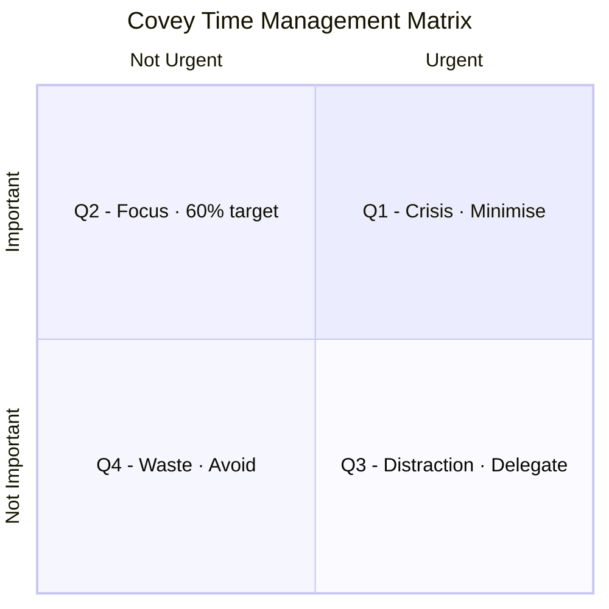
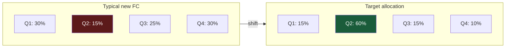

# Day 24 — The Time Management Matrix: Big Rocks First

> **The one idea for today:** Most new FCs spend their weeks in Quadrants I and III — urgent things, usually other people's emergencies. The top producers spend their time in Quadrant II — important, not urgent work. That's where the business gets built.

## What you'll walk away with

By the end of today you should be able to:

1. **Classify** any task into one of the four quadrants.
2. **Shift** your weekly time allocation toward Quadrant II (the focus zone).
3. **Handle** Quadrant I and III correctly — minimise, delegate — without getting consumed by them.

---

## 1. The matrix

Stephen Covey's time management framework, applied to a new FC's actual work.

```
 URGENT | NOT URGENT
 ─────────────────────────────────────────────────
 |
 IMPORTANT Quadrant I | Quadrant II
 ───────────── | ──────────────
 MINIMISE | FOCUS HERE
 |
 • Case submission | • Prospecting
 deadlines | • Building rapport
 • Client's urgent | • Fact finding
 requests | • Presentation
 • Lapsed case | • Closing, objection handling
 recovery | • Skills & knowledge training
 • Complaints | • Exercise
 • Claim follow-ups | • Continued education
 • MCG / persistency | • Coaching sessions
 breaches | • Relationship building
 |
 ─────────────────────────────────────────────────
 |
 NOT IMPORTANT Quadrant III | Quadrant IV
 ───────────── | ──────────────
 DELEGATE | AVOID
 |
 • Claim paperwork | • Trivia, busywork
 • Delivering gifts | • Time wasters
 • Client admin | • Gossip
 • Form filling | • Excessive messaging
 • Agent care queries | • Doom-scrolling
 • Client enquiries | • Binge TV / gaming
 (non-strategic) |
 |
 ─────────────────────────────────────────────────
```

## 2. The four quadrants — in practice

### Quadrant I — Urgent + Important (Minimise)

These are **real crises.** They need immediate attention and they matter.

Examples for a new FC:
- A case that must be submitted today or the commission tier drops.
- A client's critical illness claim that needs paperwork in 48 hours.
- A policy about to lapse because the client didn't pay.
- A compliance breach flagged by the MCG team.

**The trap:** Quadrant I feels like real work — urgent, pressured, visible. But if you spend most of your time here, it's because **Quadrant II was neglected.** Q1 crises are usually Q2 tasks that got ignored.

**Rule:** handle Q1 quickly and with discipline. Don't let it expand. Then move back to Q2 as soon as possible.

### Quadrant II — Not Urgent + Important (FOCUS)

This is where careers are built.

Examples for a new FC:
- Prospecting calls (when no one's forcing you to make them).
- Daily/weekly skill practice (before you need the skill).
- Fact-finding meetings.
- Writing a proposal properly, not rushing.
- Coaching with your mentor.
- Regular study (CMFAS prep, product knowledge).
- Exercise, sleep, relationship building.

**The paradox:** Q2 tasks never scream for attention. No one will ping you if you skip prospecting today. No one will chase you for missing your mentor call. The lack of urgency is exactly why most people skip them.

**Rule:** schedule Q2 work on the calendar **before** the week begins. Defend the blocks. If Q1 arrives and tries to eat Q2, handle Q1 minimally, then return to Q2.

**The target:** 60%+ of your productive hours should be in Q2.

### Quadrant III — Urgent + Not Important (Delegate)

These are the tasks that *feel* urgent but don't actually move your business forward.

Examples:
- Filling out a form for a client who could fill it out themselves with a link.
- Delivering a physical gift to a client's office.
- Responding to a client's non-strategic enquiry ("what's my policy number again?").
- Paperwork that an admin can handle.
- Someone else's urgent request that doesn't relate to your work.

**The trap:** Q3 tasks feel productive because they're urgent. But urgency doesn't equal importance. An hour on Q3 is an hour stolen from Q2.

**Rule:** delegate, automate, or batch. If you're a solo new FC without admin support, batch Q3 into **one block per day** (usually late afternoon). Don't let Q3 interrupt Q2 blocks.

### Quadrant IV — Not Urgent + Not Important (Avoid)

These are pure time-wasters.

Examples:
- Endless scrolling of Instagram / TikTok / news.
- Reorganising your Notion/Asana workspace for the fifth time.
- Watching "productivity" YouTube videos.
- Gossip in group chats.
- Trivia busywork (refining font sizes in documents nobody will read).

**The honest truth:** most people spend 20%+ of their working hours in Q4 without realising it. Time tracking (Day 20) reveals this.

**Rule:** aggressively avoid. Block apps during work hours. Physically move your phone to another room during peak blocks. Unsubscribe, unfollow, mute.

## 3. The shift — moving your time to Q2

For most new FCs, the current state is:
- **Q1 (urgent + important):** 30%
- **Q2 (not urgent + important):** 15% ← too low
- **Q3 (urgent + not important):** 25%
- **Q4 (time-wasters):** 30%

The target:
- **Q1:** 15% (smaller because Q2 prevents crises)
- **Q2:** 60% ← this is the move
- **Q3:** 15% (batched/delegated)
- **Q4:** 10% (short breaks, true downtime)

**How to make the shift:**

1. Track your time for one week (Day 20 exercise) and classify every 30-min block into a quadrant.
2. Identify your top 3 Q4 leaks. Remove them ruthlessly.
3. Batch your Q3 into one block per day.
4. Schedule your Q2 tasks on the calendar first, each week.
5. Protect Q2 blocks like you'd protect a client meeting.

The first week feels unnatural. By week 3, it feels normal. By week 6, you'll wonder how you worked any other way.

## 4. The "big rocks" story

Imagine a jar. You have big rocks, small rocks, sand, and water.

If you put sand first, then water, then try to add the big rocks — they don't fit. The jar is already full.

If you put the big rocks in first, then the small rocks (they fill the gaps), then the sand (it fills smaller gaps), then the water (it fills the rest) — everything fits.

**Your big rocks** are Q2 tasks. Schedule them first. Your small rocks (Q1 crises) and sand (Q3 admin) will fit around them. Your water (Q4 downtime) fills what's left.

**Put your priorities on the calendar first. Everything else fits around them, or doesn't fit at all.**

## 5. The weekly plan, re-wired

Combining Day 22's weekly planning ritual with the matrix:

**Sunday review:**
1. List the big rocks (Q2 tasks) for next week. 3–5 items.
2. Put them on the calendar first — peak hours, defended.
3. Add your fixed Q1/Q3 commitments (client meetings already scheduled).
4. Leave some buffer for real Q1 crises (15% of hours).
5. Protect rest (Q4 good version — walks, family).

**Monday morning:**
- Open your week's calendar.
- Q2 blocks are already there.
- Start with the first Q2 block. Work through.

Most weeks will go off-script in some way. That's fine. You still moved 3–5 big rocks — which most FCs never do in a week.

---



---



*The entire career shift is moving Q2 from 15% to 60%.*

---

## Quick quiz

1. **Where should 60% of your productive hours be spent?**
 - A) Quadrant I (urgent + important)
 - B) Quadrant II (not urgent + important) ✓
 - C) Quadrant III (urgent + not important)
 - D) Quadrant IV (not urgent + not important)

 **Why:** Quadrant II is where careers are built — prospecting, skill practice, fact-finding, coaching, and proposal writing all live here, and none of them will chase you if you skip them. The target allocation is 60% Q2 vs the typical new-FC reality of only 15%. Q1 (A) should shrink to around 15% as Q2 work prevents crises from forming. Q3 (C) should be batched to 15%, and Q4 (D) should be cut to around 10%.

2. **Quadrant I tasks typically exist because:**
 - A) They're necessary for the business
 - B) Quadrant II was neglected, so Q2 issues became crises ✓
 - C) Clients demand them
 - D) They have higher payoff

 **Why:** The lesson states directly that Q1 crises are usually Q2 tasks that got ignored — the lapsed policy that needed a proactive call weeks ago, the compliance issue that needed attention before the deadline. Some Q1 work is genuinely unavoidable, but the pattern of living in Q1 signals chronic Q2 neglect, not unavoidable business reality. Clients demanding urgent help (C) and higher payoff (D) do not explain the systemic cause of Q1 overload.

3. **The "big rocks first" principle means:**
 - A) Do the hardest tasks first each day
 - B) Tackle the most expensive clients first
 - C) Schedule Q2 priorities on the calendar before anything else ✓
 - D) Rank tasks by duration

 **Why:** The jar analogy shows that if you put sand and water (Q3 admin and Q4 downtime) in first, the big rocks (Q2 priorities) never fit. Scheduling the big rocks — Q2 blocks — first means everything else fits around them or simply does not fit at all. Doing the hardest task first (A) is a different heuristic (Eat the Frog) and not what is described here. Expensive clients (B) and duration ranking (D) are unrelated to the quadrant framework.

4. **An FC spends most of her week chasing policy lapses, compliance deadlines, and urgent client complaints. According to the matrix, this pattern most likely indicates:**
 - A) She is highly productive and responsive
 - B) She neglected Q2 work earlier, causing Q2 issues to escalate into Q1 crises ✓
 - C) Her client base is unusually demanding
 - D) She is correctly prioritising Quadrant I

 **Why:** The lesson explicitly names this as the Q1 trap — the quadrant feels like real work because it is urgent and pressured, but a pattern of living there means Q2 was consistently deprioritised until issues became crises. Responsiveness (A) is not the same as productivity; a high-performing FC minimises Q1 by doing Q2 work proactively. Blaming the client base (C) externalises what is an internal time-allocation problem. Correctly prioritising Q1 (D) misses the point that the goal is to reduce Q1, not to do it well.

5. **Delivering a birthday gift to a client's office falls into which quadrant, and what is the recommended handling?**
 - A) Q1 — handle immediately
 - B) Q2 — schedule in your peak-focus block
 - C) Q3 — delegate or batch into a single admin block ✓
 - D) Q4 — avoid entirely

 **Why:** Delivering a gift is urgent-feeling (there is a birthday) but not strategically important to the business — it does not prospect, close, or build skills, so it sits in Q3. The prescribed handling for Q3 is to delegate, automate, or batch into a late-afternoon admin block. It is not a genuine crisis (Q1), it does not belong in peak-focus time (Q2), and it should not be avoided entirely (Q4) because it still serves the client relationship.

6. **A new FC has tracked his week and found the following split: Q1 30%, Q2 15%, Q3 25%, Q4 30%. Which single shift would have the highest impact on his career trajectory?**
 - A) Cutting Q1 from 30% to 15%
 - B) Eliminating Q4 entirely
 - C) Moving Q2 from 15% toward 60% by scheduling it on the calendar first ✓
 - D) Batching Q3 more tightly

 **Why:** The entire framework is built around Q2 being the engine of career building — prospecting, skill development, and proposal work live here and will not happen unless explicitly scheduled. Going from 15% to 60% Q2 requires reclaiming roughly 45 percentage points, which directly addresses the root cause of low output. Cutting Q1 (A) is a symptom fix; Q1 shrinks naturally as Q2 work prevents crises. Eliminating Q4 (B) recovers 30% but without a plan to redirect it to Q2, that time often flows to Q3. Tightening Q3 (D) is a supporting move, not the primary lever.

7. **In the "big rocks" analogy, what do the sand and water represent in an FC's weekly calendar?**
 - A) Non-negotiable client meetings and deep work
 - B) Q3 admin tasks and Q4 downtime, which fill whatever space remains after big rocks are placed ✓
 - C) Study time and content creation
 - D) Breaks and exercise

 **Why:** In the analogy, big rocks are Q2 priorities, small rocks are Q1 crises, sand is Q3 admin, and water is Q4 downtime — all the smaller and more granular items that naturally fill whatever gaps remain after the big rocks are placed first. Non-negotiable client meetings and deep work (A) are the big rocks themselves, not sand and water. Study and content (C) are Q2 activities. Breaks and exercise (D) are part of Q2 (real rest and health) in the framework, not waste material.

---

## Related

- Previous: [[day-23|Day 23 — Feel-Good Productivity]]
- Next: [[../week-5/day-25|Day 25 — Weekly Team Rhythms]]
- Week 4 summary: [[README|Week 4 — Productivity Principles]]
