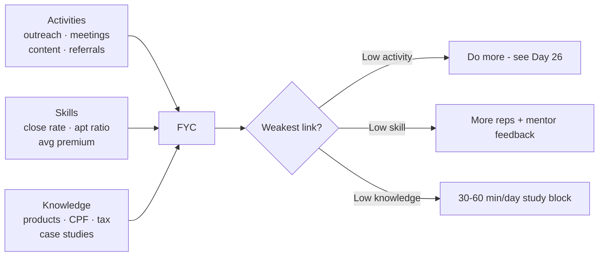
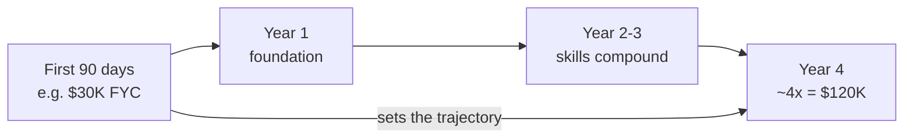

# Day 27 — Your Personal Activity Scorecard

> **The one idea for today:** You become what you track. A new FC who tracks only commission becomes frustrated in Month 2. One who tracks **activities, skills, and knowledge** builds visibility into the 3 inputs that produce the output — and can diagnose problems before they become disasters.

## What you'll walk away with

By the end of today you should be able to:

1. **Apply** the formula **Activities × Skills × Knowledge = FYC** to diagnose which factor is your weakest link.
2. **Build** a weekly scorecard that tracks the inputs, not just the outputs.
3. **Aim** for the FYC-in-first-90-days × 4 benchmark — and know what it means.

---

## 1. The production formula

**Activities × Skills × Knowledge = FYC (First-Year Commission)**

This is the most important formula in the career.

The multiplication matters. It's not **additive** — it's **multiplicative.** Which means:

- Zero activities × any skill × any knowledge = **zero.**
- High activity × low skill × high knowledge = **low** (because skill is the weakest link).
- High activity × low skill × low knowledge = **very low.**
- Moderate across all three = **compounds into real results.**

**The diagnostic value:** when your FYC is low, it's never just one thing. It's the **weakest factor multiplying down** the other two. Identify the weakest link first.

## 2. The three factors — what they actually mean

### Activities
**Definition:** the number of revenue-generating actions you take each week.

Tracked as:
- Outreach touches (calls, messages).
- Meetings (first, fact-find, presentation, close).
- Content pieces posted.
- Referral asks.
- Prospecting hours in total.

**If this is your weakest link:** you're not doing enough. Simple. Review Day 19, Day 26.

### Skills
**Definition:** how well you execute each activity.

Tracked as:
- Appointment-to-close ratio.
- Outreach-to-appointment ratio.
- Average premium per close.
- Objections handled successfully per attempt.
- Role-plays completed.

**If this is your weakest link:** you're active but inefficient. More reps + deliberate feedback. Get in front of mentor weekly.

### Knowledge
**Definition:** what you know — products, regulations, tax, CPF, client contexts.

Tracked as:
- CMFAS papers completed.
- Product deep-dives done.
- Case studies reviewed.
- New objections and rebuttals logged.

**If this is your weakest link:** you sound uncertain in meetings. Clients feel it. Block 30–60 min/day for structured study.

## 3. The "FYC × 4 in first 90 days" benchmark

A specific target worth internalising:

> **Your first 4 years of production should look like: FYC × 4 (quadruple your first-90-days production).**

Meaning: if you hit $30K FYC in your first 90 days, the aspiration is to hit ~$120K/year by Year 4.

**Why this benchmark matters:**

1. **It's grounded in first-90-day data.** Your 90-day FYC reveals your real work rate more than any inspirational goal.
2. **It's achievable.** 4x over 4 years is growth, not miracle. It assumes skills + knowledge compound while activities stay roughly consistent.
3. **It makes Year 1 matter differently.** If your first-90 FYC determines your ~Year 4 income, it's worth going hard — not because of the first $30K, but because it sets the trajectory.

**The interpretation for a new FC:**
Don't obsess about month-1 income. Obsess about **building the 90-day foundation** that scales to 4× over the coming years.

## 4. Your weekly scorecard — the actual table

Here's the scorecard to maintain. A simple Google Sheet, Notion table, or physical notebook works.

| Week | Outreach | Meetings | Proposals | Closes | Premium | Role-plays | Study (hrs) | Content posts |
|---|---:|---:|---:|---:|---:|---:|---:|---:|
| 1 | 75 | 3 | 1 | 0 | 0 | 1 | 5 | 1 |
| 2 | 80 | 4 | 2 | 1 | $180/mo | 2 | 4 | 1 |
| 3 | 90 | 5 | 3 | 1 | $250/mo | 1 | 3 | 2 |
| 4 | 70 | 3 | 1 | 0 | 0 | 0 | 2 | 0 |
| 5 | ? | ? | ? | ? | ? | ? | ? | ? |

**What to look for over time:**

- **Consistent outreach** with **rising meetings** = skill improving.
- **Consistent meetings** with **rising closes** = closing skill improving.
- **Rising premium per close** = product selection or needs analysis improving.
- **Dropping outreach** = leading indicator of trouble 30 days out.
- **Zero role-plays or study** = knowledge/skills will eventually cap your activities.

The scorecard turns vague feelings ("I feel like I'm doing well") into **actual evidence.**

## 5. The weekly ratios to know

Rough industry benchmarks for a Year 1 FC (varies by market):

| Ratio | Acceptable | Good | Great |
|---|---:|---:|---:|
| Outreach → Appointment | 1 in 25 | 1 in 15 | 1 in 10 |
| Appointment → Meeting held | 1 in 2 | 2 in 3 | 3 in 4 |
| Meeting → Close | 1 in 5 | 1 in 3 | 1 in 2 |
| Average premium per close | $150/mo | $250/mo | $400+/mo |

Your ratios will start closer to "acceptable" and improve over months. **That improvement is the career.**

**Weekly ratio review:** every Sunday, calculate last week's ratios. Are any trending down? That's where to focus next week's improvement.

## 6. Activities × Skills × Knowledge diagnostic — the worked example

**Situation:** An FC in Month 3 is frustrated. FYC is low. What's wrong?

| Factor | Metric | Score |
|---|---|---|
| Activity | 80 outreaches/week | 8/10 |
| Skill | Meeting → close ratio 1 in 10 | 3/10 |
| Knowledge | CMFAS pass, limited product depth | 5/10 |

**Diagnosis:** skill is the weakest link. Activity is strong; knowledge is adequate; but the close rate is dragging.

**Response:**
- Not "do more outreach" (activity is already high).
- Not "study more products" (modest improvement).
- Is "role-play closing 3× per week with mentor." Record meetings (with permission). Diagnose what's breaking at the close.

Same FC, wrong diagnosis — just doing more calls — keeps the frustration running for another 3 months.

---

## Quick quiz

1. **The production formula is:**
 - A) Activities + Skills + Knowledge = FYC
 - B) Activities × Skills × Knowledge = FYC ✓
 - C) Activities × Time = FYC
 - D) Skills × Experience = FYC

 **Why:** The formula is multiplicative — zero in any one factor produces zero output regardless of the other two, which is why it's not additive. Activities plus skills plus knowledge (A) would let a factor near zero be partially offset by the others, which doesn't reflect reality. Time (C) is not one of the three factors; it affects compounding but isn't a stand-alone input in this formula. Experience (D) is not the same as skills, which are tracked through ratios and reps, not tenure.

2. **"FYC × 4 in first 90 days" means:**
 - A) Your first-90-day FYC should be 4× a typical new FC's
 - B) Aim to reach ~4× your first-90-day production by Year 4 ✓
 - C) Make 4× as many calls
 - D) Close 4× as many policies

 **Why:** The benchmark is forward-looking: whatever you earn in your first 90 days is the base, and the goal is to quadruple that number by Year 4 as skills and knowledge compound on a consistent activity base. It says nothing about comparing to other FCs (A). It is a revenue trajectory, not an activity count (C) or a policy volume target (D). The value of this benchmark is that it makes first-90-day effort feel consequential beyond the immediate income.

3. **If your outreach is high but close rate is 1 in 10, the weakest link is:**
 - A) Activities
 - B) Skills ✓
 - C) Knowledge
 - D) Product selection

 **Why:** A close rate of 1 in 10 against an "acceptable" benchmark of 1 in 5 points directly to skills — specifically closing execution — as the bottleneck. High outreach (A) is already strong, so adding more activity would just compound inefficiency. Knowledge (C) is a secondary factor; modest product-depth improvement won't fix a poor close rate. Product selection (D) is a subset of knowledge, and the worked example diagnoses the same situation as a skills gap fixed by role-play, not product study.

4. **Why is the formula multiplicative (×) rather than additive (+)?**
 - A) It makes the math harder
 - B) If any one factor is zero, the result is zero — so all three must be non-zero every week ✓
 - C) Because production compounds
 - D) So managers can weight factors

 **Why:** The multiplicative structure means a zero in any single factor collapses the whole output — zero activity means zero FYC regardless of skill or knowledge. Making the math harder (A) is incidental, not the point. Production does compound over time (C), but that's a separate idea about trajectory, not why the formula uses multiplication. Weighting by managers (D) is not mentioned; the formula is a personal diagnostic tool, not a management metric.

5. **Running a personal scorecard weekly helps you:**
 - A) Compare yourself to peers
 - B) Diagnose the weakest of the three factors and focus the next week's effort on it ✓
 - C) Feel better on good weeks
 - D) Hit monthly targets automatically

 **Why:** The scorecard turns "vague feelings" into actual evidence, specifically so you can identify which of activities, skills, or knowledge is the weakest link and direct next week's energy there. The day explicitly says competitors are not the benchmark — you compete with your own last version (A). Feeling good (C) may follow, but it is not the diagnostic purpose. The scorecard does not automatically hit targets (D); it surfaces where to focus, which is a different function.

6. **An FC with strong outreach but low close rate should:**
 - A) Do 2× more outreach
 - B) Study more products
 - C) Invest in skill reps — role-play, recorded meetings, feedback from a mentor ✓
 - D) Lower their close-rate target

 **Why:** When skills are the weakest link, the fix is deliberate skill reps — role-playing the close, recording meetings, and getting mentor feedback — not more activity. More outreach (A) on a broken close rate just produces more failed closes; the worked example explicitly calls this the wrong diagnosis. Product study (B) offers modest improvement but won't fix execution gaps at the close. Lowering the target (D) masks the problem and is the equivalent of the lazy response described in Day 26.

---

## Related

- Previous: [[day-26|Day 26 — The 10X Rule in Daily Action]]
- Next: [[day-28|Day 28 — Time Value of Money: The Core Concept]]
