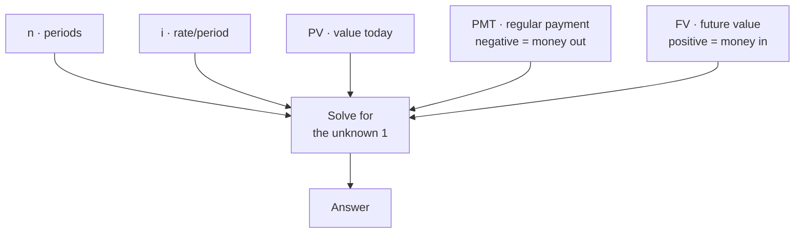
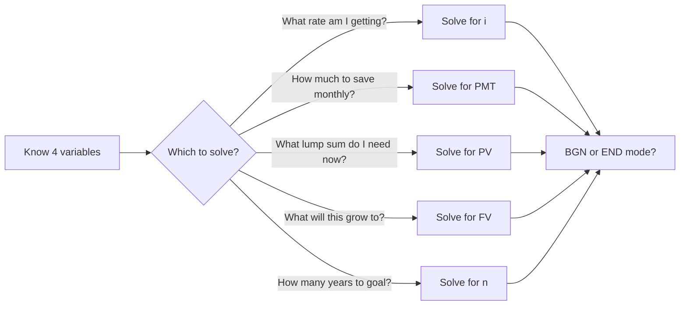
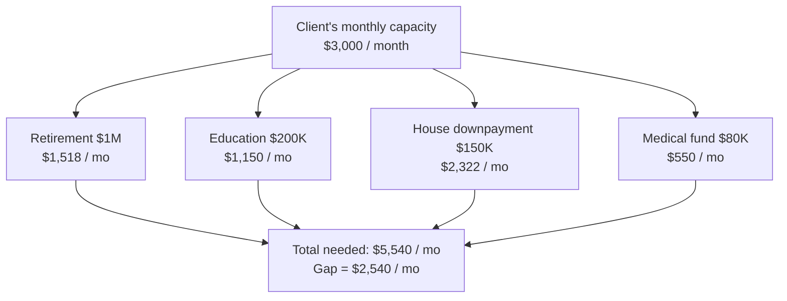
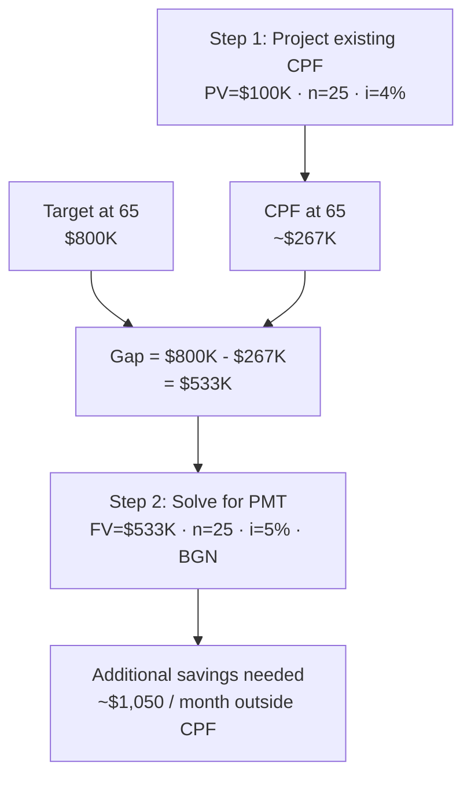
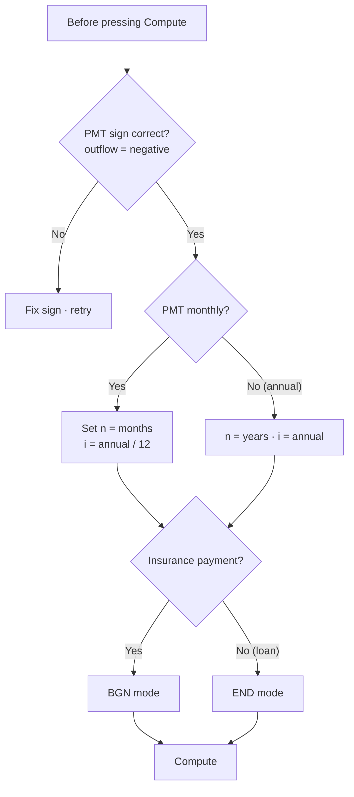

# Day 28 — Time Value of Money: The Complete Reference

> **The one idea for today:** A dollar today is worth more than a dollar tomorrow. Not because of inflation — because today's dollar can start working. Every financial conversation you'll have for the rest of your career sits on top of this one idea.

> **🛠 The calculator to use for every TVM problem in this lesson and beyond:** **[calculator.net Finance Calculator](https://www.calculator.net/finance-calculator.html)**. Free, browser-based, no login, no app to install. Has the five fields below pre-laid-out (N, I/Y, PV, PMT, FV). Bookmark it on your phone — you'll use it in front of clients for retirement projections, savings goals, premium-vs-cash-value math, and almost every Section 3 numbers conversation in CFR.

> **📚 What this day covers:** This is the single consolidated TVM reference for the program. Concept, the 5 variables, both directions of TVM (FV and PV), worked examples, the multi-goal client, inflation-adjusted returns, time-horizon-to-rate mapping, **10 practice problems** with solutions, common error patterns, and the live client speed test. Days 31 and 36 used to split this material across the week; everything has been consolidated here so you can return to one page when you need TVM in front of a prospect.

## What you'll walk away with

By the end of today you should be able to:

1. **Explain** TVM to a non-financial person in 60 seconds.
2. **Identify** the 5 variables (n, i, PV, PMT, FV) and what each one represents.
3. **Use** a financial calculator (or app) to solve a basic TVM problem in either direction.
4. **Solve** all 10 standard practice problems within 60 seconds each.
5. **Frame** each solution in a client-friendly sentence.

---

## 1. The concept in plain language

Suppose a friend says: "I'll give you $10,000 today, **or** $10,000 in 10 years. Which do you want?"

Most people say "today" instinctively. Good instinct. But **why**?

Three reasons:

1. **Uncertainty.** A lot can happen in 10 years — they could change their mind, die, or disappear.
2. **Inflation.** $10,000 in 10 years probably buys less than $10,000 today.
3. **Opportunity cost.** $10,000 today can be invested and grow. If you earn 6% p.a., $10,000 today becomes ~$17,908 in 10 years. You'd need **$17,908** in 10 years to be equivalent to $10,000 today.

**Time Value of Money** is this last insight formalised: **money has a time dimension.** A dollar in hand now is not just a dollar — it's a dollar × (1 + growth)^years.

## 2. Why this matters for every client

Every financial product you'll ever sell is solving a TVM problem.

| Client situation | TVM question |
|---|---|
| "I want to retire at 65" | "What's the FV of my current savings + future contributions?" |
| "I need $500K for my kid's education in 18 years" | "What PV / PMT do I need to start now?" |
| "My AIA plan projects $120K at age 60" | "What's the implied interest rate (i)?" |
| "Inflation is 2% — what does that mean for me?" | "What's the real (inflation-adjusted) rate of return?" |
| "Should I take the monthly annuity or the lump sum?" | "Compare their present values." |

If you can't run these calculations, you can't have meaningful client conversations. You're stuck with marketing language.

## 3. The 5 variables

Every TVM problem has 5 variables. You solve for 1 when you know the other 4.



| Variable | What it means | Typical unit |
|---|---|---|
| **n** | Number of periods (years, months) | Integer |
| **i** | Interest rate per period | % per period |
| **PV** | Present Value (value today) | $ |
| **PMT** | Periodic payment (regular contribution) | $/period |
| **FV** | Future Value (value at end) | $ |

**Sign convention (critical):**
- Money flowing **out** of you (payments, premiums) = **negative**.
- Money flowing **in** to you (withdrawals, payouts) = **positive**.

Getting signs wrong is the #1 cause of TVM errors. Treat it strictly.

## 4. Financial calculators — the tool



You need one. The standard options for Singapore FCs:

- **[calculator.net Finance Calculator](https://www.calculator.net/finance-calculator.html)** — browser, free, no login. Recommended starting point.
- **Casio FC-100V** (hardware) — industry default.
- **Sharp EL-735** or **EL-733A** — also common.
- **iOS app:** Financial Calculator V.2.0 by BiShi Team.
- **Android app:** Financial Calculators by Bishinews.

**Get one set up tonight if you don't have one.** Cost: free–few dollars. Learning it: 30 minutes.

### The five keys you'll use 95% of the time

```
 n i PV PMT FV
```

Plus two modes:
- **END mode** — payments at the end of each period (common for loans, investments).
- **BGN mode** — payments at the beginning of each period. **Most insurance policies use BGN mode.** Get used to it.

## 5. The two directions of TVM

TVM problems run in two directions. You'll use both daily.

**Forward (Future Value):**
> "I invest $X today for Y years at Z% — what do I end up with?"
- Input: PV, n, i (and PMT if you're contributing periodically)
- Output: FV

**Backward (Present Value):**
> "I want $X in Y years at Z% — how much do I need today?"
- Input: FV, n, i
- Output: PV

Most retirement and education planning runs **backward.** Clients know the target (retirement income, college tuition), and need to know **what to do today.**


## 6. Worked examples — the four solve-for patterns

### Solve for **i** (implied rate) — the "Life Plus" scenario

**Scenario:** Susan, age 26, buys a Life Plus policy. Annual premium: **$807**. At age 60, she gets back **$53,257**.

**Question:** What's the projected interest rate she's earning?

**Setup:**
- **n** = 34 years (age 26 to age 60)
- **PMT** = −$807 (she pays this yearly; money out = negative)
- **FV** = $53,257 (she receives this; money in = positive)
- **PV** = 0 (she's not starting with a lump sum)
- **Mode:** BGN (insurance premiums begin-of-year)
- **Solve for:** i

**Answer:** i ≈ **3.52% p.a.**

**The advisor insight:** When a client asks "what's the real return on this plan?", you can answer in 30 seconds with your calculator. That's the difference between sounding knowledgeable and sounding like a salesperson.

### Solve for **PMT** (required monthly contribution) — planning backwards from retirement

**Scenario:** Nancy, age 25, wants a retirement fund of **$250,000** at age 60. She likes a plan projecting **4% p.a.** What annual premium does she need?

**Setup:**
- **n** = 35
- **i** = 4
- **FV** = $250,000
- **PV** = 0
- **Mode:** BGN
- **Solve for:** PMT

**Answer:** PMT ≈ **−$3,264/year** (negative — she pays it out).

**Reframe for the client:** "To have $250,000 at 60, you need to set aside about $272/month, starting today. Every year you delay, that monthly amount goes up by roughly 10%."

### Solve for **PV** (lump sum required today) — the same Nancy

**Scenario:** Same Nancy ($250K target at 60), but considering a **single premium investment plan** at projected **9% p.a.** instead. How much does she need to invest today?

**Setup:**
- **FV** = $250,000
- **n** = 35
- **i** = 9
- **PMT** = 0
- **Solve for:** PV

**Answer:** PV ≈ **−$12,247**

**Reading:** "If Nancy has $12,247 today and invests at 9% p.a., she could reach $250,000 by age 60."

### The insight from comparing PMT vs PV solves

A **single $12,247 lump sum at 9%** does the job of **$3,264/year × 35 years = $114,240** in yearly contributions at 4%. The lump sum approach works if:
- Client has capital sitting in a bank account.
- Client can tolerate the return assumption being non-guaranteed.
- Client won't touch the money for 35 years.

For a client with both cash and discipline, a lump sum can dramatically reduce total outlay — because the money compounds for longer on the larger starting base.

## 7. Lump sum vs regular premium — the comparison table

Most clients have a choice: pay a large lump sum once, or pay smaller regular premiums. Compare using Nancy's $250K target:

| Approach | Rate | n | Required input | Total outlay | Capital at 60 |
|---|---:|---:|---:|---:|---:|
| Lump sum | 9% | 35 | $12,247 (PV) | $12,247 | $250,000 |
| Annual premium | 4% | 35 | $3,264/yr (PMT, BGN) | $114,240 | $250,000 |
| Annual premium | 6% | 35 | $2,017/yr (PMT, BGN) | $70,595 | $250,000 |
| Annual premium | 9% | 35 | $958/yr (PMT, BGN) | $33,530 | $250,000 |

**Three observations:**

1. **Higher rate = less required capital.** The rate assumption matters enormously.
2. **Lump sum beats regular at the same rate.** A $12,247 lump sum at 9% produces the same result as $33,530 in annual premiums at 9%. The difference is compounding time on the full amount.
3. **Regular premium is more accessible.** Most 25-year-olds don't have $12,247 sitting unused.

**Your job:** help the client pick the option that **fits their reality** — not the one that looks mathematically optimal on paper.

## 8. Discounting — the concept

**Discounting** is the reverse of compounding. It converts a future dollar amount into its **today's-dollar equivalent**, using a discount rate.

**Formula:**
> **PV = FV / (1 + i)^n**

**Example:** $100,000 needed in 10 years, at 6% discount rate:
> PV = $100,000 / (1.06)^10 ≈ **$55,840**

**Meaning:** $55,840 today, invested at 6%, becomes $100,000 in 10 years.

### When discounting matters for clients

1. **Goal planning:** "$500K for my kid's education in 18 years" → discount back to know the required contribution today.
2. **Comparing options:** "Take $500K lump sum at retirement, or $30K/year for 20 years?" → discount both to today's dollars and compare.
3. **Business valuation:** the reason most businesses are valued using DCF (discounted cash flow).
4. **Insurance payouts:** a $500K death benefit in 30 years has a PV of only ~$175K today at 4%. Important when comparing term vs permanent insurance.

## 9. The multiple-goal client

Real clients don't have one goal. They have three or four:



| Goal | FV | Years away | Discount rate | Monthly PMT |
|---|---:|---:|---:|---|
| Retirement | $1M | 25 | 6% | $1,518/mo |
| Kids' tertiary education | $200K | 12 | 5% | $1,150/mo |
| House downpayment | $150K | 5 | 3% | $2,322/mo |
| Parents' medical fund | $80K | 10 | 4% | $550/mo |

**Total required:** ~$5,540/month across all goals. Client's disposable savings capacity: $3,000/month.

**The math surfaces the trade-off.** The client can't hit all four without either:

- Extending timelines,
- Accepting lower return estimates,
- Reducing target amounts,
- Or finding more income.

Without the math, you have a feelings conversation. With the math, you have a **decision conversation.**

## 10. Inflation-adjusted returns (the real-rate question)

Clients will ask: "If my plan returns 4% and inflation is 2%, what's my real return?"

### Simplified formula
> **Real rate ≈ Nominal rate − Inflation rate** = 4% − 2% = **2%**

### Actual formula (more accurate)
> **Real rate = (1 + nominal)/(1 + inflation) − 1** = (1.04/1.02) − 1 ≈ **1.96%**

For most client conversations, the simplified version is fine. For technical work, use the actual formula.

**The rule of thumb for Singapore clients:** assume 2% inflation on living expenses. Anything returning less than 2% real is losing purchasing power.

## 11. Time horizon → reasonable rate assumption

New FCs sometimes quote aggressive rates (e.g., 8% for all scenarios). This creates two problems:

1. **Short horizons (< 5 years)** — markets can be volatile, and using 8% is wildly optimistic.
2. **Risk tolerance mismatch** — the rate assumes the client can stomach volatility, which they often can't at older ages.

**Rule of thumb (rough):**

| Timeline | Reasonable rate assumption |
|---|---|
| Under 3 years | 1–3% (stay conservative; cash/bonds) |
| 3–7 years | 3–5% (balanced) |
| 7–15 years | 4–6% (growth-oriented) |
| 15+ years | 5–7% (equity-heavy) |

Adjust for client risk tolerance. When in doubt, **illustrate multiple scenarios** (conservative, moderate, aggressive).

## 12. A live client conversation using PV

**Scenario:** A 40-year-old client wants $1M for retirement at 65. He asks: "Can I really get there?"

Without a financial calculator, you'd be stuck saying "let's see" or "yes probably."

With 60 seconds on the calculator:

- FV = $1,000,000
- n = 25
- i = 6%
- **Solve for PMT (BGN):** ≈ **−$1,518/month**

**Your answer:**
> "At a 6% projected return, you'd need to set aside about $1,520 a month, starting now, for 25 years. If you can manage that, yes — you get there. If not, we either adjust the target, extend the timeline, or look at higher-return vehicles (with more risk). Which would you like to explore?"

This is **instant credibility.** You're not guessing. You're showing him the math.

---

## 13. Practice problems — the 10 essentials

> **How to use this section:**
> - Work through each problem **before looking at the solution.**
> - Use your financial calculator. Time yourself.
> - After solving, write the **client-friendly version** in plain English.
> - Circle any you struggled with. Return tomorrow and re-run.

### Problem 1 — Retirement Target (Future Value)

**Mike, 30, invests $2,000/year into a plan projecting 5% p.a. until age 65. How much will he have at 65?**

<details><summary>Solution</summary>

- **PMT** = −$2,000
- **n** = 35
- **i** = 5
- **PV** = 0
- **Mode:** BGN
- **Solve:** FV

**FV ≈ $188,453**

**Client-friendly:**
> "If you put aside $2,000 a year from age 30 to 65, at a projected 5% return, you'll have about $188K at retirement."

</details>

### Problem 2 — Education Funding (Present Value of Payment)

**Sarah wants to save $250,000 for her newborn's university in 18 years. Assume 6% p.a. return. What monthly amount does she need to save?**

<details><summary>Solution</summary>

- **FV** = $250,000
- **n** = 18 × 12 = 216 months
- **i** = 6/12 = 0.5% per month
- **PV** = 0
- **Mode:** BGN
- **Solve:** PMT

**PMT ≈ −$640/month**

**Client-friendly:**
> "About $640/month for 18 years, at a projected 6% return, gets you to $250K for her university."

</details>

### Problem 3 — Implied Interest Rate

**An AIA plan shows: annual premium of $1,500, paid for 30 years, projected payout at 60 is $85,000. What's the effective interest rate?**

<details><summary>Solution</summary>

- **PMT** = −$1,500
- **n** = 30
- **FV** = $85,000
- **PV** = 0
- **Mode:** BGN
- **Solve:** i

**i ≈ 2.95%**

**Client-friendly:**
> "The projected return on this plan is roughly 3% a year — a bit above long-term bank rates but with additional benefits (insurance coverage, forced discipline)."

</details>

### Problem 4 — How Much Today to Hit a Future Goal (PV)

**David needs $500,000 at age 55 for an early retirement. He's 35 and has a lump sum available. Assuming 6% p.a. returns, how much does he need to invest today?**

<details><summary>Solution</summary>

- **FV** = $500,000
- **n** = 20
- **i** = 6
- **PMT** = 0
- **Solve:** PV

**PV ≈ −$155,906**

**Client-friendly:**
> "If you can invest roughly $156K today at 6%, you'll hit $500K by 55. If you don't have $156K, we look at a monthly contribution plan instead."

</details>

### Problem 5 — Comparing Options

**Option A:** $50,000 lump sum today, invested at 5%, held for 20 years.
**Option B:** $3,000/year for 20 years, invested at 5%.

**Which produces more at year 20?**

<details><summary>Solution</summary>

**Option A:**
- PV = −$50,000, i = 5, n = 20, PMT = 0
- FV ≈ **$132,665**

**Option B:**
- PMT = −$3,000, i = 5, n = 20, PV = 0, BGN mode
- FV ≈ **$104,157**

**Option A wins by about $28K**, despite Option B's total outlay ($60K) being larger than Option A ($50K) — because A's full amount compounds from day 1.

**Client-friendly:**
> "The lump sum does more work — the full $50K is compounding from day 1, while the monthly version is still being built up. If you have the $50K, A beats B by roughly $28,000."

</details>

### Problem 6 — Inflation Impact

**Jane's monthly expenses are $5,000 today. She plans to retire in 30 years. Inflation: 2% p.a. What will her equivalent expenses be at retirement?**

<details><summary>Solution</summary>

- **PV** = −$5,000
- **n** = 30
- **i** = 2
- **PMT** = 0
- **Solve:** FV

**FV ≈ $9,054/month**

**Client-friendly:**
> "The lifestyle that costs you $5,000/month today will cost about $9,000/month in 30 years — just from inflation. Your retirement plan has to target the $9K number, not the $5K one."

</details>

### Problem 7 — Real Return

**A plan projects 5% p.a. nominal return. Inflation is 2%. What's the real return?**

<details><summary>Solution</summary>

**Simplified:** 5% − 2% = **3%**
**Actual:** (1.05/1.02) − 1 = **2.94%**

**Client-friendly:**
> "The plan's projected 5% becomes about 3% after inflation. Still positive — you're growing purchasing power. But the real number is what matters for future quality of life."

</details>

### Problem 8 — Education Inflation Specifically

**A business degree costs $80,000 today. Jenny's kid is 6. Education inflation: 8%. Cost when the kid is 18?**

<details><summary>Solution</summary>

- **PV** = −$80,000
- **n** = 12
- **i** = 8
- **PMT** = 0
- **Solve:** FV

**FV ≈ $201,411**

**Client-friendly:**
> "That same $80K degree will cost about $200K when your child hits 18. If we plan for $80K, you'll come up $120K short — which means loans or delaying the degree."

</details>

### Problem 9 — Closing the Gap (two-step)



**Client has $100K in CPF at 40. Target at 65: $800K total. Assume 4% growth on CPF alone. What additional monthly savings (at 5%) are needed to close the gap?**

<details><summary>Solution</summary>

**Step 1 — Project CPF alone:**
- PV = −$100,000, n = 25, i = 4, PMT = 0
- FV ≈ **$266,584**

**Step 2 — Gap = $800K − $266K = $533,416**

**Step 3 — Required additional savings:**
- FV = $533,416, n = 25, i = 5, PV = 0, BGN
- PMT ≈ **−$1,050/month**

**Client-friendly:**
> "Your CPF alone projects to about $267K at 65. To hit your $800K target, you'd need to add about $1,050/month for 25 years at 5% — outside CPF."

</details>

### Problem 10 — Rule of 72 Mental Math

**No calculator allowed. Answer each in 5 seconds:**

1. At 6%, how long to double?
2. At 4%, how much is $10K after 36 years?
3. At 2% inflation, will $100 today buy what $100 buys in 72 years?

<details><summary>Solutions</summary>

1. **12 years** (72 ÷ 6).
2. **$40K** — at 4%, doubles every 18 years; 36 years = 2 doublings = 4× = $40K.
3. **No** — at 2% inflation, prices double every 36 years. In 72 years, prices have doubled twice → 4× higher. $100 will buy what **$25 buys today.**

</details>

### Scoring yourself

**Target for a well-prepared FC:**
- 10/10 correct.
- Average time: < 60 seconds per problem (except #9 which needs 2 steps).
- Mental math for Problem 10: < 5 seconds each.

| Score | Next step |
|---|---|
| **< 7** | Re-read sections 1–11 above and re-run this set tomorrow |
| **7–9** | Practise the specific types you missed. Write the client-friendly versions 3 times each |
| **10/10** | Speed test — can you do all 10 in under 10 minutes? |

## 14. Common error patterns — the 80% trap

These five errors account for roughly 80% of mistakes. Memorise them.



| Error | How to catch it |
|---|---|
| **Sign error** (PMT +/−) | Check direction of cash flow. Out = negative, in = positive. |
| **Mode mix-up** (BGN vs END) | Insurance = BGN; loans = END usually. |
| **Period mismatch** (years vs months) | If PMT is monthly, n must be in months and i in monthly rate. |
| **Nominal-vs-real confusion** | If client asks "real return", subtract inflation explicitly. |
| **Forgetting to inflate the target** | A $250K education goal in today's dollars must be inflated before solving PMT. |

## 15. The client speed test (the actual proficiency bar)

Top producers can run a full TVM calculation in a live meeting, while the client watches, in **under 90 seconds**.

To practise:

- Set up common scenarios (retirement, education, house downpayment).
- Use different variable inputs.
- Time yourself from "client asks the question" to "client-friendly answer delivered."

By Week 10, you should be comfortable doing this in front of a real prospect without visible calculator struggles. **It's an instant credibility signal.**

## 16. What TVM is *not*

A warning to keep with you:

TVM is a **calculation tool**, not an investment philosophy.

- It assumes a stable rate of return. Real markets are volatile (that's why DCA exists — Day 30).
- It doesn't account for tax drag, fees, or behaviour.
- It doesn't guarantee the illustrated rate on any product.

Use TVM to **project scenarios** and **compare options.** Don't use it to promise outcomes.

---

## Quick quiz

1. **What are the five TVM variables?**
 - A) n, i, PV, PMT, FV ✓
 - B) PV, FV, inflation, rate, term
 - C) Principal, Interest, Payment, Return, Term
 - D) Now, Interest, Present, Payment, Forecast

 **Why:** The five TVM variables are n (periods), i (interest rate per period), PV (present value), PMT (periodic payment), and FV (future value) — you solve for one when you know the other four. B substitutes inflation and term for the actual variables n and PMT. C and D use names that don't map to calculator keys.

2. **Sign convention: money flowing OUT of you is:**
 - A) Positive
 - B) Negative ✓
 - C) Doesn't matter
 - D) Zero

 **Why:** Out = negative, in = positive. Reversing this causes a "no solution" error or a nonsensical result. Mixing signs is the #1 cause of TVM errors.

3. **What mode do most insurance policies use?**
 - A) END (payments at end of period)
 - B) BGN (payments at beginning of period) ✓
 - C) No mode needed
 - D) Simple interest mode

 **Why:** Insurance premiums are typically paid at the start of each period, so BGN mode is the industry default.

4. **Present Value answers the question:**
 - A) What will this money be worth in the future?
 - B) How much do I need today to reach a future target? ✓
 - C) What's the historical return?
 - D) What's the inflation-adjusted return?

 **Why:** PV is the *backward* direction of TVM — you know the future target and solve for today's-dollar requirement. FV is the forward direction.

5. **A lump sum and a regular premium with the same rate and target differ because:**
 - A) Regular premiums are taxed differently
 - B) The lump sum compounds for longer on the full amount ✓
 - C) Regular premiums are always cheaper
 - D) Lump sums are riskier

 **Why:** With a lump sum the entire capital sits compounding from day one; regular premiums are still being accumulated, so earlier contributions have more time but average capital is much lower. Tax (A) isn't the driver. Total regular outlay can be 10× the lump sum at the same rate (C is wrong). Risk depends on the vehicle (D is wrong).

6. **For a 3-year goal, which rate assumption is most reasonable?**
 - A) 8% (aggressive equity)
 - B) 1–3% (cash/bonds) ✓
 - C) 6% (balanced)
 - D) Inflation-matching

 **Why:** Short horizons under 3 years leave no time to recover from market swings, so 1–3% conservative assumptions apply. 8% (A) is wildly optimistic. 6% (C) carries meaningful equity risk in a 3-year window.

7. **A client has four financial goals totalling $5,540/month but only $3,000/month in savings capacity. The best advisor response is to:**
 - A) Tell the client to invest more aggressively to close the gap with higher returns
 - B) Ignore the lower-priority goals and focus on retirement only
 - C) Use the math to surface the trade-off and discuss extending timelines, reducing targets, or increasing income ✓
 - D) Recommend a lump-sum investment to replace all regular savings

 **Why:** When the math reveals a gap, the advisor's job is to make the trade-offs explicit and let the client choose. The four levers are extending timelines, reducing targets, finding more income, or adjusting the rate assumption.

8. **A client watches you run a TVM calculation in under 90 seconds during the meeting. The primary advisor benefit is:**
 - A) It satisfies MAS fact-finding requirements
 - B) It allows you to upsell a higher-premium product
 - C) It demonstrates real-time competence and builds instant credibility ✓
 - D) It eliminates the need for a formal financial needs analysis

 **Why:** Live calculation transforms vague worry into a concrete answerable question. Clients who see the math in real time trust the advisor's competence. Fact-finding (A) requires formal documentation; live calc is a credibility signal not a replacement (D).

---

## Related

- Previous: [[day-27|Day 27 — Your Personal Activity Scorecard]]
- Next: [[day-29|Day 29 — Compounding: The 8th Wonder]]
- Related: [[day-30|Day 30 — Dollar Cost Averaging]] · [[../week-6/day-32|Day 32 — Rule of 72 Applied]] · [[../week-6/day-35|Day 35 — Inflation: The Silent Wealth Killer]]
