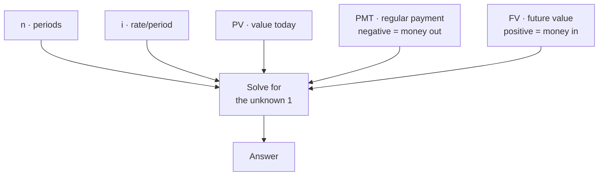
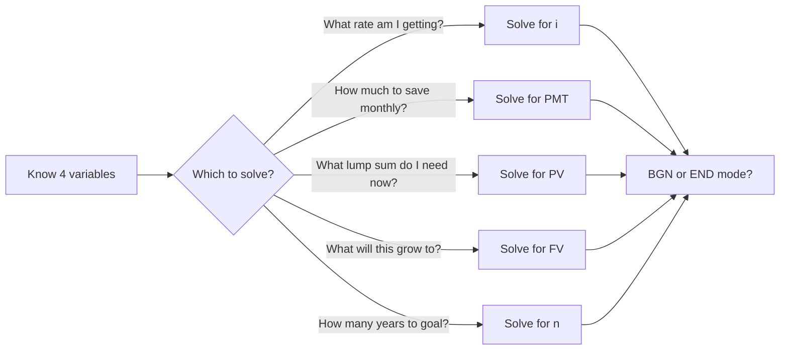

# Day 28 — Time Value of Money: The Core Concept

> **The one idea for today:** A dollar today is worth more than a dollar tomorrow. Not because of inflation — because today's dollar can start working. Every client conversation you'll have for the rest of your career sits on top of this one idea.

## What you'll walk away with

By the end of today you should be able to:

1. **Explain** TVM to a non-financial person in 60 seconds.
2. **Identify** the 5 variables (n, i, PV, PMT, FV) and what each one represents.
3. **Use** a financial calculator (or app) to solve a basic TVM problem.

---

## 1. The concept in plain language

Suppose a friend says: "I'll give you $10,000 today, **or** $10,000 in 10 years. Which do you want?"

Most people say "today" instinctively. Good instinct. But **why**?

Three reasons:

1. **Uncertainty.** A lot can happen in 10 years — they could change their mind, die, or disappear.
2. **Inflation.** $10,000 in 10 years probably buys less than $10,000 today.
3. **Opportunity cost.** $10,000 today can be invested and grow. If you earn 6% p.a., $10,000 today becomes ~$17,908 in 10 years. You'd need **$17,908** in 10 years to be equivalent to $10,000 today.

**Time Value of Money** is this last insight formalised: **money has a time dimension.** A dollar in hand now is not just a dollar — it's a dollar × (1 + growth)^years.

## 2. Why this matters for every client

Every financial product you'll ever sell is solving a TVM problem.

| Client situation | TVM question |
|---|---|
| "I want to retire at 65" | "What's the FV of my current savings + future contributions?" |
| "I need $500K for my kid's education in 18 years" | "What PV / PMT do I need to start now?" |
| "My AIA plan projects $120K at age 60" | "What's the implied interest rate (i)?" |
| "Inflation is 2% — what does that mean for me?" | "What's the real (inflation-adjusted) rate of return?" |
| "Should I take the monthly annuity or the lump sum?" | "Compare their present values." |

If you can't run these calculations, you can't have meaningful client conversations. You're stuck with marketing language.

## 3. The 5 variables

Every TVM problem has 5 variables. You solve for 1 when you know the other 4.



| Variable | What it means | Typical unit |
|---|---|---|
| **n** | Number of periods (years, months) | Integer |
| **i** | Interest rate per period | % per period |
| **PV** | Present Value (value today) | $ |
| **PMT** | Periodic payment (regular contribution) | $/period |
| **FV** | Future Value (value at end) | $ |

**Sign convention (critical):**
- Money flowing **out** of you (payments, premiums) = **negative**.
- Money flowing **in** to you (withdrawals, payouts) = **positive**.

Getting signs wrong is the #1 cause of TVM errors. Treat it strictly.

## 4. Financial calculators — the tool



You need one. The standard options for Singapore FCs:

- **Casio FC-100V** (hardware) — industry default.
- **Sharp EL-735** or **EL-733A** — also common.
- **iOS app:** Financial Calculator V.2.0 by BiShi Team.
- **Android app:** Financial Calculators by Bishinews.

**Buy the app tonight if you don't have a physical calculator.** Cost: a few dollars. Learning it is 30 minutes.

### The five keys you'll use 95% of the time

```
 n i PV PMT FV
```

Plus two modes:
- **END mode** — payments at the end of each period (common for loans, investments).
- **BGN mode** — payments at the beginning of each period. **Most insurance policies use BGN mode.** Get used to it.

## 5. A worked example — the "Life Plus" scenario

Here's a classic insurance TVM question from the AIA sample curriculum.

**Scenario:**
Susan, age 26, buys a Life Plus policy. Annual premium: **$807**. At age 60, she gets back **$53,257**.

**Question:** What's the projected interest rate she's earning?

**Setup:**
- **n** = 34 years (age 26 to age 60).
- **PMT** = −$807 (she pays this yearly; money out = negative).
- **FV** = $53,257 (she receives this; money in = positive).
- **PV** = 0 (she's not starting with a lump sum).
- **Mode:** BGN (insurance premiums usually begin-of-year).
- **Solve for:** i

**Answer:** i ≈ **3.52% p.a.**

**The advisor insight:**
When a client asks "what's the real return on this plan?", you can answer in 30 seconds with your calculator. That's the difference between sounding knowledgeable and sounding like a salesperson.

## 6. Another example — planning backwards from retirement

**Scenario:**
Nancy, age 25, wants a retirement fund of **$250,000** at age 60. She likes a plan projecting **4% p.a.** return. What annual premium does she need?

**Setup:**
- **n** = 35 (age 25 to 60).
- **i** = 4% p.a.
- **FV** = $250,000.
- **PV** = 0.
- **Mode:** BGN.
- **Solve for:** PMT.

**Answer:** PMT ≈ **−$3,264/year** (negative because she pays it out).

**Reframe for the client:** "To have $250,000 at 60, you need to set aside about $272/month, starting today. Every year you delay, that monthly amount goes up by roughly 10%."

## 7. Inflation-adjusted returns

Clients will ask: "If my plan returns 4% and inflation is 2%, what's my real return?"

### Simplified formula
> **Real rate ≈ Nominal rate − Inflation rate** = 4% − 2% = **2%**

### Actual formula (more accurate)
> **Real rate = (1 + nominal)/(1 + inflation) − 1** = (1.04/1.02) − 1 ≈ **1.96%**

For most client conversations, the simplified version is fine. For technical work, use the actual formula.

**The rule of thumb for Singapore clients:** assume 2% inflation on living expenses. Anything returning less than 2% real is losing purchasing power.

## 8. What TVM is not

A warning:

TVM is a **calculation tool**, not an investment philosophy.

- It assumes a stable rate of return. Real markets are volatile (that's why DCA exists — Day 30).
- It doesn't account for tax drag, fees, or behaviour.
- It doesn't guarantee the illustrated rate on any product.

Use TVM to **project scenarios** and **compare options.** Don't use it to promise outcomes.

---

## Quick quiz

1. **What are the five TVM variables?**
 - A) n, i, PV, PMT, FV ✓
 - B) PV, FV, inflation, rate, term
 - C) Principal, Interest, Payment, Return, Term
 - D) Now, Interest, Present, Payment, Forecast

 **Why:** The five TVM variables are n (periods), i (interest rate per period), PV (present value), PMT (periodic payment), and FV (future value) — you solve for one when you know the other four. B substitutes inflation and term for the actual variables n and PMT, which will not work on a financial calculator. C and D use different names that do not map to calculator keys and would produce errors in practice.

2. **Sign convention: money flowing OUT of you is:**
 - A) Positive
 - B) Negative ✓
 - C) Doesn't matter
 - D) Zero

 **Why:** The cash-flow convention is strict: money flowing out (premiums, contributions) is entered as negative; money flowing in (payouts, withdrawals) is positive. Reversing this (A) causes the calculator to see both sides of the transaction as inflows, which produces a "no solution" error or a nonsensical result. It always matters (C) — mixing signs is cited as the number-one cause of TVM errors. Payments are not zero (D); that is only true when there are no periodic contributions.

3. **What mode do most insurance policies use?**
 - A) END (payments at end of period)
 - B) BGN (payments at beginning of period) ✓
 - C) No mode needed
 - D) Simple interest mode

 **Why:** Insurance premiums are typically paid at the start of each period (beginning of year), so BGN mode is the industry default for policy calculations. END mode (A) assumes payments come at the close of each period, which is more common for loan amortisations. No mode needed (C) is false — leaving the calculator in the wrong mode is a common source of off-by-one-period errors. TVM uses compound interest, not simple interest (D).

4. **A client pays $2,400/year for 20 years into a plan and gets back $80,000 at maturity. Roughly what return is implied?**
 - A) 0–1%
 - B) ~3.5% ✓
 - C) ~7%
 - D) Cannot be calculated

 **Why:** Setting n=20, PMT=-2400, FV=80000, PV=0 in BGN mode and solving for i yields approximately 3.5% p.a. — consistent with the Life Plus worked example in the lesson. 0–1% (A) is far too low; even a savings account at that rate on $48K total contributions would not reach $80K. ~7% (C) would require the plan to roughly triple contributions, which the numbers don't support. This is a straightforward TVM solve (D is wrong).

5. **Why must you be strict with the sign convention when solving for i?**
 - A) Because the calculator manual says so
 - B) Mixing signs gives a "no solution" error or a misleading rate ✓
 - C) Insurance regulators require it
 - D) It doesn't actually matter

 **Why:** If both PMT and FV are entered with the same sign, the calculator cannot find an interest rate that satisfies the equation and returns an error — or, worse, returns a nonsensical negative rate that looks like a valid answer. The manual (A) follows from the math, not the other way round. There is no MAS regulation on calculator sign convention (C). It very much matters (D) — a wrong sign produces a wrong answer that could be quoted to a client.

6. **A client says "my plan returns 5% but inflation is 3%." Their real return is closest to:**
 - A) 5%
 - B) 8%
 - C) ~2% ✓
 - D) 0%

 **Why:** The simplified formula is real rate = nominal rate minus inflation = 5% - 3% = 2%; the more precise formula (1.05/1.03 - 1) gives ~1.94%, which rounds to roughly 2%. The nominal rate (A) ignores the purchasing-power erosion inflation causes. Adding instead of subtracting (B) is a common error that has no financial meaning. Zero (D) would require inflation to equal the nominal return exactly; 3% does not equal 5%.

7. **TVM is best thought of as:**
 - A) An investment philosophy
 - B) A calculation tool for projecting scenarios and comparing options ✓
 - C) A guaranteed-outcome formula
 - D) A replacement for fact-finding

 **Why:** TVM is a calculation framework — it lets you project scenarios and compare options, but it assumes a stable rate and cannot account for volatility, fees, or behaviour. It is not a philosophy (A); it is maths that serves whatever planning philosophy you hold. It assumes a rate of return that is not guaranteed (C); the day explicitly warns against using TVM to promise outcomes. It is an input to fact-finding conversations, not a substitute for them (D).

8. **The most common TVM mistake with new FCs is:**
 - A) Forgetting to use a calculator
 - B) Using END mode when the product is BGN, or mixing up payment signs ✓
 - C) Rounding too much
 - D) Using decimals instead of percentages

 **Why:** The two most frequent errors are mode confusion (END vs BGN) and sign errors — both produce wrong answers that can be confidently quoted to a client. Forgetting the calculator (A) is a preparation issue, not a calculation error. Rounding (C) at the level of cents is rarely consequential in financial planning conversations. Entering 4 instead of 4% (D) is a beginner slip that calculators typically handle, and it is not the primary mistake flagged in the lesson.

---

## Related

- Previous: [[day-27|Day 27 — Your Personal Activity Scorecard]]
- Next: [[day-29|Day 29 — Compounding: The 8th Wonder]]
