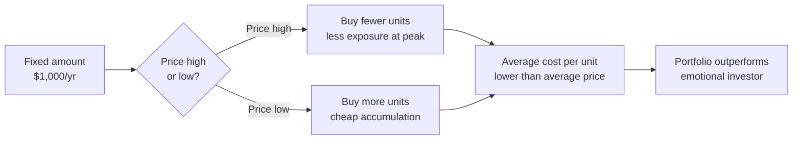
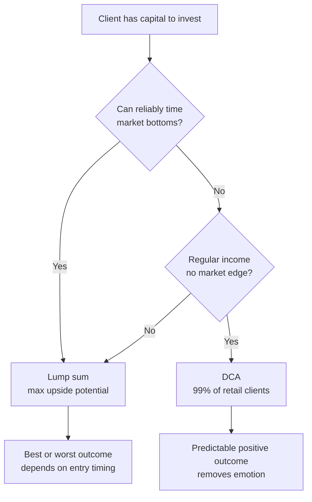

# Day 30 — Dollar Cost Averaging

> **The one idea for today:** "Time IN the market beats timing the market." DCA is the mechanism that lets normal clients invest through volatility without emotional disasters. It's one of the most useful concepts in your toolkit.

## What you'll walk away with

By the end of today you should be able to:

1. **Explain** Dollar Cost Averaging (DCA) using a concrete 5-year example.
2. **Compare** DCA to lump-sum investing — and know when each is better.
3. **Use** DCA to help clients stay invested during market volatility.

---

## 1. What is DCA?

**Dollar Cost Averaging:** investing a **fixed amount** at **regular intervals**, regardless of the market price.

Examples:
- $1,000 every month into the same fund, for 5 years.
- $500 every fortnight into an ETF, automatically.
- Monthly ILP premium that buys units at whatever price they are that month.

**The mechanism:** when prices are **low**, your fixed amount buys more units. When prices are **high**, it buys fewer. Over time, your **average cost per unit** is lower than the average market price over the same period.

## 2. The worked example — DCA in a volatile market

Scenario: You DCA $1,000/year for 5 years. Unit prices swing.

| Year | Unit Price | Amount Invested | Units Bought |
|---:|---:|---:|---:|
| 1 | $5.00 | $1,000 | 200 |
| 2 | $1.00 | $1,000 | 1,000 |
| 3 | $3.00 | $1,000 | 333.33 |
| 4 | $2.00 | $1,000 | 500 |
| 5 | $3.00 | $1,000 | 333.33 |

**Totals:**
- Total amount invested: **$5,000**.
- Total units bought: **~2,367**.
- Year-5 price: **$3.00**.
- **Portfolio value: $3 × 2,367 = ~$7,100**.

**Result:** you invested $5,000 and ended with $7,100. **A 42% gain**, despite the price ending at the same $3 it was in Year 3.

**Why?** Because Year 2's crash let you buy 1,000 units at $1 — far more than any other year. DCA **forces you to buy more when prices are low**, which is counter to human instinct.

## 3. DCA vs Lump Sum — the comparison

Same market, but instead of DCA, you invest $5,000 **in a single lump sum**. Let's see different entry points:

| You entered at... | Units bought with $5,000 | Year-5 value at $3 | Profit/Loss |
|---|---:|---:|---:|
| Year 1 price $5.00 | 1,000 | $3,000 | **−$2,000** ❌ |
| Year 2 price $1.00 | 5,000 | $15,000 | **+$10,000** 🏆 |
| Year 3 price $3.00 | 1,667 | $5,000 | $0 |
| Year 4 price $2.00 | 2,500 | $7,500 | +$2,500 |
| Year 5 price $3.00 | 1,667 | $5,000 | $0 |

**The lump sum outcome depends entirely on timing:**
- **Best case** (entered at $1): $10,000 profit. You timed the market perfectly.
- **Worst case** (entered at $5): $2,000 loss. You got crushed.

**DCA's outcome:** +$2,100 profit. Not the best. Not the worst. **Predictable and positive.**

## 4. The trade-off — DCA's cost

DCA is not free of trade-offs:

**You give up:** the maximum possible return if you happen to lump-sum at the bottom.
**You get:** protection from lump-summing at the top.

For most clients who **can't reliably predict market bottoms** (which is most humans, most of the time), DCA's insurance is worth the lost upside.

**The simple rule:**

- **Client has a lump sum and can tolerate volatility + has strong conviction about market timing:** consider lump sum.
- **Client has a regular income and no special market knowledge:** **DCA** is almost always the right answer.

99% of retail clients fit the second category.

## 5. Why DCA works for behaviour, not just math

The deeper reason DCA is powerful: **it removes emotional decisions.**

Without DCA, an investor in a volatile market tends to:
- **Buy high** (when everyone's excited and prices have already risen).
- **Sell low** (when everyone's panicking and prices have already fallen).
- **Exit completely** after a big loss, missing the recovery.

These behaviours destroy wealth systematically. Studies show the average retail investor underperforms the market by 2–4% annually — not because of fees, but because of **behavioural errors.**

**DCA automates the right behaviour:**
- You **keep buying** when prices are low (even though emotions scream "sell!").
- You **don't overbuy** when prices are high (because your amount is fixed).
- You **stay invested** through crashes (your next $1,000 buys more units at the bottom).

The discipline is structural, not emotional. That's its value.

## 6. Insurance-wrapped DCA — the client story

Most clients in Singapore have their first DCA experience through an **ILP** (Investment-Linked Plan) or **Regular Savings Plan (RSP)**:

- Monthly premium of $200–$500 goes in regardless of market conditions.
- The premium buys units at whatever price they are that month.
- Over 20–30 years, the compounding + DCA effect produces meaningful capital.

**The client message:**
> "You won't time the market. Nobody does. What you *can* do is set up a monthly contribution that keeps buying — more units when prices drop, fewer when they rise. In 20 years, the math of that beats 95% of people who try to time the market."

## 7. DCA pitfalls — when it doesn't help

DCA is not magic. It fails in two scenarios:

### 1. A continuously falling market
If prices fall monotonically for 20 years, DCA still loses money (you just lose less than lump-summing at the top). DCA doesn't save you from a fundamentally broken investment.

**Mitigant:** diversify. DCA into a broad index, not one sector or one stock.

### 2. Very short time horizons
If you're investing for a goal 2 years away, DCA provides little volatility smoothing. Better to keep short-term money in cash/bonds.

**Rule:** DCA works best for 10+ year horizons.

## 8. The key client takeaway

Everything on this page collapses into one sentence you can say to a client:

> **"Time in the market beats timing the market — and DCA is how ordinary people get time in the market without making emotional mistakes."**

Memorise that sentence. You'll use it for the rest of your career.

---

## Quick quiz

1. **DCA means:**
 - A) Investing a lump sum at the lowest price
 - B) Investing a fixed amount at regular intervals regardless of price ✓
 - C) Investing more when the market is high
 - D) Reducing investment when the market falls

 **Why:** DCA is defined as a fixed amount invested at fixed intervals independent of what the market is doing — the consistency is the point. A lump sum at the lowest price (A) describes perfect market timing, which is the opposite of DCA's premise. Investing more when high (C) is the emotional mistake DCA is designed to prevent. Reducing in downturns (D) is another emotional error; DCA keeps the amount constant so that falling prices automatically buy more units.

2. **The main advantage of DCA vs lump sum:**
 - A) Always produces higher returns
 - B) Lower capital outlay
 - C) Protects against the risk of lump-summing at a market peak, smooths volatility ✓
 - D) Eliminates all downside

 **Why:** DCA's core trade-off is explicit: you give up the maximum possible return (lump-summing at the bottom) in exchange for protection against lump-summing at the top. DCA does not always beat lump sum (A) — if the market rises steadily, lump sum wins. Capital outlay is the same over time (B); DCA spreads it, it does not reduce it. DCA does not eliminate downside (D) — in a continuously falling market it still loses money, just less than lump-summing at the peak.

3. **The deepest reason DCA works:**
 - A) Math
 - B) It removes emotional decisions and automates the right behaviour ✓
 - C) Tax benefits
 - D) Compound interest

 **Why:** The lesson distinguishes between DCA working mathematically and DCA working behaviourally — the deeper reason is that it automates buying through downturns (when emotions scream sell) and prevents overbought peaks (because the amount is fixed). The math (A) is real but secondary; studies show retail investors underperform not because of fees but because of behavioural errors. Tax benefits (C) are not mentioned. Compound interest (D) works alongside DCA but is a separate mechanism.

4. **DCA is least useful when:**
 - A) The investment horizon is 20+ years
 - B) The investment horizon is under 2 years ✓
 - C) The market is volatile
 - D) The investor is young

 **Why:** DCA needs time to smooth volatility — over a 2-year horizon there are too few periods for the averaging effect to reduce variance meaningfully, and short-term money should stay in cash or bonds. DCA is most effective at 20+ year horizons (A), not least. Volatility (C) is precisely the condition DCA is designed for; it forces buying at low prices during dips. Young investors (D) benefit most from DCA because they have the longest compounding runway.

5. **The single sentence a client should take away from a DCA conversation:**
 - A) "DCA guarantees returns."
 - B) "Time in the market beats timing the market." ✓
 - C) "Never invest in volatile assets."
 - D) "Always invest lump sums."

 **Why:** The lesson closes with the explicit instruction to memorise: "Time in the market beats timing the market — and DCA is how ordinary people get time in the market without making emotional mistakes." DCA guarantees nothing (A); it is a risk-smoothing strategy, not a guarantee. Avoiding volatile assets (C) is the opposite of the lesson's message, which is to stay invested through volatility. Always investing lump sums (D) is not mentioned and contradicts the DCA premise.

6. **A DCA plan works best when the client:**
 - A) Monitors markets daily
 - B) Automates the contribution and doesn't interrupt it ✓
 - C) Pauses during downturns
 - D) Increases contributions when the market is high

 **Why:** DCA's discipline is structural, not emotional — automating the contribution removes the human decision to pause, which is the exact mistake it is designed to prevent. Monitoring markets daily (A) primes the client to make emotional decisions during volatility, undermining the strategy. Pausing during downturns (C) eliminates the cheap-unit purchases that drive DCA's outperformance. Increasing contributions when high (D) reverses the DCA advantage — it means buying fewer units at elevated prices.

7. **When lump-sum beats DCA, it's usually because:**
 - A) The market rose steadily over the period ✓
 - B) The client was younger
 - C) Fees were lower
 - D) The investment horizon was shorter

 **Why:** In a steadily rising market, a lump sum buys at a lower average price than DCA contributions spread across rising prices — so lump sum wins. The comparison table in the lesson shows this clearly: Year-1 lump sum at $5 loses, but that is because the market fell later; in a market that only goes up, the early lump sum compounds the most. Age (B) and fees (C) affect returns but are not the condition under which lump sum structurally beats DCA. A shorter horizon (D) reduces DCA's averaging benefit but doesn't make lump sum beat it on its own.

---

## Related

- Previous: [[day-29|Day 29 — Compounding: The 8th Wonder]]
- Next: [[../week-6/day-31|Day 31 — Present Value & Discounting]]
- Week 5 summary: [[README|Week 5 — Operating Rhythms & Daily Discipline]]
