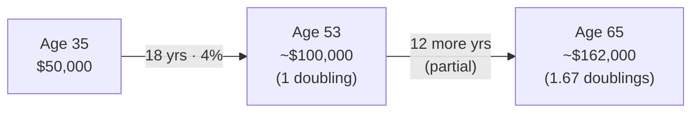
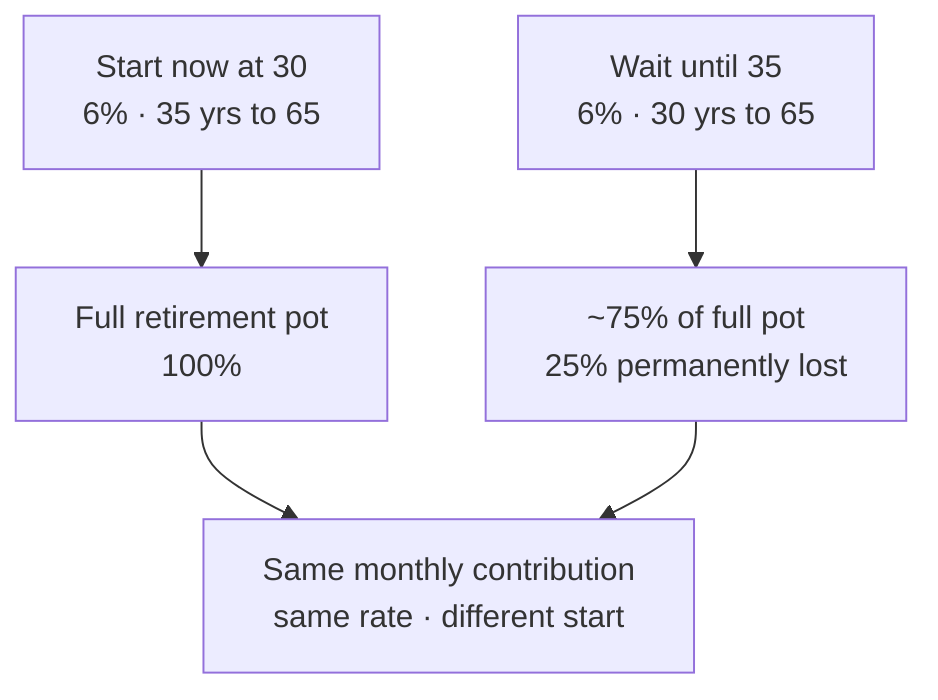

# Day 32 — The Rule of 72: Applied

> **The one idea for today:** The Rule of 72 is the single piece of arithmetic you'll use most often with clients. If you know it cold, you can run credible projections in any conversation — no calculator needed.

## What you'll walk away with

By the end of today you should be able to:

1. **Answer** doubling-time questions in under 5 seconds for any rate between 2% and 12%.
2. **Apply** Rule of 72 to four distinct client scenarios: retirement, inflation, education, legacy.
3. **Use** the Rule of 72 to surface the cost of waiting — without making the client feel guilty.

---

## 1. Quick review

> **Years to double = 72 / interest rate**

Commit this table to memory.

| Rate | Years to double | Doubles in 40 years |
|---:|---:|---:|
| 2% | 36 | 1× |
| 3% | 24 | 1.7× |
| 4% | 18 | 2.2× |
| 5% | 14.4 | 2.8× |
| 6% | 12 | 3.3× |
| 7% | 10.3 | 3.9× |
| 8% | 9 | 4.4× |
| 9% | 8 | 5.0× |
| 10% | 7.2 | 5.6× |
| 12% | 6 | 6.7× |

The last column shows how many **doublings** fit in 40 years, which roughly maps to lifetime compounding.

## 2. Scenario 1 — Retirement

**Client, 35, has $50,000 in CPF SA.** CPF SA earns ~4% p.a.

**Without touching this money, how much will it be at age 65?**

- 4% → doubles every 18 years.
- 65 − 35 = 30 years.
- 30 ÷ 18 ≈ **1.67 doublings.**
- $50,000 × 2^1.67 ≈ $50,000 × 3.18 ≈ **$159,000.**

**Quick cross-check with the calculator:** $50,000 × (1.04)^30 ≈ **$162,170.** Close enough for a conversation.

### The insight for the client

You can make this calculation in your head during a meeting. Most clients have never seen their CPF SA projected forward. The number makes the balance feel real — and a $50K balance becoming $160K+ becomes a reason to **top up.**

## 3. Scenario 2 — Inflation

**Your client worries about inflation.** "If inflation is 2%, what will things cost in 30 years?"

- 2% → doubles every 36 years.
- 30 ÷ 36 ≈ **0.83 doublings.**
- Prices ~1.8× today's.
- **$5 kopi today → ~$9 kopi in 30 years.**
- **$5,000/month expenses today → $9,000/month in 30 years.**

### The insight for the client

Inflation isn't abstract. It's a doubling mechanism. Every 36 years at 2% inflation, everything costs twice as much. Retirement at 65 has to be planned for **future dollars**, not today's dollars.

**A strong line:** "If you plan for today's $5K/month and retire in 30 years, you'll have planned for half of what you actually need. Every financial plan has to adjust for this — otherwise we're planning to run out of money halfway through retirement."

## 4. Scenario 3 — Education

**Client, kid age 8, target university at age 21.** Cost today for a 4-year Australian business degree: **$100,000.** Education inflation runs higher than general inflation — assume **8% p.a.**

- 8% → doubles every 9 years.
- 21 − 8 = 13 years away.
- 13 ÷ 9 ≈ **1.44 doublings.**
- $100,000 × 2^1.44 ≈ $100,000 × 2.72 ≈ **$272,000.**

**Cross-check:** $100,000 × (1.08)^13 ≈ **$272,000.** Exact match.

### The insight for the client

Education inflation is the silent killer of mid-career parents. Most parents underestimate by **50–70%** because they quote today's price.

**A strong line:** "If we plan for $100,000, you'll come up $170K short when your child is 21. That's a mortgage-sized miscalculation. Let's use $272K as the real target."

## 5. Scenario 4 — Legacy / life insurance

**Client has $500K life insurance coverage today.** They're 40. Assume 3% inflation.

**In real terms, what will $500K be worth to their family 30 years from now?**

- 3% inflation → doubles prices every 24 years.
- 30 ÷ 24 ≈ **1.25 doublings.**
- Prices × 2.38.
- **$500K today → ~$210,000 in today's-purchasing-power in 30 years.**

### The insight for the client

A $500K sum assured feels massive today. In 30 years, with inflation, it's buying what $210K buys today. Which may not be enough.

**The implication:** life insurance coverage should be periodically reviewed against inflation. A policy bought at 30 with $1M sum assured may need a top-up at 45 to maintain real purchasing power.

## 6. The "cost of waiting" — gently

The Rule of 72 is the single most powerful tool for showing a client the cost of delaying an investment decision — without guilt-tripping them.

**Client, 30, says: "I'll start investing in 5 years when I'm more settled."**

Quick math:
- At 6% compounding, money doubles in 12 years.
- 5 years of waiting = ~0.42 doublings lost.
- Their final retirement pot at 65 will be roughly **0.42 × a full doubling smaller.** That's about **25% less** in final capital, on the same contribution plan started 5 years earlier.

**Your framing (gentle, not pushy):**
> "Waiting 5 years isn't the end of the world. Mathematically, it costs you roughly 25% of your retirement capital. That might be worth $200K at 65. You can decide if the 5-year break is worth $200K to you — not my decision. But I want you to know the number, so the decision is informed."

**Then — silent.** Let them sit with it. Don't press.

## 7. The "doubling intuition" drill

Top producers have doubling-time intuition so fast it's automatic. Here's how to build it.

For the next 60 days, every time you see a dollar figure, run a 10-second mental calculation:
- "If this doubled every X years, what is it in 20 years? 30 years?"
- "If inflation doubled this number in 30 years, what's the real amount?"

After 60 days, this becomes reflex. You'll find yourself doing it during client meetings without thinking.

### A simple desk-memorisation

Post this table next to your monitor:

  
Rule of 72 · Years to double

  

    

2%

36y

    

3%

24y

    

4%

18y

    

5%

14y

    

6% · CPF OA

12y

    

7%

10y

    

8%

9y

    

9%

8y

  

See it daily for 10 days. It becomes permanent.

## 8. When Rule of 72 is wrong

The rule is an approximation. It breaks down at:

- **Very high rates** (>20%). The real doubling time is slightly shorter than 72 predicts.
- **Very short periods** where compounding frequency matters.
- **Negative rates** (doesn't apply — use half-life formulas instead).

For 99% of client conversations (rates 2–12%, periods 5–40 years), the rule is accurate within 3–5%. That's good enough for projection; use the calculator for any commitment.

## Quick quiz

1. **At 6% p.a., money doubles in:**
 - A) 6 years
 - B) 10 years
 - C) 12 years ✓
 - D) 15 years

 **Why:** Rule of 72 gives 72 ÷ 6 = 12 years exactly. 6 years (A) would require a 12% return. 10 years (B) corresponds to roughly 7.2%, not 6%. 15 years (D) corresponds to roughly 4.8% — a common confuse with the CPF OA rate.

2. **If education inflation is 8% p.a., a $100K degree in 13 years will cost roughly:**
 - A) $150K
 - B) $200K
 - C) $270K ✓
 - D) $400K

 **Why:** At 8%, money doubles every 9 years (72 ÷ 8); 13 years is 1.44 doublings, giving $100K × 2^1.44 ≈ $272K, confirmed by the calculator as $272,000. $150K (A) reflects only simple linear growth and badly underestimates compounding. $200K (B) is roughly one doubling, which would require 9 years, not 13. $400K (D) would require nearly two full doublings, i.e., 18 years.

3. **Rule of 72 is most accurate for:**
 - A) Rates below 1%
 - B) Rates above 20%
 - C) Rates between 2–12%, periods 5–40 years ✓
 - D) Short-term calculations only

 **Why:** The rule is an algebraic approximation that holds within 3–5% of the exact answer for rates in the 2–12% band across medium-to-long time horizons — exactly the range of most financial planning conversations. Below 1% (A), compounding is so slow the approximation loses meaning. Above 20% (B), the rule starts overshooting the true doubling time. Short-term periods (D) are precisely where compounding frequency and volatility make the approximation less reliable, not more.

4. **A client, age 35, has $50,000 in CPF SA earning 4% p.a. Without any additional contributions, the approximate balance at age 65 is:**
 - A) $100,000
 - B) $130,000
 - C) $162,000 ✓
 - D) $250,000

 **Why:** At 4%, money doubles every 18 years (72 ÷ 4); 30 years from 35 to 65 is 30 ÷ 18 ≈ 1.67 doublings, giving $50K × 2^1.67 ≈ $159K; the exact calculator answer is $162,170. $100K (A) is just one doubling, which would require 18 years, not 30. $130K (B) falls short of even 1.5 doublings. $250K (D) would require nearly 2.3 doublings — closer to 41 years at 4%.

5. **A client says "I'll start investing in 5 years when I'm more settled." At 6% compounding, the cost of this 5-year delay in terms of final retirement capital is approximately:**
 - A) 5%
 - B) 10%
 - C) 25% ✓
 - D) 50%

 **Why:** At 6%, money doubles in 12 years; a 5-year delay sacrifices roughly 5/12 ≈ 0.42 doublings, which translates to about 25% less final capital on the same contribution plan. 5% (A) dramatically understates the compounding loss. 10% (B) is closer but still underestimates because the delay costs compounding on every future contribution, not just the first. 50% (D) would imply almost a full doubling lost, which requires a much longer delay or a higher rate.

6. **Your client is 40 and holds a $500K life insurance policy. Inflation is 3% p.a. In real purchasing-power terms, what will $500K buy their family in 30 years?**
 - A) Roughly $500K — nominal value is preserved
 - B) Roughly $350K
 - C) Roughly $210K ✓
 - D) Roughly $100K

 **Why:** At 3% inflation, prices double every 24 years (72 ÷ 3); in 30 years prices are 2.38× higher, so $500K in future dollars buys only $500K ÷ 2.38 ≈ $210K in today's purchasing power. A is wrong because the nominal face value is unchanged but purchasing power is not. $350K (B) understates the inflation erosion over 30 years. $100K (D) overstates it — that level of erosion would require roughly 5% inflation sustained for 30 years.

7. **A 4-year Australian business degree costs $100,000 today. A client's child is 8. Using 8% education inflation, the target amount when the child turns 21 is closest to:**
 - A) $150,000
 - B) $200,000
 - C) $270,000 ✓
 - D) $400,000

 **Why:** This is the same calculation as question 2 — 13 years at 8% gives 1.44 doublings, arriving at approximately $272K, confirmed precisely by the calculator. $150K (A) represents near-linear growth and ignores compounding entirely. $200K (B) reflects only one full doubling at 9 years, not 13. $400K (D) requires roughly two doublings (18 years), almost 50% more time than is available.

---

## Related

- Previous: [[day-31|Day 31 — Present Value & Discounting]]
- Next: [[day-33|Day 33 — Understanding CPF]]
